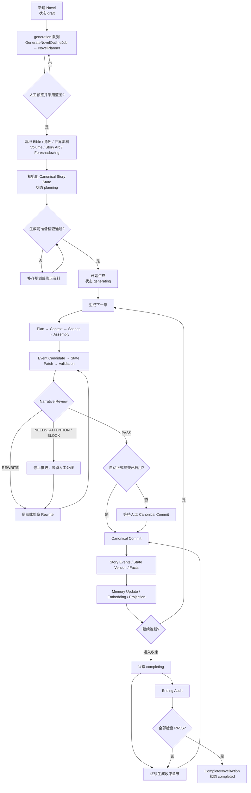
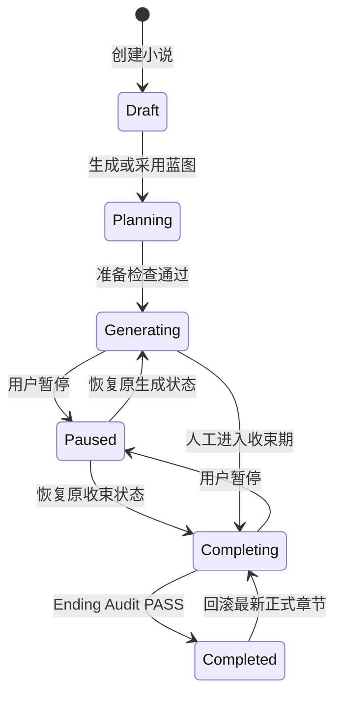
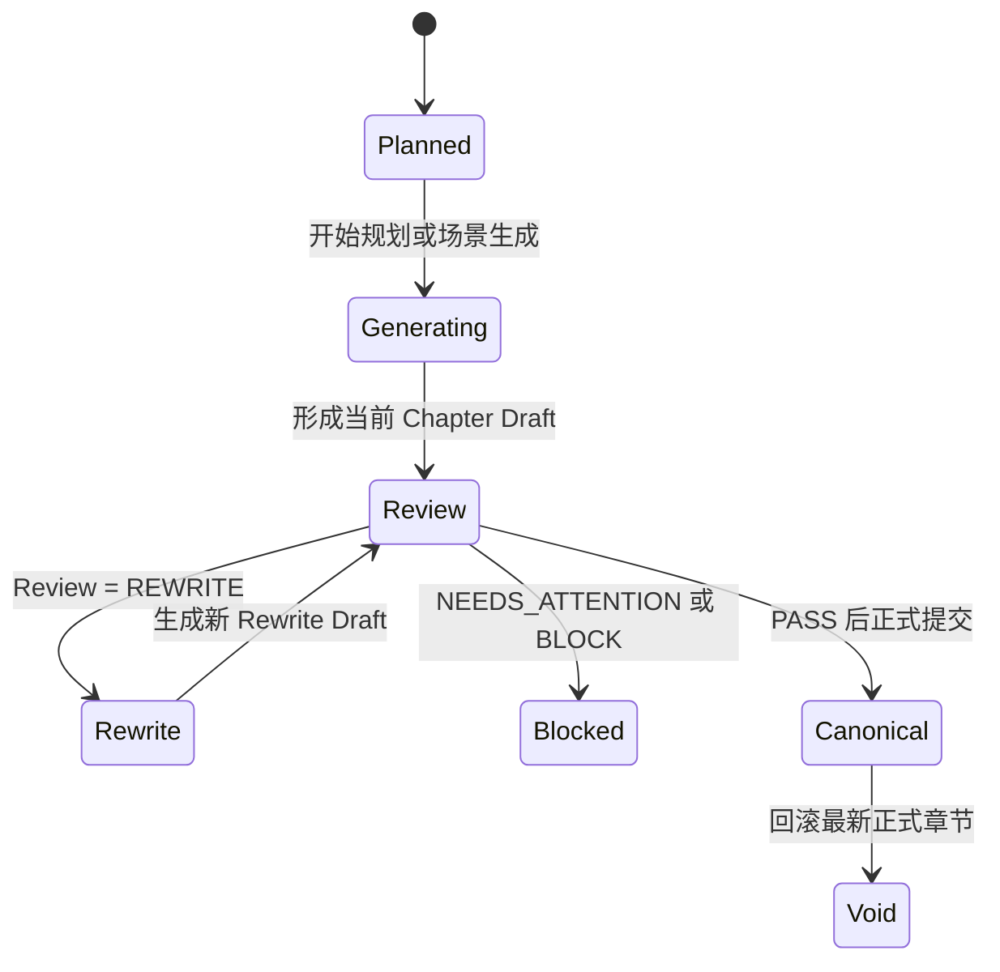
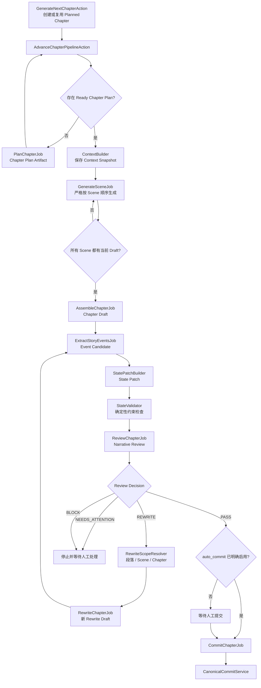
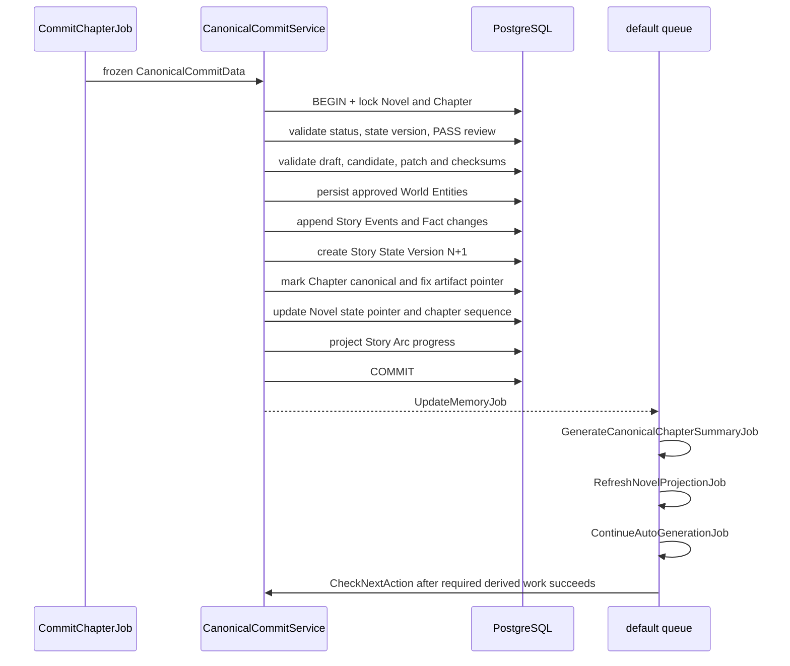
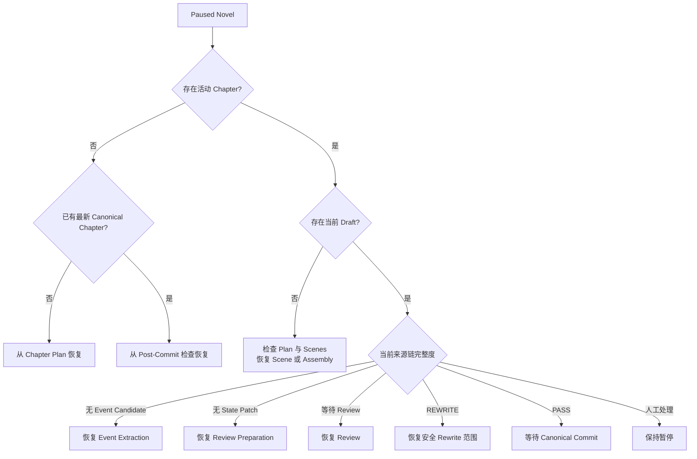
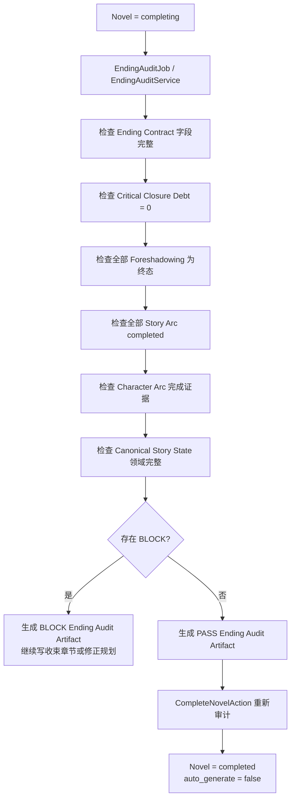

# 小说生成全生命周期与项目核心

> 本文描述 XNovel 从新建小说、生成蓝图、逐章生产、正式提交、记忆更新，到收束和完本的完整流程。
>
> 文档依据当前代码、`docs/PRD.md` 与 `docs/architecture/` 编写。凡是架构目标与当前实现不完全一致的地方，会明确标注，避免把设计目标误写成已实现能力。

## 1. 项目定位

XNovel 是一个单用户、单租户的 AI 长篇网络小说生产系统。Laravel 负责确定性的工作流和业务规则，LLM 只承担规划、写作、审校、提取等具体认知任务。

系统要解决的不是“一次生成一篇文章”，而是长期维护一条可解释、可恢复、可审校的小说生产链：

```text
Novel Bible
    ↓
Volume
    ↓
Story Arc
    ↓
Chapter Plan
    ↓
Context Snapshot
    ↓
Scene Drafts
    ↓
Chapter Draft
    ↓
Event Candidate + State Patch
    ↓
Review / Rewrite
    ↓
Canonical Commit
    ↓
Story State + Memory
    ↓
Ending Audit
    ↓
Completed Novel
```

项目的核心价值可以概括为一句话：

> 用确定性的 Laravel 工作流约束不确定的模型输出，让百万字小说的每一章都有规划、有来源、有审校、有正式状态、有恢复点，并且最终能够收束完本。

## 2. 全生命周期总览



这条链路有三个重要分界：

1. **Blueprint 与正式规划的分界**：模型生成的蓝图只是 `Context` Artifact，采用后才写入 Bible、人物、世界和分卷等正式规划数据。
2. **Draft 与 Canonical 的分界**：正文、事件候选和状态补丁都只是候选，只有 PASS Review 后的 `CanonicalCommitService` 能改变正式故事。
3. **连载与完本的分界**：进入 `completing` 后仍可生成章节，但必须消化收束债务；只有 Ending Audit PASS 才能改为 `completed`。

## 3. 核心状态机

### 3.1 小说状态



当前 `NovelStatus` 包含：`draft`、`planning`、`generating`、`paused`、`completing`、`completed`、`failed`、`archived`。
图中只画出本次代码核查确认的主流程迁移；`failed` 和 `archived` 是已定义状态，不在主生成链中推断其入口。

### 3.2 章节状态



章节 Draft 不等于正式章节。`canonical_artifact_id` 被固定、Story Events 写入、下一版 Story State 创建并更新 Novel 指针后，章节才是 `canonical`。

## 4. 第一阶段：新建小说

### 4.1 创建基础记录

Filament 的小说表单当前收集：

- 标题 `title`
- 题材 `genre`
- 小说目标总字数 `target_words`
- 单章目标字数 `generation_chapter_target_words`
- 故事前提 `premise`
- 各 AI Stage 的模型覆盖配置
- 小说总预算和单章预算
- Review PASS 后是否自动提交正式章节

新建完成时，Novel 仍是 `draft`。此时只有创作意图和运行策略，还不具备安全生成正文所需的世界资料与正式初始状态。

### 4.2 生成结构化蓝图

Filament 只投递 `GenerateNovelOutlineJob` 并立即结束 Web 请求；该 Job 在 `generation` 队列调用 `NovelPlanner`，根据小说基础信息生成结构化 Blueprint，避免全书规划受 PHP-FPM 请求时限影响。同一 Novel 同时只允许一个该 Job，网络、超时和临时 Provider 错误最多重试三次；输出截断不会用相同参数自动重复计费。规划请求使用 24,000 completion token，推理程度读取 `planner` 模型路由；该配置为空时采用 Provider 默认行为。Provider Schema 分别约束 `vol-*`、`arc-*`、`beat-*` 键，防止模型把分卷错放到故事线层或用备注/占位节点凑分卷数。当前蓝图 Prompt 版本由 `NovelPlanner` 记录为 `novel-planner-v7`。

Blueprint 至少覆盖：

- Bible 的核心设定、硬约束、文风配置和 Ending Contract
- 主要角色，且必须存在主角
- 世界实体和世界规则
- 嵌套的 Volume → Story Arc → 结构化 Beat，以及稳定 Key、Sequence、章节预算和验收条件
- 伏笔及其兑现窗口

这个结果保存为 `GenerationArtifact(type=context)`，并关联 Generation Run；其中 Outline 同时创建为 `novel_outlines.status=draft` 的不可变版本。Artifact 和 Draft Outline 都只是候选，不会在 Provider 返回后直接写入 Bible、Volume、Story Arc、Character、World Entity 或 Canonical State。手工入口直接创建 Draft Outline，不调用 Provider；人工编辑和局部重新生成均创建新版本，不覆盖 Artifact 或旧 Outline。

### 4.3 采用蓝图

用户确认采用后，`ApplyNovelBlueprintAction` 只接受已经通过结构校验且 checksum 匹配的 Draft Outline，并在数据库事务中锁定 Novel。AI Outline 还必须提供属于同一 Novel 且与其来源版本匹配的不可变 Blueprint Artifact；手工 Outline 使用用户已经创建的 Current Bible 和初始资料。

1. 确认 Draft Outline 属于当前小说、校验结果有效且 checksum 匹配。
2. 确认小说尚未存在 Current Outline、Volume、Story Arc、Chapter 或 Story Event。
3. AI 路径从匹配 Artifact 创建不可变 Bible Version、初始 Characters 和 World Entities；未来 Candidate 保留在 Outline Beat 中。
4. 按 `outline_key + sequence` 创建 Volumes；第一卷为 `active`，其余为 `planned`。
5. 创建 Story Arcs 并原样保存结构化 Beats；第一卷的 Arc 为 `active`，其他为 `planned`。
6. AI 路径从匹配 Artifact 创建 Foreshadowings。
7. 将选定 Outline 改为 `current`、更新 `novels.current_outline_id`，并初始化或刷新 Canonical Story State。
8. 将 Novel 切换到 `planning`。

采用蓝图是一次正式业务写入。重复采用不得产生第二套规划数据。

### 4.4 规划资料的职责

| 数据 | 回答的问题 | 对生成的约束 |
|---|---|---|
| Bible | 这是什么故事，哪些规则不能破坏 | 提供硬约束、文风、终局契约 |
| Character | 谁在故事中行动 | 身份、性格、能力、知识和人物弧 |
| World Entity | 世界中已知的地点、组织、物件、规则是什么 | 防止随意创造或冲突 |
| Volume | 当前大阶段要完成什么 | 控制阶段目标、高潮和篇幅 |
| Story Arc | 哪条剧情线如何推进和完成 | 让每章承担明确的 Arc Beat |
| Foreshadowing | 哪个承诺应在何时兑现 | 控制铺垫、强化、延期、兑现或放弃 |
| Ending Contract | 故事最后必须交付什么 | 为收束和完结提供可检查条件 |

## 5. 第二阶段：开始生成

`StartNovelGenerationAction` 只允许 `draft` 或 `planning` 的小说进入生成。它会检查：

- 存在 Current Outline；
- 存在当前 Bible；
- 存在主角；
- 存在世界设定；
- 存在一个 Active Volume；
- 存在推进中的 Story Arc；
- 存在初始 Canonical Story State。
- 如果已经存在正式章节，上一正式章的 Canonical Summary 已生成。

`NovelGenerationReadiness` 是 UI 和领域 Action 共用的只读事实来源，返回每项检查的 key、label、ready 和修复提示。小说概览在 `draft/planning` 状态直接展示全部检查项，缺项时禁用“开始正文生成”；Action 仍在锁定 Novel 的事务内重新检查，防止页面加载后规划数据发生变化。AI Outline 采用流程已经初始化 Initial State，因此正常路径不再把初始化作为常规步骤；手工规划或异常恢复仍可显式初始化。

全部通过后，Novel 进入 `generating`。这一步只改变工作流状态，不会绕过章节规划直接写正文。

## 6. 第三阶段：生成下一章

### 6.1 生成前检查

`GenerateNextChapterAction` 锁定 Novel 后执行前置检查。当前允许 `generating` 和 `completing` 状态继续生成；`paused`、`completed` 等状态不能开启新章节。

主要门禁包括：

- Bible、文风和 Canonical State 是否完整；
- 是否存在 Active Volume；
- 是否存在未解决的 Blocked Chapter；
- 同一本小说是否已有另一个活动章节或活动 Run；
- 预算是否允许继续调用 Provider；
- 下一章序号是否能由 `current_chapter_sequence + 1` 唯一确定。

如果相同序号已有未正式提交的章节，动作优先复用该章节，而不是创建重复章节。

### 6.2 章节生产主流程



`AdvanceChapterPipelineAction` 是章节阶段推进的统一决策点。它每次从数据库重新读取当前来源链，判断下一步缺少什么，再派发对应 Job。Queue Job 不自行决定跨阶段跳转。

### 6.3 Chapter Plan

Chapter Planner 回答“这一章为什么存在”，而不是立即写正文。计划数据包括：

- chapter function
- arc contribution 与 Arc Beat 契约
- reader promise
- target words
- POV、tone、time anchor、hook type
- must reveal、may hint、must not reveal
- required facts、forbidden conflicts
- due foreshadowings 及处理动作
- scene plans
- 本章允许引入的 World Entity Candidates

计划必须处于 `ready`，后续 Scene Writer 才能工作。Planner 同时受 Active Volume、Active Story Arc、当前状态和收束债务约束。

### 6.4 Context Builder

每次重要模型调用都应能解释“模型当时看到了什么”。上下文按可靠性分层：

```text
L0  Bible Hard Constraints / Ending Contract
L1  Locked Facts / Current Canonical Story State
L2  当前规划、人物、世界资料、近期正式章节与事件
L3  Long-term Memory RAG
L4  风格样例和低优先级辅助资料
```

Token 不足时先裁剪 L4、L3，再压缩较低价值的 L2。L0 和 L1 不能因节省 Token 被删除。

Generation Run 的 `context_snapshot` 负责记录 Bible Version、State Version、Plan、选中的实体和记忆、Prompt Version、模型与预算等来源。

### 6.5 Scene 顺序生成

一个 Chapter 被拆成多个 Scene，每个 Scene 至少有：

- goal
- conflict
- turn
- outcome
- POV、地点、时间锚点
- 与上一场景的衔接
- 目标字数和必须满足的事实

Scene 默认严格串行。下一 Scene 可以读取上一 Scene 的尾部和临时章节状态，但临时状态不属于 Canonical Story State。

每次成功写作生成新的 `scene_draft` Artifact，并将 Scene 的当前指针指向它；重试和重写不会覆盖历史 Artifact。

### 6.6 Chapter Assembly

所有 Scene 的当前 Draft 齐备后，Assembler 生成 `chapter_draft`。它负责：

- 场景衔接；
- 语气统一；
- 删除重复信息；
- 调整段落和局部表达；
- 形成可审校的整章正文。

Assembly 不能借机改变关键剧情结果、人物能力或世界硬规则。当前 Chapter Draft 必须明确绑定本次使用的 Scene Artifact 来源集合。

### 6.7 Event Candidate 与 State Patch

正文形成后，系统不会直接修改故事状态，而是先建立两类候选 Artifact：

1. `event_candidate`：提取会影响后续故事的事件，并记录正文证据。
2. `state_patch`：描述这些事件预计如何改变当前 Story State，以及 Fact 的创建或替代。

严格来源链为：

```text
Current Chapter Draft
    ↓ source_artifact_id
Event Candidate
    ↓ source_artifact_id + expected_state_version
State Patch
```

任一来源不匹配、State Version 过期或最新指针改变，后续 Review/Commit 都必须停止。

### 6.8 State Validation

确定性规则先于 LLM 判断，主要检查：

- Expected State Version 是否仍是当前版本；
- 引用的角色、世界实体和事实是否属于当前小说；
- 是否违反 Locked Fact；
- 事件证据和主体是否合法；
- State Patch 是否能应用且校验和一致；
- 人物生死、位置、知识、物品归属等硬状态是否冲突；
- Arc Beat 与 World Entity Candidate 是否有 Plan 契约。

确定性冲突不能通过再次让模型“判断一下”绕过。

### 6.9 Narrative Review

Review 对当前 Draft 做综合审校，决策只有四种：

审校维度的产品基线为：事实与连续性 25%、计划遵循 15%、人物一致性 15%、剧情推进 15%、重复度 10%、节奏与悬念 10%、文风与可读性 10%。确定性校验失败时，即使综合文风评分较好也不能 PASS。

| 决策 | 行为 |
|---|---|
| `PASS` | 允许进入 Canonical Commit 门禁 |
| `REWRITE` | 根据 Findings 解析安全重写范围并生成新 Artifact |
| `NEEDS_ATTENTION` | 停止自动推进，等待用户判断或修订 |
| `BLOCK` | 阻止提交，必须先解决硬冲突 |

Review 的状态、Findings、来源 Draft、Event Candidate、State Patch 和 Expected State Version 必须一致。不能只有显示状态为 PASS，而 Findings 仍包含会要求 Rewrite/Block 的问题。

### 6.10 Rewrite 循环

Rewrite 优先选择最小安全范围：

```text
Paragraph → Scene → Chapter
```

每次 Rewrite 都创建新的 `rewrite_draft`，再重新执行事件提取、状态补丁、验证和 Review。旧 Draft 和旧 Review 保留用于追踪，不会被覆盖。

默认最大 Rewrite 次数由配置控制。范围无法安全确定、次数耗尽或 Finding 要求人工判断时，流程转为人工处理。

## 7. Canonical Commit：全项目最严格的写操作

### 7.1 提交前冻结输入

`CommitChapterJob` 固定以下输入后调用 `CanonicalCommitService`：

- Chapter ID
- 当前正文 Artifact ID 与 checksum
- PASS Review ID
- Event Candidate Artifact ID
- State Patch Artifact ID
- Expected State Version

任何输入在排队期间发生变化，提交都应失败，而不是提交一条“看起来最新”的混合来源链。

### 7.2 事务边界



事务必须满足 All or Nothing。不能出现“章节已 canonical，但 State 没更新”或“事件已写入，但章节仍是 draft”。

### 7.3 幂等性

如果 Chapter 已存在 `canonical_artifact_id`，服务走重复提交校验，只有冻结输入与既有正式结果一致时才返回已有 State Version。重复 Queue Delivery 不得产生第二套事件、状态版本或正式章节效果。

### 7.4 提交产生的正式结果

Canonical Commit 会：

- 固定 Chapter 的 Canonical Artifact；
- 追加 Story Events；
- 应用受 Review/Plan 批准的 World Entity Introductions；
- 创建、替代或拒绝 Fact 变化，Locked Fact 不能被自动替代；
- 创建不可变的 `StoryStateVersion N+1`；
- 更新 Novel 的 Canonical State 指针和当前正式章节序号；
- 根据正式事件投影 Story Arc 进度与完成状态。

## 8. 正式提交后的记忆与连续生成

### 8.1 Memory Update

`UpdateMemoryJob` 只接受 Canonical Chapter。`MemoryUpdater` 会再次核验：

- Chapter 是 `canonical`；
- Canonical Artifact 属于当前 Chapter；
- State Version 由当前 Chapter 创建；
- Story Events 属于同一 Novel、Chapter 和 State Version，且仍为 active。

它以 Story Event 为来源幂等创建短记忆，按事件类型归类为人物里程碑、关系、物品、伏笔、世界、地点、Arc 等，再派发 `GenerateEmbeddingJob`。Draft、被拒绝的 Rewrite 和未提交事件不能创建正式 Memory。

正式提交后的阻塞链为 `UpdateMemoryJob → GenerateCanonicalChapterSummaryJob → RefreshNovelProjectionJob → ContinueAutoGenerationJob`。前三项任一失败都不撤销正式章节，但会停止自动续写。Embedding 由 Memory 独立派发，可以单独重试，不阻塞下一章。摘要任务只在 Chapter 的 `canonical_artifact_id` 仍与任务来源一致时写入 `chapters.summary`。

### 8.2 下一章是否自动启动

`CheckNextAction` 只有在下列条件满足时才创建下一章：

- 小说设置 `auto_generate=true`；
- 刚提交的 Chapter 确实是当前最新正式章节；
- 该正式 Chapter 的 Summary 已生成；
- Smoke、Reliability 或 Soak 运行没有达到各自目标；
- 下一章前置检查和预算通过。

`auto_generate` 与 `auto_commit` 是两个不同开关：

- `auto_commit` 决定 PASS Review 后是否自动正式提交；默认关闭，且必须明确配置。
- `auto_generate` 决定一次正式提交后是否继续创建下一章。

要形成无人值守的连续链，两者都需要启用，并且每一道门禁持续通过。

### 8.3 Queue 分工

| Queue | 任务类型 |
|---|---|
| `generation` | Chapter Plan、Scene、Assembly、Event Extraction、Review、Rewrite、Commit |
| `default` | Memory Update、Embedding、Projection Refresh、Ending Audit |

Queue 只负责异步执行。章节能否进入下一阶段仍由数据库状态和 `AdvanceChapterPipelineAction` 决定，Queue 顺序本身不是业务一致性保证。

## 9. 分卷与 Story Arc 推进

Story Arc 的进度不由 Draft 宣称，而由正式 `StoryArcBeatCompleted` 事件和 Canonical Chapter 的完成条件审计投影。只有所有 Beat 与完成条件都满足，Arc 才会成为 `completed`。

Active Volume 必须通过 `VolumeCompletionGate` 才能完成，检查项包括：

- Volume Goal 和 Climax 已定义；
- 关联 Story Arcs 已完成；
- 人物阶段变化证据；
- 到期伏笔，关键伏笔会 BLOCK；
- 本卷最新 Review 不存在未处理的 NEEDS_ATTENTION/BLOCK。

当前实现提供人工“完成分卷”操作。未发现完成当前卷后自动激活下一卷的工作流；运营者需要在规划界面把下一卷和相应 Story Arc 切换为 active，再继续生成。

## 10. 暂停、恢复、失败与回滚

### 10.1 优雅暂停

只有 `generating` 或 `completing` 可以暂停。`PauseGenerationAction` 会保存：

- 暂停时间；
- 暂停前状态；
- 最近 Run 的 Stage；
- Chapter 和 Scene；
- 可读的恢复标签。

暂停后不能开始新的规划、场景、组装、事件提取、Review、Rewrite 或 Canonical Commit。已经完成的 Provider 响应可以保存为 Artifact，但不会越过暂停门禁继续推进。

### 10.2 恢复点解析

`ResumeResolver` 从数据库事实计算恢复点，而不是只读取一个缓存状态：



恢复会还原暂停前的 `generating` 或 `completing` 状态，并由统一阶段推进器继续。PASS Review 的恢复点不会擅自替用户提交正式章节。

### 10.3 Retry 与复用

每个 Generation Run 记录 `idempotency_key`、`input_hash`、attempt、状态、来源版本和错误。相同输入已有成功 Artifact 时应优先复用；输入变化则必须创建新 Run/Artifact，不能伪装成同一次执行。

可恢复的网络错误、超时、429 或临时 Provider 故障可以 Retry。Schema Invalid、Locked Fact Conflict、State Version Conflict 和业务规则失败必须进入修正、重建上下文或人工处理。

### 10.4 回滚最新正式章节

当前只支持回滚最新 Canonical Chapter。`LatestCanonicalChapterRollback` 会在事务中：

- 确认目标是当前最新正式章节；
- 把 Novel 指针恢复到上一 State Version；
- 将本章正式事件标记为 invalidated；
- 失效相关 Memory；
- 失效本章创建的 Facts，并恢复本章曾替代的 Facts；
- 删除本章首次引入且未被其他正式章节引用的 World Entities；
- 将 Chapter 标记为 `void`；
- 重算 Story Arc 进度；
- 如果小说原为 `completed`，退回 `completing`。

回滚需要记录原因。若本章引入的世界实体已被其他正式章节引用，简单回滚会被拒绝，必须先处理后续 Canonical 链。

## 11. 收束与完本

### 11.1 进入收束期

用户在小说概览执行“进入收束期”，`EnterCompletingModeAction` 将状态从 `generating` 改为 `completing`。这是显式操作，当前没有根据字数自动切换收束状态的代码。

收束期仍使用同一章节生产链，但 Planner 会读取 Closure Debt 和 Ending Contract，目标从持续扩张转为关闭故事义务。

### 11.2 Closure Debt

收束债务代表尚未完成的故事承诺，核心包括：

- 未完成 Story Arc；
- 未兑现 Reader Promise；
- 未回收或未明确放弃的 Foreshadowing；
- 未解决的核心关系、冲突与开放线程；
- 未完成的人物弧；
- Ending Contract 尚未满足的终局要求。

关键收束债务存在时，小说不能完结。

### 11.3 Ending Audit



Ending Audit 是确定性审计，会形成带 `input_hash` 的 Generation Run 和不可变 `ending_audit` Artifact。相同输入可以复用已有成功审计。

### 11.4 完本

`CompleteNovelAction` 要求：

1. Novel 当前为 `completing`；
2. 最新 Ending Audit Artifact 的 decision 为 PASS；
3. 在完成事务中重新执行审计，结果仍为 PASS。

通过后小说改为 `completed`，并关闭 `auto_generate`。完本不是一个可由模型自行宣布的文本标签，而是所有正式状态和收束检查满足后的业务状态。

## 12. Prompt 版本与模型调用追踪

用户指定的 `PromptVersionResolver` 是主 AI Stage 的版本入口。它从 `config/prompts.php` 读取阶段版本；缺失、空值、未知 Stage 或错误配置会直接抛出异常，不允许静默使用一个无法追踪的 Prompt。Planner、Writer、Assembler、Reviewer、Rewrite 和 Summary 的有效版本为 `{stage_prompt_version}+{NarrativeProsePolicy::VERSION}`；Extractor 保持独立阶段版本。

当前配置为：

| AI Stage | Effective Prompt Version |
|---|---|
| planner | `chapter-planner-v10+natural-prose-v1` |
| writer | `scene-writer-v15+natural-prose-v1` |
| assembler | `assembler-v12+natural-prose-v1` |
| extractor | `event-extractor-v6` |
| reviewer | `reviewer-v14+natural-prose-v1` |
| rewrite | `rewrite-v13+natural-prose-v1` |
| summary | `summary-v2+natural-prose-v1` |

补充边界：

- Novel Blueprint 当前由 `NovelPlanner` 单独记录 `novel-planner-v7`，局部 Outline 修订记录 `novel-outline-node-v2`；两者都不通过 `PromptVersionResolver`。
- Embedding 是 `AiStage::Embedding`，但 `config/prompts.php` 不含 embedding Prompt；Embedding 使用模型配置，不是文本 Prompt 流程。
- 每次主模型调用应把有效 Prompt Version 写入 Generation Run、Context Snapshot、Input Hash 和 Idempotency Key，使阶段 Prompt 或自然文风策略更新后都不会复用旧 Artifact。
- `AiDebugService` 不注入 Narrative Prose Policy，因此显示并记录基础阶段版本，不伪装成生产有效版本。

## 13. 数据与职责地图

| 领域 | 主要数据 | 作用 |
|---|---|---|
| 小说入口 | `novels` | 生命周期状态、当前章节、Canonical State 指针、策略与预算 |
| 不可变设定 | `bible_versions` | 硬约束、风格、Ending Contract |
| 规划 | `volumes`、`story_arcs`、`chapter_plans`、`scenes` | 从全书到场景的结构化目标 |
| 世界资料 | `characters`、`world_entities`、`foreshadowings` | 可查询的角色、世界和伏笔边界 |
| 工作流追踪 | `generation_runs`、`generation_artifacts`、`reviews` | 输入、输出、版本、费用、失败和恢复依据 |
| 正式故事 | `story_events`、`story_state_versions`、`facts` | 已发生事件、当前世界状态、需精确验证的事实 |
| 长期记忆 | `memories` | 从正式事件派生的可检索记忆和向量 |
| 成本追踪 | `usage_records` | Provider、模型、Token、延迟、费用与 Request ID |

PostgreSQL 是这些业务事实的唯一权威来源。Redis 只用于 Queue、Cache、Lock、限流和临时进度。

## 14. 整个项目的核心

### 14.1 Laravel 拥有工作流控制权

Laravel 决定下一步执行什么、是否 Retry、是否 Rewrite、是否 Commit、是否暂停以及能否完本。LLM 只能返回候选内容和判断结果。

### 14.2 Draft 与 Canonical 必须隔离

Scene Draft、Chapter Draft、Rewrite Draft、Event Candidate、State Patch 都不能直接修改正式故事。唯一入口是 PASS Review 后的 `CanonicalCommitService`。

### 14.3 正式故事由 Event 与 State 共同表达

- Story Event 回答“正式故事中发生了什么”；
- Story State 回答“截至当前正式章节结束，世界现在是什么状态”；
- Fact 只保存需要精确查询、锁定和硬校验的事实。

每次 Canonical Commit 都从 State Version N 创建 N+1，历史版本不覆盖。

### 14.4 来源链比“最新数据”更重要

系统要求 Draft、Review、Event Candidate、State Patch、Expected State Version 形成同一条来源链。不能把不同版本的“最新记录”拼成一次提交。

### 14.5 确定性规则先于模型判断

状态版本、角色生死、知识边界、物品归属、Locked Fact、章节序号和来源 ID 由代码与数据库判断。人物性格、节奏、情绪和可读性再交给 LLM Review。

### 14.6 Artifact 不可变，Run 可追踪

重试、重写和修复都创建新 Artifact。Generation Run 记录输入哈希、幂等键、Prompt、模型、上下文、错误和用量，使问题可复现、费用可追踪、恢复可确定。

### 14.7 Canonical Commit 必须 Exactly Once

数据库事务、行锁、State Version 比较、校验和与唯一约束共同保证重复 Job 最终只有一次正式效果。Redis Lock 只能减少重复任务，不能替代数据库一致性。

### 14.8 Memory 只能来自正式故事

正式 Memory 必须能追到 Canonical Chapter、Story Event 和 State Version。否则未来 RAG 可能召回一段从未真正发生的剧情。

### 14.9 恢复能力是生产链的一部分

暂停、恢复、Retry、Artifact 复用和最新章节回滚不是附加功能。长篇生成持续时间长、Provider 调用昂贵，系统必须从已确认的最后一步继续，而不是整章重来。

### 14.10 完本是硬门禁

Ending Contract、Closure Debt 和 Ending Audit 确保系统不仅会继续生成，也知道何时停止。`completed` 必须由正式数据证明，不能由正文语气或模型声明决定。

## 15. 当前实现边界与文档差异

以下结论来自当前代码核查：

1. Post-Commit 已使用 `UpdateMemoryJob → GenerateCanonicalChapterSummaryJob → RefreshNovelProjectionJob → ContinueAutoGenerationJob` 的 Queue Chain；Embedding 由 Memory 独立派发，不阻塞下一章。
2. `MemoryUpdater` 使用确定性的 `memory-policy-v1` 从 Story Event 建立 Memory；`GenerateCanonicalChapterSummaryJob` 调用 `CanonicalChapterSummaryService` 使用有效版本 `summary-v2+natural-prose-v1` 生成正式章节摘要，不属于 Memory 建立步骤。
3. 当前分卷完成由人工触发 `VolumeCompletionGate`；未发现自动激活下一卷的工作流。
4. 进入收束期由用户显式执行 `EnterCompletingModeAction`；未发现按目标字数自动进入 `completing` 的流程。
5. `auto_commit` 默认关闭；Review PASS 本身不会自动改变 Canonical Story State。

这些边界不影响主链的正确性；后续若实现自动卷切换或自动收束触发，需要同步修改本文件与对应架构文档。

## 16. 关键不变量检查清单

任何生成流程改动都应继续满足：

- [ ] 没有 Chapter Plan 时不能正常生成正文。
- [ ] 同一本小说的章节生成与 Canonical Commit 默认串行。
- [ ] Draft 不修改 Story Events、Story State、Facts 或 Novel Canonical Pointer。
- [ ] Review、Event Candidate、State Patch 必须指向同一个当前 Draft。
- [ ] State Patch 的 Expected State Version 必须等于当前 Canonical State Version。
- [ ] Locked Fact 冲突不能被自动覆盖。
- [ ] 每次 Rewrite 创建新 Artifact。
- [ ] Canonical Commit 全部成功或全部回滚。
- [ ] 重复 Job 不产生重复正式效果。
- [ ] Memory 只来自 Canonical Chapter。
- [ ] 暂停后不创建新的 Generation Stage，也不执行 Canonical Commit。
- [ ] 回滚只允许最新 Canonical Chapter，并同步处理事件、状态、事实和记忆。
- [ ] Ending Audit 存在 BLOCK 时不能完成小说。
- [ ] 完本后关闭自动生成。

## 17. 主要代码入口

| 流程 | 代码入口 |
|---|---|
| Prompt 版本 | `app/AI/PromptVersionResolver.php`、`config/prompts.php` |
| 蓝图生成与采用 | `app/Services/NovelPlanner.php`、`app/Actions/Novels/ApplyNovelBlueprintAction.php` |
| 开始生成 | `app/Actions/Novels/StartNovelGenerationAction.php` |
| 创建下一章 | `app/Actions/Generation/GenerateNextChapterAction.php` |
| 章节阶段推进 | `app/Actions/Generation/AdvanceChapterPipelineAction.php` |
| 规划、场景、组装、审校与重写 | `app/Jobs/PlanChapterJob.php`、`GenerateSceneJob.php`、`AssembleChapterJob.php`、`ReviewChapterJob.php`、`RewriteChapterJob.php` |
| 事件提取 | `app/Jobs/ExtractStoryEventsJob.php` |
| 正式提交 | `app/Jobs/CommitChapterJob.php`、`app/Services/CanonicalCommitService.php` |
| 记忆与向量 | `app/Jobs/UpdateMemoryJob.php`、`app/Services/MemoryUpdater.php`、`app/Jobs/GenerateEmbeddingJob.php` |
| 自动连续生成 | `app/Actions/Generation/CheckNextAction.php` |
| 暂停与恢复 | `app/Actions/Generation/PauseGenerationAction.php`、`app/Services/ResumeResolver.php` |
| 最新章节回滚 | `app/Services/LatestCanonicalChapterRollback.php` |
| 分卷完成 | `app/Services/VolumeCompletionGate.php` |
| 进入收束与完本 | `app/Actions/Novels/EnterCompletingModeAction.php`、`app/Services/EndingAuditService.php`、`app/Actions/Novels/CompleteNovelAction.php` |

## 18. 关联架构文档

- [产品需求](../PRD.md)
- [生成管线](generation-pipeline.md)
- [故事引擎](story-engine.md)
- [记忆与上下文](memory-context.md)
- [数据模型](data-model.md)

## 19. 日常操作视图

Dashboard 只汇总跨小说的持久化事实：活跃小说、运行中章节、今日 Usage、最新 Run、最新 Review 和到期伏笔。最近生成入口进入 Chapter Workbench；没有章节的 Run 进入 Generation Run Inspector。

Novel Overview 通过 `NovelOperationsOverview` 汇总当前小说的正式进度、质量指标和当前流水线。正式字数只统计 Canonical Chapter；首轮 Review 通过率与 Rewrite 比例只使用最近 30 个符合条件的章节；失败分类复用 `GenerationFailurePolicy`。

下一动作按准备度、暂停、Review、失败恢复和当前流水线状态确定。Filament Schema 只展示服务结果，不复制失败分类或生成准备度规则。

20/50/100 章验收工具保留在 Dashboard 的诊断区，由 `generation.acceptance_tools_enabled` 显式开启，生产默认隐藏。
