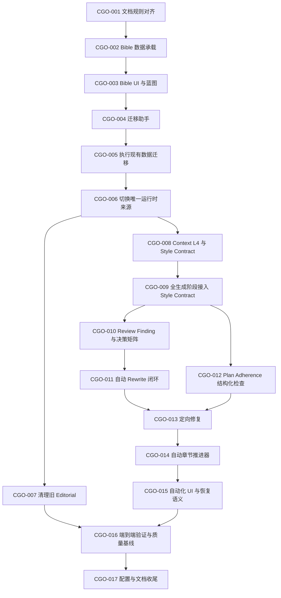

# 章节生成优化可执行任务

> 日期：2026-09-10  
> 来源：`docs/development/CHAPTER_GENERATION_OPTIMIZATION_PLAN.md`  
> 用途：把已确认的优化方案拆成可独立实施、测试、验收和回滚的任务。  
> 当前状态：CGO-001 至 CGO-017 已完成。

## 1. 使用规则

每次只实施一个 `CGO-XXX` 任务。开始前必须重新检查对应代码和上游任务结果，不得因为本文件列出文件路径就假定实现仍未变化。

每个任务完成时必须报告：

```text
Summary
Files Changed
Database / State Changes
Tests Actually Run
Known Limitations
Next Task
```

状态定义：

```text
TODO                 尚未实施
BLOCKED_BY_DECISION  缺少产品决策，不得编码
READY                依赖和决策已经满足
IN_PROGRESS          正在实施
DONE                 已通过验收
```

优先级定义：

```text
P0  正确性或主链路必需
P1  内容质量、可恢复性或可调试性必需
P2  不阻塞主链路的整理工作
```

## 2. 已确认事实、决策与未决项

### 2.1 任务拆分时的已确认基线（历史）

以下条目记录 2026-09-10 拆分任务时的实现状态，用于解释任务来源，不代表 CGO-017 完成后的当前行为。

- `novel_bibles` 已有 `tone`、`pov`、`tense` 和可空 `style_profile`；历史版本可为 `null`，CGO-003 起所有新版本必须保存完整对象。
- Bible 内容不可原地修改；变化通过新 Bible Version 表达。
- Novel 旧表单的创作风格和高级参数仍保存在 `novels.settings.editorial`；新 Bible Version 同时已能独立保存完整 `style_profile`。
- 当前 `NarrativeStyleProfile` 从 `settings.editorial` 读取。
- Writer 和 Assembler 已收到部分 Style Profile；Reviewer 和 Rewriter 尚未使用同一份 Style Contract。
- 当前 `ReviewChapterJob` 在 PASS 且 `auto_commit=true` 时自动派发 Commit。
- 当前正常章节生成仍依赖多个阶段按钮，没有一次启动到 PASS 的完整编排。

### 2.2 已确认产品决策

1. Novel Bible 是叙事与文风的唯一权威来源。
2. 当前小说迁移后的基调为“热血”，视角为“第一人称”，时态保留“过去时”。
3. 自动章节流水线运行到 Review PASS 后停止。
4. Canonical Commit 由用户手动确认。
5. Bible 增加 `style_profile` 承载能力。
6. Bible Version 创建、展示和校验覆盖完整文风设置。
7. 迁移期间暂时保留旧 Editorial 读取，但只用于迁移预览、冲突对照和数据复制。
8. 现有小说通过创建新 Bible Version 迁移；独有字段可按原值自动复制，基调和视角冲突必须人工选择。
9. Bible 创建后的章节生成阶段只读取 Current Bible；未完成迁移的小说不得继续生成。
10. 完成上述基础切换后，再实施自动流水线、Review/Rewrite、Style Contract 全链路和端到端测试。

### 2.3 已确认的补充决策

| 编号 | 已确认事项 | 最终方案 |
|---|---|---|
| D-01 | `style_profile` 的数据库存储类型 | 使用一个可空 JSONB；新版本要求完整对象，历史版本允许 `null` |
| D-02 | 普通 warning 的最终分流规则 | 可自动修复则 REWRITE；不影响发布且无需修复可 PASS；真正需要用户选择或 Rewrite 耗尽才 NEEDS_ATTENTION |

D-01 和 D-02 已于 2026-09-10 按推荐方案确认。相关任务不再受产品决策阻塞，但仍必须等待前置 Task 完成。

## 3. 总体依赖



推荐严格按编号实施。`CGO-008` 与 `CGO-010` 在依赖满足后可以分别开发，但单人项目优先顺序执行，降低同时变更多条主链的排查成本。

## 4. 任务清单

| Task | 名称 | 优先级 | 当前状态 | 依赖 |
|---|---|---:|---|---|
| CGO-001 | Source of Truth 规则对齐 | P0 | DONE | 无 |
| CGO-002 | Bible `style_profile` 数据承载 | P0 | DONE | CGO-001 |
| CGO-003 | Bible 版本 UI、展示与蓝图结构 | P0 | DONE | CGO-002 |
| CGO-004 | 旧 Editorial 迁移助手与冲突处理 | P0 | DONE | CGO-003 |
| CGO-005 | 执行并验证现有小说迁移 | P0 | DONE | CGO-004 |
| CGO-006 | 切换 Current Bible 唯一运行时来源 | P0 | DONE | CGO-005 |
| CGO-007 | 停止兼容读取并清理旧 Editorial | P1 | DONE | CGO-006 |
| CGO-008 | Context L4 与冻结 Style Contract | P0 | DONE | CGO-006 |
| CGO-009 | 全生成阶段接入 Style Contract | P0 | DONE | CGO-008 |
| CGO-010 | Review Finding Schema 与决策矩阵 | P0 | DONE | CGO-009 |
| CGO-011 | Review 后自动 Rewrite 闭环 | P0 | DONE | CGO-010 |
| CGO-012 | Scene/Assembly Plan Adherence 质量门 | P1 | DONE | CGO-009 |
| CGO-013 | 最小范围定向修复 | P1 | DONE | CGO-011、CGO-012 |
| CGO-014 | 自动章节推进器，运行到 PASS | P0 | DONE | CGO-011、CGO-013 |
| CGO-015 | 自动化入口、Pause/Resume 与 PASS 停点 | P0 | DONE | CGO-014 |
| CGO-016 | 端到端测试与质量基线 | P0 | DONE | CGO-007、CGO-009、CGO-013、CGO-015 |
| CGO-017 | 配置、架构文档与发布收尾 | P2 | DONE | CGO-016 |

## 5. Task Cards

## CGO-001 — Source of Truth 规则对齐

**Skills：** `generation-pipeline`, `memory-context`, `story-engine`  
**优先级：** P0  
**状态：** DONE
**依赖：** 无

### 目标

先消除已确认决策与现有 PRD/Architecture 的冲突，使后续代码任务有单一规范。

### 实施范围

- 更新 `docs/PRD.md`：正常自动章节生成终点改为 Review PASS，Canonical Commit 需要用户确认。
- 更新 `docs/architecture/generation-pipeline.md`：Review PASS 后停止，不再由 `auto_commit` 自动提交；手动 Commit 后才允许下一章。
- 更新 `docs/architecture/memory-context.md`：L4 Style 来自 Current Bible Version。
- 更新 `docs/architecture/data-model.md`：记录 Bible 使用可空 JSONB 承载 `style_profile`，新版本要求完整对象，历史版本允许 `null`。
- 明确首次 AI 小说蓝图发生在 Current Bible 创建前，是唯一不能读取 Current Bible 的生成入口。
- 更新普通 warning 分流规则：可自动修复则 REWRITE；无需修复且不阻塞发布则 PASS；需要用户选择或 Rewrite 耗尽才 NEEDS_ATTENTION。

### 不包含

- 不修改 PHP、Blade、CSS、JavaScript、配置或 Migration。
- 不修改数据库和小说业务数据。

### 验收

- PRD、Generation Pipeline、Memory Context 和本任务文档对 PASS/Canonical 的定义一致。
- 所有文档都把 Current Bible 写成章节文风的唯一权威来源。
- 文档没有继续承诺正常路径自动 Canonical Commit。
- D-01、D-02 与已确认方案一致，没有遗留冲突表述。

### 测试

- 文档链接和术语检查。
- 搜索 `auto_commit`、`Editorial Style Contract`、`L4 Style`，确认不存在互相矛盾的规范描述。

### 完成定义

Source of Truth 文档一致，并且没有应用代码变化。

### 完成记录

- 完成日期：2026-09-10。
- 已更新：`docs/PRD.md`、`docs/architecture/generation-pipeline.md`、`docs/architecture/memory-context.md`、`docs/architecture/data-model.md`。
- 已确认：自动流水线到 PASS 停止、Canonical Commit 必须由用户确认、Current Bible 是章节叙事与文风唯一来源、首次 Blueprint 是创建 Bible 前的唯一例外。
- 后续决策：D-01 和 D-02 已在 2026-09-10 按推荐方案确认，并同步更新 Source of Truth。
- 已验证：目标术语搜索、Markdown code fence 配对、`git diff --check`。
- 未执行应用测试，因为本任务只修改文档。

## CGO-002 — Bible `style_profile` 数据承载

**Skills：** `generation-pipeline`, `memory-context`  
**优先级：** P0  
**状态：** DONE
**依赖：** CGO-001

### 目标

使一个不可变 Bible Version 能完整保存叙事基线和文风设置。

### 实施范围

- 在 `novel_bibles` 增加可空 JSONB `style_profile`，并限制非空值必须为 JSON object。
- 历史版本保持 `null`，不得用默认风格伪造历史数据。
- `NovelBible` 增加 fillable、array cast，并把 `style_profile` 纳入不可变内容。
- `CreateBibleVersionAction` 接受并保存 `style_profile`。
- 复用 `config/narrative.php` 的 style、platform、language era、pace 和参数 code。
- 校验主文风、最多两个不重复的辅助文风、六项 1～5 整数参数以及必填项。

### 可能涉及的现有文件

- `database/migrations/*_create_novel_bibles_table.php`，仅作现状参考。
- 新增一个扩展 `novel_bibles` 的 Migration，实际文件名由创建时间确定。
- `app/Models/NovelBible.php`
- `app/Actions/Novels/CreateBibleVersionAction.php`
- `config/narrative.php`
- `database/factories/NovelBibleFactory.php`
- `tests/Feature/NovelBibleTest.php`

### 不包含

- 不迁移 `settings.editorial`。
- 不修改 Novel 表单。
- 不切换 `NarrativeStyleProfile` 读取来源。

### 测试

- PostgreSQL Migration migrate/rollback/reapply。
- `style_profile` cast 和完整结构保存。
- 非 object、未知 code、重复主辅文风和越界参数校验失败。
- `style_profile` 不能原地修改。
- 创建新版本时旧版本内容不变。

### 验收

- 新 Bible Version 能保存完整 Style Profile。
- 历史 Bible 没有被回填或改写。
- 数据库约束与 Laravel 校验职责清晰。

### 完成定义

Migration、Model、Action 和针对性测试全部通过，不包含 UI 或数据迁移。

### 完成记录

- 完成日期：2026-09-10。
- 已新增：`novel_bibles.style_profile` 可空 JSONB，以及 PostgreSQL JSON object CHECK；迁移已完成 migrate、rollback、reapply。
- 已更新：`NovelBible` 的 fillable、array cast 和不可变字段；`CreateBibleVersionAction` 可保存完整 Profile，并按 `config/narrative.php` 校验 code、必填键、主辅文风关系和六项整数参数。
- 历史数据：迁移没有回填旧版本；迁移后数据库中 `style_profile` 非空记录数为 0。
- 过渡兼容：CGO-002 完成时允许尚未升级的 Bible UI 和 Blueprint 调用方暂时省略 `style_profile`。CGO-003 已让全部创建入口显式提交完整对象，并移除此过渡行为；历史版本仍可保留 `null`。
- 已验证：Pint；CGO-002、现有 Bible 页面和 Blueprint 采用流程共运行 33 个测试，32 个通过、151 个断言，1 个 PostgreSQL 专属用例因测试环境为 SQLite 跳过；PostgreSQL 实库已直接确认列类型、可空性和 CHECK 定义。
- 完整套件：共运行 616 个测试，588 通过、21 跳过、6 个未在本任务中修改的 Filament 断言失败、1 个 Embedding Provider 连接错误；逐文件重跑可稳定复现，代码路径检查确认这些用例没有使用本任务修改的 Bible Model、Action、Factory 或 Migration。本任务未扩大范围修复这些范围外问题。
- 未修改：Novel 表单、Bible UI、Blueprint Schema、Editorial 数据和 `NarrativeStyleProfile` 读取来源。

## CGO-003 — Bible 版本 UI、展示与蓝图结构

**Skills：** `filament-ui`, `generation-pipeline`  
**优先级：** P0  
**状态：** DONE
**依赖：** CGO-002

### 目标

让用户在小说圣经中创建、查看和比较完整叙事与文风设置。

### 实施范围

- `ManageNovelBible` 按以下分区组织新版本表单：作品定位、叙事与文风基线、文风高级设置、写作边界、结局契约。
- 新版本表单预填 Current Bible 的完整 `style_profile`。
- `NovelBibleDetails` 展示当前版本和历史版本的主文风、辅助文风、语言时代感、节奏及高级参数。
- 关键输入校验错误使用简体中文。
- 扩展 AI 小说蓝图 Schema，使候选 Bible 包含完整 `style_profile`。
- `ApplyNovelBlueprintAction` 继续通过 `CreateBibleVersionAction` 创建版本，不复制落库逻辑。
- 蓝图采用前允许审阅完整叙事与文风设置。

### 可能涉及的现有文件

- `app/Filament/Resources/Novels/Pages/ManageNovelBible.php`
- `app/Filament/Resources/Novels/Schemas/NovelBibleDetails.php`
- `app/Services/NovelPlanner.php`
- `app/Actions/Novels/ApplyNovelBlueprintAction.php`
- `tests/Feature/Filament/NovelBiblePageTest.php`
- Novel Blueprint 相关 Feature Tests。

### 不包含

- 不移除 Novel 表单旧入口。
- 不迁移现有数据。
- 不改变章节生成读取来源。

### 测试

- 首个版本和新版本均能保存完整 Style Profile。
- 创建新版本时预填值正确，历史版本不变。
- 主辅文风和高级参数校验可见。
- 蓝图 Schema 无 Style Profile 时失败，采用后形成合法 Bible Version。
- Filament 关键中文文案断言。

### 验收

用户无需进入 Novel 基础设置即可在 Bible 页面维护全部叙事与文风内容。

### 完成定义

Bible UI 与蓝图流程测试通过，旧 Editorial 仍未迁移或删除。

### 完成记录

- 完成日期：2026-09-10。
- Bible UI：新版本表单按作品定位、叙事与文风基线、文风高级设置、写作边界、结局契约分区；预填 Current Bible 的完整 `style_profile`，历史 `null` 只在新表单中使用明确默认值，不回填旧版本。
- Bible UI 补充：子题材、基调、视角和时态改为可搜索下拉选择；标准选项来自 `config/narrative.php`，当前及历史 Bible 的已有值会继续显示，并允许添加自定义值，保存格式保持不变。
- Bible 展示：当前版本与版本历史均展示主文风、辅助文风、语言时代感、故事节奏、子题材、目标平台和六项高级参数；未知或历史缺失值显示为原 code 或“尚未记录”。
- Blueprint：`novel-planner-v4` 的响应 Schema 和 Laravel 校验都要求完整 `style_profile`；采用前预览完整叙事与文风设置；采用时继续通过 `CreateBibleVersionAction` 创建不可变版本。
- 创建规则：`CreateBibleVersionAction` 已移除 CGO-002 的临时可省略行为；新 Bible Version 必须提供完整合法对象，历史 `null` 不受影响。
- 已验证：Pint；CGO-003 相关 38 个测试中 37 个通过、209 个断言、1 个 PostgreSQL 专属用例在 SQLite 测试环境跳过；本地 Herd 页面已只读核验完整展示、五段表单、四个下拉字段、预填值和中文文案。
- 完整套件：共运行 623 个测试，595 个通过、21 个跳过；本次新增的下拉字段用例通过。其余仍是 CGO-002 已记录的 6 个范围外 Filament 旧断言失败和 1 个 Embedding Provider 连接错误，失败数量没有增加。
- 未修改：Novel 表单旧 Editorial 入口、现有 Editorial 数据、章节生成运行时来源与任何现有小说数据。

## CGO-004 — 旧 Editorial 迁移助手与冲突处理

**Skills：** `filament-ui`, `generation-pipeline`  
**优先级：** P0  
**状态：** DONE
**依赖：** CGO-003

### 目标

提供可审阅、可重复执行的迁移入口，把旧 Editorial 转换成新的 Bible Version。

### 实施范围

- 在 Bible 页面提供迁移预览，分别显示 Current Bible 与 `settings.editorial` 原值。
- 独有字段按原始 code 预填：子题材、目标平台、主/辅文风、语言时代感、节奏和高级参数。
- `tone/story_tone`、`pov/narrative_pov` 不一致时必须显示两侧值并要求选择。
- 使用现有 `CreateBibleVersionAction` 创建新版本，不直接更新旧 Bible。
- 已有完整 Current Bible `style_profile` 时不再显示可执行迁移，防止重复版本。
- 迁移失败不得把旧版本置为 Superseded 或留下半成品版本。

### 不包含

- 不自动执行任何小说的数据迁移。
- 不清理 `settings.editorial`。
- 不允许章节生成读取迁移预览结果。

### 测试

- 独有字段原样复制。
- 冲突没有选择时禁止提交。
- 无冲突时能创建新版本。
- 重复执行不创建内容相同的新版本。
- 事务失败时 Current Bible 和旧设置保持不变。

### 验收

用户能在一个可审阅表单中完成冲突选择，并且迁移只产生一个新的不可变 Bible Version。

### 完成定义

迁移助手和失败恢复测试通过，但真实小说数据仍未改变。

### 完成记录

- 完成日期：2026-09-10。
- 领域入口：新增 `MigrateEditorialToBibleAction`；预览 Current Bible 与旧 `settings.editorial` 原值，使用 `config/narrative.php` 对基调和视角做确定性 code 映射，只在语义一致时自动沿用。
- 冲突处理：基调或视角不一致、缺失或无法确定性映射时，必须从 Current Bible 与旧 Editorial 候选值中人工选择；未选择时领域 Action 与 Filament 表单均拒绝提交。
- 数据复制：子题材、目标平台、主辅文风、语言时代感、节奏和六项高级参数按旧 Editorial 原始值构建 `style_profile`，并继续交由 `CreateBibleVersionAction` 做完整结构校验和版本创建。
- UI：Bible 页面仅在 Current Bible 的 `style_profile` 为 `null` 且存在旧 Editorial 时显示“迁移旧创作风格”；模态框显示两侧原值、映射名称、保留的时态和冲突选择。
- 原子性与幂等：迁移锁定 Novel 并在事务中创建新版本；成功后完整 Current Bible 使入口隐藏，重复调用直接返回当前版本；模拟新版本持久化失败后，旧 Current Bible 状态和 `settings.editorial` 均保持不变。
- 数据变化：没有执行任何真实小说迁移，没有修改或清理 `settings.editorial`，没有切换章节生成运行时来源。
- 实库只读核对：当前仅有《六环余光》，Current Bible 已为 v3，且 `style_profile` 通过完整结构校验，因此迁移入口按防重复规则隐藏；CGO-005 开始时必须重新审计现状，不能继续假定 Current Bible 仍为 v1。本次核对没有写入数据。
- 已验证：Pint、`git diff --check`；迁移 Action、NovelBible、Bible 页面与旧 `NarrativeStyleProfile` 共 42 个测试，41 个通过、245 个断言、1 个 PostgreSQL 专属用例在 SQLite 环境跳过。
- 完整套件：共运行 631 个测试，603 个通过、3860 个断言、21 个跳过；其余仍是 CGO-003 已记录的 6 个范围外 Filament 旧断言失败和 1 个 Embedding Provider 连接错误，失败用例集合没有增加。

## CGO-005 — 执行并验证现有小说迁移

**Skills：** `generation-pipeline`  
**优先级：** P0  
**状态：** DONE
**依赖：** CGO-004

### 目标

使用已经通过测试的迁移入口完成现有小说数据迁移，并保存可核对的结果。

### 实施范围

- 迁移前记录 Current Bible ID、版本、状态和 `settings.editorial` 原值。
- 为当前《六环余光》创建下一个 Bible Version。
- 新版本采用已确认的“热血 / 第一人称 / 过去时”。
- 执行前审计发现 v3 已包含晚于旧 Editorial 的完整 `style_profile`；经用户确认，v4 原样保留 v3 的 `style_profile`，不再用旧 Editorial 覆盖。
- 校验新版本成为 Current Bible，原 Bible v1 内容保持不变并仅变更版本状态。
- 再次运行迁移检查，确认不会生成重复版本。

### 不包含

- 不清理旧 Editorial。
- 不修改 Canonical Chapter、Story Event、Story State 或 Memory。
- 不进行真实 AI 生成。

### 验收

- 当前小说存在一个完整、合法的 Current Bible。
- 新版本采用已确认的基线，并与 v3 除基调外内容一致。
- Bible v1 内容未被修改。
- 没有重复版本或半迁移状态。

### 测试与验证

- 使用数据库查询核对迁移前后版本和内容。
- 运行 NovelBible、Bible Page 和迁移助手针对性测试。
- 不声称执行备份，除非实际完成并记录备份位置。

### 完成定义

真实现有小说迁移成功，证据可核对；本任务需要执行时的明确数据变更授权，不能随代码任务顺带执行。

### 执行审计

- 审计日期：2026-09-10。
- 迁移前：Current Bible 为 v3（ID 3），内容哈希为 `b0c59e1ed3856e79c04ba743807ac377091b408907dfa76d63622a2f940cb4db`；旧 Editorial 原值已记录。
- 决策：用户确认保留较新的 v3 完整文风，只创建 v4 将基调从“严肃且充满希望”改为“热血”。
- 执行：通过 `CreateBibleVersionAction` 创建 v4（ID 4）；v4 为唯一 Current，采用“热血 / 第一人称 / 过去时”，v3 降级为 Superseded。
- 内容核对：v4 与 v3 除 `tone` 外完全一致；v3、v1 的内容哈希保持不变，旧 Editorial 未清理或修改。
- 幂等核对：再次调用迁移助手返回现有 v4，Bible 数量在调用前后均为 4，没有生成 v5。
- 边界核对：Canonical Chapter 4、Story Event 41、Story State Version 7、Memory 41，迁移前后计数一致；未运行 AI。
- 测试：`NovelBibleTest`、`MigrateEditorialToBibleActionTest`、`NovelBiblePageTest` 共 40 个测试，39 个通过、238 个断言、1 个 PostgreSQL 专属用例在 SQLite 环境跳过。
- 未执行数据库备份，因此不声称存在本次操作的独立备份文件。
- 完整证据：[CGO-005_MIGRATION_AUDIT.md](CGO-005_MIGRATION_AUDIT.md)。

## CGO-006 — 切换 Current Bible 唯一运行时来源

**Skills：** `generation-pipeline`, `memory-context`, `filament-ui`  
**优先级：** P0  
**状态：** DONE
**依赖：** CGO-005

### 目标

使章节生成只能从合法 Current Bible 获取叙事与文风，不再从 Editorial 回退。

### 实施范围

- `NarrativeStyleProfile` 从 `$novel->currentBible` 的 `tone`、`pov`、`tense` 和 `style_profile` 构建 Profile。
- 删除其章节生成路径中的 `settings.editorial` 和旧 `generation.narrative_style` 回退。
- 从 Novel 新建/编辑表单移除创作风格和文风高级设置。
- `CreateNovel`、`EditNovel` 不再写入 `settings.editorial`。
- 增加生成前置检查：Current Bible 存在、Style Profile 合法、迁移已完成、冲突已处理。
- 前置检查失败时不派发新 Stage，并显示可操作的中文原因。
- 迁移助手仍可只读访问旧 Editorial。

### 可能涉及的现有文件

- `app/Services/NarrativeStyleProfile.php`
- `app/Filament/Resources/Novels/Schemas/NovelForm.php`
- `app/Filament/Resources/Novels/Pages/CreateNovel.php`
- `app/Filament/Resources/Novels/Pages/EditNovel.php`
- `app/Actions/Generation/GenerateNextChapterAction.php`
- 现有 Generation preflight/gate 服务。
- `tests/Feature/NarrativeStyleProfileTest.php`
- `tests/Feature/Filament/NovelResourceTest.php`
- `tests/Feature/GenerateNextChapterActionTest.php`

### 不包含

- 不接入统一 Context L4。
- 不修改 Reviewer 或 Rewriter Prompt。
- 不删除旧数据库数据。

### 测试

- Bible Profile 存在时只读取 Bible，即使旧 Editorial 值不同。
- 缺少 Current Bible 或合法 Profile 时阻止生成。
- Novel 表单不再展示或保存 Editorial 字段。
- 首次小说蓝图生成仍能在没有 Current Bible 时创建候选，不被章节 preflight 错误阻止。

### 验收

任何章节生成入口都不能从旧 Editorial 获取文风；迁移工具仍能展示旧值。

### 完成定义

唯一读取来源和生成前置检查测试通过，旧数据仍保留以便回滚核对。

### 实施结果

- 唯一来源：`NarrativeStyleProfile` 攅读取最新 Current Bible，校验其状态、基调、视角、时态和完整 `style_profile`；输出直接采用 Bible 的显式六项高级参数，不再展开或回退旧 Editorial Preset。
- 兼容退出：章节规划、场景生成和章节组装通过同一 Profile 服务读取 Bible；运行时代码已移除 `settings.editorial` 和 `generation.narrative_style` 回退。
- 蓝图例外：首次 AI 小说蓝图在尚无 Current Bible 时仍可生成完整 Bible 候选；其输入只保留章节目标字数，不再把旧 Editorial 当作生成偏好。
- 前置检查：`GenerateNextChapterAction` 在创建或恢复 Chapter 前校验 Current Bible；缺失、状态错误或 `style_profile` 不完整时以 `current_bible_incomplete` 拒绝执行，并返回指向“小说圣经”的中文处理建议。
- Novel 表单：新建和编辑页面已移除“创作风格”和“文风高级设置”；`CreateNovel` 不再创建 `settings.editorial`，`EditNovel` 不再回填或改写该 key。
- 迁移窗口：已有 `settings.editorial` 数据仍原样保留，迁移助手及其 Bible 页面预览仍可只读访问；实际清理继续留给 CGO-007。
- 实库核对：《六环余光》的运行时 Profile 来自 Current Bible v4，返回“热血 / 第一人称 / 过去时”、剑与魔法、番茄小说、通俗爽快及 v4 显式高级参数；未调用 AI，未写入业务数据。
- 针对性验证：17 个相关测试文件共 132 个测试全部通过，包含唯一来源、旧值冲突、前置拒绝、表单移除、初始蓝图、自动生成、恢复和长跑入口。
- 完整套件：共运行 635 个测试，608 个通过、3878 个断言、21 个跳过；剩余 5 个范围外 Filament 旧断言失败和 1 个 Embedding Provider 连接错误。本次影响过的失败用例经定向重跑均已通过。
- 格式与静态检查：Pint 和 `git diff --check` 通过；运行时代码中对 Editorial 的剩余访问只存在于迁移 Action 和迁移预览 UI。

## CGO-007 — 停止兼容读取并清理旧 Editorial

**Skills：** `generation-pipeline`  
**优先级：** P1  
**状态：** DONE
**依赖：** CGO-006

### 目标

在所有小说迁移和唯一来源切换验证通过后，结束临时兼容窗口。

### 实施范围

- 生成迁移完成清单，确认不存在缺少完整 Current Bible Profile 的小说。
- 删除迁移助手和其他代码对 `settings.editorial` 的读取。
- 以幂等方式删除每部小说 `settings` 中的 `editorial` key，不影响 budget、model override、automation 等其他设置。
- 删除无用的 Editorial 表单映射和旧测试 fixture。
- 保留历史 Generation Run 的 context snapshot，不改写历史记录。

### 不包含

- 不删除 `novels.settings` 字段。
- 不清理与 Editorial 无关的 Novel 设置。
- 不修改历史 Bible、Canonical Chapter 或 Artifact。

### 测试

- 清理只删除 `settings.editorial`。
- 清理重复执行结果一致。
- 清理前存在未迁移小说时必须拒绝执行。
- 清理后完整回归 Novel Settings 和 Bible Version 流程。

### 验收

运行时代码中不存在 Editorial 文风来源，数据库中不再保留活动小说的旧 Editorial 配置。

### 完成定义

兼容读取和旧数据安全清理完成，历史追踪数据不变。

### 完成记录

- 完成日期：2026-09-10。
- 迁移完成清单：实库共 1 部小说；《六环余光》（Novel ID 2）的最新 Bible 为 v4（ID 4）、状态为 Current，基调/视角/时态齐全，`style_profile` 通过与新 Bible Version 相同的完整结构校验；不存在未迁移小说。
- 安全清理：新增 `CleanupEditorialSettingsAction`，在同一事务中先锁定并校验全部 Novel，任一小说缺少完整 Current Bible 时拒绝全部写入；校验通过后仅删除每部小说 `settings` 的 `editorial` key。
- 兼容退出：删除 `MigrateEditorialToBibleAction`、Bible 页面“迁移旧创作风格”入口及其 Editorial 展示/映射方法，同时删除对应迁移测试 fixture；应用代码中已不存在 Editorial 文风读取来源。
- 实库结果：首次清理 1 部小说，重复执行清理 0 部；《六环余光》不再包含 `settings.editorial`，原有 `ai`、`pause`、`auto_stop`、`auto_generate` key 及其值均保持不变。
- 历史保护：清理前后 156 条 Generation Run `context_snapshot`、4 个 Bible、4 个 Chapter、93 个 Generation Artifact 的数量和逐表 SHA-256 指纹完全一致；没有改写历史快照、Bible、Chapter 或 Artifact。
- 针对性验证：清理 Action、Bible Version、Bible 页面、Novel Settings 保存和 Novel Resource 共 48 个测试，47 个通过、292 个断言、1 个 PostgreSQL 专属用例在 SQLite 环境跳过；覆盖只删 Editorial、重复执行、未迁移拒绝、快照不变及其他设置保留。
- 完整套件：共运行 631 个测试，604 个通过、3792 个断言、21 个跳过；剩余 5 个范围外 Filament 旧文案/展示断言失败和 1 个 Embedding Provider 连接错误，与 CGO-006 已记录的失败类别一致。
- 格式与静态检查：Pint、PHP 语法检查和 `git diff --check` 通过；搜索确认 `app` 中只有清理 Action 会识别并删除 `editorial` key，不会将其作为文风来源。

## CGO-008 — Context L4 与冻结 Style Contract

**Skills：** `memory-context`, `generation-pipeline`  
**优先级：** P0  
**状态：** DONE
**依赖：** CGO-006

### 目标

把 Current Bible 的叙事与文风展开成可追踪、可复用的 L4 Style Contract。

### 实施范围

- `ContextSnapshot` 增加明确的 L4 Style 结构。
- `ContextBuilder` 从指定 Bible Version 构建 L4，不在各生成服务中临时拼接不同版本。
- Style Contract 包含 Bible ID/version、tone、pov、tense、作品定位、主/辅文风、语言时代感、节奏和展开后的参数。
- 对规范化结构计算稳定 checksum。
- Bible version/checksum 进入 context snapshot 和 `input_hash`。
- Token 裁剪时保留 POV、tense 和硬性禁用规则；低优先级样例以后才允许裁剪。
- 同一 Chapter Pipeline 冻结一个 Bible Version，不在中途静默切换。

### 可能涉及的现有文件

- `app/Data/ContextSnapshot.php`
- `app/Services/ContextBuilder.php`
- `app/Services/NarrativeStyleProfile.php`
- `tests/Feature/ContextBuilderTest.php`
- `tests/Feature/NarrativeStyleProfileTest.php`

### 不包含

- 不增加独立 Style Contract 表。
- 不接入所有 Prompt；该工作属于 CGO-009。
- 不新增正向样例或禁用表达字段。

### 测试

- 相同 Bible 内容得到稳定 checksum。
- Bible Version 变化导致 checksum/input hash 变化。
- 同一 Pipeline 的多个 Context Snapshot 引用同一版本。
- 缺少或无效 Style Profile 明确失败，不使用默认 Editorial。
- Token 预算不足时硬性 Style 约束不被裁剪。

### 验收

Run Inspector 能回答本次调用使用了哪个 Bible Version 和 Style Contract checksum。

### 完成定义

L4 构建、序列化、hash 和预算测试通过。

### 完成记录

- 完成日期：2026-09-10。
- L4 契约：`ContextSnapshot` 升级为 schema v2，显式保存 `l4` 和 `style_contract_checksum`；L4 包含 Bible ID/version、基调、视角、时态、作品定位、主辅文风、语言时代感、节奏、六项原值及可执行展开说明、禁忌和硬约束。
- 稳定校验：Style Contract 在递归规范化关联键后计算 SHA-256；列表顺序保留，因此同一 Bible 重复构建得到相同 checksum，Bible Version 或契约内容变化会改变 checksum，并经完整 Context 进入实际 Scene `input_hash`。
- 指定版本：`ContextRequest` 必须携带 Bible Version，`ContextBuilder` 只读取该小说的指定版本，不再在构建过程中隐式查询最新 Current Bible；无效或缺失的 `style_profile` 明确失败。
- Pipeline 冻结：当前 Chapter Plan 已有 Run 时，以最早绑定该 Plan 的 Bible Version 为锚点；没有锚点时使用 Current Bible，并由首个 Scene Run 固定。后续 Scene 即使遇到新的 Current Bible，也继续使用锚定版本；已有 Run 不能改绑另一版本。
- Token 规则：L0、L1、L4 一并作为不可裁剪区参与预算；紧张预算只裁剪近期故事和长期记忆，L4 中的 POV、时态、禁忌和硬约束保持完整。
- Inspector：Run Inspector 的“Context 版本”同时展示 Bible Version 与可复制的 Style Contract checksum，并可查看完整 L4。
- 兼容边界：Scene 的旧形态 `writing_constraints.style_profile` 暂时保留，但已从同一冻结 L4 投影，避免双来源；其移除以及 Plan、Assembly、Review、Rewrite 等全部 Prompt 的统一接入属于 CGO-009。
- 实库只读核对：《六环余光》Current Bible v4（ID 4）可生成完整契约；checksum 为 `906db1978d4fd93e7cf371b4d660e19e96b3eba71bf90d803f06be0dce704e23`，基线为“热血 / 第一人称 / 过去时”。未写入业务数据，未调用 AI。
- 针对性验证：Context 构建/检查、文风 Profile、Scene 生成、Plan Job、Assembly、Review、Rewrite、Run Inspector UI 与章节详情共 122 个测试全部通过，777 个断言。
- 完整套件：共运行 636 个测试，609 个通过、3838 个断言、21 个跳过；剩余 5 个范围外 Filament 旧文案/展示断言失败和 1 个 Embedding Provider 连接错误，与 CGO-007 记录的失败类别一致。
- 格式与静态检查：Pint 和 `git diff --check` 通过；本任务没有新增数据表或迁移。

## CGO-009 — 全生成阶段接入 Style Contract

**Skills：** `generation-pipeline`, `memory-context`  
**优先级：** P0  
**状态：** DONE
**依赖：** CGO-008

### 目标

让规划、写作、组装、审校、重写和长度修复使用同一份冻结 Style Contract。

### 实施范围

- Chapter Planner 不再同时接收冲突的 Bible 基线和 Editorial Profile。
- Scene Writer 从 L4 获取完整 Style Contract。
- Assembler 移除重复 `style_constraints`/Editorial 拼接，只使用冻结契约。
- Reviewer 获得目标文风和可观察规则，并要求 style finding 提供正文证据。
- Rewriter 和所有压缩/扩写调用继续注入同一契约。
- 各 Stage Run snapshot 记录相同 Bible version/checksum。
- 新 Bible Version 只影响新 Pipeline；进行中的章节继续使用冻结版本，除非用户显式重启本章。

### 可能涉及的现有文件

- `app/Services/ChapterPlanner.php`
- `app/Services/SceneGenerator.php`
- `app/Services/ChapterAssembler.php`
- `app/Services/ChapterReviewer.php`
- `app/Services/ChapterRewriter.php`
- 对应 Plan、Scene、Assembly、Review、Rewrite Feature Tests。

### 不包含

- 不改变 Review 最终 Decision Matrix。
- 不自动派发 Rewrite。
- 不改变 Pipeline 编排。

### 测试

- 每个 Stage 的请求和 Run snapshot 包含相同契约标识。
- Reviewer 能对目标主/辅文风给出带证据的 finding。
- Rewrite/字数修复请求保留 POV、tense 和主文风。
- Bible Version 变化后不复用旧风格 Artifact。

### 验收

不存在某个正文相关 Stage 使用不同文风来源或缺少 Style Contract 的情况。

### 完成定义

全阶段针对性测试通过，Review 分流和自动流水线行为尚未改变。

### 完成记录

- 完成日期：2026-09-10。
- 唯一契约：Chapter Planner、Scene Writer、Assembler、Reviewer 和 Rewriter 的请求及 Run Snapshot 均保存同一结构的 `l4`、`bible_version` 和 `style_contract_checksum`；各阶段的 `input_hash` 均覆盖完整契约。
- Planner：移除 `generation_preferences.style_profile`，保留 Bible 故事信息并以 L4 作为唯一文风契约；章节 tone 只能在契约基调范围内变化，辅助文风不得覆盖主文风，POV 与时态不得改变。
- Writer/Assembler：Scene 移除 `writing_constraints.style_profile`；Assembler 移除 `style_constraints` 和重复的 `style_profile`。两者只读取 L4，Assembler 明确保留 Scene 的叙述声音，不重新选择文风来源。
- Review：审校上下文加入冻结 L4；Reviewer 明确逐项核对主文风、辅助文风和展开参数，style finding 必须包含非空正文证据和对应的目标文风说明。最终 Decision Matrix 没有改动。
- Rewrite 与长度修复：章节或 Scene Rewrite、Scene 扩写/压缩、Assembly 扩写/压缩和 Rewrite 扩写/压缩均继续注入同一 L4，并明确保持 POV、时态、主文风和辅助文风层级。
- 版本冻结：已有 Chapter Plan 继续使用其最早绑定的 Bible Version；Current Bible 中途变化不会影响后续 Scene、Assembly、Review 或 Rewrite。普通重复投递复用原契约；只有显式“重新生成计划”才以新 Current Bible 启动新 Pipeline，其 checksum、`input_hash` 和 Artifact 均发生变化。
- Prompt 追踪：因执行规则发生变化，版本升级为 `chapter-planner-v5`、`scene-writer-v9`、`assembler-v7`、`reviewer-v5`、`rewrite-v6`；Extractor 与 Summary 未改动。
- 端到端契约测试：在 Current Bible 从 v1 切换到 v2 后，验证同一 Chapter 的 Assembly、Review、Rewrite 仍使用 v1 的相同 checksum，三个实际请求均包含 v1 的“热血激昂 / 第一人称”，且不包含 v2 的“冷峻克制”。
- 针对性验证：全阶段 Style Contract、Context、Prompt 版本、自动生成/恢复路径和相关 Filament 页面共 179 个测试全部通过，1043 个断言。
- 完整套件：共运行 640 个测试，613 个通过、3885 个断言、21 个跳过；剩余 5 个范围外 Filament 旧文案/展示断言失败和 1 个 Embedding Provider 连接错误，与 CGO-008 记录的失败类别一致。
- 边界：没有修改 Review Decision Matrix、自动 Rewrite 派发或 Pipeline 编排；没有新增数据表、迁移或依赖，没有调用真实 AI，也没有写入真实小说数据。

## CGO-010 — Review Finding Schema 与决策矩阵

**Skills：** `generation-pipeline`, `story-engine`  
**优先级：** P0  
**状态：** DONE
**依赖：** CGO-009

### 目标

由 Laravel 根据结构化 Finding 和确定性规则决定 PASS、REWRITE、NEEDS_ATTENTION、BLOCK，降低模型顶层建议造成的误分流。

### 实施范围

- 扩展 Finding Schema：稳定 code、dimension、severity、scene_id、scope、auto_fixable、requires_human_decision、message、evidence。
- Schema 校验引用合法性和必填字段。
- StateValidator hard finding、Locked Fact 和 Canonical 前置冲突始终 BLOCK。
- 可定位、可自动修复问题进入 REWRITE。
- 只有需要用户选择、重大歧义或 Rewrite 耗尽进入 NEEDS_ATTENTION。
- 模型 `recommended_decision` 作为输入证据，不直接覆盖 Laravel 决策。
- 保持现有七维权重，除非另有明确需求。

### 不包含

- 不自动派发 Rewrite。
- 不改变最大 Rewrite 次数。
- 不修改 Canonical Commit 的硬校验。

### 测试

- 高分加普通 warning 时：可自动修复则 REWRITE；无需修复且不阻塞发布则 PASS；需要用户选择才 NEEDS_ATTENTION。
- 可修复 Plan/Style finding 进入 REWRITE。
- 需要人工选择进入 NEEDS_ATTENTION。
- hard finding 无法被高分或模型 PASS 覆盖。
- 非法 scene_id 或缺少 evidence 的 Finding 拒绝入库。

### 验收

每个 Decision 都能从结构化 Finding 和确定性规则解释，模型建议不再是最终分流开关。

### 完成定义

Decision Matrix 和相关回归测试通过。

### 完成记录

- 完成日期：2026-09-10。
- Finding 契约：Narrative Review 使用七个固定 code，并强制输出 `dimension`、`severity`、`scene_id`、`scope`、`auto_fixable`、`requires_human_decision`、`message` 和 `evidence`；Reviewer 上下文新增本章 Scene ID 清单。
- Schema 校验：拒绝未知 code、code 与 dimension 不匹配、缺少必填字段、空 evidence、互相冲突的修复标志、无处理路径的 error、非法跨章 scene_id，以及 scope 与 scene_id 不一致的响应；低于通过分数却没有可执行 Finding 的响应不会写入 Review。
- Laravel 决策矩阵：StateValidator hard finding（包括 Locked Fact 与 Canonical 前置冲突）始终 BLOCK；`requires_human_decision=true` 或 Rewrite 耗尽进入 NEEDS_ATTENTION；`auto_fixable=true`（包括字数确定性 Finding）进入 REWRITE；评分达标且只有不阻塞 warning 时 PASS。
- 模型边界：`recommended_decision` 继续保存为审校证据，但不参与最终分流；Review Artifact 新增 `decision_basis`，记录命中的 Laravel 规则、相关 Finding code、实际分数和通过阈值。
- 统一持久化：State、字数和 Rewrite 耗尽 Finding 均补齐 scope、修复能力、人工决策等字段；Reviewer Prompt Version 升级为 `reviewer-v6`。
- 针对性验证：Chapter Review、Rewrite 耗尽、Style Contract、Prompt Version、AI 设置、Canonical Commit 和 StateValidator 共 85 个测试全部通过，354 个断言。
- 完整套件：共运行 654 个测试，627 个通过、3934 个断言、21 个跳过；剩余 5 个范围外 Filament 旧文案/展示断言失败和 1 个 Embedding Provider 连接错误，与 CGO-009 已记录的失败类别一致。
- 边界：没有自动派发 Rewrite，没有改变最大 Rewrite 次数，没有修改 Canonical Commit 硬校验，没有调用真实 AI，也没有写入真实小说数据。

## CGO-011 — Review 后自动 Rewrite 闭环

**Skills：** `generation-pipeline`  
**优先级：** P0  
**状态：** DONE
**依赖：** CGO-010

### 目标

Review 得到 REWRITE 时自动开始现有重写链，并在最多两次自动尝试后正确停止。

### 实施范围

- `ReviewChapterJob` 在 REWRITE 且预算未耗尽时通过现有 gate/dispatcher 派发 `RewriteChapterJob`。
- 复用现有 Rewrite → Extract Events → Build Patch → Review 链。
- 自动 Rewrite 次数排除 `manual_edit` Artifact，与 UI 统计口径一致。
- 最大自动尝试保持 2。
- 两次后仍有问题进入 NEEDS_ATTENTION。
- Pause、重复投递、非重试错误和状态版本冲突不触发无脑 Rewrite。

### 可能涉及的现有文件

- `app/Jobs/ReviewChapterJob.php`
- `app/Jobs/RewriteChapterJob.php`
- `app/Services/ChapterRewriter.php`
- `app/Services/GenerationStageGate.php`
- `app/Services/GenerationJobDispatcher.php`
- `tests/Feature/RewriteLoopTest.php`
- `tests/Feature/ChapterReviewTest.php`

### 不包含

- 不实现完整章节自动推进器。
- 不改 Canonical Commit。
- 不增加第三个自动 Rewrite 尝试。

### 测试

- REWRITE 自动派发一次重写。
- 重复 Review delivery 不重复派发。
- 人工修改不消耗自动次数。
- 两次耗尽后停止为 NEEDS_ATTENTION。
- Pause 后保存已有结果但不派发下一 Stage。

### 验收

普通可修复问题不需要用户点击 Rewrite，且不会无限循环。

### 完成定义

自动重写闭环的成功、耗尽、重复投递和暂停测试通过。

### 完成记录

- 完成日期：2026-09-10。
- 自动闭环：`ReviewChapterJob` 对 REWRITE 结果检查预算后，通过现有 `GenerationStageGate` 与 `GenerationJobDispatcher` 派发一次整章 `RewriteChapterJob`；后续继续复用 Rewrite → Extract Events → Build State Patch → Review 链。
- 幂等：Review Job 增加稳定 operation ID；同一强制审校 Job 重复投递时复用已成功 Run。已完成当前 Review 对应的 Rewrite Artifact 时不再重复派发，队列预留键继续阻止并发重复入队。
- 次数口径：新增统一自动 Rewrite 计数，只统计当前成功 Chapter Plan 之后且 `manual_edit` 不为 true 的 Rewrite Artifact；Reviewer、Rewriter 与章节工作台均使用该口径，最大自动次数仍为 2。Artifact 展示版本仍按全部不可变重写稿递增，避免人工修改与自动重写出现重复版本号。
- 停止条件：第二次自动 Rewrite 后仍有可修复 Finding 时，Review 直接转为 NEEDS_ATTENTION；预算到限时保留 Review 并记录 `budget_limit`，Pause、状态版本冲突和其他未成功 Review 均不会派发 Rewrite。
- 针对性验证：审校、重写、预算、事件提取、状态补丁、队列去重、暂停/恢复、人工修订、Style Contract 和章节工作台共 127 个测试全部通过，634 个断言。
- 完整套件：共运行 663 个测试，636 个通过、3955 个断言、21 个跳过；剩余 5 个范围外 Filament 展示断言失败和 1 个 MemoryUpdater 连接 Embedding Provider 错误。失败测试分别位于 DueForeshadowingsWidget、NovelAiSettings、NovelPlanningPreview、NovelStoryStateInitialization（2 个）和 MemoryUpdater，与本任务改动的 Review/Rewrite 针对性回归无重叠。
- 边界：自动派发暂为整章 Rewrite；Finding 驱动的最小范围选择属于 CGO-013。没有实现完整章节推进器，没有增加第三次 Rewrite，没有修改 Canonical Commit，也没有调用真实 AI 或写入真实小说数据。

## CGO-012 — Scene/Assembly Plan Adherence 质量门

**Skills：** `generation-pipeline`  
**优先级：** P1  
**状态：** DONE
**依赖：** CGO-009

### 目标

在最终 Review 前发现 Scene goal/conflict/turn/outcome 缺失或反转。

### 实施范围

- 把 Scene Writer 的 `self_check` 改为固定 Schema。
- 每个 goal/conflict/turn/outcome 返回是否落实和正文 evidence。
- Laravel 只校验结构和引用，不把模型自检当作事实。
- Assembler 返回各 Scene 的结构化 coverage。
- Outcome 表述支持明确的 allowed/forbidden 行为边界。
- 缺失 coverage 形成稳定 Finding，供 CGO-013 使用。

### 不包含

- 不新增 Critic Agent。
- 不自动修复缺失项。
- 不改变最终 Review Decision。

### 测试

- 完整 Scene 通过结构校验。
- 缺少或反转 outcome 产生可定位 Finding。
- 非法 evidence 或 scene 引用失败。
- Assembly 不得用新增重大事实补齐 coverage。

### 验收

第 3、4 章同类的 Outcome 偏差能在 Scene/Assembly 阶段被识别，而不是只在最终 Review 才出现。

### 完成定义

Self-check、coverage 和 Finding 测试通过。

### 完成记录

- 完成日期：2026-09-13。
- Scene Writer：`self_check` 固定为 goal/conflict/turn/outcome 四项；每项只接受 fulfilled、missing、contradicted，并按状态校验 evidence 是否逐字引用当前正文。Scene Artifact 保存自检及稳定的 `SCENE_PLAN_COVERAGE_MISSING` / `SCENE_PLAN_COVERAGE_CONTRADICTED` Finding。
- Outcome 边界：Chapter Plan 的每个 Scene 新增 `outcome_allowed` 与 `outcome_forbidden` 数组；AI 规划 Schema、人工编辑表单、规划预览和 Scene Writer 上下文已同步。旧 Plan 读取时缺少边界会按空数组处理，未修改历史 Plan。
- Assembly：由纯正文响应改为结构化 `content + scene_coverage + introduced_major_facts`；Laravel 校验 Scene ID 完整、顺序、唯一且属于当前章节，并校验 coverage evidence 引用。Chapter Draft Artifact 保存 coverage 和可定位 Finding。
- 防止补写：Assembler Prompt 明确禁止通过新增重大剧情结果补齐 coverage；若来源 Scene self-check 已报告 missing/contradicted，Assembly 不能直接报告 fulfilled；`introduced_major_facts` 非空时响应校验失败。
- 边界：模型自检与 coverage 只作为生成质量证据，不是 Canonical Fact；Laravel 能确认结构和字符串引用，无法单凭模型自报确认语义判断或发现未声明的新增事实。后续仍由 Event/State Validation 与最终 Review 检查。本任务没有自动修复 Finding，没有新增 Critic Agent，也没有改变 Review Decision。
- Prompt 版本：`chapter-planner-v6`、`scene-writer-v10`、`assembler-v8`；其他 Stage 版本未改动。
- 针对性验证：Scene、Assembly、Planner、Prompt Version、AI Settings/Debug、Scene 同步、章节管理与 Style Contract 集成共 92 个测试全部通过，553 个断言；Pint 通过。
- 完整套件：共运行 673 个测试，646 个通过、4006 个断言、21 个跳过；剩余 5 个 Filament 展示断言失败和 1 个 MemoryUpdater 连接 Embedding Provider 错误。失败文件为 DueForeshadowingsWidget、NovelAiSettings、NovelPlanningPreview、NovelStoryStateInitialization（2 个）和 MemoryUpdater。
- 已知范围外失败：CGO-012 没有修改上述 Dashboard/Novel 概览/返回按钮展示逻辑或 Memory Embedding 调用；这些失败位置与 coverage、Outcome 边界和 Prompt 版本无重叠。

## CGO-013 — 最小范围定向修复

**Skills：** `generation-pipeline`  
**优先级：** P1  
**状态：** DONE
**依赖：** CGO-011、CGO-012

### 目标

根据 Finding 选择 Paragraph、Scene 或 Chapter 中最小可行修复范围。

### 实施范围

- scene_id 明确且问题局部时优先 Scene Rewrite。
- 跨 Scene 连贯、章节整体长度或整体节奏问题才使用 Chapter Rewrite。
- 每次修复创建新 Artifact，不覆盖原 Draft。
- 修复请求包含 Finding、原文证据、计划验收项和冻结 Style Contract。
- 修复后继续现有 Assembly/Event/Patch/Review 链。
- 无法确定安全修复范围时进入 NEEDS_ATTENTION，不猜测。

### 不包含

- 不增加并行 Scene 生成。
- 不让 LLM 决定是否跳过 Review 或 Commit。
- 不修改 Canonical 内容。

### 测试

- 单 Scene finding 只重写目标 Scene。
- 全局 finding 进入 Chapter Rewrite。
- 修复后 Style Contract 和计划结果保持。
- Artifact 历史完整。
- 无法定位时不错误重写其他 Scene。

### 验收

局部问题不会默认触发全章重写，且修复后仍经过完整 Review 链。

### 完成定义

最小范围选择和两种 Rewrite 路径测试通过。

### 完成记录

- 完成日期：2026-09-13。
- 范围决策：新增确定性 `RewriteScopeResolver`。单一有效 Scene Finding 选择 Scene Rewrite；Paragraph Finding 的 evidence 只有在一个当前 Scene Artifact 中唯一命中才映射到该 Scene；存在 Chapter Finding 或多个 Scene 受影响时选择 Chapter Rewrite。当前没有 Paragraph Artifact，因此段落级问题的最小可持久修复单位是所属 Scene。
- 失败转人工：非法 Scene 引用、不支持的 scope 或无法唯一定位的 Paragraph evidence 会追加 `REWRITE_SCOPE_UNRESOLVED` Finding，将最终 Decision 转为 NEEDS_ATTENTION，不派发错误 Scene Rewrite。暂停恢复使用同一规则，无法确定范围时保持阻断。
- 路由冻结：Review Artifact 新增 `rewrite_scope`，保存 scope、scene_id、原因与 Finding 索引；自动派发和恢复优先使用已保存的不可变路由，旧 Review 没有该字段时才按现有 Finding 重建。
- 定向修复：Rewrite Brief 包含选中 Finding 及 evidence、`plan_acceptance`、Current State、Locked Facts、上一章结尾和冻结 `l4` Style Contract。Scene Rewrite 改为结构化 `content + self_check`，生成新 `rewrite_draft` 并仅切换目标 Scene 指针；原 Scene Artifact、其他 Scene 指针和原 Chapter Draft 保持不变。
- 后续链路：Scene Rewrite 继续 Rewrite → Assembly → Event Extraction → State Patch → Review；Chapter Rewrite 继续 Rewrite → Event Extraction → State Patch → Review。没有跳过 Review 或修改 Canonical 数据。
- 上游证据：Reviewer 现在读取 Chapter Draft 中 CGO-012 产生的 `plan_findings`，与 Narrative、State 和字数 Finding 合并决策，并要求模型不得重复报告同一问题。
- Prompt 版本：Reviewer 和 Rewrite 的执行规则已变更，分别升级为 `reviewer-v7` 和 `rewrite-v7`。
- 针对性验证：范围决策、Review、Rewrite、恢复、Plan/Scene/Assembly、Event/Patch、Style Contract、Prompt Version 和 Filament 章节界面共 182 个测试全部通过，975 个断言；Pint 通过。
- 完整套件：共运行 684 个测试，657 个通过、4059 个断言、21 个跳过；剩余 5 个 Filament 展示断言失败和 1 个 MemoryUpdater 连接 Embedding Provider 错误。失败文件为 DueForeshadowingsWidget、NovelAiSettings、NovelPlanningPreview、NovelStoryStateInitialization 和 MemoryUpdater，与 CGO-012 已记录的失败类别相同。
- 已知范围外失败：CGO-013 没有修改上述 Dashboard/Novel 展示逻辑或 Memory Embedding 调用；这些失败与 Rewrite 范围路由、定向修复和 Prompt 版本回归无重叠。
- 边界：未增加并行 Scene 生成，未让 LLM 决定流程，未修改 Canonical Commit，未调用真实 AI，未写入真实小说数据。

## CGO-014 — 自动章节推进器，运行到 PASS

**Skills：** `generation-pipeline`, `story-engine`  
**优先级：** P0  
**状态：** DONE
**依赖：** CGO-011、CGO-013

### 目标

新增一个简单的确定性推进动作，把现有独立 Job 连接成一次启动到 PASS 的正常路径。

### 实施范围

- 建议新增 `AdvanceChapterPipelineAction`；该类当前不存在，实施前再次确认没有等价能力。
- 根据 PostgreSQL 中 Chapter、Run、Artifact、Review 和 State Version 只决定下一个合法 Stage。
- 顺序连接 Plan → Scenes → Assembly → Events → Patch → Review → Rewrite loop。
- PASS 后停止，不派发 Commit。
- 每个成功 Job 调用同一个推进动作，不复制分支规则。
- 继续复用 `GenerationStageGate`、`GenerationJobDispatcher`、现有唯一键、`input_hash` 和 Artifact。
- Scene 严格串行，同一 Novel 同时只有一个活动章节生成流程。
- Worker crash 后根据持久化状态恢复，不依赖 Redis 中的临时进度。

### 可能涉及的现有文件

- `app/Actions/Generation/GenerateNextChapterAction.php`
- 建议新增 `app/Actions/Generation/AdvanceChapterPipelineAction.php`
- `app/Jobs/PlanChapterJob.php`
- `app/Jobs/GenerateSceneJob.php`
- `app/Jobs/AssembleChapterJob.php`
- `app/Jobs/ExtractStoryEventsJob.php`
- State Patch/Review/Rewrite 相关 Job。
- `app/Services/GenerationStageGate.php`
- `app/Services/GenerationJobDispatcher.php`

### 不包含

- 不引入工作流引擎。
- 不增加 Queue 类型。
- 不并行生成 Scene。
- 不自动 Canonical Commit。

### 测试

- 一次启动依次派发正确 Stage 并到 PASS 停止。
- 多 Scene 严格串行。
- 同一成功状态不会重复调用 Provider。
- Pause 后不派发下一 Stage。
- 重复 Job delivery 最终只有一个有效 Artifact。
- 任意 Stage crash 后从最近持久化断点恢复。

### 验收

正常章节无需逐个点击 Plan、Scene、Assembly、Extract 和 Review，且 PASS 后没有 Commit Job。

### 完成定义

推进器的成功、重复、暂停和恢复测试通过。

### 完成记录

- 完成日期：2026-09-13。
- 新增 `AdvanceChapterPipelineAction`，在 Novel 行锁内根据 PostgreSQL 的当前 Plan、Scene 指针、Artifact 来源链、State Version 与 Review Decision 确定唯一下一阶段。
- 正常链路统一为 Plan → 顺序 Scene → Assembly → Event Extraction → State Patch → Review；Review 为 REWRITE 时按已冻结范围进入 Rewrite，并根据 Chapter 或 Scene Rewrite 的持久化结果分别回到 Event Extraction 或 Assembly。
- Plan、Scene、Assembly、Event Extraction、Review、Rewrite Job 成功后统一调用推进器；原 Job 内的级联 Scene、Rewrite 后续分支和 Review 自动提交分支已移除。
- PASS、NEEDS_ATTENTION、BLOCK、暂停、Canonical 和 Void 均停止自动推进；即使遗留 `auto_commit=true`，PASS 也不会派发 `CommitChapterJob`。
- 继续复用 `GenerationStageGate`、`GenerationJobDispatcher`、Job 唯一键、Run `input_hash` 与不可变 Artifact；Redis 标记只负责抑制重复入队，恢复判断不依赖 Redis。
- 新增推进顺序、Scene 串行、重复调用、暂停、运行中断点恢复、Rewrite 路由和 PASS 停点测试；相关回归共 245 个测试、1835 个断言全部通过，Pint 通过。
- 完整套件共 691 个测试：664 个通过、4096 个断言、21 个跳过；仍有此前已记录的 5 个 Filament 展示断言失败和 1 个 MemoryUpdater 外部 Embedding 连接错误。相对 CGO-013 基线新增的 7 个测试全部通过，没有出现新的 CGO-014 失败。
- 验证未调用真实 AI，未写入真实小说数据。
- 边界：未改 Filament 自动化入口、Pause/Resume 展示与操作语义，这些仍属于 CGO-015；未自动 Canonical Commit，未增加 Queue 或工作流引擎。

## CGO-015 — 自动化入口、Pause/Resume 与 PASS 停点

**Skills：** `filament-ui`, `generation-pipeline`  
**优先级：** P0  
**状态：** DONE

**依赖：** CGO-014

### 目标

让用户通过一个主操作启动或恢复流水线，并准确理解 PASS 与 Canonical 的边界。

### 实施范围

- “生成下一章”创建/恢复章节后立即调用统一推进器。
- “开始自动生成”立即启动当前章，而不是只修改开关。
- 当前章 PASS 后显示“等待提交正式章节”，不再自动 Commit。
- 用户手动 Commit 后，`auto_generate` 开启时再启动下一章并运行到 PASS。
- 移除或禁用 `auto_commit` UI 与运行时自动提交分支，避免和已确认规则冲突。
- `ResumeResolver` 在 PASS 状态返回等待人工 Commit，而不是把 Commit 当作自动恢复点。
- 保留阶段按钮用于调试、指定重跑和故障恢复。
- UI 显示当前 Stage、停止原因和下一可执行操作。

### 可能涉及的现有文件

- `app/Filament/Resources/Novels/Pages/ViewNovel.php`
- `app/Filament/Resources/Novels/Pages/ViewNovelChapter.php`
- `app/Filament/Resources/Novels/Schemas/NovelForm.php`
- `app/Actions/Generation/SetAutoGenerationAction.php`
- `app/Actions/Generation/CheckNextAction.php`
- `app/Services/ResumeResolver.php`
- `app/Jobs/ReviewChapterJob.php`
- 对应 Filament、Resume 和 Auto Generation tests。

### 不包含

- 不改变 CanonicalCommitService 内部事务。
- 不允许 PASS 章节成为 Story State 或 Memory 来源。
- 不提前排队多个章节。

### 测试

- 单击生成下一章后自动启动。
- 开启自动生成后当前章立即启动。
- PASS 后停止，且页面显示人工 Commit 操作。
- 手动 Commit 后才启动下一章。
- Resume 在各 Stage 返回正确断点，PASS 不自动 Commit。
- 关键用户文案为简体中文。

### 验收

正常用户每章只需启动一次，并在 PASS 后确认一次正式提交；不再逐 Stage 点击。

### 完成定义

自动化入口、PASS 停点、手动 Commit 后续接和恢复测试通过。

### 完成记录

- 完成日期：2026-09-13。
- “生成下一章”与“开始自动生成”都会创建或恢复当前目标章，并立即调用 `AdvanceChapterPipelineAction`；成功后跳转章节工作台。“开始自动生成”只有在章节前置检查成功后才开启 `auto_generate`，避免只打开开关却没有可运行章节。
- `CheckNextAction` 不再直接派发 Plan，也不只处理新建 Chapter；用户手动 Canonical Commit 后，仅在 `auto_generate=true` 且回调章节仍是最新正式章时创建或恢复紧邻下一章，并交给统一推进器运行。
- 设置页已移除 `auto_commit` 控件和表单读写；Review Job 的运行时自动提交分支已在 CGO-014 删除。历史 `settings.auto_commit` 键可能仍存在，但 UI 与运行时均不读取，本任务没有伪装成数据迁移删除旧值。
- `ResumeResolver` 恢复小说状态后在事务外调用统一推进器，并补齐 Event Candidate、State Patch 与 Review 的持久化断点识别。PASS 恢复点固定为“等待提交正式章节”，恢复只解除暂停，不派发 `CommitChapterJob`。
- Worker 在不可变 Artifact 已持久化、Run 尚未标记 succeeded 时崩溃，恢复流程会复用该 Artifact；Chapter Draft 从 Event Extraction 继续，不跳过事件、状态补丁或 Review。
- 章节工作台新增“当前流水线状态”，明确显示当前 Stage、停止原因和下一可执行操作；PASS 明确显示仍是草稿并等待用户提交。原 Plan、Scene、Assembly、Extract、Review、Rewrite 按钮保留用于调试、指定重跑和故障恢复。
- 受影响范围验证：自动入口、自动续接、暂停/恢复、Worker 恢复、Review/Rewrite、Canonical Commit、Generation 页面与 Filament 工作台共 174 个测试、1541 个断言全部通过。Pint 与 `git diff --check` 通过。
- 完整套件：共 693 个测试、4124 个断言；667 个通过、21 个跳过，剩余 4 个既有 Filament 展示断言失败和 1 个 MemoryUpdater 外部 Embedding 连接错误。失败文件为 `DueForeshadowingsWidgetTest`、`NovelPlanningPreviewTest`、`NovelStoryStateInitializationTest`（2 项）与 `MemoryUpdaterTest`，均不在 CGO-015 修改链路。
- CGO-015 针对性验证使用测试队列与测试数据，没有调用真实生成模型，也没有写入真实小说数据；完整套件中的既有 `MemoryUpdaterTest` 尝试连接外部 Embedding Provider 后失败，没有取得 Provider 结果。未修改 `CanonicalCommitService` 的事务实现，未提前排队多个章节。

## CGO-016 — 端到端测试与质量基线

**Skills：** `generation-pipeline`, `memory-context`, `story-engine`, `filament-ui`  
**优先级：** P0  
**状态：** DONE

**依赖：** CGO-007、CGO-009、CGO-013、CGO-015

### 目标

用真实数据库状态转换和 Fake Provider 验证整条章节主链，不通过真实 AI 调用伪造成功。

### 实施范围

- 新增端到端 Feature Test；建议文件名 `tests/Feature/ChapterPipelineOrchestrationTest.php`，实施前确认没有同类测试。
- 覆盖一次启动、动态 Scene 数、Assembly、Events、Patch、Review、Rewrite 和 PASS 停点。
- 覆盖手动 Commit 后 Story Events、State Version、Memory 后续任务和下一章启动。
- 覆盖 Style Contract 在全部 Stage 使用相同 Bible version/checksum。
- 覆盖 Pause、重复投递、Worker crash、迁移前置失败和 Bible Version 变化。
- 记录当前 4 章为有限历史样本，不据此虚构首稿 PASS 率目标。
- 选择一组固定输入作为后续质量回归 fixture，记录 Plan Adherence 和 Style Finding 基线。

### 必须覆盖的场景

```text
single trigger → plan → scenes → assembly → events → patch → review
PASS → stop without canonical commit
manual commit → canonical state update → optional next chapter
REWRITE → targeted rewrite → extract → patch → review → PASS
rewrite exhausted → NEEDS_ATTENTION
hard finding → BLOCK
pause between stages → no next dispatch
duplicate delivery → one effective artifact/commit
worker crash → resume from persisted state
missing migrated Bible profile → preflight block
Bible version change → old style artifact not reused
all creative/review/rewrite snapshots → same Style Contract
```

### 不包含

- 不调用真实 Provider 评估文学质量。
- 不设定无数据支持的 PASS 百分比。
- 不以测试绕过 Review 或 Canonical Commit。

### 测试

- 先运行新增端到端测试。
- 再运行受影响模块测试。
- 最后运行完整 Laravel test suite。
- 涉及前端资源时才运行对应构建检查；不因纯后端变化机械增加无关检查。

### 验收

一次章节从启动到 PASS 的状态、Artifact、Run、Review、Style Snapshot 和恢复行为都有自动证据。

### 完成定义

新增测试、受影响测试和完整测试套件全部通过，质量基线已记录且不含虚构指标。

### 实施结果（2026-09-13）

- 新增 `tests/Feature/ChapterPipelineOrchestrationTest.php`，使用真实数据库记录和 Fake Provider，由测试队列逐个执行 Job，验证一次入口后的实际阶段推进。
- 新增固定回归输入 `tests/Fixtures/chapter_pipeline_quality_baseline.php`；包含两个动态 Scene、42 字章节目标、热血 / 第一人称 / 过去时、热血激昂主文风和轻松幽默辅助文风。
- 首轮 PASS 路径已验证：Plan → 两个 Scene → Assembly → Event Candidate → State Patch → Review PASS，并停在草稿状态，不创建正式 Story Event 或新 State Version。
- 手动 Canonical Commit 已验证：创建一个正式 Story Event 和 State Version v1，更新 Novel/Chapter 指针，派发 Memory Update，并只创建、排队紧邻的下一章。
- 自动 Rewrite 路径已验证：首次 Review REWRITE → 定向 Scene Rewrite → 重新 Assembly → 重新 Extract/Patch → 第二次 Review PASS；旧的下游 Artifact 不会被当成当前版本。
- 主链所有 Planning、Writing、Assembly、Review、Rewrite 成功 Run 均断言使用同一 Bible Version 和 Style Contract checksum。
- 修正 4 处既有 Filament 过期断言，并让 `MemoryUpdaterTest` 默认 Fake Queue，避免测试环境同步执行 Embedding Job 而访问外部 Provider。
- 新增与受影响模块验证：201 tests、984 assertions，全部通过。
- 完整 Laravel 测试：695 tests、4207 assertions；674 passed、21 skipped、0 failed，测试进程报告 2 条 warning 但未提供 warning 明细。
- `vendor/bin/pint --dirty` 与 `git diff --check` 通过；本任务未修改前端资源，因此未运行前端构建。

### 必要场景覆盖矩阵

| 场景 | 自动证据 |
|---|---|
| 单次入口到 Review PASS，PASS 不自动 Commit | `ChapterPipelineOrchestrationTest` 首个测试 |
| 手动 Commit、Story Events、State Version、Memory 后续任务、下一章 | `ChapterPipelineOrchestrationTest` 首个测试 |
| REWRITE、定向 Scene 修复、重新提取与 PASS | `ChapterPipelineOrchestrationTest` 第二个测试 |
| Rewrite 耗尽转 NEEDS_ATTENTION | `RewriteLoopTest` 的 `rewrite exhaustion becomes needs attention` |
| 确定性 hard finding 转 BLOCK | `ChapterReviewTest` 的 `deterministic hard state finding overrides narrative score with block` |
| 暂停后不派发下一阶段 | `AdvanceChapterPipelineActionTest` 与 `ChapterReviewTest` 的暂停场景 |
| 重复投递只有一个有效 Artifact / Commit | `AdvanceChapterPipelineActionTest`、`ChapterReviewTest`、`CanonicalCommitServiceTest` |
| Worker crash 从已持久化 Artifact 恢复 | `StalledRunRecoveryTest` 的 `worker crash after artifact persistence resumes the next database stage once` |
| 缺少已迁移 Bible Style Profile 时前置阻止 | `GenerateNextChapterActionTest` 的 incomplete Bible profile 场景 |
| Bible Version 变化后不复用旧 Style Artifact | `PlanChapterJobTest`、`SceneGenerationTest` 与 `StyleContractPipelineTest` |
| 创意、审校、重写 Run 使用同一 Style Contract | `ChapterPipelineOrchestrationTest` 的 `assertFrozenPipelineStyle` |

### 质量基线

#### 当前本地历史样本（只读核对于 2026-09-13）

当前本地数据库仍只有《六环余光》4 章；与最初调查时不同，4 章现均为 Canonical，共有 22 条 Review。首次 Review 如下：

| Chapter | 首次决策 | 首次总分 |
|---:|---|---:|
| 1 | BLOCK | 86.95 |
| 2 | BLOCK | 88.90 |
| 3 | NEEDS_ATTENTION | 96.65 |
| 4 | NEEDS_ATTENTION | 92.30 |

该样本来自优化前后混合的历史运行，只有一部小说、四章，且多次人工处理和重复审校共同存在。它不能用于估计当前流水线的首稿 PASS 率、自动 Rewrite 成功率或文学质量提升幅度，也不据此设定百分比目标。

#### 固定结构质量回归 Fixture

固定 fixture 的确定性验收值为：

```text
Scene goal/conflict/turn/outcome = 全部 fulfilled
Assembly plan_findings = 0
最终 Review style findings = 0
```

这些值只验证固定输入下的 Plan Coverage、Style Contract 传递和 Finding 结构没有回归。Fake Provider 的正文和评分是测试数据，不是对真实模型文学质量或线上 PASS 率的测量。

## CGO-017 — 配置、架构文档与发布收尾

**Skills：** `generation-pipeline`, `memory-context`  
**优先级：** P2  
**状态：** DONE
**依赖：** CGO-016

### 目标

使最终代码、配置示例、操作说明和架构文档保持一致。

### 实施范围

- 根据最终实现回查并更新 PRD、Generation Pipeline、Memory Context 和 Data Model。
- 文档明确：空 Stage model override 回退全局模型。
- 核实当前支持的 Provider/model 后，再决定是否调整 `.env.example`；不能仅因本地 `.env` 不同就复制本地模型值。
- 更新运行和恢复说明：自动生成到 PASS、手动 Commit、迁移失败、Style Profile 缺失和 Rewrite 耗尽。
- 在发布检查中加入 Migration 状态、Horizon 状态和目标测试结果。
- 确认没有输出 API Key、完整 Prompt 敏感内容或本地凭据。

### 不包含

- 不改变已经验收的业务行为。
- 不引入新 Provider、模型路由或外部基础设施。

### 验收

- 文档与最终实现一致。
- `.env.example` 只包含经核实的可用示例，不声称它代表历史 Run。
- 新操作人员能从文档判断章节为何停在 PASS、如何 Commit、如何恢复迁移或生成失败。

### 测试

- 文档链接、配置 key 和命令存在性检查。
- 执行发布清单中实际适用于此次变更的检查，并只报告真实结果。

### 完成定义

代码、测试、架构文档、配置示例和发布说明不存在已知冲突。

### 完成记录

- 完成日期：2026-09-13。
- Summary：逐项回查最终流水线后同步 PRD、Generation Pipeline、Memory Context 和 Data Model；补充从启动到 PASS、手动 Canonical Commit、`current_bible_incomplete`、生成失败、Rewrite 耗尽及暂停恢复的实际操作入口。任务拆分时的“当前实现”改为明确的历史基线，避免与完成后的行为混淆。
- Provider / Model：当前代码只注册 `AI_PROVIDER=openai`，使用可配置 `AI_BASE_URL` 的 OpenAI-compatible 接口。依据 OpenAI 官方模型页核实 `gpt-4.1-mini` 支持 Chat Completions 与 Structured Outputs，`text-embedding-3-small` 为官方 Embedding 型号；没有可靠依据确认 `gpt-5.6-luna` 是 OpenAI 官方 API 型号，因此 `.env.example` 与 `config/ai.php` 的无环境变量默认值统一为 `gpt-4.1-mini`。空 Stage Override 继续由 `AiSettingsResolver` 回退全局 `AI_MODEL`，没有新增 Provider 或路由。
- Files Changed：`.env.example`、`config/ai.php`、`docs/PRD.md`、`docs/architecture/generation-pipeline.md`、`docs/architecture/memory-context.md`、`docs/architecture/data-model.md`、`docs/development/MVP_RELEASE_CHECKLIST.md` 和本任务文件。
- Database / State Changes：无 Migration、无数据库写入、无真实 Provider 请求、无 Queue 重试或清理，也未改写历史 Run/Artifact。
- Tests Actually Run：目标回归 50 个测试全部通过、323 个断言；完整套件 695 个测试中 674 个通过、21 个跳过、0 个失败、4207 个断言。Pest 分别报告 1 和 2 条 warning，但未输出 warning 明细，原因无法确认。
- Release Checks：文档路径、`.env.example` 配置 key 和操作说明引用的 Artisan 命令均已检查存在；`php artisan migrate:status` 显示全部 Migration 为 `Ran`；`php artisan horizon:status` 显示 `Horizon is running`；`php artisan schedule:list` 显示 `generation:mark-stalled` 每分钟执行、`horizon:snapshot` 每五分钟执行。首次在受限沙箱内读取 Scheduler 因 Redis `Operation not permitted` 失败，允许连接本机 Redis 后同一命令成功。
- Known Limitations：`php artisan queue:failed` 仍列出 28 条 2026-09-08 至 2026-09-10 的历史失败 Job，本任务没有权限依据判断它们是否仍需重试，也没有擅自重试或删除；正式发布前仍需逐项确认。没有调用真实模型，因此未验证当前账户权限、兼容端点或线上文学质量/PASS 率。
- Next Task：CGO-001 至 CGO-017 已全部完成；后续是发布前失败 Queue 审核与经授权的真实 Provider 冒烟验证，不属于新的 CGO 实施任务。

## 6. 推荐执行批次

### Batch A — Bible 单一来源

```text
CGO-001
→ CGO-002
→ CGO-003
→ CGO-004
→ CGO-005
→ CGO-006
→ CGO-007
```

完成结果：当前小说有完整的新 Bible Version，章节生成只能从 Current Bible 读取，旧 Editorial 已安全退出。

### Batch B — Style Contract 全链路

```text
CGO-008
→ CGO-009
```

完成结果：所有正文相关 Run 使用同一 Bible Version/checksum，Reviewer 和 Rewriter 不再丢失文风目标。

### Batch C — Review 与内容质量

```text
CGO-010
→ CGO-011
→ CGO-012
→ CGO-013
```

完成结果：结构化 Finding 决定分流，可修复问题自动重写，计划遗漏在最终 Review 前尽早发现。

### Batch D — 自动章节流水线

```text
CGO-014
→ CGO-015
```

完成结果：一次启动自动运行到 PASS，用户手动 Commit 后才进入下一章。

### Batch E — 验证与收尾

```text
CGO-016
→ CGO-017
```

完成结果：主链路、恢复、幂等、Style Contract 和配置文档均有可验证证据。

## 7. 全部任务完成标准

只有同时满足以下条件，才能把章节生成优化视为完成：

- Novel Bible 是叙事与文风唯一权威来源。
- 现有小说已通过新 Bible Version 完成迁移，历史版本未被改写。
- 旧 Editorial 不再参与章节生成，迁移窗口结束后旧数据已安全清理。
- Planner、Writer、Assembler、Reviewer、Rewriter 和长度修复使用同一冻结 Style Contract。
- 用户一次启动即可自动完成 Plan、全部 Scene、Assembly、Event、Patch、Review 和必要 Rewrite。
- Review PASS 后停止，系统不会自动 Canonical Commit。
- 用户手动 Commit 后才更新正式 Story Events、Story State 和 Memory，并可启动下一章。
- Hard Conflict、NEEDS_ATTENTION、Rewrite 耗尽、Pause 和不可恢复错误会停止流水线。
- 重复 Job、重复迁移和 Worker crash 不产生重复正式数据或重复昂贵调用。
- 端到端测试、受影响模块测试和完整测试套件全部通过。
- 文档只报告实际验证结果，不以历史四章样本虚构质量成功率。
