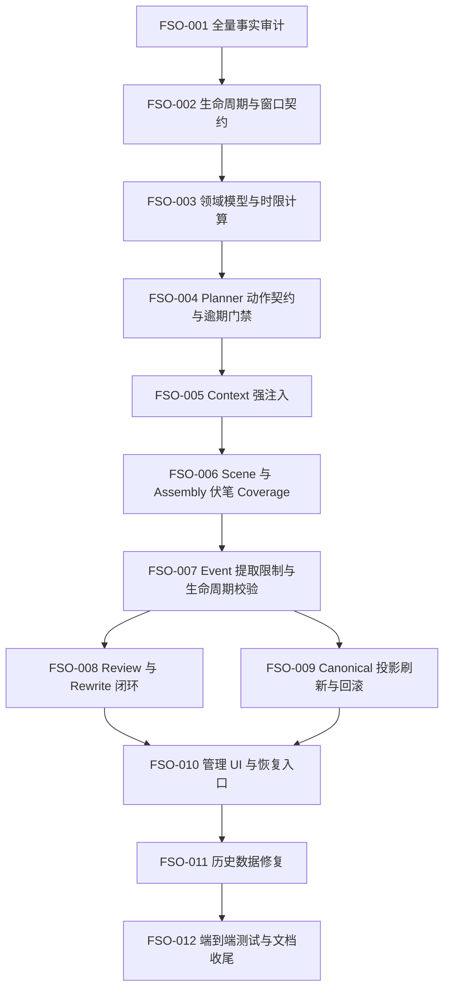

# 伏笔生成流程闭环优化可执行任务

> 日期：2026-09-14  
> 来源：对《六环余光》伏笔 #1“魔法代价的痛苦”的只读排查  
> 用途：把伏笔生命周期、到期控制、正文落实、事件提取和领域投影问题拆成可独立实施、测试、验收和回滚的任务。  
> 当前状态：FSO-001～FSO-012 已完成。

## 1. 已确认问题基线

以下结论来自 2026-09-14 的代码、架构文档和本地数据库只读检查。数据库状态会继续变化，执行任何任务前必须重新核对。

1. `foreshadowings` 表中的伏笔 #1 仍为 `idea`，`reinforce_count = 0`，且未记录铺设或兑现章节。
2. 当前 Canonical Story State 中，同一伏笔为 `reinforced`，检查时已累计 11 次强化。
3. 第 1～11 章均产生了该伏笔的正式 `foreshadowing_reinforced` Story Event；第 1 章没有先产生 `foreshadowing_planted`。
4. 第 1～12 章的 Ready Chapter Plan 均包含伏笔 #1。
5. 该伏笔的窗口为第 1～10 章；第 11 章成为 Canonical 后，管理页按章节进度会把它计算为 `Overdue`，但内容状态仍显示“构思中”。
6. 当前 Planner 只要求到期关键伏笔 ID 进入 Plan，没有声明本章应执行 `plant`、`reinforce`、`pay_off`、`defer` 或 `abandon` 中的哪一种动作。
7. 当前 Plan Validator 把“ID 已进入 Plan”视为满足关键伏笔要求，没有验证最晚兑现章节前是否真正兑现。
8. 当前 Event Extractor 可以引用小说中的任意伏笔，且 State Validator 没有校验伏笔生命周期转换。因此伏笔 #2、#3 已在各自窗口开始前被提取为强化事件。
9. Canonical Commit 会更新 Story Events 和 Canonical Story State，但不会自动刷新 `foreshadowings` 领域投影。
10. 现有 Projection Rebuilder 只同步伏笔 `status`，不会同步 `reinforce_count`、`setup_chapter_id` 或 `payoff_chapter_id`。
11. “魔法代价的痛苦”的 `promised_payoff` 是“后续魔法代价不断影响主角成长与选择”，它缺少可以确定判断“已经兑现”的完成条件。

## 2. 已确认的产品决策

以下事项已于 2026-09-14 按推荐方案确认。FSO-001 已在 `FORESHADOWING_STATE_AUDIT.md` 提供当前全库证据，FSO-002 负责把这些决策同步到 Source of Truth 文档；实施时不得改用其他语义。

| 编号 | 已确认事项 | 最终方案 | 实施约束 |
|---|---|---|---|
| D-01 | `due_from` / `due_to` 的含义 | 定义为兑现窗口；铺设时间另行表达 | 到达 `due_to` 仍未兑现时必须进入逾期处理，不能把“已进入 Plan”当作已兑现 |
| D-02 | `due` 是否属于内容生命周期 | 内容生命周期与时限状态分离；`due`、`overdue` 只作为计算出的时限状态 | 时间推进不得把 `idea`、`planted` 或 `reinforced` 等内容事实覆盖成另一种生命周期状态 |
| D-03 | Critical 伏笔逾期后的流程 | 默认阻止普通新章规划；只允许有审计记录的延期、放弃或修复章 | 模型不能自行延期或放弃；恢复生成必须有明确处理结果 |
| D-04 | 同一章能否完成 `plant → pay_off` | 允许 | 必须存在两个顺序明确、各自拥有正文证据并通过状态校验的事件 |
| D-05 | “魔法代价的痛苦”的归属 | 把“魔法必有代价”定义为世界硬规则；需要精确查询和锁定时，再建立引用该规则的 Locked Fact；另建具有具体结果和验收条件的伏笔 | 历史调整必须在 FSO-011 中依据正文证据执行，不得直接覆盖现有 Canonical 历史 |
| D-06 | 到期状态使用哪个章节进度计算 | 只使用最新 Canonical 章节序号 | 活跃草稿章节单独展示，不得提前推进正式到期状态 |
| D-07 | 非 Critical 伏笔逾期后的流程 | High、Medium、Low 产生 Warning，不阻止普通新章 | Volume Gate 和 Ending Audit 仍按各自完成规则处理，不能把 Warning 当作已经兑现 |

产品决策已经解除，但 FSO-002 仍依赖 FSO-001 的全量审计结果。FSO-002 未完成前，不得实施会改变状态语义、到期阻断或历史数据的后续任务。

## 3. 状态与执行规则

状态定义：

```text
TODO                 尚未实施
BLOCKED_BY_DECISION  缺少事实或产品决策
READY                可以开始实施
IN_PROGRESS          正在实施
DONE                 已通过验收
```

优先级定义：

```text
P0  Canonical 正确性、生命周期或主流程门禁
P1  内容质量、可恢复性或操作可见性
P2  文档、监控和发布收尾
```

每次只实施一个任务。每个任务开始前必须重新检查当前实现和数据库状态；任务卡中的文件是已确认的候选范围，不代表实施时必须全部修改。

每个任务完成时必须报告：

```text
Summary
Problems Addressed
Files Changed
Database / Canonical State Changes
Tests Actually Run
Known Limitations
Rollback / Recovery
Next Task
```

任何现有 Story Event 修正必须采用 correction / invalidation 语义，不得静默改写或删除已经进入 Canonical State 的历史事件。

## 4. 总体依赖



## 5. 任务总表

| Task | 名称 | 优先级 | 状态 | 依赖 |
|---|---|---:|---|---|
| FSO-001 | 全量伏笔事实与漂移审计 | P0 | DONE | 无 |
| FSO-002 | 固定生命周期、窗口和延期规则 | P0 | DONE | FSO-001 |
| FSO-003 | 分离内容生命周期与时限状态 | P0 | DONE | FSO-002 |
| FSO-004 | Planner 伏笔动作契约与逾期门禁 | P0 | DONE | FSO-003 |
| FSO-005 | Context 全链路强注入伏笔契约 | P0 | DONE | FSO-004 |
| FSO-006 | Scene 与 Assembly 伏笔 Coverage | P1 | DONE | FSO-005 |
| FSO-007 | Event 提取限制与生命周期校验 | P0 | DONE | FSO-006 |
| FSO-008 | Review 与自动 Rewrite 伏笔闭环 | P1 | DONE | FSO-007 |
| FSO-009 | Canonical Commit 后刷新完整领域投影 | P0 | DONE | FSO-007 |
| FSO-010 | 管理 UI、预警和恢复操作 | P1 | DONE | FSO-008、FSO-009 |
| FSO-011 | 现有小说的证据化历史数据修复 | P0 | DONE | FSO-010 |
| FSO-012 | 端到端回归、架构文档与发布收尾 | P0 | DONE | FSO-011 |

## 6. Task Cards

## FSO-001 — 全量伏笔事实与漂移审计

**Skills：** `story-engine`, `generation-pipeline`  
**优先级：** P0  
**状态：** DONE  
**依赖：** 无

### 实现功能

建立一次只读审计，逐部小说对比：

- `foreshadowings` 表中的内容状态、窗口、强化次数和章节引用；
- 当前 Canonical Story State 中的伏笔状态；
- Active Story Events 中的伏笔事件及正文证据；
- Chapter Plan 中选中的伏笔；
- 正文真正落实的动作；
- 已到期、逾期、提前强化、非法跳转和投影漂移。

审计结果应落为开发报告，不修改任何业务数据。至少对每条异常给出 novel、foreshadowing、chapter、event/artifact 来源和建议处置类型。

### 改动的问题

- 当前只确认了《六环余光》的局部样本，无法判断问题是否影响其他小说。
- 无法确认已有 `due`、`paid_off` 或 `abandoned` 数据是否符合相同语义。
- 无法在没有证据的情况下安全设计历史数据迁移。

### 目的

为状态语义和迁移规则提供可复核事实，避免用单个伏笔样本推断全库行为。

### 可能涉及的文件

- 新增 `docs/development/FORESHADOWING_STATE_AUDIT.md`。
- 如确有复用价值，可新增只读审计命令及其测试；是否新增命令必须在实施时评估，不能为一次性查询提前增加维护负担。
- `app/Services/ProjectionRebuilder.php` 仅用于核对现有检测能力，本任务不改变它。

### 可能影响和后果

- 只读审计本身不改变运行状态。
- 大型数据库可能需要分批读取，避免一次加载全部正文和 Artifact。
- 审计可能发现比当前样本更多的错误事件；这些发现不能在本任务中直接修复。

### 验收

- 报告明确区分表投影、Canonical State 和 Story Events。
- 每条“错误事件”判断都有正文证据和当前状态依据。
- 列出全部需要人工判断的伏笔，不能用脚本替用户决定故事含义。
- 无 Migration、无数据库写入、无模型请求。

### 完成记录（2026-09-15）

- **Summary：** 已完成本地数据库中全部 1 部小说、3 条伏笔、23 条 Active 伏笔事件及其 Canonical evidence、Plan、Context、Projection 和 Memory 的只读交叉审计；报告见 `docs/development/FORESHADOWING_STATE_AUDIT.md`。
- **Problems Addressed：** 确认全部伏笔投影漂移、三条非法首次强化、Critical 逾期门禁缺失、动作契约缺失、Extractor 目标过宽、Memory 下游影响；额外确认现有 State Version 0 重建基线不能完整恢复本小说基础元数据。
- **Files Changed：** 新增审计报告；仅更新本任务文档的状态和完成记录。
- **Database / Canonical State Changes：** 无。
- **Tests Actually Run：** 未运行应用测试；本任务没有代码变更。已执行只读数据库核对、23 条 evidence 与 Canonical Artifact 逐条匹配、Projection inspect、Story State rebuild 只读比较和 `git diff --check`。
- **Known Limitations：** 数据库仅有《六环余光》一部小说；正文语义上的强化有效性、#3 是否独立，以及历史 correction / invalidation 清单仍需人工决定。
- **Rollback / Recovery：** 删除审计报告并还原本任务文档即可；没有业务状态需要恢复。
- **Next Task：** FSO-002 已解除依赖并进入 `READY`。

## FSO-002 — 固定生命周期、窗口和延期规则

**Skills：** `story-engine`, `generation-pipeline`  
**优先级：** P0  
**状态：** DONE  
**依赖：** FSO-001

### 实现功能

根据 FSO-001 审计和已经确认的 D-01～D-07，先更新 Source of Truth 文档，固定以下规则：

- 内容生命周期的状态集合和允许转换；
- `due_from`、`due_to` 的业务定义；
- upcoming、due、overdue 只使用最新 Canonical 章节计算；活跃草稿进度只作独立展示；
- Critical、High、普通伏笔到期和逾期时的阻断级别；
- 延期、放弃、重新开启的操作要求和审计信息；
- 同章铺设与兑现的事件顺序；
- 伏笔、Reader Promise、世界规则、Locked Fact 和 Character Arc 的边界。

已确认的基础转换为：

```text
idea → planted
planted → reinforced
reinforced → reinforced
planted/reinforced → paid_off
idea/planted/reinforced → abandoned（需要原因）
```

`due/overdue` 是计算出的时限状态，不得覆盖上述内容生命周期。

### 改动的问题

- 当前 UI 把窗口称为“兑现窗口”，Validator 却只把它当成“进入 Plan 的处理窗口”。
- `idea + Due`、`reinforced + Overdue` 等组合没有统一解释。
- “持续影响”这种开放式承诺没有明确完成条件。

### 目的

让 Planner、Validator、Review、Commit 和 UI 使用同一套规则，避免每层自行解释“到期”和“兑现”。

### 可能涉及的文件

- `docs/PRD.md`
- `docs/architecture/story-engine.md`
- `docs/architecture/generation-pipeline.md`
- `docs/architecture/data-model.md`
- `docs/architecture/memory-context.md`
- 本任务文档中的决策表和后续任务状态

### 可能影响和后果

- 若确认“最晚兑现章节”，现有允许逾期继续规划的行为将被认定为缺陷。
- 若拆分生命周期和时限，现有 `ForeshadowingStatus::Due` 需要兼容或迁移方案。
- 更严格的 Critical 门禁会主动停止部分现有小说，直到用户处理逾期项。

### 验收

- 文档对窗口、状态和阻断规则没有冲突。
- D-01～D-07 的最终方案已完整写入 PRD 和 Architecture，且没有被实现细节改写。
- FSO-001 新发现的其他产品歧义必须明确报告；没有用户确认时不得擅自扩大本任务决策。
- 本任务不修改 PHP 和业务数据。

### 完成记录（2026-09-15）

- **Summary：** 已在 PRD、Story Engine、Generation Pipeline、Data Model 和 Memory Context 中固定 D-01～D-07，统一内容生命周期、兑现窗口、Critical/非 Critical 门禁、人工延期/放弃/重开及概念边界。
- **Problems Addressed：** 删除 Source of Truth 中把 `due` 当内容状态、把 `foreshadowing_due` 当新正式事件以及把领域表当权威详情的冲突表述；补充同章铺设与兑现顺序、旧数据兼容和可靠重建基线要求。
- **Files Changed：** `docs/PRD.md`、`docs/architecture/story-engine.md`、`docs/architecture/generation-pipeline.md`、`docs/architecture/data-model.md`、`docs/architecture/memory-context.md`、本任务文档。
- **Database / Canonical State Changes：** 无。
- **Tests Actually Run：** 未运行应用测试；本任务只修改文档。执行了跨文档冲突检索和 `git diff --check`。
- **Known Limitations：** 当前 PHP、数据库枚举和历史数据仍保留旧 `due` 行为，文档契约要到 FSO-003 及后续任务实施后才会成为运行行为；FSO-001 列出的故事语义判断仍留待 FSO-011 人工确认。
- **Rollback / Recovery：** 还原本任务涉及的文档段落即可；没有业务状态需要恢复。
- **Next Task：** FSO-003 已解除依赖并进入 `READY`。

## FSO-003 — 分离内容生命周期与时限状态

**Skills：** `story-engine`, `filament-ui`  
**优先级：** P0  
**状态：** DONE  
**依赖：** FSO-002

### 实现功能

在领域层实现 FSO-002 确认的状态契约：

- 内容状态只表达伏笔是否构思、铺设、强化、兑现或放弃。
- 时限状态根据 Canonical `current_chapter_sequence` 与窗口计算。
- 所有调用方使用同一个时限计算入口，避免页面、Widget、Planner 和 Completion Gate 各自实现不同条件。
- 明确“正在生成第 N 章”和“第 N 章已 Canonical”的区别；草稿不得提前推进正式时限基准。
- 为旧的持久化 `due` 值提供兼容读取和待迁移标记；停止产生新的 `due` 内容状态，迁移前不能让 Enum cast 失败，也不能无证据猜测真实生命周期。

### 改动的问题

- 当前状态字段与动态提醒表达重叠。
- 多处重复到期计算容易发生边界差异。
- 用户容易把“正在生成第 11 章”理解成正式进度已经到第 11 章。

### 目的

建立唯一、可测试的状态判断，使 UI 提醒不会改变 Canonical 内容事实。

### 可能涉及的文件

- `app/Enums/ForeshadowingStatus.php`
- 新的时限状态 Enum 或值对象；仅在能减少重复逻辑时新增。
- `app/Models/Foreshadowing.php`
- `app/Filament/Widgets/DueForeshadowingsWidget.php`
- `app/Services/VolumeCompletionGate.php`
- `app/Services/ClosureDebtService.php`
- 对应 Feature / Unit Tests
- 如需数据库约束调整，新增 Migration；实际文件名由实施时间确定。

### 可能影响和后果

- 现有筛选器、排序和测试中的 `Due` 文案可能变化。
- 若发现旧 `due` 数据，迁移前必须保持可读，不能直接让 Enum cast 失败。
- 统一使用 Canonical 进度后，活跃草稿不会提前显示 Overdue；这属于预期语义变化。

### 验收

- 窗口开始、窗口结束和结束后一章的边界测试通过。
- terminal 状态不再显示 due/overdue。
- 同一记录可以明确显示“内容状态：已强化；时限状态：逾期”。
- 所有业务入口调用同一套计算规则。

### 完成记录（2026-09-15）

- **Summary：** 新增独立 `ForeshadowingTimingStatus`，统一按 `最新 Canonical 章节 + 1` 计算 `upcoming / due / overdue`；Planner、Plan Validator、章节计划入口、伏笔管理页、Dashboard Widget、Volume Completion Gate 与 Closure Debt 已改用同一模型入口。
- **Problems Addressed：** 内容状态不再决定到期状态；终态不再显示 due/overdue；Volume Gate 不再使用可能包含草稿的分卷最大章节；管理页分别显示“内容状态”和“时限状态”；章节计划只提供当前需处理或历史已选的伏笔，并显示时限标签；旧 `due` 保持可读但禁止新写入，`foreshadowing_due` 不再进入模型生成 Schema，也不再覆盖 Canonical 内容状态。
- **Files Changed：** 新增 `app/Enums/ForeshadowingTimingStatus.php`；修改 Foreshadowing/Event Enum、Foreshadowing Model、Planner/Validator/Closure Debt/Volume Gate/Event Extractor/Event Applier、两个 Filament 页面组件及相关测试；同步本任务文档。
- **Database / Canonical State Changes：** 无。只读核对确认当前数据库 3 条伏笔均为 `idea`，没有旧 `due` 记录，因此未创建数据迁移。
- **Tests Actually Run：** 针对性测试 95 项，93 passed、2 skipped，486 assertions；完整测试 732 项，711 passed、21 skipped，4394 assertions，测试框架另报告 2 warnings 但未提供明细；`vendor/bin/pint --dirty`、改动 PHP 文件语法检查和 `git diff --check` 通过。
- **Known Limitations：** 历史 `due` 枚举值和 Event Type 仍保留用于读取旧数据/Artifact；完整动作契约、Critical 逾期规划阻断及生命周期事件校验属于 FSO-004、FSO-007。
- **Rollback / Recovery：** 回退本任务代码和测试即可；没有 Migration 或业务数据需要回滚。
- **Next Task：** FSO-004 已解除依赖并进入 `READY`。

## FSO-004 — Planner 伏笔动作契约与逾期门禁

**Skills：** `generation-pipeline`, `story-engine`  
**优先级：** P0  
**状态：** DONE  
**依赖：** FSO-003

### 实现功能

把 Chapter Plan 中仅含 ID 的 `due_foreshadowings` 扩展或替换为结构化动作契约。每个动作至少表达：

```text
foreshadowing_id
action: plant / reinforce / pay_off / defer / abandon
target_scene_sequence
acceptance_criteria
reason（延期或放弃时必填）
```

Planner 必须收到完整伏笔定义、当前生命周期、时限状态和已发生的重要事件。Plan Validator 必须确定性检查：

- 引用属于当前小说且尚未终止；
- 动作符合当前生命周期；
- Critical 到期项有明确动作；
- 到达最晚兑现章节时不能只靠 `reinforce` 无限续期；
- Critical 逾期时按已确认规则阻止普通新章，或只允许明确的修复章；
- `defer` 和 `abandon` 不能由模型自行决定，必须有用户授权和审计原因。

### 改动的问题

- 当前 `[1]` 只能说明“选中过伏笔”，不能说明需要做什么。
- Critical 伏笔被每章重复加入 Plan，但没有任何规则要求兑现。
- 非关键逾期项在部分条件下甚至不会产生 Warning。

### 目的

把“关注伏笔”变成可以由 Laravel 验收的本章任务，而不是依赖模型自由理解。

### 可能涉及的文件

- `app/Services/ChapterPlanPayload.php`
- `app/Services/ChapterPlanner.php`
- `app/Services/PlanValidator.php`
- `app/Models/ChapterPlan.php`
- Chapter Plan 相关 Migration；是否复用现有 JSONB 字段须先检查数据库结构。
- `app/Filament/Resources/Novels/Pages/ManageNovelChapters.php`
- Planner、Plan Validator 和 Filament 相关测试

### 可能影响和后果

- Plan Schema 和 Prompt Version 必须升级，旧 Artifact 必须继续可解释，不能当作新 Schema 复用。
- 严格门禁可能使已有逾期小说在规划阶段停止，这是为了防止继续累积错误。
- 若复用旧字段，需要明确区分历史整数数组和新对象数组；不能静默误读。

### 验收

- `idea → reinforce` 的 Plan 被拒绝。
- Critical 最晚兑现章只返回 `reinforce` 时被拒绝或转为需要人工决定。
- 未经授权的 `defer/abandon` 被拒绝。
- 重复投递相同 Plan 不产生重复动作或额外模型调用。

### 完成记录（2026-09-15）

- **Summary：** 新增 `foreshadowing_actions` JSONB 和 `ForeshadowingPlanAction`，`chapter-planner-v7` 输出 `foreshadowing_id / action / target_scene_sequence / acceptance_criteria / reason`；Planner 上下文包含完整伏笔定义、Canonical 生命周期来源、领域投影状态、时限、允许动作和 Active 重要事件。人工计划入口支持 `defer / abandon` 并由服务端补齐用户、授权时间、Canonical 章节和 State Version；人工保存创建新 Plan Version。
- **Problems Addressed：** 旧整数 ID 不再被当作已完成动作；`idea → reinforce`、非法引用、终态动作、无效 Scene、重复动作和动作顺序错误由 Laravel 阻止；Critical 最晚兑现章的 reinforce-only Plan 被阻止；Critical 逾期在 Planning Run 和 Provider 调用前停止，只有明确兑现或具有人工授权的延期/放弃契约可作为修复计划；模型 Schema 不允许自行返回 `defer / abandon`。
- **Files Changed：** 新增动作 Enum、Canonical 生命周期解析器、Planner 门禁及 Chapter Plan Migration；修改 ChapterPlan Model/Payload、Planner、Plan Validator、Plan Job、Auto Stop、Context Builder、章节计划编辑和预览、Prompt Version、架构文档及对应测试。
- **Database / Canonical State Changes：** 已执行 `2026_09_15_100000_add_foreshadowing_actions_to_chapter_plans_table`，只新增默认 `[]` 的 JSONB 列，没有修改 Canonical Story State、Story Events 或旧 Plan 内容。只读核对现有 13 个 Plan 全部仍有旧整数引用，结构化动作数为 0；系统没有自动猜测或转换这些历史动作。
- **Tests Actually Run：** 针对性测试 107 项，104 passed、3 skipped，558 assertions；完整测试 746 项，725 passed、21 skipped，4440 assertions，测试框架另报告 2 warnings 但未提供明细；`vendor/bin/pint --dirty`、迁移状态检查和 `git diff --check` 通过。
- **Known Limitations：** FSO-004 只建立 Planner 动作契约与规划门禁。Scene、Assembly、Extractor、Review 尚未消费和验收该冻结契约，分别属于 FSO-005～FSO-008；延期/放弃对伏笔领域投影和完整管理恢复操作属于 FSO-009～FSO-010。现有 13 个旧 Plan 保持兼容可读，但在涉及 Critical 到期伏笔时不能凭旧 ID 通过新动作校验。
- **Rollback / Recovery：** 回退代码后执行该 Migration 的 `down()` 可删除新列；新列删除会丢失实施后创建的结构化动作，因此一旦产生新 Plan，应先导出或停止回滚。此次未产生新的业务 Plan 数据。
- **Next Task：** FSO-005 已解除依赖并进入 `READY`。

## FSO-005 — Context 全链路强注入伏笔契约

**Skills：** `memory-context`, `generation-pipeline`, `story-engine`  
**优先级：** P0  
**状态：** DONE  
**依赖：** FSO-004

### 实现功能

让 Planner 之后的每个相关阶段收到同一份冻结伏笔契约，至少包含：

- ID、标题、描述和 promised payoff；
- 当前内容状态和时限状态；
- due window、重要度和所属 Arc；
- 本章动作、目标 Scene 和验收条件；
- 最近一次有效伏笔事件及证据来源；
- 当前 Bible、State Version、Plan Version 和 checksum。

Context Snapshot 必须保存实际注入内容或可追踪的冻结引用，不能只保存 ID。Token 不足时，Critical/Due/Overdue 伏笔不得被低价值 Memory 挤出。

### 改动的问题

- 当前 `ContextBuilder` 只把 Plan 里的伏笔 ID 写入 Snapshot 元数据，L0 约束没有完整伏笔契约。
- Event Extractor 的 `chapter_plan` 没有包含 `due_foreshadowings`。
- 模型能看到全部 Canonical 伏笔状态，却不知道哪些是本章允许处理的目标，导致提前或错误绑定。

### 目的

确保 Writer、Assembler、Extractor、Reviewer 和 Rewriter 对“本章要处理哪个伏笔、执行什么动作”没有上下文差异。

### 可能涉及的文件

- `app/Services/ContextBuilder.php`
- `app/Data/ContextSnapshot.php`
- `app/Services/SceneGenerator.php`
- `app/Services/ChapterAssembler.php`
- `app/Services/StoryEventExtractor.php`
- `app/Services/ChapterReviewer.php`
- `app/Services/ChapterRewriter.php`
- 对应 Context Snapshot 和 Style/Plan Pipeline 测试

### 可能影响和后果

- Context token 使用量会略有增加，需要从低优先级长期 Memory 中让出预算。
- Snapshot Schema 变化需要 Prompt Version 升级，历史 Run 保持不可变。
- 暴露完整 promised payoff 时必须继续遵守 `must_not_reveal`，不能让模型提前向读者揭晓秘密。

### 验收

- 每个相关 Run 可以追踪相同的伏笔动作契约和版本。
- 未选中的未来伏笔不会被当作本章可处理目标。
- Critical/Due/Overdue 契约在 Token 紧张测试中仍被保留。

### 完成记录（2026-09-15）

- **Summary：** 新增确定性的 `ForeshadowingContextContract`。契约包含完整定义、promised payoff、Canonical 优先的内容状态及来源、时限、兑现窗口、重要度、所属 Arc、本章动作、目标 Scene、验收条件、最近 Active Story Event 及证据，并冻结 Bible Version、State Version、Chapter Plan ID/Version 和 checksum。Scene Writer 将契约放入强制 `l0`；Assembler、Extractor、Reviewer 和 Rewriter 保存并读取同一结构。
- **Problems Addressed：** 后续阶段不再只看到伏笔 ID 或各自缺失的 Plan 字段；未选中的未来伏笔不进入可执行 actions；Extractor 的 Chapter Plan 已包含 `foreshadowing_actions`；所有阶段 Prompt 均明确 promised payoff 仍受 `must_not_reveal` 限制。
- **Files Changed：** 新增伏笔 Context Contract Service；修改 Context Snapshot/Builder、Scene Generator、Chapter Assembler、Story Event Extractor、Chapter Reviewer、Chapter Rewriter、Prompt Version、PRD、Context/Generation Architecture 及对应测试。
- **Database / Canonical State Changes：** 无 Migration，无 Canonical State、Story Event 或业务数据写入。契约只读取冻结版本与 Active Story Event，并保存到新的 Generation Run Context Snapshot。
- **Tests Actually Run：** 阶段级针对性回归 210 项全部通过，1039 assertions；最终完整回归 748 项中 727 passed、21 skipped，4484 assertions，测试框架报告 2 warnings 但未提供明细。第一次完整回归曾因 `MemoryQueryBuilderTest` 的随机 `source_id` 碰撞 SQLite 唯一约束而失败；该测试单独复跑 4 项全部通过，随后完整回归通过。
- **Known Limitations：** FSO-005 只保证契约输入一致和可追踪，尚未增加 Scene/Assembly 的伏笔 Coverage 结构、事件动作确定性验收或 Review 独立验收结果；这些分别属于 FSO-006～FSO-008。历史 Run/Artifact 保持原 Snapshot 和旧 Prompt Version，不回填新契约。
- **Rollback / Recovery：** 回退代码和 Prompt Version 即可；已有新 Run 的 Snapshot 保持不可变并可按 checksum 解释，不需要数据库回滚。
- **Next Task：** FSO-006 已解除依赖并进入 `READY`。

## FSO-006 — Scene 与 Assembly 伏笔 Coverage

**Skills：** `generation-pipeline`, `story-engine`  
**优先级：** P1  
**状态：** DONE  
**依赖：** FSO-005

### 实现功能

扩展现有 Scene Plan Coverage，使伏笔动作拥有独立的结构化自检和逐字正文证据：

- Writer 对目标 Scene 返回每条伏笔动作的 `fulfilled/missing/contradicted`。
- `fulfilled` 和 `contradicted` 的 evidence 必须逐字来自当前正文。
- Laravel 校验证据、目标伏笔、动作类型和 Scene 归属。
- Assembly 汇总各 Scene 的伏笔 Coverage，不得因润色删除唯一兑现证据，也不得擅自改变动作结论。
- 缺失或冲突形成明确、可自动 Rewrite 的 Finding。

### 改动的问题

- 当前 Coverage 只检查 `goal/conflict/turn/outcome`。
- Scene 即使没有真正落实伏笔，只要普通场景目标通过，就可能进入后续阶段。
- Assembly 可能保留主题相近文字，但缺少满足 promised payoff 的具体行为结果。

### 目的

在昂贵的 Event Extraction 和 Review 前，用确定性证据尽早发现正文没有落实伏笔动作。

### 可能涉及的文件

- `app/Services/PlanCoverage.php`，或新增职责明确的伏笔 Coverage 类型。
- `app/Services/SceneDraftPayload.php`
- `app/Services/SceneGenerator.php`
- `app/Services/ChapterAssembler.php`
- Coverage 证据修复相关服务
- Scene Generation、Assembly 和 Coverage Tests

### 可能影响和后果

- Structured Output Schema 变化会增加 Writer 输出字段和验证失败面。
- 证据修复只能修复引用，不能把正文中不存在的兑现动作伪造成 fulfilled。
- 一个动作跨多个 Scene 才能完成时，需要 Chapter 级汇总，不能强迫单 Scene 独立兑现。

### 验收

- 正文缺少伏笔动作时生成可修复 Finding。
- 只有主题相近措辞、没有验收结果时不能判定兑现。
- Assembly 删除关键证据时会被发现。
- Coverage 失败不修改 Canonical State。

### 完成记录（2026-09-15）

- **Summary：** Scene Draft 新增按目标 Scene 排列的 `foreshadowing_coverage`；Laravel 校验伏笔 ID、动作、顺序、Scene 归属和逐字正文证据。Assembly 按 Scene 聚合并重新验证 Coverage，阻止把 Scene 的 missing/contradicted 直接提升为 fulfilled。缺失或反转转换为可自动 Rewrite 的稳定 Finding。
- **Problems Addressed：** 普通 goal/conflict/turn/outcome 通过不再掩盖伏笔动作缺失；主题相近但未实现验收结果必须报告 missing；Assembly 删除唯一伏笔证据会在最终 Coverage 中暴露并形成 Finding。
- **Files Changed：** 新增伏笔 Coverage 与 evidence 修复服务；修改 Scene Draft/Generator、Chapter Assembly Payload/Assembler、Prompt Version、PRD、Generation Architecture 及对应测试。
- **Database / Canonical State Changes：** 无 Migration，无 Canonical State、Story Event 或业务数据写入。Coverage 只保存到新的 Scene/Chapter Draft Artifact；失败路径不会产生 Canonical 变更。
- **Tests Actually Run：** FSO-006 Scene/Assembly 最终针对性回归 61 项全部通过，325 assertions；编排、Style Contract、Prompt/设置、Review/Rewrite 回归 84 项全部通过，415 assertions；相关阶段回归 275 项中 270 passed、5 skipped，1389 assertions；最终完整回归 756 项中 735 passed、21 skipped，4518 assertions，测试框架报告 2 warnings 但未提供明细。
- **Known Limitations：** Laravel 能确定结构、目标归属和 evidence 是否逐字来自正文，但不能仅凭字符串规则证明语义确实满足 `acceptance_criteria`；本阶段通过 Writer/Assembler 明确声明和 Finding 提前拦截，FSO-008 将由 Reviewer 独立做语义验收。旧 Artifact 未回填 `foreshadowing_coverage`，仍通过兼容读取参与 Assembly。
- **Rollback / Recovery：** 回退 Writer/Assembler Prompt Version 和 Coverage 代码即可；既有新 Artifact 保持不可变。Coverage missing/contradicted 交由后续 Rewrite，不触碰 Canonical State。
- **Next Task：** FSO-007 已解除依赖并进入 `READY`。

## FSO-007 — Event 提取限制与生命周期校验

**Skills：** `story-engine`, `generation-pipeline`  
**优先级：** P0  
**状态：** DONE  
**依赖：** FSO-006

### 实现功能

限制 Story Event Extractor 只能按已验证的本章伏笔动作提取事件，并为 State Validator 增加确定性生命周期规则：

- 伏笔事件的 subject ID 必须出现在本章动作契约中。
- event type 必须与 Plan action 和 Coverage 结论一致。
- `reinforced` 必须建立在已经 `planted/reinforced` 的 Canonical 状态上，或本章更早存在有效 `planted` 事件。
- `paid_off` 必须满足 promised payoff 的验收条件并有正文证据。
- terminal 状态不能再次强化或兑现；重新开启只能走人工修正流程。
- 同一伏笔同章多个事件必须按合法顺序应用。
- 不允许用“主题相似”把正文绑定到未来或未选中的伏笔。

### 改动的问题

- 第 1 章从 `idea` 直接变成 `reinforced`。
- 伏笔 #2、#3 在窗口开始前被提前强化。
- 当前 Subject Validator 只确认 ID 属于小说，不确认它是不是本章目标。
- 当前 State Validator 跳过了伏笔生命周期验证。

### 目的

防止模型生成语法合法、主体存在但业务含义错误的 Story Event。

### 可能涉及的文件

- `app/Services/StoryEventExtractor.php`
- `app/Data/StoryEventCandidate.php`
- `app/Services/StateValidator.php`
- `app/Services/DeterministicStoryEventApplier.php`
- `app/Enums/EventType.php`
- Story Event Extraction、State Validator 和 State Patch Tests

### 可能影响和后果

- 旧 Event Candidate Artifact 仍须保持不可变，但不能在新规则下被错误复用。
- 新验证可能把历史上能够 Commit 的草稿改为 BLOCK；恢复入口必须说明具体非法转换。
- 若一章确实同时铺设和兑现，事件排序必须稳定，否则 State Patch 结果不确定。

### 验收

- `idea → reinforced`、未来伏笔强化、未选中伏笔事件都被阻止。
- 合法的 `plant → reinforce` 和 `plant → pay_off` 顺序通过。
- 重复 Job 不产生重复正式伏笔事件。
- 非伏笔 Story Event 行为不发生无关回归。

### 完成记录（2026-09-15）

- **Summary：** 新增共享的 `ForeshadowingEventValidator`。Extractor 在保存 Event Candidate 前校验冻结动作授权、最终 fulfilled Coverage、目标 Scene 证据、动作事件映射和顺序生命周期；StateValidator 使用 Candidate Run 中冻结的契约及 checksum 独立复核同一规则。
- **Problems Addressed：** 未选中或未来伏笔不能再仅凭实体存在就生成事件；`idea → reinforced`、终态再操作、动作类型不匹配、missing/contradicted Coverage、跨 Scene 证据，以及把非 idea 的领域投影当作 Canonical 进度均被阻止；同章合法 `plant → reinforce/pay_off` 按顺序通过。
- **Files Changed：** 新增伏笔事件校验服务；修改 Story Event Extractor、State Validator、Event Type 辅助判断、Extractor Prompt Version、PRD、Generation/Story Engine Architecture 及对应测试。
- **Database / Canonical State Changes：** 无 Migration，无现有数据修复。Extractor 只创建通过校验的新 Event Candidate；State Patch 仍是候选产物；任何失败都不会修改 Canonical Story State 或写入正式 Story Event。
- **Tests Actually Run：** Story Event、State Validator、State Patch 与 Canonical Commit 最终针对性回归 74 项全部通过，325 assertions；编排、Review/Rewrite、Resume、Style Contract、Prompt/设置回归 90 项全部通过，459 assertions；FSO 全链路回归 295 项中 290 passed、5 skipped，1373 assertions；最终完整回归 773 项中 752 passed、21 skipped，4568 assertions，测试框架报告 2 warnings 但未提供明细。
- **Known Limitations：** 确定性规则可验证契约、Coverage、证据与生命周期一致性，但不能仅凭字符串证明正文语义确实满足 `acceptance_criteria` 或 promised payoff；该独立语义判断属于 FSO-008。历史 Event Candidate 不回填新字段；含伏笔事件且缺少匹配冻结契约 lineage 时会被 StateValidator BLOCK。
- **Rollback / Recovery：** 回退 Extractor Prompt Version 和伏笔事件校验接入即可；新旧 Candidate Artifact 均保持不可变。被拒绝的候选可在修复 Plan/Coverage 或正文后重新提取，不需要回滚 Canonical State。
- **Next Task：** FSO-008 已解除依赖并进入 `READY`。

## FSO-008 — Review 与自动 Rewrite 伏笔闭环

**Skills：** `generation-pipeline`, `story-engine`  
**优先级：** P1  
**状态：** DONE  
**依赖：** FSO-007

### 实现功能

让 Review 在第一轮全量审校中检查本章全部伏笔动作：

- 对照 promised payoff、Plan action、Scene/Assembly Coverage、Event Candidate 和正文证据。
- 区分“提及”“强化”“兑现”，不能因为关键词出现就判定成功。
- 同一根因产生一个完整 Finding，列出全部需要一起修复的证据。
- 可通过正文修复的问题进入一次有完整目标的 Rewrite。
- 需要延期、放弃或改变 promised payoff 的问题进入 NEEDS_ATTENTION，不允许 Rewrite 自行改变 Canonical 约束。
- Rewrite 完成后重新执行 Coverage、Event Extraction、State Patch 和全量 Review。

### 改动的问题

- 当前 Review 没有独立检查伏笔生命周期和最晚兑现条件。
- 正文可以重复描述魔法代价并通过 Review，却始终没有明确兑现动作。
- 自动 Rewrite 可能只修复表面措辞，无法修正需要用户决定的窗口或承诺。

### 目的

让内容质量审校和确定性状态规则互相补充，并尽可能在一轮审校中发现全部相关问题。

### 可能涉及的文件

- `app/Services/ChapterReviewer.php`
- Review Payload / Finding Schema
- `app/Services/ChapterRewriter.php`
- `app/Services/RewriteScopeResolver.php`
- `app/Actions/Generation/AdvanceChapterPipelineAction.php`
- Review、Rewrite Loop 和 Pipeline Orchestration Tests

### 可能影响和后果

- Review Prompt 和 Rewrite Prompt 必须升级版本。
- 更严格的审校可能短期提高 REWRITE / NEEDS_ATTENTION 数量，但能避免错误进入 Canonical。
- 不能把到期规则完全交给模型；确定性 Finding 必须拥有更高优先级。

### 验收

- 未兑现的 Critical 最晚窗口不能 PASS。
- 纯正文问题能自动 Rewrite 并重新走完整下游链。
- 需要用户改变窗口或承诺时稳定停在 NEEDS_ATTENTION。
- Rewrite 不会直接修改伏笔定义或 Canonical State。

### 完成记录（2026-09-15）

- **Summary：** Reviewer 新增与冻结契约逐项同序的 `foreshadowing_audits`，同时读取 promised payoff、Plan action、最终 Coverage、当前草稿绑定的 Event Candidate 和正文证据；整章 Rewrite 改为返回并保存完整 Scene Coverage，局部 Rewrite 继续经 Assembly 汇总，之后统一重跑 Event Extraction、State Patch 和 Review。
- **Problems Addressed：** 仅出现关键词不再足以把强化或兑现审校为完成；fulfilled 必须有逐字正文证据、fulfilled Coverage 和匹配事件。Coverage 与语义审校的同一伏笔根因合并为一个 Finding；正文可修复问题进入单次批量 Rewrite，必须改变窗口或 promised payoff 的问题稳定进入 NEEDS_ATTENTION。
- **Files Changed：** 新增 `ForeshadowingReviewAudit`；修改 Reviewer、Rewriter、Assembly Payload 的重写校验模式、Prompt Version、PRD、Generation Pipeline Architecture 及 Review/Rewrite/Pipeline Tests。
- **Database / Canonical State Changes：** 无 Migration，无数据修复。Review 与 Rewrite 只创建不可变 Run/Artifact；不会更新伏笔定义、正式 Story Event、领域投影或 Canonical Story State。
- **Tests Actually Run：** FSO-008 首轮针对性回归 83 项全部通过，396 assertions；伏笔生成、Coverage、事件、State Patch、Review/Rewrite、编排、恢复与 Commit 的扩大回归 222 项全部通过，1089 assertions；首次完整回归 777 项中 756 passed、21 skipped，4585 assertions；2026-09-15 在 FSO-009 完成后的最新代码上再次复核 Review、Rewrite、Pipeline 与 Prompt 测试 79 项全部通过，344 assertions，当前完整回归 784 项中 763 passed、21 skipped，4613 assertions；测试框架报告 2 warnings 但未提供明细。
- **Known Limitations：** Laravel 能确定性验证动作身份、顺序、Coverage、事件类型和证据来源，但正文是否在文学语义上真正满足 promised payoff 仍属于 Reviewer 模型判断；系统通过强制逐项审计和结构化证据降低误判，无法把语义判断变成纯规则证明。
- **Rollback / Recovery：** 回退 Reviewer/Rewrite Prompt Version 与新 Payload 字段即可；旧 Artifact 保持不可变。新 Rewrite 若结构或 Coverage 无效会失败且不会成为当前正式版本，可从原 Review 重试。
- **Next Task：** FSO-009、FSO-010 已完成；FSO-011 已解除依赖。

## FSO-009 — Canonical Commit 后刷新完整领域投影

**Skills：** `story-engine`, `generation-pipeline`  
**优先级：** P0  
**状态：** DONE  
**依赖：** FSO-007

### 实现功能

在 Canonical Commit 成功后，根据已固定的 Story Events / New State 刷新受影响伏笔的完整领域投影：

- `status`
- `reinforce_count`
- `setup_chapter_id`
- `payoff_chapter_id`
- 如 FSO-002 确认需要，记录最近处理章节或延期信息。

必须明确事务边界、幂等键和失败恢复：

- Canonical Story State 与 Story Events 仍是权威来源。
- Projection 失败不能回滚已提交正式章节。
- 重试相同刷新任务必须得到相同结果，不能重复累计强化次数。
- Rebuilder 应从 Canonical State / Active Events 计算目标值，不能在当前表值上盲目 `+1`。
- Rollback Latest Canonical Chapter 后必须恢复到上一正式版本对应的完整伏笔投影。

### 改动的问题

- 当前 Commit 后管理表永久停留在旧状态。
- 现有 Rebuilder 只能修复 status，无法修复计数和章节引用。
- UI、Volume Gate 和部分查询读取陈旧表值，会与 Canonical State 冲突。

### 目的

保证管理页面和快速查询最终与权威状态一致，并且投影失败可以安全重建。

### 可能涉及的文件

- `app/Services/CanonicalCommitService.php`
- `app/Services/ProjectionRebuilder.php`
- 新的 Projection Refresh Job；只有异步恢复确实需要时才新增。
- `app/Services/LatestCanonicalChapterRollback.php`
- `app/Actions/Story/ManualCanonicalCorrectionAction.php`
- Canonical Commit、Projection Rebuilder、Rollback 和重复投递测试

### 可能影响和后果

- 若采用异步刷新，Commit 后短时间内 UI 可能最终一致；必须显示或监控刷新失败。
- 若在 Commit 事务内同步刷新，会扩大最严格事务的职责和锁范围，需要评估是否符合现有架构。
- 历史错误事件若未先修正，完整重建会把错误精确投影出来，而不会自动判断故事语义。

### 验收

- Commit 一章后，表投影与新 Canonical State 一致。
- `reinforce_count` 来源于有效事件重放，重复刷新不会增加。
- setup/payoff chapter 只在对应有效事件存在时写入。
- Projection 刷新失败后可重试，Canonical Chapter 和 State Version 不丢失。
- Latest Chapter Rollback 恢复全部伏笔投影字段。

### 完成记录（2026-09-15）

- **Summary：** 扩展 `ProjectionRebuilder`，从最新无章节 Canonical 基线和目标 State Version 以内的 Active Story Events 重放完整伏笔投影；新增按 Novel/State Version 唯一的 `RefreshNovelProjectionJob`，在 Commit、Latest Rollback 和 Manual Canonical Correction 成功后统一派发。
- **Problems Addressed：** 管理表不再只修复 `status`；`reinforce_count` 不再基于陈旧表值盲目累加；`setup_chapter_id` 与 `payoff_chapter_id` 只由有效铺设/兑现事件产生，无有效事件时清空。Rollback 通过同一重放器恢复四个字段，避免维护第二套不完整规则。
- **Files Changed：** 修改 Projection Health DTO、Projection Rebuilder、Canonical Commit、Latest Rollback、Manual Correction；新增 Projection Refresh Job；同步 PRD、Generation Pipeline、Story Engine 和相关测试。
- **Database / Canonical State Changes：** 无 Migration，无现有数据批量修复。刷新 Job 只写 `foreshadowings` 领域投影，不修改 Story Events、Story State Versions、Canonical Chapter 或 Novel Canonical 指针。
- **Tests Actually Run：** Projection、Refresh Job、Commit、Rollback、Manual Correction 针对性回归 43 项全部通过，215 assertions；扩大回归 109 项中 107 passed、2 skipped，473 assertions；最终完整回归 784 项中 763 passed、21 skipped，4613 assertions，测试框架报告 2 warnings 但未提供明细；`vendor/bin/pint --dirty`、PHP 语法检查和 `git diff --check` 通过。
- **Known Limitations：** 管理表在异步 Job 完成前可能短暂陈旧；失败通过 Laravel Queue/Horizon 的失败任务记录监控和重试。历史 Active Event 若业务含义本身错误，重建会忠实投影该错误；证据化历史修复属于 FSO-011。
- **Rollback / Recovery：** Projection Job 最多尝试 3 次，使用固定 State Version 唯一键；若任务已过期则不写入。失败后可安全重投同一任务或执行现有 Projection Rebuild，重复执行不会增加计数。回退 Job 派发和完整字段重放即可，不涉及数据结构回滚。
- **Next Task：** FSO-010 已完成；FSO-011 负责历史证据修复。

## FSO-010 — 管理 UI、预警和恢复操作

**Skills：** `filament-ui`, `story-engine`, `generation-pipeline`  
**优先级：** P1  
**状态：** DONE  
**依赖：** FSO-008、FSO-009

### 实现功能

调整伏笔管理和生成操作界面，使用户可以直接判断问题属于哪一层：

- 分栏展示“内容状态”和“时限状态”。
- 同时展示当前 Canonical 章节与正在生成的章节。
- 展示最近有效伏笔事件、证据章节、累计强化次数和计划中的下一动作。
- Critical Overdue 提供明确的处理入口：安排修复章、延期、放弃或检查投影。
- 检测到表投影与 Canonical State 漂移时显示警告，不能继续把陈旧状态当作事实。
- 延期、放弃和人工修正要求填写原因并留下审计记录。

### 改动的问题

- 当前 `Due/Overdue` 与“构思中”并列但没有解释来源。
- 页面不提示 Canonical State 实际已经强化 11 次。
- 用户无法区分“正文未处理”和“投影未刷新”。
- 现有 setup/payoff 输入是裸 Chapter ID，容易关联错误小说或不存在章节。

### 目的

把异常原因和下一步动作直接呈现给单一运营者，减少进入数据库或 Story State 页面人工比对。

### 可能涉及的文件

- `app/Filament/Resources/Novels/Pages/ManageNovelForeshadowings.php`
- `app/Filament/Widgets/DueForeshadowingsWidget.php`
- `app/Filament/Resources/Novels/Pages/ViewNovelStoryState.php`
- `app/Filament/Resources/Novels/Pages/ViewNovelPlanningPreview.php`
- 对应 Filament Feature Tests

### 可能影响和后果

- 表格列和筛选器会变化，现有截图和操作文档需要更新。
- 处理入口必须调用领域 Action/Service，不能让 Filament 页面直接改 Canonical State。
- “重建投影”只能修复派生数据，不能替代历史事件修正。

### 验收

- 页面能明确显示“已强化 + 已逾期”等组合。
- 页面同时显示 Canonical 进度与活跃草稿进度。
- 漂移状态有可理解的提示和恢复路径。
- 不允许选择其他小说的 setup/payoff 章节。

### 完成记录（2026-09-15）

- **Summary：** 伏笔工作台现在并列显示 Canonical 内容状态、时限状态、完整投影健康、Canonical 强化次数、最近有效事件及证据、未来计划动作、最新正式章节和活跃章节工作流；Dashboard 待处理伏笔也改用 Canonical 状态筛选并展示活跃章节和投影漂移提示。Critical 逾期项提供安排修复章、延期、放弃和检查投影入口。
- **Problems Addressed：** 页面不再把领域表的“构思中”当作 Canonical 事实；正文未处理、计划已安排和表投影未刷新可以分开判断；setup/payoff 从裸 ID 改为仅当前小说章节可选；普通 Edit 不再直接改写已有伏笔的窗口、生命周期、计数和章节引用。
- **Files Changed：** 新增延期与放弃领域 Action、伏笔管理审计 JSONB Migration 和对应测试；修改伏笔 Model、管理页、Dashboard Widget、Manual Canonical Correction 操作者审计、PRD、Data Model、Generation Pipeline、Story Engine 及本任务文档。
- **Database / Canonical State Changes：** Migration 只新增默认空数组的 `foreshadowings.management_history`。本次未对现有伏笔执行延期、放弃、人工修正或投影重建。延期只更新窗口和管理审计；放弃运行时会通过 `ManualCorrection` 创建新 State Version，再异步刷新领域投影。
- **Tests Actually Run：** 管理操作、Filament 工作台、Dashboard、Manual Correction 针对性回归 25 项全部通过，184 assertions；Projection、Refresh Job、规划门禁、Canonical Commit 与章节管理扩大回归 112 项全部通过，629 assertions；最终完整回归 791 项中 770 passed、21 skipped，4680 assertions，测试框架报告 2 warnings 但未提供明细。`vendor/bin/pint --dirty`、改动 PHP 文件语法检查、Migration 状态检查和 `git diff --check` 通过。
- **Known Limitations：** 页面只能确定性证明状态来源、事件/计划关联和逐字证据存在，不能替用户判断历史事件在文学语义上是否有效；该证据化判断仍属于 FSO-011。投影异步刷新完成前，表投影可能短暂显示漂移，但页面继续以 Canonical State 为准。
- **Rollback / Recovery：** 延期在单事务内更新窗口并追加审计；校验失败不会部分写入。放弃受 Expected State Version 保护，Canonical 修正成功后投影任务可幂等重试。代码回退前可先导出 `management_history`，随后执行 Migration `down`；删除该列会丢失实施后产生的延期审计。
- **Next Task：** FSO-011 已解除依赖，可按 dry-run → 明确确认 → 显式执行的方式修复历史数据。

## FSO-011 — 现有小说的证据化历史数据修复

**Skills：** `story-engine`  
**优先级：** P0  
**状态：** DONE  
**依赖：** FSO-010

### 实现功能

根据 FSO-001 报告和已经验收的新规则，修复现有小说中的历史伏笔数据。执行必须分为两个阶段：

1. 默认 dry-run：列出将失效、修正、保留或重建的记录以及前后状态。
2. 显式执行：经用户确认后，在事务和版本检查下追加 correction / invalidation 事件、重建 Canonical State，并刷新领域投影。

对《六环余光》至少处理：

- 第 1 章应当是 `planted` 还是同时存在其他事件；
- 第 2～11 章哪些对伏笔 #1 的强化具有独立意义，哪些只是重复提取；
- 伏笔 #2、#3 在窗口前的强化是否属于错误绑定；
- “魔法代价的痛苦”是转为长期规则，还是保留为具有明确兑现条件的新伏笔；
- setup/payoff chapter 和 reinforce count 的最终证据来源。

### 改动的问题

- 历史 Canonical State 中已有非法生命周期和可能错误绑定的正式事件。
- 只重建投影会把这些错误继续复制到管理表。
- 直接更新 `foreshadowings.status` 会制造新的表与 Canonical State 冲突。

### 目的

在保留审计链的前提下恢复一致状态，为后续章节提供可信上下文。

### 可能涉及的文件

- 新的迁移/修复 Artisan Command 或领域 Action；实施前先确认现有 Manual Correction 和 Story State Rebuild 能否复用。
- `app/Actions/Story/ManualCanonicalCorrectionAction.php`
- `app/Services/StoryStateRebuilder.php`
- `app/Services/ProjectionRebuilder.php`
- 新增数据修复报告
- 修复命令、事务、幂等和失败恢复测试

### 可能影响和后果

- 这是唯一会主动改变现有 Canonical 派生结果的任务，执行前必须提供完整 dry-run 并获得明确授权。
- 事件失效可能影响 Memory、Embedding、Closure Debt、后续 Plan 和 Ending Audit；相关派生数据必须按来源失效或重建。
- 无法从正文确认的含义必须留给用户选择，不能自动判定 paid off。

### 验收

- dry-run 与 execute 使用同一份冻结修复计划。
- 重复 execute 不产生重复 correction、State Version 或计数。
- 修复后 Story State 可由有效事件重建，表投影一致。
- Memory 不再引用已失效事件。
- 报告明确记录所有人工选择和未处理项。

### 完成记录（2026-09-15）

- **Summary：** 已新增默认 dry-run、显式 `--execute --actor=`、冻结 plan hash、Expected State Version/checksum、Canonical evidence、事务、幂等、Memory 来源迁移及统一投影重建能力；《六环余光》v13 冻结计划与完整前后快照已生成。
- **Database / Canonical State Changes：** 经用户明确批准，冻结计划已显式执行；《六环余光》Canonical State 从 v13 更新到 v14。Event #15、#24、#41、#52 已失效，新增三个 `foreshadowing_planted` 替代 Event 和五个审计 Event；四条旧来源 Memory 已失效，三个替代来源 Memory 已创建；统一领域投影已重建且无漂移。
- **Reports：** `docs/development/FORESHADOWING_HISTORY_REPAIR_DRY_RUN.md`；执行前机器快照位于 `docs/development/foreshadowing-repair-plans/six-ring-afterglow-v13-dry-run.json`，实际执行结果位于 `docs/development/foreshadowing-repair-plans/six-ring-afterglow-v14-execution.json`。
- **Tests Actually Run：** 修复服务、命令、状态重放、Fact 引用门禁和投影针对性回归 20 项全部通过，106 assertions；Canonical Commit、Memory、Projection 与 Refresh Job 扩大回归 60 项全部通过，296 assertions；完整回归 797 项中 776 passed、21 skipped，4732 assertions，测试框架报告 2 warnings 但未提供明细；Pint、PHP 语法、命令注册、JSON 解析和 `git diff --check` 通过。首次扩大回归因引用了不存在的 `LatestCanonicalChapterRollbackTest.php` 测试文件而未启动，移除错误文件名后实际回归通过。
- **Execution Verification：** v14 checksum `e0367a6534f0650e15d4485f949d22c6163721e4e65f683d8f7f9f4e056e3b15` 与从 v1 重放 93 条 Active Event 的结果一致；人物、世界实体和伏笔投影无漂移；四个原 Event 没有 Fact 引用。重复执行同一冻结计划前后均为 15 个 State Version、106 个 Story Event、101 条 Memory，Canonical version 始终为 v14，确认没有重复写入。
- **Known Limitations：** 冻结计划列出的四项文学语义判断仍缺乏可验证证据，本次没有自动删除其他历史强化，也没有编造替代伏笔；另有一条早于本次修复的 Invalid 伏笔 Memory，其原因不归入本计划。
- **Next Task：** FSO-012 已解除依赖并进入 `READY`。

## FSO-012 — 端到端回归、架构文档与发布收尾

**Skills：** `generation-pipeline`, `story-engine`, `memory-context`, `filament-ui`  
**优先级：** P0  
**状态：** DONE  
**依赖：** FSO-011

### 实现功能

用 Fake Provider 和真实数据库记录覆盖完整闭环，并同步最终文档：

```text
创建伏笔
→ 进入窗口
→ Plan action
→ Scene/Assembly evidence
→ Event Candidate
→ State validation
→ Review / Rewrite
→ PASS
→ 手动 Canonical Commit
→ Story Event / State Version
→ Projection Refresh
→ 下一章使用新状态
```

必须覆盖成功、错误、重复投递、暂停、恢复和回滚，不调用真实 Provider 伪造质量结论。

### 改动的问题

- 当前测试分别覆盖 Plan、Event、Projection 和 UI，但没有证明伏笔从规划到投影的完整闭环。
- 架构文档承诺 Post-Commit Projection Refresh，而当前实现没有对应主链证据。
- 旧 Prompt / Artifact 与新伏笔动作 Schema 的兼容边界需要固定。

### 目的

防止以后优化某个阶段时再次打断生命周期、到期门禁或投影一致性。

### 必须覆盖的场景

```text
idea → planted → reinforced → paid_off
同章 plant → pay_off 的合法顺序
idea → reinforced 被阻止
未选中或未来伏笔事件被阻止
Critical due 缺少动作被阻止
Critical 到达 due_to 仍只 reinforce 被阻止
Critical overdue 阻止普通下一章
用户授权延期后恢复
Coverage 缺失进入 Rewrite
改变承诺或窗口进入 NEEDS_ATTENTION
PASS 不自动 Commit
Commit 后完整投影刷新
Projection Job 重复执行保持幂等
Projection 失败后可恢复
Latest Chapter Rollback 恢复投影
历史整数数组 Plan 不被误读为新动作对象
失效 Event 不进入 State、Memory 和 reinforce count
```

### 可能涉及的文件

- `tests/Feature/ChapterPipelineOrchestrationTest.php`
- Planner、Scene、Assembly、Event Extraction、State Validator、Review、Canonical Commit、Projection、Rollback、Filament 相关测试
- `docs/PRD.md`
- `docs/architecture/story-engine.md`
- `docs/architecture/generation-pipeline.md`
- `docs/architecture/memory-context.md`
- `docs/architecture/data-model.md`
- 运行和恢复说明

### 可能影响和后果

- 完整闭环测试会增加测试时间，但应使用 Fake Provider，不能产生模型费用。
- 若完整测试暴露非本任务引入的既有失败，必须单独报告，不能修改断言掩盖问题。
- Prompt Version、Schema Version 和历史 Artifact 兼容说明必须与最终代码一致。

### 验收

- 新增端到端测试、受影响模块测试和完整 Laravel 测试分别报告真实结果。
- `git diff --check` 和适用的格式检查通过。
- PRD 与 Architecture 对生命周期、窗口、阻断、PASS 和 Canonical Commit 没有冲突。
- 不声称执行了未运行的真实模型测试或线上数据验证。

### 完成记录（2026-09-15）

- **Summary：** 已新增三章 Fake Provider 端到端用例，使用真实测试数据库记录验证同一条 Critical 伏笔按 `idea → planted → reinforced → paid_off` 跨章推进；每章覆盖 Plan、Scene、Assembly、Event Candidate、State Patch、全量 Review、PASS 停止、用户手动 Canonical Commit、Story Event、State Version、Memory、Projection Refresh 和下一章读取新状态。
- **Required Scenarios：** 任务卡列出的生命周期、同章顺序、非法跳转、未授权目标、到期/逾期、延期恢复、Coverage/Rewrite、NEEDS_ATTENTION、PASS/Commit 隔离、投影幂等/失败恢复、最新章回滚、历史兼容和失效来源均已有自动测试。完整映射与恢复边界见 `docs/development/FORESHADOWING_WORKFLOW_VERIFICATION.md`。
- **Versions Verified：** `chapter-planner-v7`、`scene-writer-v12`、`assembler-v10`、`event-extractor-v6`、`reviewer-v10`、`rewrite-v11`；Context Snapshot Schema v3；Foreshadowing Contract v1；历史 `due_foreshadowings` 只兼容读取。
- **Tests Actually Run：** 新增端到端用例 1 passed、66 assertions；新增/修改文件回归 6 passed、151 assertions；FSO 受影响模块回归 285 项中 283 passed、2 skipped，1462 assertions；完整回归 798 项中 777 passed、21 skipped，4798 assertions，并报告 2 warnings 但没有 warning 明细。最终完整回归与格式检查结果以本任务结束前的最后一次执行记录为准。
- **External Effects：** 全部测试使用 Fake Provider 和 SQLite 内存数据库，没有真实模型调用、模型费用或现有小说数据变更。
- **Known Limitations：** Fake Provider 验证确定性流程和数据边界，不能证明真实模型的文学质量或语义判断准确率；测试框架未提供两个 warning 的来源，当前无法进一步归因。

## 7. 推荐实施批次

### Batch A — 事实和规则

```text
FSO-001 → FSO-002 → FSO-003
```

完成结果：明确什么是内容状态、什么是时限状态，并确定逾期后的唯一业务行为。

### Batch B — 生成内容闭环

```text
FSO-004 → FSO-005 → FSO-006 → FSO-007 → FSO-008
```

完成结果：每章对伏笔执行明确动作，正文有可验证证据，事件不能越过生命周期或错误绑定。

### Batch C — Canonical 与运营闭环

```text
FSO-009 → FSO-010
```

完成结果：正式提交后管理投影自动一致，用户能区分内容状态、时限状态和投影故障。

### Batch D — 历史修复与收尾

```text
FSO-011 → FSO-012
```

完成结果：现有小说按证据完成修复，完整主链、重试、回滚和文档均有自动验证。

## 8. 全部完成标准

只有同时满足以下条件，才可以认定伏笔流程已经闭环：

- 生命周期状态与到期提醒是两个明确概念。
- Critical 伏笔不能靠每章重复引用 ID 无限越过最晚兑现章节。
- Plan 明确本章的伏笔动作、目标 Scene 和验收条件。
- Writer、Assembler、Extractor、Reviewer 和 Rewriter 使用同一冻结契约。
- 正文 Coverage 和 Story Event 都有逐字证据。
- 非本章目标、未来伏笔和非法状态跳转会被确定性阻止。
- Review PASS 前已经完成到期规则检查；PASS 仍等待用户手动 Canonical Commit。
- Commit 后 Story Events、Canonical State 和完整领域投影最终一致。
- 重复 Job、Projection 重试和 Latest Chapter Rollback 不产生重复计数或半更新状态。
- 历史错误通过 correction / invalidation 和重建处理，没有静默改写 Canonical 历史。
- UI 能说明当前正式章节、活跃草稿、内容状态、时限状态、最近事件和恢复动作。
- 端到端、受影响模块和完整测试套件的实际结果已经记录。
