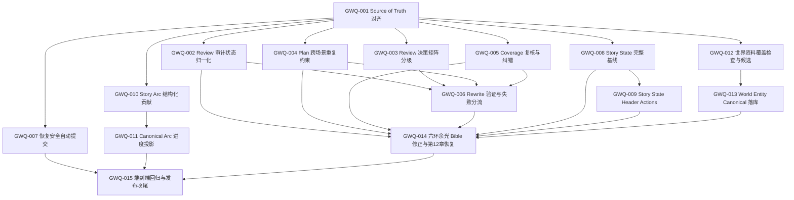

# 生成流程与内容质量稳定化可执行任务

> 日期：2026-09-15  
> 来源：2026-09-15 对《六环余光》章节生成、Review/Rewrite、Canonical State、Story Arc 和 World Entity 的现状检查  
> 参考：`docs/development/CHAPTER_GENERATION_OPTIMIZATION_TASKS.md`、`docs/development/FORESHADOWING_WORKFLOW_OPTIMIZATION_TASKS.md`  
> 用途：把检查中确认的问题与建议拆成可逐项实施、测试、验收和回滚的任务。  
> 当前状态：Batch A～D（GWQ-001～GWQ-015）已完成；Chapter 12 已使用 Bible v6 重建来源链并通过 Review 门禁，Canonical Commit 仍由用户控制。

## 1. 使用规则

每次只实施一个 `GWQ-XXX`。开始前必须重新检查当前代码、数据库状态、依赖任务完成记录和未提交改动，不能把本文件记录的 2026-09-15 快照当作永久事实。

每个任务完成时必须记录：

```text
Summary
Problems Addressed
Files Changed
Database / Canonical State Changes
Tests Actually Run
Known Limitations
Rollback / Recovery
Next Task
```

状态定义：

```text
TODO                 尚未满足依赖
READY                可以直接实施
IN_PROGRESS          正在实施
BLOCKED_BY_EVIDENCE  缺少运行证据，不能继续猜测
BLOCKED_BY_DECISION  存在未确认且会改变产品语义的选择
DONE                 已通过验收
```

优先级定义：

```text
P0  当前主链阻塞、Canonical 正确性或恢复能力
P1  稳定质量闭环或长期运营所需能力
P2  数据补齐、可观测性和发布收尾
```

除专门的数据修复任务外，所有任务必须使用测试数据或只读检查，不得顺手修改《六环余光》的 Bible、Chapter、Review、Story Event、Story State、World Entity 或 Story Arc。

## 2. 已确认事实

### 2.1 Review 与 Rewrite

- “每章都重写两次仍不通过”不是准确事实：第 5 章首次 PASS，第 7 章两次 Rewrite 后 PASS，第 8、9 章一次 Rewrite 后 PASS。
- 第 10、11 章确实耗尽两次自动 Rewrite；第 11 章最终通过来自人工 Override。
- 第 12 章只成功执行了一次 Rewrite。第二轮 Review 因 `review_validation_failed` 终止，并不是第二次 Rewrite 未通过。
- 第 6～12 章首次 Review 连续出现 Rewrite，`EXCESSIVE_REPETITION` 是最稳定的共同问题。
- Rewrite 已收到当前 Review 的全部 Findings，并明确要求一次性修复和七维复查；仅继续加强同类 Prompt 不能解决上游规则冲突。
- 当前决策矩阵中，任意 `auto_fixable=true` Finding 都会触发 Rewrite，不区分 `warning` 与 `error`，也不受总分已经达标影响。
- 第 12 章首次 Review 得分 92.30，仍因 Coverage Finding 和重复 warning 进入 Rewrite。
- 第 12 章 Assembly 将第一场的 goal/outcome 标为 missing，但正文实际包含报告递交、正式受理、核查范围和待审核状态；该 Coverage 结论至少存在一次已确认的误判。

### 2.2 Review Schema 失败

- Review Run #350 使用 `reviewer-v8` 和 `gpt-5.6-luna`，Provider 请求成功并产生 Usage Record。
- 原始响应返回 `dimension_audits.style.status=issues_found`，但 `findings` 中没有 `STYLE_MISMATCH`，只有一个 `EXCESSIVE_REPETITION`。
- Laravel 对这个矛盾的拒绝符合当前校验规则；不合理之处是冗余状态不一致直接导致 Run Failed，并最终把 Chapter 置为 blocked。

### 2.3 自动提交

- 当前 PRD 和 Generation Architecture 明确规定自动化停在 Review PASS，必须由用户手动 Canonical Commit。
- 设置页刻意移除了 `auto_commit`；历史同名配置即使存在也不参与运行。
- 本轮需求明确要求恢复自动提交选项，因此后续任务必须先更新 Source of Truth，再实现新的安全语义。

### 2.4 Story State 与 UI

- 当前《六环余光》Canonical State 为 v14。
- 当前领域投影检查结果健康：人物 3 条、世界实体 4 条、伏笔 3 条，漂移均为 0，错误为空。
- `StoryStateRebuilder::rebuild()` 固定从 v0 重放；《六环余光》从 v0 重放到 v14 与当前状态有 31 项差异。
- 主要差异是 v0 不包含后来加入完整基线的人物名称/摘要、世界实体、伏笔定义、Hard Constraints 和 Reader Promises。
- 页面“校验 / 重建”实际上只生成 dry-run 报告，Action 主体为空且没有提交按钮，不会执行重建。
- 已在真实浏览器复现三个 Header Action 不弹出窗口；同页人物/地点等 Livewire 状态切换正常。
- 现有 Feature Test 直接调用 Action 或单独渲染报告，没有覆盖真实浏览器点击与弹窗挂载。
- 当前日志不足以确认三个 Header Action 未挂载的最终前端原因，实施时必须先取得浏览器请求或事件证据，不能猜测为某个 Filament API 问题。

### 2.5 Story Arc 与 World Entity

- 五条 Story Arc 的 `progress` 都是 0；蓝图应用时显式写 0，代码中没有 Canonical Commit 后的更新入口。
- Chapter Plan 只有自然语言 `arc_contribution`，没有可确定性结算的 Arc/Beat 完成引用。
- 《六环余光》只有 4 个 World Entity：2 个地点、1 个阵营、1 个概念；物品、组织、规则实体均为 0。
- 这 4 条记录与最初 Novel Blueprint 完全一致，不是 UI 漏数或蓝图应用丢失。
- Novel Planner 只要求 `world_entities` 总数至少为 1，不要求每种类型都存在。
- 后续章节流水线只引用和投影已有 World Entity，没有把正文中新出现的候选实体转为正式实体的流程。
- `type=rule` 的独立世界规则、Bible `hard_constraints`、实体自身的 `rules` 是三种不同数据，不能因为后两者存在就认定“规则”标签应有记录。

### 2.6 当前 Bible 冲突

- 当前 Bible v5 为：基调“热血”、视角“第三人称全知”、时态“过去时”。
- 已确认的历史产品选择为：基调“热血”、视角“第一人称”、时态“过去时”。
- 当前数据与已确认选择冲突。Bible 不可原地修改，只能通过新 Bible Version 修正。

## 3. 本任务集采用的实现规则

以下规则直接来自上一轮建议，并作为本任务集的实施基线：

1. `findings` 是七维问题集合的权威来源，`dimension_audits.*.status` 由 Laravel 确定性派生。
2. Review 中只有 warning、总分达到 `review_pass_score` 且没有其他门禁时允许 PASS；error、硬规则、人工决策和低分仍按各自路径处理。
3. Rewrite 配额只计算实际创建成功的自动 Rewrite Draft；Review Schema Repair 不消耗正文 Rewrite 配额。
4. Assembly/Writer 自报的 Coverage 不是不可推翻的确定性事实；出现内部冲突时必须经过复核再决定是否 Rewrite。
5. 自动提交是小说级选项，默认关闭；只允许真实 Review PASS 进入现有 `CanonicalCommitService`。
6. Story State 重建必须从适用于目标版本的完整 Canonical Baseline 开始，不能固定 v0。
7. Story Arc 进度只由 Canonical Chapter 的结构化 Beat 完成记录计算，Draft 不修改正式进度。
8. 新 World Entity 在 Review PASS 前只能是 Candidate；只有 Canonical Commit 可以把已验证候选变为正式实体。
9. 不强迫每本小说机械拥有所有 World Entity 类型；系统显示缺口并支持受控补充。
10. 《六环余光》的 POV 修正通过新 Bible Version 完成，不覆盖 v5。

如果实施者认为其中某条与最新 PRD、Architecture 或用户后续决定冲突，必须先报告冲突并停止相关任务。

## 4. 总体依赖



## 5. 任务清单

| Task | 名称 | 优先级 | 状态 | 依赖 |
|---|---|---:|---|---|
| GWQ-001 | Source of Truth 与产品语义对齐 | P0 | DONE | 无 |
| GWQ-002 | Review 七维审计状态确定性归一化 | P0 | DONE | GWQ-001 |
| GWQ-003 | Review warning/error 决策矩阵分级 | P0 | DONE | GWQ-001 |
| GWQ-004 | Chapter Plan 跨场景重复约束治理 | P0 | DONE | GWQ-001 |
| GWQ-005 | Scene/Assembly Coverage 复核与纠错 | P0 | DONE | GWQ-001 |
| GWQ-006 | Rewrite 全量验证、配额与失败分流 | P0 | DONE | GWQ-002～005 |
| GWQ-007 | 恢复小说级安全自动提交 | P0 | DONE | GWQ-001 |
| GWQ-008 | Story State 完整基线选择与重建 | P0 | DONE | GWQ-001 |
| GWQ-009 | Story State Header Actions 与错误反馈 | P0 | DONE | GWQ-008 |
| GWQ-010 | Chapter Plan 结构化 Story Arc 贡献 | P1 | DONE | GWQ-001 |
| GWQ-011 | Canonical Story Arc 进度投影 | P1 | DONE | GWQ-010 |
| GWQ-012 | 世界资料覆盖检查与 Entity Candidate | P1 | DONE | GWQ-001 |
| GWQ-013 | World Entity Canonical 落库与回滚 | P1 | DONE | GWQ-012 |
| GWQ-014 | 《六环余光》Bible 修正与第12章安全恢复 | P0 | DONE | GWQ-002、004～006、008、009、013 |
| GWQ-015 | 真实缺陷夹具、浏览器回归与发布收尾 | P0 | DONE | GWQ-006、007、009、011、014 |

## 6. Task Cards

## GWQ-001 — Source of Truth 与产品语义对齐

**Skills：** `generation-pipeline`, `story-engine`, `memory-context`, `filament-ui`  
**优先级：** P0  
**状态：** DONE  
**依赖：** 无

### 实现功能

- 更新 PRD 与 Generation Architecture，恢复小说级自动提交选项，默认关闭。
- 明确 PASS 后根据 `auto_commit` 选择自动或人工 Canonical Commit，两条路径都必须调用同一 `CanonicalCommitService`。
- 固化 Review warning/error 分流、Review Schema Repair、Coverage 复核、Story State 完整基线、Arc Canonical 进度和 World Entity Candidate 边界。
- 修正 FSO/CGO 文档中“PASS 必须永远手动提交”的旧结论，保留历史完成记录但标注已由 GWQ-001 更新。

### 改动的问题与目的

当前代码、测试和文档明确禁止自动提交，直接恢复 UI 会制造规范冲突。本任务先建立唯一规则，使后续代码任务有可验收依据。

### 可能涉及的文件

- `docs/PRD.md`
- `docs/architecture/generation-pipeline.md`
- `docs/architecture/story-engine.md`
- `docs/architecture/data-model.md`
- `docs/development/CHAPTER_GENERATION_OPTIMIZATION_TASKS.md`
- `docs/development/FORESHADOWING_WORKFLOW_OPTIMIZATION_TASKS.md`
- 本任务文档

### 影响和后果

- 自动化边界从固定 PASS 停点变为小说级策略。
- 旧 CGO/FSO 的部分完成描述将成为历史行为，必须保留时间语境，不能静默删除审计记录。
- 本任务只修改文档，不修改运行行为或数据。

### 验收

- 所有 Source of Truth 对 PASS、自动提交、Canonical 隔离和暂停语义一致。
- 文档明确 Review Schema Repair 不消耗 Rewrite 配额。
- 文档明确 Draft 不更新 Arc Progress 或正式 World Entity。
- `git diff --check` 通过。

### 完成记录（2026-09-17）

- **Summary：** PRD、Generation Pipeline、Story Engine 和 Data Model 已统一为小说级 `auto_commit`，默认关闭；自动与人工提交共用 Canonical Commit 门禁。Review Repair、Coverage、Arc Progress 和 World Entity Candidate 边界已固化。
- **Problems Addressed：** 消除了当前规范与 CGO/FSO 历史“PASS 永远手动提交”结论的冲突，并为 Batch A 后续任务建立单一验收语义。
- **Files Changed：** `docs/PRD.md`、`docs/architecture/generation-pipeline.md`、`docs/architecture/story-engine.md`、`docs/architecture/data-model.md`、CGO/FSO 历史任务文档和本任务文档。
- **Database / Canonical State Changes：** 无；未执行 Migration，未写入小说数据。
- **Tests Actually Run：** 文档与代码一并执行 `git diff --check`；完整回归结果见 GWQ-006 完成记录。
- **Known Limitations：** `auto_commit` 运行时恢复属于 GWQ-007；本任务只确定产品语义。
- **Rollback / Recovery：** 可回退上述文档差异；历史完成记录本身未被删除或重写，只增加当前规则覆盖说明。
- **Next Task：** GWQ-002、GWQ-003、GWQ-004、GWQ-005 已按 Batch A 顺序实施。

## GWQ-002 — Review 七维审计状态确定性归一化

**Skills：** `generation-pipeline`  
**优先级：** P0  
**状态：** DONE  
**依赖：** GWQ-001

### 实现功能

- 保留七维 `summary` 和 Findings 的结构校验。
- 在 Laravel 内根据最终 Findings 重新计算每个维度的 `status`：存在同维度 Finding 为 `issues_found`，否则为 `pass`。
- 模型返回状态与 Findings 不一致时保存原始值和归一化结果，便于审计。
- 如果 summary 明确声称存在实质问题而 Findings 为空，执行一次只针对该维度的结构化修复；修复失败进入 `NEEDS_ATTENTION`，不得把 Chapter 标为 blocked。
- 结构修复保持相同 Draft、State Version、Bible Version 和 Prompt Version 来源链。

### 改动的问题与目的

解决 Run #350 这类“模型请求成功、正文可用，只因冗余状态字段矛盾而阻塞整章”的问题。保持 AI 输出不可信原则，同时把可确定修复的问题留在确定性流程中解决。

### 可能涉及的文件

- `app/Services/ChapterReviewer.php`
- 新增或复用 Review payload repair service
- `app/Jobs/ReviewChapterJob.php`
- `config/generation.php`
- Review 相关 Feature Tests

### 影响和后果

- Review Artifact 需要记录模型原始状态、归一化状态和 repair 元数据。
- 若只覆盖状态而忽略 summary，可能隐藏模型漏报；因此 summary/Findings 语义冲突仍需有限修复。
- 不应重新调用完整 Review，也不应消耗正文 Rewrite 次数。

### 验收

- 精确复现 Run #350 的响应时不会 blocked。
- `issues_found + 无 Finding` 和 `pass + 有 Finding` 都有确定结果。
- 修复失败生成可理解的 NEEDS_ATTENTION 和 `ai_request_log_id`。
- 重复 Queue Delivery 不产生重复 Review Artifact 或 Usage。

### 完成记录（2026-09-17）

- **Summary：** Review 先校验七维结构，再以最终 Findings 确定性派生状态；保留原始审计，并对 `issues_found` 无 Finding 的单一维度执行一次有输入哈希的聚焦修复。
- **Problems Addressed：** Run #350 等价响应不再使 Review Run 直接失败；修复失败会产生带 `ai_request_log_id` 的 NEEDS_ATTENTION Finding。
- **Files Changed：** `ChapterReviewer`、新增 `ReviewDimensionAuditRepairer`、OpenAI 请求日志关联、生成配置及 Review 测试。
- **Database / Canonical State Changes：** 无 Migration；仅在测试数据库创建不可变 Context/Review Artifact，未修改 Canonical State。
- **Tests Actually Run：** Batch A 定向回归 196 项中 193 passed、3 skipped，863 assertions；Provider 日志关联测试 13/13 passed，53 assertions；完整结果见 GWQ-006。
- **Known Limitations：** Fake Provider 只能验证协议、幂等复用和分流；未验证真实模型的语义判断质量。
- **Rollback / Recovery：** 移除聚焦修复服务和 Reviewer 归一化调用即可回退；旧 Review Artifact 仍可读取。
- **Next Task：** GWQ-003。

## GWQ-003 — Review warning/error 决策矩阵分级

**Skills：** `generation-pipeline`  
**优先级：** P0  
**状态：** DONE  
**依赖：** GWQ-001

### 实现功能

- 调整 Review 决策矩阵：
  - hard/state conflict → BLOCK；
  - `requires_human_decision=true` → NEEDS_ATTENTION；
  - auto-fixable error → REWRITE；
  - 只有 warning 且总分达到 `review_pass_score` → PASS，并保留 advisory Findings；
  - 总分未达标且存在可执行 warning → REWRITE；
  - 没有可执行路径且未达标 → NEEDS_ATTENTION。
- Review Artifact 保存明确的 `decision_basis`，列出实际触发决策的 Finding IDs/代码和阈值。
- UI 区分阻塞 Finding 与非阻塞建议。

### 改动的问题与目的

当前一个轻微、可修复的 warning 就会让高分章节整体重写。分级后仍保留质量反馈，但不再让轻微建议无限消耗 Rewrite 配额。

### 影响和后果

- 一些以前进入 Rewrite 的高分章节会直接 PASS。
- PASS Artifact 可能保留 warning，Canonical Commit UI 必须清楚展示这些建议。
- 需要更新 CGO-010 的旧分流测试和文档。

### 验收

- 92 分且只有 repetition warning 的夹具得到 PASS。
- 同样 Finding 为 error 时得到 REWRITE。
- 低于阈值且有可执行 warning 时得到 REWRITE。
- Locked Fact/State Conflict 行为不变。

### 完成记录（2026-09-17）

- **Summary：** Review 决策矩阵按 hard、human、error、低分 actionable warning 和高分 advisory warning 分级；Artifact 保存触发规则、Finding codes 和稳定 refs，UI 使用“处理级别”明确阻塞与建议。
- **Problems Addressed：** 92 分且仅有轻微 warning 的章节可 PASS；同一问题为 error 时仍进入 REWRITE。
- **Files Changed：** `ChapterReviewer`、Review 页面、章节工作台及 Review/Filament 测试。
- **Database / Canonical State Changes：** 无。
- **Tests Actually Run：** Review 定向测试 49/49 passed；Batch A 和完整回归结果见 GWQ-006。
- **Known Limitations：** PASS 可以保留 advisory Finding；GWQ-007 实现自动提交设置时仍须在提交界面展示这些建议。
- **Rollback / Recovery：** 回退决策矩阵与 UI 标签即可；Artifact 新增元数据为兼容性附加字段。
- **Next Task：** GWQ-004。

## GWQ-004 — Chapter Plan 跨场景重复约束治理

**Skills：** `generation-pipeline`  
**优先级：** P0  
**状态：** DONE  
**依赖：** GWQ-001

### 实现功能

- 在 Chapter Plan 中区分：首次建立的信息、跨场景持续状态、必须发生变化的状态和章末允许回扣的信息。
- Plan Validator 检测多个 Scene 中语义相同的 goal/conflict/turn/outcome、allowed/forbidden 和状态说明。
- 对可合并的重复要求生成明确的 Plan Finding 或要求 Planner 修复，不能把矛盾合同直接交给 Writer。
- Writer 只在首次、状态发生变化或关键选择时重述持续状态；后续 Scene 使用增量表达。
- 保留真正必要的连续性约束，不通过删除 Canonical State、Hard Constraints 或伏笔契约减少重复。

### 改动的问题与目的

第 11、12 章的计划反复要求伤势、未施法、监管边界和等待审核；Writer 为满足 Coverage 重复表达，Reviewer 又判定重复。本任务在写作前消除这种合同冲突。

### 影响和后果

- Chapter Plan Schema、Prompt Version 和历史兼容读取可能变化。
- 历史 Plan 保持只读；重新生成时创建新 Plan Version。
- 去重不能让后续 Scene 失去必要的状态约束。

### 验收

- 使用第 12 章等价计划夹具时，Validator 能识别跨 Scene 重复要求。
- 修复后的 Plan 仍保留全部 must_reveal、must_not_reveal 和 Canonical 约束。
- Writer 输出不需要逐 Scene 重复同一伤势和边界才能通过 Coverage。

### 完成记录（2026-09-17）

- **Summary：** Scene Plan 新增 `continuity_requirements` 稳定契约，区分 establish、persist、change、callback；Planner、Validator、Writer、Assembler、Rewriter、人工计划和预览已贯通。
- **Problems Addressed：** Validator 阻止跨 Scene 的规范化完全重复核心要求，并校验连续性契约顺序，使持续状态以首次、增量、变化或章末回扣表达。
- **Files Changed：** Chapter Plan payload/factory、Planner、Validator、Scene Generator、Assembler、Rewriter、Filament 计划页、Prompt Versions 和相关测试。
- **Database / Canonical State Changes：** 无 Migration；字段保存在现有 `scene_plans` JSON，历史 Plan 继续兼容读取。
- **Tests Actually Run：** Plan/生成定向回归包含在 196 项结果中；Filament 计划编辑与预览 16/16 passed，141 assertions。
- **Known Limitations：** Laravel 只确定性识别规范化后完全相同的自由文本；语义相同但措辞不同依靠 Planner 输出同一稳定 key，再由契约顺序校验，未用关键词相似度冒充语义判断。
- **Rollback / Recovery：** 新 Prompt Version 创建的新 Artifact 保持可解释；回退代码不会改写历史 Plan JSON。
- **Next Task：** GWQ-005。

## GWQ-005 — Scene/Assembly Coverage 复核与纠错

**Skills：** `generation-pipeline`  
**优先级：** P0  
**状态：** DONE  
**依赖：** GWQ-001

### 实现功能

- 把 Writer/Assembler 的 Coverage 定义为结构化自报证据，不再称为不可推翻的确定性结果。
- `fulfilled/contradicted` 继续要求 evidence 逐字来自当前正文；`missing` 继续要求 evidence 为 null。
- 当 Coverage 报 missing、但 Narrative Review 或可验证文本证据认为已完成时，执行一次聚焦 Coverage 判定修复。
- 修复调用只能重判 status/evidence，不能改正文、Plan 或 Canonical State。
- 修复仍不确定时保留明确 Finding，并记录判定来源，不能静默转为 fulfilled。

### 改动的问题与目的

解决第 12 章第一场 goal/outcome 已出现在正文，却因 Assembly 自报 missing 而触发不必要 Rewrite 的问题。

### 影响和后果

- 需要新的 Coverage 判定版本或 Artifact 元数据。
- 可能增加一次小型模型调用；必须设上限、记录 Usage，并优先复用相同输入结果。
- 不能用简单关键词匹配冒充语义完成判断。

### 验收

- 使用第 12 章原始正文和 Coverage 夹具时，goal/outcome 不再被无条件当作 missing。
- 真正缺失的计划结果仍进入 REWRITE。
- 无逐字 evidence 的 fulfilled 仍被拒绝。
- 重复执行复用相同修复 Artifact，不重复付费。

### 完成记录（2026-09-17）

- **Summary：** Assembly/Writer Coverage 明确为结构化自报；missing Finding 在 Review 前可进行一次只重判 status/evidence 的聚焦复核，相同输入复用不可变 Artifact。
- **Problems Addressed：** 正文已有语义证据但自报 missing 时不再无条件 Rewrite；证据仍须通过 `PlanCoverage` 的逐字校验，失败或不确定会保留 Finding 和请求关联信息。
- **Files Changed：** 新增 `PlanCoverageJudgmentRepairer`、`ChapterReviewer`、生成配置、架构文档和 Review 测试。
- **Database / Canonical State Changes：** 无 Migration；测试只创建非 Canonical 修复 Artifact 和 Usage 路径。
- **Tests Actually Run：** Coverage 误判与重复执行用例包含在 Review 49/49 和 Batch A 196 项定向回归中。
- **Known Limitations：** 未调用真实 Provider；语义裁决质量需在真实响应夹具或后续受控运行中继续观测。
- **Rollback / Recovery：** 移除聚焦复核调用即可恢复原分流；原 Coverage 和修复 Artifact 均未被覆盖。
- **Next Task：** GWQ-006。

## GWQ-006 — Rewrite 全量验证、配额与失败分流

**Skills：** `generation-pipeline`  
**优先级：** P0  
**状态：** DONE  
**依赖：** GWQ-002、GWQ-003、GWQ-004、GWQ-005

### 实现功能

- 每轮 Rewrite 继续接收全部可执行 Findings，并保存逐项修复清单。
- Review after Rewrite 输出每个旧 Finding 的 `resolved/still_present/replaced` 结果，再进行七维全量检查。
- 区分正文 Rewrite、长度 Repair、Coverage Repair 和 Review Schema Repair 的计数。
- `max_rewrite_attempts` 只限制成功生成的自动正文 Rewrite Draft。
- Provider/Schema/证据修复失败走各自有限恢复路径，不伪装成“重写两次仍未通过”。
- Rewrite 耗尽时保存尚未解决的问题差异，并进入 NEEDS_ATTENTION。

### 改动的问题与目的

让用户能看到究竟是正文质量未修好、模型输出协议失败，还是上游 Coverage 误判；避免不同失败共享一个模糊的“两次重写失败”结论。

### 影响和后果

- Rewrite Artifact/Review Artifact 会增加验证元数据。
- 现有历史 Artifact 没有新字段，必须兼容读取而不能回填伪造。
- 不应通过增加最大 Rewrite 次数掩盖上游合同问题。

### 验收

- 一轮 Rewrite 同时处理多个 Findings，并能逐项证明结果。
- Review Schema Repair 不增加自动 Rewrite 次数。
- 长度/证据修复失败显示真实错误分类。
- 两次正文 Rewrite 后仍有阻塞问题时稳定进入 NEEDS_ATTENTION。

### 完成记录（2026-09-17）

- **Summary：** Review Artifact 会逐项记录上一轮 Finding 的 `resolved / still_present / replaced`；Schema Repair 和 Coverage Repair 使用独立 stage/Artifact，不计入 `AutomaticRewriteCounter`，正文 Rewrite 仍按成功创建的 Draft 计数。
- **Problems Addressed：** Rewrite 后可看到旧问题的完整差异；协议或证据修复失败不再伪装成正文 Rewrite 耗尽。
- **Files Changed：** `ChapterReviewer`、两个聚焦修复服务、Review/Rewrite 兼容测试、Prompt Versions 和架构文档。
- **Database / Canonical State Changes：** 无 Migration、无真实 Provider 请求、无现有小说或 Canonical 数据写入。
- **Tests Actually Run：** Batch A 定向回归 196 项中 193 passed、3 skipped，863 assertions；Filament 16/16 passed，141 assertions；兼容修复回归 4/4 passed，138 assertions；Provider 日志关联测试 13/13 passed，53 assertions；最终完整回归在 `php -d memory_limit=512M vendor/bin/pest --compact` 下 803 项中 782 passed、21 skipped，4820 assertions，测试框架另报告 2 个未提供明细的 warnings。默认 128 MB 的两次完整命令在 Livewire 测试中内存耗尽，未形成测试结论。
- **Known Limitations：** 未执行真实模型质量验证；两个测试框架 warning 没有明细，当前无法归因。Batch B 的安全自动提交尚未实现。
- **Rollback / Recovery：** 删除附加验证元数据和聚焦 repair 服务不会改变旧 Artifact；所有新增结果均为不可变 Artifact，可按来源链审计。
- **Next Task：** GWQ-007 已 READY；本次按用户范围不实施 Batch B。

## GWQ-007 — 恢复小说级安全自动提交

**Skills：** `generation-pipeline`, `story-engine`, `filament-ui`  
**优先级：** P0  
**状态：** DONE  
**依赖：** GWQ-001

### 实现功能

- 在小说设置中恢复“Review PASS 后自动提交正式章节”开关，默认关闭。
- 设置保存必须保留 `settings` 中无关配置，并明确显示当前状态。
- Review PASS 后由统一推进器判断是否派发 `CommitChapterJob`，Job 只调用现有 `CanonicalCommitService`。
- 自动提交前检查小说未暂停、Review 来源为当前 Draft、Event Candidate/State Patch 来源一致、Expected State Version 正确。
- 自动 Commit 成功后复用现有 Post-Commit、Memory、Projection 和 `CheckNextAction`。

### 改动的问题与目的

恢复用户需要的无人值守正式提交选项，同时不绕过 Review Gate、Canonical Transaction 和幂等边界。

### 影响和后果

- 开启后 PASS 会直接改变 Canonical Story State，属于高影响小说级设置。
- UI 必须解释开启后的后果，并记录设置变化。
- 旧数据库中的 `auto_commit` 键需要明确迁移/保留策略，不能仅因存在就自动启用。

### 验收

- 默认关闭时仍停在 PASS 等待人工提交。
- 明确开启时 PASS 自动调用 Commit；重复投递只有一次正式效果。
- 暂停、NEEDS_ATTENTION、BLOCK、过期 State Version 均不自动提交。
- 自动提交和人工提交得到相同 Canonical 结果与后置任务。

### 完成记录（2026-09-17）

- **Summary：** 小说设置恢复默认关闭的自动提交开关；只有显式保存产生的 `auto_commit_configured=true` 才激活历史同名策略。统一推进器在 PASS、当前 Draft、Event Candidate、State Patch 和 Expected State Version 全部一致时派发唯一的 `CommitChapterJob`，Job 继续只调用 `CanonicalCommitService`。
- **Problems Addressed：** 恢复无人值守提交，同时避免历史 `auto_commit=true` 静默生效，也没有复制 Canonical 事务或后置任务。
- **Files Changed：** 小说表单与保存页、`AdvanceChapterPipelineAction`、`CommitChapterJob`、相关 Feature Tests，以及 PRD/Generation Architecture。
- **Database / Canonical State Changes：** 无 Migration；未修改现有小说设置或 Canonical 数据。新建/保存表单后才会明确写入 `auto_commit` 与 `auto_commit_configured`。
- **Tests Actually Run：** Batch B 定向回归与最终完整回归见 GWQ-009 完成记录；自动提交覆盖默认关闭、旧键惰性、显式开启、重复推进、暂停、非 PASS 与过期 State Version。
- **Known Limitations：** 自动提交开关变化使用 Laravel Log 记录，项目当前没有独立的小说设置审计表。
- **Rollback / Recovery：** 关闭 `auto_commit` 即恢复人工提交；移除显式确认键会使历史值保持惰性。已经完成的 Canonical Commit 仍使用现有最新章节回滚流程。
- **Next Task：** GWQ-008 已完成。

## GWQ-008 — Story State 完整基线选择与重建

**Skills：** `story-engine`  
**优先级：** P0  
**状态：** DONE  
**依赖：** GWQ-001

### 实现功能

- 定义并校验“完整 Canonical Baseline”的必要 Domain 和元数据。
- 重建目标版本时选择不晚于目标版本的最新完整无章节基线，而不是固定 v0。
- 报告所选 baseline version、checksum、被重放 Event 范围和跳过原因。
- 如果没有完整基线，返回可操作错误，禁止用不完整状态生成误导性的 diff。
- 保持重建为 dry-run；真正替换 Canonical State 必须走独立、受版本检查和事务保护的恢复 Action。

### 改动的问题与目的

解决《六环余光》从不完整 v0 重放产生 31 项伪差异的问题，保证校验报告能够真实判断 Event 链是否可重建。

### 影响和后果

- 对有多个无章节版本的小说，重建起点可能从 v0 改为较新版本。
- 只能证明 baseline 之后的 Event 链；报告必须明确这个验证范围。
- 不能删除旧 v0 或覆盖历史 State Version。

### 验收

- 《六环余光》dry-run 明确选中完整基线，并报告可信差异。
- 缺少完整基线时失败且不写数据。
- Manual Correction、失效 Event、Rollback 后的重建结果都有测试。

### 完成记录（2026-09-17）

- **Summary：** 重建器验证必要 Domain、`schema_version`、无章节来源和 checksum，从目标版本之前选择最新完整基线，并报告基线、Event 范围及跳过原因；新增受版本/checksum/事务保护的 `RecoverCanonicalStoryStateAction`。
- **Problems Addressed：** 不再把 v0 当作固定可信起点，也不再用不完整快照生成伪差异。
- **Files Changed：** `StoryStateRebuilder`、`StoryStateRebuildResult`、恢复 Action、CLI/报告视图、重建/恢复/回滚测试和 Story Engine/Data Model 文档。
- **Database / Canonical State Changes：** 无 Migration；重建命令和页面校验保持 dry-run。恢复 Action 仅在用户确认后追加无章节 State Version，不覆盖历史版本。
- **Tests Actually Run：** 覆盖最新完整基线、缺失基线、Manual Correction、失效 Event、Rollback、恢复成功与版本冲突；最终结果见 GWQ-009。
- **Known Limitations：** 校验范围只证明所选 baseline 之后的 Event 链，报告会明确显示该边界。
- **Rollback / Recovery：** 恢复写入本身形成新的不可变基线；若结果不正确，需再次校验并通过受保护恢复或既有人工修正流程创建后续版本。
- **Next Task：** GWQ-009 已完成。

## GWQ-009 — Story State Header Actions 与错误反馈

**Skills：** `filament-ui`, `story-engine`  
**优先级：** P0  
**状态：** DONE  
**依赖：** GWQ-008

### 实现功能

- 先采集 Header Action 点击时的浏览器事件、Livewire 请求和响应证据，确认未挂载原因后再修改。
- 将“校验 / 重建”拆成语义明确的“校验重建结果”和实际恢复操作，避免空 Action 被理解为已重建。
- 修复校验、重建投影、人工修正三个弹窗的真实浏览器挂载。
- 为 ValidationException、State Version Conflict 和领域错误显示中文通知及下一步。
- 成功操作后刷新版本、Projection Health 和当前 Domain 数据。

### 改动的问题与目的

解决三个 Header Action 在真实页面无响应、现有 Feature Test 却全部通过的问题，并防止后端异常被 UI 静默吞没。

### 影响和后果

- 可能涉及 Filament Action 定义、Modal 配置或前端资源；必须以捕获的证据决定，不能预设原因。
- “重建投影”会写派生表，但不能修改 Canonical State 或 Story Events。
- “人工修正”继续要求 path、合法 JSON value 和 reason。

### 验收

- 真实浏览器点击三个按钮都出现预期弹窗或确认框。
- 校验动作只读；重建投影和人工修正只有确认后写入。
- 错误时页面显示通知，日志和 UI 能关联同一请求。
- 增加浏览器级或等价的 JavaScript 集成测试，不能只用 `callAction()`。

### 完成记录（2026-09-17）

- **Summary：** Header Actions 改为直接 Livewire 页面方法并渲染页面自有可访问对话框，校验、Canonical 恢复、投影重建与人工修正语义分离；错误统一显示中文持久通知、下一步和可与 Laravel Log 对应的错误编号。
- **Problems Addressed：** 改动前真实浏览器点击无请求/无弹窗；去除 Record 上下文后请求已发出，但 Filament `sync-action-modals` 仍未生成 dialog。最终实现绕过该失效的 modal 同步层，同时保留 Action/Service 业务边界。
- **Files Changed：** Story State 页面、对话框与重建报告 Blade、Filament/领域 Action Tests。
- **Database / Canonical State Changes：** 浏览器验收只打开/关闭对话框，没有确认任何写操作；未修改《六环余光》Canonical、Projection 或领域数据。
- **Tests Actually Run：** 定向回归 106/106 passed、464 assertions；Pint `--dirty` 通过；最终完整回归结果在本批次收尾时记录为 811 项，其中 790 passed、21 skipped，4859 assertions，另有 2 个测试框架未提供明细的 warnings。真实 Chrome 验证三个目标 Header Action 均出现 `role=dialog`。
- **Known Limitations：** 项目未安装 Dusk/Playwright 测试依赖；自动测试验证 Header Action 的实际 Livewire click handler 与页面对话框渲染，另以真实 Chrome 完成点击回归。
- **Rollback / Recovery：** 校验始终只读；投影重建只写派生表；人工修正和 Canonical 恢复均创建新版本并保留历史。
- **Next Task：** Batch B 完成；GWQ-010 已解除依赖。

## GWQ-010 — Chapter Plan 结构化 Story Arc 贡献

**Skills：** `generation-pipeline`, `story-engine`  
**优先级：** P1  
**状态：** DONE  
**依赖：** GWQ-001

### 实现功能

- Chapter Plan 引用当前小说内有效 Story Arc。
- 用 Arc ID 和 Beat 索引/稳定标识记录本章计划推进项，保留自然语言 `arc_contribution` 作为说明。
- Planner 只能引用所属 Volume 中有效 Arc 和真实 Beat。
- Review 验证正文是否完成声明的 Beat；未完成不能在 Commit 时计入进度。
- 历史 Plan 无结构化引用时保持可读，但不据此伪造进度。

### 改动的问题与目的

为 Arc Progress 提供可验证来源，替代无法结算的自然语言说明。

### 影响和后果

- 可能需要 Chapter Plan JSONB 字段扩展或新结构；实施前先检查现有表是否能最小承载。
- 多 Arc 章节必须允许多个贡献，但避免新增复杂关系表，除非 JSONB 无法满足查询和约束。

### 验收

- 非本小说 Arc、错误 Volume、无效 Beat 被拒绝。
- Draft 只保存候选贡献，不更新 `story_arcs.progress`。
- Review Artifact 能显示计划 Beat 与正文验收结果。

### 完成记录（2026-09-17）

- **Summary：** Chapter Plan 新增 `arc_contributions` 冻结契约，以稳定 Beat Key、索引、目标 Scene 和验收条件引用当前小说中当前 Volume 或跨卷 Active Arc；Planner、Context、Writer、Assembler、Reviewer 与 Rewriter 共用该契约。
- **Problems Addressed：** 自然语言 `arc_contribution` 无法确定性验证和结算；现在错误小说、错误 Volume、无效 Beat、重复贡献和错误 Scene 都在 Plan Validation 阶段被拒绝。
- **Files Changed：** Chapter Plan migration/model/factory、Beat Contract、Planner/Payload/Validator/Context、生成与审校服务、章节审校 UI 和测试。
- **Database / Canonical State Changes：** 新增 `chapter_plans.arc_contributions` JSONB，默认空数组；没有修改《六环余光》Plan 或 Canonical 数据。
- **Tests Actually Run：** Batch C 定向回归 142/142 passed、721 assertions；最终完整回归 816 项，其中 795 passed、21 skipped，4892 assertions，测试框架另报告 2 个未提供明细的 warnings。
- **Known Limitations：** 历史 Plan 仍可读取，但缺少结构化引用时不会推测或补写 Beat 完成状态。
- **Rollback / Recovery：** 删除新 Plan 字段即可回退契约；已有自然语言说明仍保留。
- **Next Task：** GWQ-011 已完成。

## GWQ-011 — Canonical Story Arc 进度投影

**Skills：** `story-engine`, `generation-pipeline`, `filament-ui`  
**优先级：** P1  
**状态：** DONE  
**依赖：** GWQ-010

### 实现功能

- Canonical Commit 后根据已正式验收的 Beat 完成记录重算 Arc Progress。
- `progress = 已完成的唯一 Beat 数 / Arc Beat 总数`；Completion Conditions 满足后才把 Arc 标为 completed。
- 重复 Commit、Projection Refresh 不重复计数。
- Latest Chapter Rollback、Event invalidation 和修正后从剩余 Canonical 来源重算。
- UI 分开显示 Canonical Progress 和活跃草稿的预计贡献。

### 改动的问题与目的

解决已经提交 11 章但第一卷主线仍永久显示 0 的问题，并使进度可追踪、可回滚。

### 影响和后果

- 现有 5 条 Arc 需要单独历史回算；不能根据章节数直接猜进度。
- 若历史 Chapter Plan 没有 Beat 引用，历史回算需要证据化评估任务，不能自动标记全部完成。

### 验收

- Commit、重复投递、Rollback 和修正均得到确定进度。
- 进度始终在 0～1，来源能追溯到 Canonical Chapter。
- 《六环余光》的历史回算先输出 dry-run，不在本任务直接修改数据。

### 完成记录（2026-09-17）

- **Summary：** 新增 `story_arc_beat_completed` Event 与确定性 Progress Projector；Commit 和 Latest Chapter Rollback 在 Canonical 事务内从唯一 Active Beat Events 重算进度，规划页分开显示 Canonical 完成数与当前草稿预计贡献。
- **Problems Addressed：** Arc Progress 过去只在蓝图创建时写 0，提交章节后没有更新入口；现在重复 Commit、刷新和回滚都从正式来源重算，不做累加。
- **Files Changed：** Event Enum/migration、Story Arc Beat Contract/Projector、Canonical Commit、Latest Rollback、重算命令、Planning UI 和测试。
- **Database / Canonical State Changes：** PostgreSQL Event Type CHECK 已加入新类型；对《六环余光》执行了只读 `story:rebuild-arc-progress 2` dry-run，五条 Arc 的当前值和重算值均为 0，未写入业务数据。
- **Tests Actually Run：** Batch C 定向回归 142/142 passed、721 assertions；最终完整回归 816 项，其中 795 passed、21 skipped，4892 assertions，测试框架另报告 2 个未提供明细的 warnings。
- **Known Limitations：** 历史 Plan 没有 Beat 引用，dry-run 明确不推测历史完成度；如需人工证据化补齐应另建数据修复任务。
- **Rollback / Recovery：** `story:rebuild-arc-progress` 默认只读，只有 `--execute` 才更新；Rollback 从剩余 Active Canonical Events 重算。
- **Next Task：** GWQ-012、GWQ-013 已完成；GWQ-014 已解除依赖。

## GWQ-012 — 世界资料覆盖检查与 Entity Candidate

**Skills：** `generation-pipeline`, `story-engine`, `filament-ui`  
**优先级：** P1  
**状态：** DONE  
**依赖：** GWQ-001

### 实现功能

- Novel Blueprint 展示各 World Entity 类型覆盖情况，但不强迫所有类型非空。
- Planning 阶段发现剧情需要尚不存在的地点、物品、阵营、组织、规则或概念时，输出结构化 `world_entity_candidates`。
- Candidate 包含稳定临时键、类型、名称、描述、与既有实体的去重依据、引入理由和目标 Scene。
- Writer 只能使用 Plan 中批准的 Candidate，不得在正文自由创造未登记的重大世界事实。
- UI 区分现有 Canonical Entity、当前章节 Candidate 和类型缺口。

### 改动的问题与目的

解决世界资料永远停留在初始蓝图四条记录的问题，同时避免为了填满页面而生成无剧情价值的实体。

### 影响和后果

- Candidate 是 Draft Artifact，不得提前写入正式 `world_entities`。
- 需要处理与既有实体同名、别名和类型冲突。
- 独立 Rule Entity、Bible Hard Constraint 和实体内部 rules 继续分层展示。

### 验收

- 不需要新实体的章节可以返回空 Candidate。
- 引入新关键物品的计划必须产生 Candidate，Writer 引用稳定临时键。
- 未批准的新重大实体进入 Review Finding，不能直接 Canonical Commit。

### 完成记录（2026-09-17）

- **Summary：** Chapter Plan 新增结构化 `world_entity_candidates`，包含稳定临时键、类型、名称、描述、去重信息、引入理由和目标 Scene；Planner、Writer、Extractor 与 Reviewer 都受冻结契约约束。
- **Problems Addressed：** 正文过去只能引用初始 World Entity，也没有受控新增路径；现在无新增需求可返回空数组，需要新增时必须先建立 Candidate，未批准实体会形成阻断 Finding。
- **Files Changed：** Chapter Plan schema/model/factory、Planner/Payload/Validator/Context、Writer/Assembler/Extractor/Reviewer/Rewriter、World UI 和测试。
- **Database / Canonical State Changes：** 新增 `chapter_plans.world_entity_candidates` JSONB，默认空数组；没有提前创建正式 Entity，也没有补齐《六环余光》的空类型。
- **Tests Actually Run：** Batch C 定向回归 142/142 passed、721 assertions；最终完整回归 816 项，其中 795 passed、21 skipped，4892 assertions，测试框架另报告 2 个未提供明细的 warnings。
- **Known Limitations：** 去重使用 Plan 明示的潜在重复 ID 加当前同名/类型规则，不做模糊语义合并；空类型只是可见信息，不会机械补齐。
- **Rollback / Recovery：** Candidate 属于不可变 Draft Artifact，废弃 Plan 版本不会影响 Canonical World。
- **Next Task：** GWQ-013 已完成。

## GWQ-013 — World Entity Canonical 落库与回滚

**Skills：** `story-engine`, `generation-pipeline`, `memory-context`  
**优先级：** P1  
**状态：** DONE  
**依赖：** GWQ-012

### 实现功能

- Event Extraction/Review 验证 Candidate 确实在正文中引入，并保存逐字证据。
- Canonical Commit 在同一事务中幂等创建正式 World Entity、解析临时引用、写 Story Event 和下一 State Version。
- Candidate 未通过 Review 时不创建正式实体。
- Memory 只能引用 Commit 后的正式 Entity ID。
- Latest Chapter Rollback 正确失效或恢复由该章首次引入的 Entity；若后续 Canonical Chapter 已引用，必须阻止简单删除并走重建规则。

### 改动的问题与目的

建立世界资料从正文出现到正式世界状态的完整闭环，使地点、物品、组织和规则可以随长篇故事受控增长。

### 影响和后果

- Canonical Commit 事务扩大，必须补充失败注入和重复投递测试。
- 是否新增 Event Type 或复用现有 World 事件，要在实施前根据当前 Enum/Applier 能力决定，不能预设不存在的接口。
- 可能需要数据库唯一性或业务去重规则，但不应仅按名称全局唯一。

### 验收

- PASS 前数据库无正式新增 Entity。
- Commit 后 Entity、Event、State 和 Memory 引用一致。
- 重复 Commit 只创建一条正式 Entity。
- 中途失败不留下 Entity 已创建而 Chapter 未 canonical 的半提交状态。

### 完成记录（2026-09-17）

- **Summary：** 新增 `world_entity_introduced` Event；Canonical Commit 在同一事务内复核 Review 逐字证据、幂等创建正式 Entity、解析临时键、写 Event/State/Chapter metadata，并让 Memory 只接收正式 Entity ID。Latest Chapter Rollback 删除无后续正式引用的本章来源 Entity，存在后续引用时阻止简单删除。
- **Problems Addressed：** Candidate 过去没有从 Draft 进入 Canonical World 的受控闭环，也缺少 exactly-once、正式引用和回滚语义。
- **Files Changed：** World Entity migration/model、Event Candidate/Extractor/Validator/Applier、State Patch/Commit/Rebuilder/Rollback/Memory、审校验收和事务测试。
- **Database / Canonical State Changes：** 新增 Entity 来源列和 `(novel_id, source_chapter_id, source_candidate_key)` 唯一约束，Chapter 新增 `canonical_metadata`；迁移已应用到当前 PostgreSQL。没有执行真实 Provider 请求，也没有新增、提交或回滚《六环余光》的正式实体或章节。
- **Tests Actually Run：** Batch C 定向回归 142/142 passed、721 assertions；最终完整回归 816 项，其中 795 passed、21 skipped，4892 assertions，测试框架另报告 2 个未提供明细的 warnings。
- **Known Limitations：** 当前 Entity 去重采用显式候选关联与同名/类型冲突规则；复杂别名或语义合并需要独立人工流程。
- **Rollback / Recovery：** 事务失败不保留 Entity/Event/State/Chapter/Arc 半状态；最新章回滚只删除无后续 Active Canonical 引用的来源 Entity。
- **Next Task：** GWQ-014 已解除依赖；Batch D 未实施。

## GWQ-014 — 《六环余光》Bible 修正与第12章安全恢复

**Skills：** `generation-pipeline`, `story-engine`, `memory-context`  
**优先级：** P0  
**状态：** DONE
**依赖：** GWQ-002、GWQ-004、GWQ-005、GWQ-006、GWQ-008、GWQ-009、GWQ-013

### 实现功能

本任务分为不可跳过的两阶段：

1. dry-run：输出 Bible v5→新版本的完整字段差异、受影响 Run/Artifact、Chapter 12 恢复起点、Story State 基线检查和 World/Arc 历史补齐候选。
2. 显式执行：用户审核冻结报告后创建新 Bible Version，将 POV 改为“第一人称”，保留“热血、过去时”和其余已确认 style profile；随后按来源失效规则恢复第 12 章。

第 12 章现有 Plan、Scene、Rewrite 和 Review 均冻结到 Bible v5。切换新 Bible 后不得直接把 v5 Rewrite Draft 提交为正式版本；必须从最早受 Bible 变化影响的阶段创建新版本并重新推进。

### 改动的问题与目的

- 修正当前 Bible v5 与“第一人称”已确认决策的冲突。
- 清除 Run #350 留下的 blocked 状态，但保留失败 Run、原始响应和 Usage 审计。
- 使用已经修复的 Review/Coverage/Rebuild 流程验证第 12 章，而不是手工改数据库跳过门禁。

### 影响和后果

- 会创建新的不可变 Bible Version，并使后续 Run 使用新 checksum。
- 可能产生真实 Provider 调用和费用；执行前报告预计调用阶段，不能把 dry-run 说成已重生成。
- 现有 Canonical 1～11 章保持原有 Bible/Artifact 来源，不回写历史。

### 验收

- dry-run 和 execute 使用同一冻结 plan hash、Expected Bible Version 和 Expected State Version。
- 新 Bible 只有 POV 及必要版本元数据发生预期变化。
- 第 12 章恢复后每个 Artifact 都能追溯到新 Bible 和正确 State Version。
- 失败重试不删除 Run #350，也不重复生成 Canonical 数据。

### 阶段记录（2026-09-17）

- 已实现默认只读的 `novel:recover-bible-chapter` 和受 Expected Bible/State、来源链及 plan hash 保护的显式执行路径。
- 《六环余光》使用冻结 hash `1e29a14191465d04021bdb325c96fabe2192e0db5ca5de99857dd6799a836b3f` 完成显式恢复；Bible v6 将 POV 从“第三人称全知”改为“第一人称”，保留热血、过去时和其余已确认内容。
- Story State 从完整 baseline v1 重放到 current v14，无差异；Projection 无漂移。World/Arc 历史缺少可验证的结构化证据，因此只报告候选，不写入推断数据。
- Run 352～360 与 Artifact 231～240 构成 Bible v6 / State v14 新来源链；旧 Run 350 和 v5 Artifact 保留。Run 360 已成功持久化 Review，不再因冗余审计结构直接失败。
- 用户随后通过产品内 Manual Override 创建 Run 361 / Review 47，决策为 PASS；自动提交关闭，Chapter 12 尚未进入 Canonical，未产生重复正式数据。

## GWQ-015 — 真实缺陷夹具、浏览器回归与发布收尾

**Skills：** `generation-pipeline`, `story-engine`, `memory-context`, `filament-ui`  
**优先级：** P0  
**状态：** DONE
**依赖：** GWQ-006、GWQ-007、GWQ-009、GWQ-011、GWQ-014

### 实现功能

- 将 Run #350 的结构矛盾、Chapter 12 Coverage 误判、Chapter 11 两轮 Rewrite 未解决、v0 不完整基线和 Header Action 无响应转成脱敏回归夹具。
- 用 Fake Provider 覆盖完整自动链；另以录制的真实响应结构验证 Parser/Validator，不调用真实模型伪造文学质量结论。
- 增加真实浏览器交互回归，验证 Header Actions、自动提交开关、PASS/Commit 状态和通知。
- 更新 PRD、Architecture、运行恢复说明及本任务完成记录。

### 改动的问题与目的

现有测试全部通过却没有阻止本轮生产缺陷，原因是测试主要覆盖理想 Fake Provider 输出和直接 Livewire Action 调用。本任务用已发生的真实失败建立防回归基线。

### 影响和后果

- 测试时间会增加，但 Provider 调用必须全部 Fake/Fixture 化。
- 文学质量仍不能由确定性测试证明；测试只能证明流程、结构、来源链和已知缺陷不回归。

### 验收

- Review/Rewrite、Canonical Commit、Story State、Arc、World Entity 和 Filament 浏览器回归分别报告结果。
- 完整测试、Pint、PHP 语法、Migration 状态和 `git diff --check` 真实执行并记录。
- 自动测试和浏览器验收不调用真实 Provider；另行获得用户明确批准的恢复执行、Provider 调用和 Horizon 重启必须保留 Run、Artifact、Usage 与操作审计。
- 《六环余光》当前 Canonical、Bible、Chapter 12、Projection、Arc 和 World Entity 状态形成最终只读验证报告。

### 阶段记录（2026-09-17）

- 已将五类生产事故转为共享脱敏夹具，并由 Review、Coverage、Rewrite、Story State 与 Filament 测试消费。
- 分组回归结果：Review/Rewrite 86 passed；Canonical/Pipeline 40 passed；State/Recovery 45 passed；Arc/World 56 项中 52 passed、4 skipped；Filament 服务端/Livewire 66 passed。
- 完整回归 821 项，其中 800 passed、21 skipped，4948 assertions，另有 2 个测试框架未提供明细的 warnings；本次相关 PHP 文件 Pint、PHP 语法、27 项 Migration 状态和 `git diff --check` 均通过。全仓 Pint 另报告既有 `bootstrap/providers.php` 格式差异，该文件不在本次变更中。
- 登录态真实浏览器已验证 Dashboard、Story State Header Actions、自动提交开关、Review/Commit 门禁和持久通知；未确认任何投影、修正或 Canonical 写操作。浏览器同时发现并修复了 Dashboard 伏笔 Widget 忽略 PostgreSQL `x_` table prefix 导致的 500。
- 发布验收报告见 `docs/development/GENERATION_WORKFLOW_QUALITY_VERIFICATION.md`。经用户明确批准，真实恢复与 Provider 来源链已执行并核对；Chapter 12 的 Canonical Commit 保持未执行。

## 7. 推荐实施批次

### Batch A — 规则与当前阻塞

```text
GWQ-001
→ GWQ-002 + GWQ-003
→ GWQ-004 + GWQ-005
→ GWQ-006
```

结果：Review Schema 小错误不再阻塞整章，高分轻微 warning 不再无条件 Rewrite，计划与 Coverage 不再制造虚假修订任务。

### Batch B — Canonical 与恢复操作

```text
GWQ-007
GWQ-008 → GWQ-009
```

结果：自动提交按小说策略安全恢复，Story State 使用正确基线，页面操作具有真实响应和错误反馈。

### Batch C — 规划和世界资料闭环

```text
GWQ-010 → GWQ-011
GWQ-012 → GWQ-013
```

结果：Arc 进度随正式章节推进，世界资料随剧情受控增长。

完成记录（2026-09-17）：GWQ-010～GWQ-013 已完成。迁移已应用到当前 PostgreSQL；对《六环余光》只执行 Arc Progress dry-run，未修改其 Plan、Entity、Event、State、Chapter 或 Arc。默认 128 MB 的完整测试命令在连续 Livewire 渲染时内存耗尽；使用 `php -d memory_limit=512M vendor/bin/pest --compact` 完成同一套 816 项测试，其中 795 passed、21 skipped，4892 assertions，另有 2 个测试框架未提供明细的 warnings。没有调用真实 AI Provider。

### Batch D — 现有数据与发布验收

```text
GWQ-014 → GWQ-015
```

结果：《六环余光》使用正确 POV 恢复第 12 章，所有已发现缺陷进入自动回归。

## 8. 全部完成标准

- Review 的冗余审计状态矛盾不会再把可用章节置为 blocked。
- Review 能一次性给出完整问题集合，Rewrite 一次性处理并逐项报告结果。
- 高分章节不会因为一个轻微 warning 无条件重写整章。
- Plan、Coverage 和 Review 对同一内容的判定有明确复核路径。
- 自动提交选项存在、默认关闭，并且不绕过 Review、State Version、事务和幂等门禁。
- Story State 校验使用完整基线，页面三个 Header Action 在真实浏览器可用。
- Arc Progress 只来自 Canonical Chapter，并能随回滚正确恢复。
- World Entity 在 PASS 前保持 Candidate，Commit 后才成为正式数据。
- 《六环余光》Current Bible 与“热血、第一人称、过去时”的已确认选择一致。
- 第 12 章通过新的来源链安全恢复，旧失败记录保持可审计。
- 所有结论区分 Fake Provider 流程验证、真实响应夹具验证和实际业务数据验证，不声称未执行的测试或模型质量结果。
