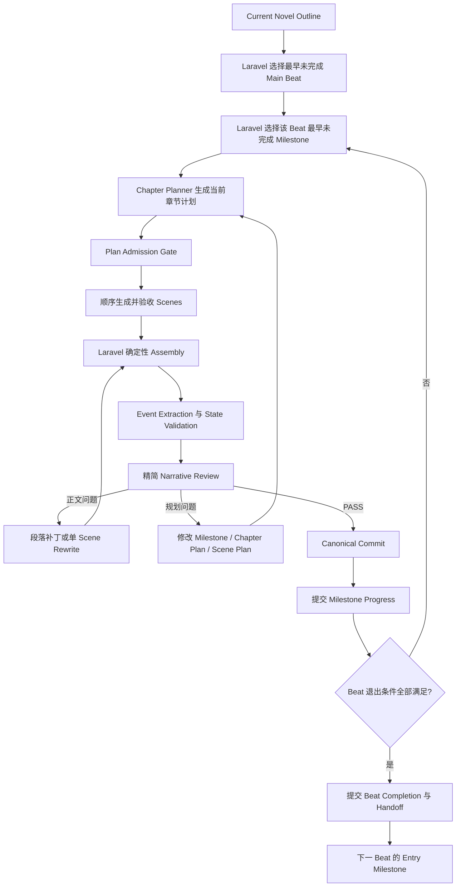
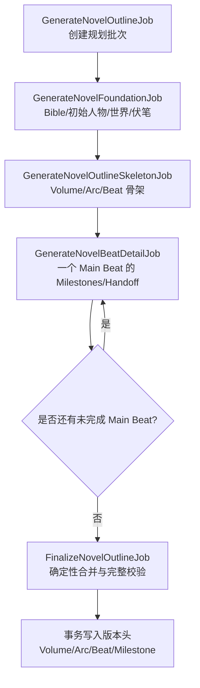
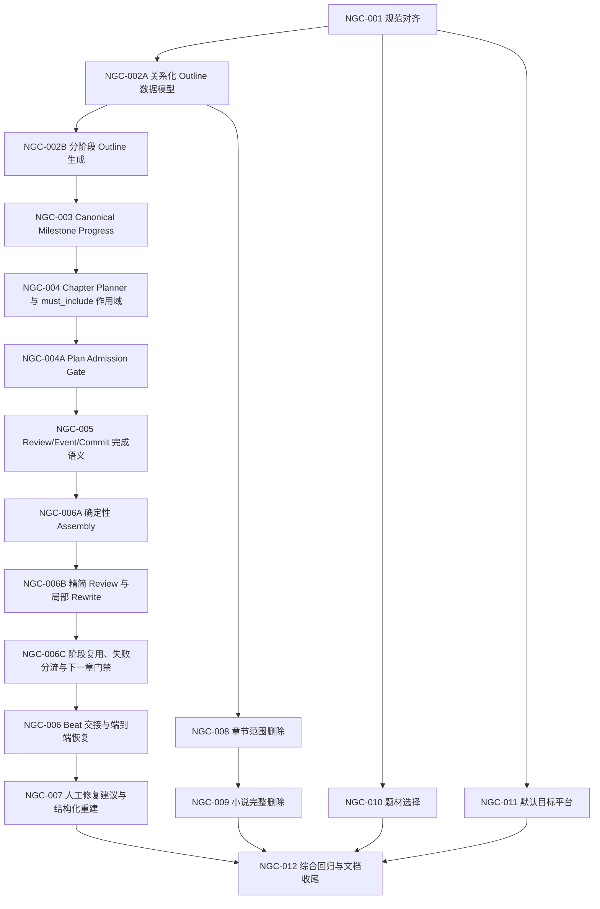

# 小说生成控制、人工修复与内容删除优化方案

> 日期：2026-09-26
> 状态：待实施
> 来源：当前项目长篇生成流程检查、EasyPay 章节生成代码对比、Beat/Milestone/Handoff 讨论，以及本轮新增的章节删除、小说删除、题材列表和默认目标平台需求
> 性质：可逐项实施的设计与任务文档；本文档不修改业务代码、不执行 Migration、不调用 AI Provider、不修改任何小说数据
> 关联文档：`docs/development/NOVEL_OUTLINE_CONTROL_ADJUSTMENT_PLAN.md`、`docs/PRD.md`、`docs/architecture/generation-pipeline.md`、`docs/architecture/story-engine.md`、`docs/architecture/data-model.md`

## 1. 目标

本轮优化解决七类问题：

1. 让宏观 Beat 能稳定拆成连续、可验证的中程 Milestone，避免每章重新解释同一个 Beat。
2. 让前后 Beat 通过明确 Handoff 自然交接，避免正文硬切或生成没有归属的“过渡章”。
3. 人工处理时先指出应该修改的大纲、Milestone、Chapter Plan、Scene Plan、事实或正文层级，并让下游状态随修改一起重建。
4. 为章节和小说提供可预览影响范围、事务化、无残留的删除功能。
5. 在现有字段和配置基础上增加可选题材列表，并让小说圣经的默认目标平台通过 `.env` 配置，默认选择番茄小说。
6. 把全书 Outline 完全量化为版本化 Volume、Arc、Beat、Milestone 关系表，并把生成拆成有界步骤，避免单次 AI 请求膨胀、JSONB 全树解析和空引用。
7. 借鉴 EasyPay 已实现且有测试用例覆盖的阶段指纹、局部恢复和确定性拼章机制，移除默认整章 Assembly/Rewrite 模型调用，缩小 Review 输出契约，降低截断、Coverage 漂移和无效重试。

优化后的最小主链：



## 2. 实施边界

### 2.1 保留现有架构

- 继续使用 Laravel 单体、PostgreSQL、Redis Queue 和 Filament。
- `novel_outlines` 只作为不可变 Outline Version 头，删除 `content`；完整结构由 `novel_outline_volumes`、`novel_outline_arcs`、`novel_outline_beats` 和 `novel_outline_milestones` 唯一表达。
- Handoff 与 Beat 一对一，保存在 `novel_outline_beats`，并通过 `handoff_next_beat_id` 自外键引用相邻 Main Beat，不新增独立 Handoff 表。
- 现有数据库数据全部视为可放弃数据；实施时采用干净数据库重建，不实现旧 Outline Backfill、旧 JSON Schema 兼容或历史引用迁移。
- Laravel 决定当前 Beat、Milestone 和下一阶段，LLM 只生成受约束的候选内容。
- Draft、Plan、Review 和 Rewrite 不得直接更新 Canonical Story State。
- 正式 Milestone/Beat 完成进度、Story Event、Fact、Memory 和 Canonical Story 投影只能在 Canonical Commit 后变化；关系化 Outline 定义创建后不可变，也不保存完成状态。
- 同一小说章节继续串行生成，不引入 Scene 并行或 Workflow Engine。
- 继续使用现有 `GenerationRun + GenerationArtifact + input_hash + source_artifact_id/checksum` 表达章节阶段，不照搬 EasyPay 的 Pipeline Run/Step 表。
- Chapter Assembly 默认由 Laravel 按已验收 Scene 顺序确定性拼接，不再调用 Provider 重写整章；衔接或长度问题回到最早受影响 Scene 做有界修复。
- Outline 规划继续使用现有 `generation` 队列，但拆成可恢复的 Foundation、Skeleton、Beat Detail 和 Finalize 阶段；每个调用 Provider 的 Job 最多执行一次模型请求。
- 章节预算仅用于观测和异常停留保护，不作为 Milestone 或 Beat 完成条件。

### 2.2 本轮明确不做

- 不预先生成整本小说全部章节的完整 Chapter Plan。
- 不把宏观 Beat 机械扩成与目标章节数一一对应的 Beat。
- 不保留 `novel_outlines.content`，也不在 `story_arcs.beats` 中保存第二份 Beat 定义。
- 不要求一次 AI 请求同时返回 Bible、人物、世界、完整 Outline、全部 Milestone 和全部 Handoff。
- 不单独新增一张 `novel_outline_handoffs` 表；只有出现一对多 Handoff 或独立生命周期的真实需求时再评估。
- 不保留新旧 Outline 双读、Key 回退、Backfill 或兼容分支；新流程的外键缺失必须在调用 Provider 前失败。
- 不允许 LLM 自行跳过、重排或删除 Main Beat/Milestone。
- 不通过提高 Token、增加 Retry 或强制凑章节数掩盖规划问题。
- 不允许人工只改正文，却继续复用已经失真的 Scene、Event Candidate、State Patch 或 Review。
- 不允许在中间删除一章后保留依赖它的后续正式章节。
- 不实时抓取外部小说平台分类；平台页面只作为初始配置参考。
- 不复制 EasyPay 的多租户、团队权限、多队列、A/B Scene 实验、发布流程或独立 Pipeline Step 数据模型。
- 不再把 AI 整章 Assembly 和 AI 整章 Rewrite 作为自动主路径，也不在 Assembly 失败后回退到同类整章请求。

### 2.3 数据重置前提

- 当前数据库中的 Novel、Outline、Chapter、Run、Artifact、Story Event、State、Memory 和 Usage 数据全部允许放弃。
- 实施阶段先完成代码与 Migration，再停止 Worker，并在明确的开发环境执行 `php artisan migrate:fresh`；本文档阶段不执行该命令。
- 因为只支持全新数据库，本轮直接把现有基线 Migration 改成最终 Schema，并删除其中只为旧字段回填数据的循环；不新增“先创建 `content`/`beats` 再立即删除”的过渡 Migration。
- 不编写 `novel_outlines.content`、`story_arcs.beats`、旧 `beat_key` 引用或已有 Canonical 数据的迁移脚本。
- 不保留旧 Schema 双读、旧字段回退或“迁移期间两套 Source of Truth”。
- 验收只针对空数据库中新建小说的完整生命周期；任何依赖旧数据仍可读取的测试都应删除或改写为新结构测试。
- 数据重置授权不等于允许忽略事务、外键和恢复设计；新流程产生的数据仍必须满足不可变版本、Canonical Commit 和幂等要求。

## 3. 已确认事实

### 3.1 当前流程的问题是规划粒度和推进语义

- Current Novel Outline 的正式层级是 Volume → Story Arc → Beat。
- Beat 已包含摘要、章节预算、验收条件、必须包含项和禁止项，可表达宏观剧情目标。
- `chapter_budget` 只提供章节数量范围，不能回答当前章节应推进什么、已经完成什么，以及下一阶段如何开始。
- 当前 Outline Schema 和推进解析器没有保存 Beat 内部的有序阶段目标，也没有保存相邻 Beat 之间的交接契约。

因此，长篇生成流程需要补充 Milestone 和 Handoff，而不是根据某一本小说的 Beat 数量或目标章节数制定专项规则。预算应在流程能够稳定推进后用于观测和异常保护，不能代替剧情完成判定。

### 3.2 当前 JSONB 读取、重复存储和引用方式没有增长边界

- `NovelOutline` 当前把 `content` 整体 Cast 为 PHP 数组；`OutlineProgressResolver::resolve()` 读取完整结构，再遍历 Volume、Arc 和 Beat。
- `ApplyNovelBlueprintAction` 又把 Arc 的 Beat 数组复制到 `story_arcs.beats`，同一 Beat 定义存在于两个 JSONB 来源中。
- 当前数据库没有 Beat Model 或 `beat_id` 外键；Chapter Plan 和 Story Event 依赖 JSONB 中的 `beat_key`，PostgreSQL 无法阻止空值、拼写错误或跨 Outline 引用。
- 当前本地样本不能证明 JSONB 解析已经是实际性能瓶颈；本方案改为关系化，主要是消除无界增长、双重 Source of Truth 和无法建立外键的结构性风险。
- `NovelPlanner::generate()` 当前一次请求同时生成 Bible、人物、世界实体、完整 Outline 和伏笔，`MAX_COMPLETION_TOKENS` 固定为 24,000。
- 当前运行记录中，已有规划请求在 8,000 Output Token 处被截断；成功记录最高使用 19,959 Output Token。继续把全部 Milestone/Handoff 加进同一个响应，会进一步压缩安全余量。
- `NovelPlanner::regenerateNode()` 当前发送完整 Outline，并要求返回完整 Outline；随着节点增长，局部修订的输入、输出和校验成本都会同步增长。

结论：不能把“当前样本已经很慢”当作已确认事实，但在加入 Milestone/Handoff 前必须取消 JSONB Outline Source of Truth。新流程以版本化关系表为唯一权威，以 Generation Artifact 保存原始模型输出和调试证据，并把全书规划拆成多个可恢复、可复用的有界阶段。

### 3.3 当前 Beat 推进缺少中间状态

- `OutlineProgressResolver::resolve()` 只选择最早未完成 Main Beat。
- `CurrentOutlineTarget` 只有 Beat、已完成 Beat Keys 和当前 Beat 已使用章节数，没有当前 Milestone、已完成 Milestone Keys、剩余目标或 Handoff。
- `ChapterPlanner::context()` 会传入 Story State、最近十章摘要、上一章结尾、人物、世界实体、事实和伏笔，但这些信息主要维持连续性，不能替代中程路线。
- `ChapterPlanner::applyOutlineContract()` 会把当前 Beat 全部 `must_include` 合并进每一章的 `must_reveal`，容易让同一约束在数十章内反复出现。
- `ChapterPlanPayload` 的每条 `arc_contributions` 只有一个 `acceptance_criteria` 字符串，不能表达该章具体推进哪个 Milestone、完成了哪些阶段条件以及还剩什么。
- `PlanValidator` 只把 `chapter_budget.max` 当作停止条件；预算不应被提升为剧情完成条件。

### 3.4 Beat 完成的文档和当前代码存在语义差异

- `docs/architecture/story-engine.md` 和 `docs/architecture/generation-pipeline.md` 已要求 Reviewer 对当前 Beat 的全部验收条件完成审计后，才能产生 `story_arc_beat_completed`。
- 当前 Chapter Plan 和 `PlanningReviewAudit` 仍按本章单条 Contribution/Acceptance Criteria 工作。
- `CanonicalCommitService` 能校验 Plan、Review 和 Event Candidate 的 Beat 标识与证据，但没有独立的 Milestone Progress 和 Handoff Readiness 判定。

实施前必须先把 PRD、Architecture、Schema 和代码统一到同一语义，不能只修改 Prompt。

### 3.5 现有章节连续性能力不能代替 Beat Handoff

- `previous_chapter_ending` 保存上一正式章末尾。
- `scene_plans[0].transition_from_previous` 要求说明时间、地点和行动如何承接。
- `PlanValidator` 会阻止存在上一正式章但第一 Scene 没有过渡说明的计划。

这些能力只能回答“下一章如何接着上一章写”，不能回答“前一 Beat 的什么结果导致后一 Beat 开始”。Beat Handoff 必须成为独立的规划契约。

### 3.6 当前人工修改正文不会同步修改计划和场景状态

`ManuallyReviseChapterAction::execute()` 当前行为是：

```text
人工替换正文
→ 创建新的 rewrite_draft Artifact
→ 重新执行 Event Extraction
→ State Patch
→ Review
```

它不会修改：

- Current Outline、Beat 或未来 Milestone；
- Chapter Plan；
- Scene Plan；
- 已生成 Scene 的结构化 goal/conflict/turn/outcome；
- 旧计划与新正文之间的语义关系。

因此人工把剧情方向直接改进正文后，系统仍可能按旧 Scene 和旧 Beat 契约校验，产生新的 Coverage、Review 或 Event 错误。

### 3.7 当前删除能力和数据库关系不足以满足需求

- 小说列表当前只有“进入工作台”和“编辑”，没有删除操作。
- 章节列表当前没有删除操作。
- 多数小说级表使用 `novel_id ... cascadeOnDelete()`。
- `story_events.chapter_id` 使用 `restrictOnDelete()`，直接删除正式章节会被数据库拒绝。
- `usage_records.novel_id`、`usage_records.chapter_id` 和 `usage_records.generation_run_id` 使用 `nullOnDelete()`，只依赖级联会留下失去归属的费用记录。
- `characters.source_chapter_id`、`world_entities.source_chapter_id` 使用 `nullOnDelete()`，直接删除章节不会删除由该章首次转正的对象。
- `story_state_versions.chapter_id`、`facts.source_event_id`、`foreshadowings.setup_chapter_id` 和 `payoff_chapter_id` 目前不是完整外键链，必须由领域 Action 显式处理。
- 现有 `LatestCanonicalChapterRollback` 只允许回滚最新正式章，并以失效 Event/Memory 为主，不等于用户要求的物理清除。

结论：删除功能必须使用领域 Action、事务、影响预览和删除后校验，不能直接在 Filament 中调用 `$record->delete()`。

### 3.8 当前题材和目标平台配置

- `novels.genre` 是必填字符串，创建表单使用自由文本 `TextInput`。
- `config/narrative.php` 已有细分 `subgenres` 和平台列表，不需要新增题材表。
- 当前平台选项已有通用网文、起点中文网、番茄小说、晋江文学城、七猫小说和其他。
- `ManageNovelBible::defaultStyleProfile()` 当前把目标平台硬编码为 `general`。
- `.env.example` 当前没有默认目标平台配置。

### 3.9 EasyPay 与 XNovel 章节生成对比

本次对比依据 `/Users/webb/Herd/EasyPay` 中的路由、Service、Job 和 Feature Test。`http://easypay.test/default/` 在当前执行环境中无法解析，桌面自动化运行时也不可用，因此以下结论是代码级流程对比，不是页面视觉或真实 Provider 运行对比。

| 维度 | EasyPay 已确认实现 | XNovel 当前实现 | 对 XNovel 的结论 |
|---|---|---|---|
| 下一章入口 | `NextChapterEligibilityService` 在预留章节前检查前章正式版本、质量审核、状态应用、Story Snapshot、既有失败、连续性和收束门禁。 | `GenerateNextChapterAction` 已检查暂停、Bible、Canonical State、Active Volume、前章 Summary、阻塞章节和并发 Run；`NovelGenerationReadiness` 另有 Outline/Arc 等准备度展示。 | 合并“展示用准备度”和“执行用前置检查”的规则来源，并补 Current Outline 的关系化 Target、Milestone/Handoff 与来源链校验，避免 UI 显示可生成但 Action 拒绝，或反向漂移。 |
| 正文前规划 | Task Card → Chapter Outline → Outline Review → Outline Repair；输入变化后只失效声明的下游步骤。 | `PlanChapterJob` 直接产出 Ready Plan，随后进入 Scene；完整规划语义审校主要发生在正文后的 Review。 | 不复制额外的默认 AI Outline Review；先增加无 Provider 的 Plan Admission Gate，把身份、顺序、引用、过渡、字数分配和上下文容量问题挡在 Scene 1 之前。真实数据证明仍有语义缺陷后，再单独评估一次小型规划审校。 |
| Scene 生成 | 按 Scene 顺序生成；前一 Scene 的 `closing_state` 进入下一 Scene；确定性连续性检查只重写受影响 Scene。 | 已按 sequence 串行生成，传入 Previous Scene Tail、Temporary State 和过渡约束；当前 Scene 及后续 Scene 支持级联重生成。 | 保留现有 Scene 表和级联恢复，在 Scene Artifact 中继续固化正文、自检、Coverage、状态增量、Checksum 和输入指纹。 |
| Chapter Assembly | `SceneGenerationPipelineService::assemble()` 不调用 AI，只按 sequence 拼接 Scene content，并保存 Scene IDs、hashes 和 assembly hash。现有 Feature Test 用例断言 Assembly 为 deterministic，且中断重试只重做失败 Scene。 | `ChapterAssembler` 把全部 Scene 正文再次发给模型，要求同时返回整章 content、Scene Coverage 和伏笔 Coverage；还可能再次调用模型做 Evidence Repair 与整章长度修复。 | 默认 Assembly 改为确定性拼接。当前整章模型调用同时重写正文和重建权威 Coverage，是 `assembly_output_truncated`、Evidence 漂移、Scene 顺序错误和重复费用的集中风险。 |
| Review / Revision | 确定性 Quality Gate 与模型审校分离；Revision 根据失败范围生成新版本；局部连续性问题只重写 Scene。 | 已有 `StateValidator`、长度检查、`PlanningReviewAudit`、`RewriteScopeResolver`，但单次 Review Schema 同时返回七维评分、七维摘要、多组规划/实体/伏笔审计、Findings 和推荐决策；整章 Rewrite 仍返回完整正文与全量 Coverage。 | 保留确定性规则和语义审校边界，删除重复输出；Laravel 决定身份、顺序和最终决策，模型只返回语义判断、短证据和 Findings。自动 Rewrite 只允许段落补丁或单 Scene 替换。 |
| 阶段复用 | 每个 Pipeline Step 有稳定 fingerprint、版本和显式 downstream 列表；相同输入复用，语义输入变化只失效相关下游。 | 多个 Stage 已按 `input_hash` 复用成功 Run/Artifact，`AdvanceChapterPipelineAction` 也检查 Scene checksum 和 Draft/Event/Patch/Review 来源，但规则散落在不同 Service 的 `startRun()` 与 Job 分支中。 | 不新增 Step 表；在现有 Run/Artifact 上统一阶段指纹字段、来源链和失效图，让所有 Job 使用同一规则。 |
| 失败分流 | Error Catalog 将 Provider 临时故障、配置、结构、领域、质量和永久数据错误分类；Retry Policy 为每类 Step 决定次数、退避和是否允许定向修复。 | `GenerationFailurePolicy` 已分类并记录错误，但重试上限、终止错误数组和恢复分支仍有一部分分散在 Job/Service 中。 | 扩展现有 Policy，不创建第二套错误系统；Queue 只重试临时技术故障，结构/业务错误进入对应修复阶段，代码缺陷立即停止。 |
| 正式状态边界 | 正式版本、审校、状态提取/应用、Snapshot 完成后才允许下一章。 | Review PASS 后仍通过 `CanonicalCommitService` 才更新正式状态；Summary 缺失会阻止下一章，Memory/Embedding 可独立恢复。 | 保留 XNovel 的 Canonical Commit 边界；下一章必须等待 Commit 与 Summary，但不等待 Embedding，避免把非关键派生任务变成主链阻塞点。 |

EasyPay 也存在 XNovel 不应照搬的复杂度：多租户与 Team Ownership、多套队列、A/B Scene 分流、发布状态、Pipeline Run/Step 新表，以及仍然较大的兼容 Job。XNovel 的目标是把其中经过测试证明有效的“输入指纹、精确失效、局部修复、确定性拼章、下一章门禁”映射到现有模型，而不是复制项目结构。

## 4. 设计决定

### 4.1 Beat、Milestone 和 Chapter 的职责

```text
Beat
定义一段宏观剧情为什么存在、最终必须改变什么。

Milestone
定义 Beat 内有顺序的阶段目标、冲突升级、转折和退出条件。

Chapter Plan
选择当前 Milestone 中本章可以完成的有限任务，并拆为 Scenes。

Scene Plan
定义本场的 goal、conflict、turn、outcome 和上下场衔接。
```

推荐的 Beat 结构：

```json
{
  "key": "beat-020",
  "sequence": 20,
  "title": "宏观节点标题",
  "summary": "宏观剧情目标",
  "chapter_budget": {"min": 1, "max": 40},
  "acceptance_criteria": ["Beat 最终退出条件"],
  "must_include": ["整个 Beat 生命周期内至少出现一次的内容"],
  "must_not_include": ["整个 Beat 期间始终禁止的内容"],
  "milestones": [
    {
      "key": "beat-020-m01",
      "sequence": 1,
      "title": "进入",
      "objective": "本阶段要改变什么",
      "acceptance_criteria": ["可由正式正文证明的阶段结果"],
      "must_include": [],
      "must_not_include": []
    }
  ],
  "handoff": {
    "next_beat_key": "beat-021",
    "transition_mode": "causal",
    "exit_result": "前一 Beat 结束时已经成立的结果",
    "next_trigger": "启动下一 Beat 的直接原因",
    "carried_states": [],
    "open_threads": [],
    "required_transition": [],
    "forbidden_jump": []
  }
}
```

`chapter_budget` 继续作为 Beat 规模与异常停留配置，但含义限定为：

- `max`：异常停留保护；达到后转 `NEEDS_ATTENTION`。
- `min`：规模提示和偏差观测，不阻止剧情自然完成。
- Beat/Milestone 是否完成只由 Canonical 证据和退出条件决定。

首版 Milestone 和 Handoff 只控制 Main Arc 中按 `mainline_sequence` 排列的 Main Beat。每个 Main Beat 至少一个 Milestone；除全书最后一个 Main Beat 外必须有一个指向下一 Main Beat 的 Handoff。Subplot 继续通过 Arc Completion Conditions 和 Chapter Plan 的次要 Contribution 推进，不创建独立 Milestone Completion；这避免同时引入两套主进度游标。后续若真实生成数据证明 Subplot 也需要独立中程游标，再单独扩展。

上面的 JSON 只表示 Provider Artifact 和内存 DTO 的交换格式。Provider 在数据库记录创建前只能返回稳定 Key，不能生成或猜测数据库 ID。`FinalizeNovelOutlineJob` 必须由 Laravel 按父子关系和稳定 Key 解析全部引用，再写入非空外键；Key 缺失、重复或无法唯一解析时整批失败。

### 4.2 关系化 Outline 是唯一 Source of Truth

`novel_outlines` 只保存版本头和全局约束，不再保存 `content`：

```text
novel_outlines
  id / novel_id / version
  status / source / schema_version
  title / summary
  must_include / must_not_include
  checksum
  source_artifact_id nullable
  based_on_outline_id nullable
  created_by nullable / applied_at
```

完整规划层级由四张版本化关系表表达：

```text
novel_outline_volumes
  id / novel_outline_id
  volume_key / sequence
  title / goal / climax / target_words

novel_outline_arcs
  id / novel_outline_id / novel_outline_volume_id
  arc_key / sequence / mainline_sequence nullable
  type / title / goal / stakes
  completion_conditions

novel_outline_beats
  id / novel_outline_id / novel_outline_arc_id
  beat_key / sequence / mainline_sequence nullable
  title / summary
  chapter_budget_min / chapter_budget_max nullable
  acceptance_criteria / must_include / must_not_include
  character_candidates / world_entity_candidates
  handoff_next_beat_id nullable self FK
  handoff_transition_mode
  handoff_exit_result / handoff_next_trigger
  handoff_carried_states / handoff_open_threads
  handoff_required_transition / handoff_forbidden_jump

novel_outline_milestones
  id / novel_outline_id / novel_outline_beat_id
  milestone_key / sequence
  title / objective
  acceptance_criteria / must_include / must_not_include
```

`title`、`summary` 使用普通列；低频、无独立身份且只整体验收的字符串列表继续使用 JSONB。这样保留 PostgreSQL 约束能力，同时避免为了数组项建立无价值小表。

数据库约束：

- 所有四层子表都使用 `foreignId(...)->constrained()->cascadeOnDelete()` 归属不可变 Outline Version，并为需要被下游引用的完整父链增加组合唯一键，作为组合外键目标。
- Arc 的 `(novel_outline_volume_id, novel_outline_id)` 必须组合引用同一版本的 Volume；Beat 的 `(novel_outline_arc_id, novel_outline_id)` 必须组合引用同一版本的 Arc；Milestone 的 `(novel_outline_beat_id, novel_outline_id)` 必须组合引用同一版本的 Beat。数据库层直接阻止父子节点跨 Outline Version 串联。
- Volume 和 Arc 分别提供 `(id, novel_outline_id)` 唯一键；Beat 提供 `(id, novel_outline_arc_id, novel_outline_id)` 唯一键；Milestone 提供 `(id, novel_outline_beat_id, novel_outline_id)` 唯一键。Chapter Plan 和 Completion Event 必须引用这些完整父链，不能分别引用几个“各自合法但互不匹配”的节点。
- Volume 对 `(novel_outline_id, volume_key)` 和 `(novel_outline_id, sequence)` 唯一。
- Arc 对 `(novel_outline_id, arc_key)` 和 `(novel_outline_volume_id, sequence)` 唯一；Main Arc 的 `mainline_sequence` 在同一 Outline 内唯一。
- Beat 对 `(novel_outline_id, beat_key)`、`(novel_outline_arc_id, sequence)` 唯一；Main Beat 的 `mainline_sequence` 在同一 Outline 内唯一。
- Milestone 对 `(novel_outline_id, milestone_key)` 和 `(novel_outline_beat_id, sequence)` 唯一。
- 为 Current Target 查询建立 `(novel_outline_id, mainline_sequence)` 的 Main Arc/Main Beat Partial Index、`(novel_outline_beat_id, sequence)` Milestone 索引，以及 Active Completion Event 的 Outline/Beat/Milestone 索引；章节规划不得为取得当前节点加载整套关系树。
- `NormalizedNovelOutlineValidator` 要求 Milestone 只属于 Main Beat，且每个 Main Beat 至少一个；Chapter Plan 的 Primary Arc/Beat/Milestone 也只能引用当前 Mainline 链。Subplot 只能出现在次要 Contribution 中。
- `chapter_budget_min >= 1`，`chapter_budget_max` 为空或不小于最小值。
- `(handoff_next_beat_id, novel_outline_id)` 使用组合自外键，确保目标 Beat 属于同一 Outline Version；相邻 Main Beat 规则和“最后一个 Main Beat 必须为空”由 `NormalizedNovelOutlineValidator` 在事务提交前校验。
- `source_artifact_id` 只允许引用当前小说规划批次产生的最终 `outline_blueprint` Artifact；`source=ai` 时必须非空，手工创建允许为空。Artifact 类型和小说归属由 Action 在事务内校验。
- 非空 `source_artifact_id` 建立唯一索引并使用限制删除；同一个 Finalize Artifact 最多创建一个 Outline Version，重复 Job 必须返回已有版本。完整小说删除先删除 Outline Version，再删除其规划 Run/Artifact。
- Outline 头删除时四层定义表内部使用级联；运行态 Volume/Arc、Chapter Plan 和 Story Event 对 Outline 节点使用限制删除，防止误删已被正式流程引用的定义。完整小说删除必须先按依赖顺序删除这些外部引用，再删除 Outline 头。

Source of Truth 边界：

- `novel_outline_*` 表保存“规划定义是什么”，创建版本后不可原地修改。
- `story_events` 保存“哪些 Milestone/Beat 已经正式完成”，不得把完成状态写回 Outline 表。
- `volumes` 和 `story_arcs` 保存当前小说的运行状态；采用 Outline 时从版本化定义创建，并分别保存非空且唯一的 `source_outline_volume_id`、`source_outline_arc_id`。两个来源外键使用限制删除，不能因误删定义而级联清除运行状态。
- `story_arcs.beats`、`volumes.outline_key` 和 `story_arcs.outline_key` 从新流程删除，避免出现第三份 Beat/Arc 来源。
- Generation Artifact 保存 Provider 原始结构化输出和阶段证据，但不是可供章节规划读取的 Outline Source of Truth。
- 旧 `baseline_completions` 是历史数据迁移专用结构；本轮从 Schema、DTO 和 Validator 中删除。空数据库中新建 Outline 的完成进度只能从零开始，并由 Canonical Completion Event 产生。

Checksum 规则：

- `NovelOutlineChecksum` 按 `Volume.sequence → Arc.sequence → Beat.sequence → Milestone.sequence` 加载关系数据并构造稳定 DTO。
- Checksum 包含业务字段和 Handoff 的目标 `beat_key`，不包含数据库自增 ID、时间戳、状态、运行进度或 Eloquent 序列化细节。
- Chapter Plan 冻结 `novel_outline_id + checksum + arc_id + beat_id + milestone_id`；任一引用不匹配时在 Provider 请求前失败。

版本创建事务：

```text
验证完整 DTO
→ 从稳定 DTO 计算 checksum
→ 创建 novel_outlines 版本头
→ 创建 Volumes
→ 创建 Arcs
→ 创建 Beats（先不写 Handoff 自外键）
→ 创建 Milestones
→ 根据稳定 beat_key 回填 handoff_next_beat_id
→ 校验完整 FK 链、顺序和邻接
→ 从已持久化关系重新计算并核对 checksum
→ COMMIT
```

所有步骤位于同一事务；版本头创建时即写入最终 Checksum，Beat 暂时为空的 Handoff 自外键不会对其他事务可见。任何节点失败都回滚整个 Outline Version。新版本创建完成后，Model Guard 禁止修改版本头业务字段和全部子节点；修订必须创建一套新的关系记录。

### 4.3 Outline 分阶段生成与恢复

新建小说的规划不能继续依赖一个 Job 内的一次超大模型响应。推荐流程：



各阶段边界：

1. `GenerateNovelOutlineJob` 只创建或恢复规划批次并派发下一阶段，不直接完成全部认知任务。
2. Foundation 只生成 Bible、Ending Contract、初始人物、初始世界实体和伏笔候选，不生成完整剧情树；结果只保存为不可变 Artifact，不提前写入 `novel_bibles`、`characters`、`world_entities` 或 `foreshadowings`。
3. Skeleton 只生成 Volume → Arc → Beat 的稳定 key、顺序、目标、预算和宏观退出条件，不生成 Milestone/Handoff。
4. Beat Detail 每次只处理一个 Main Beat，并读取全书约束、当前 Beat、前后相邻 Beat 摘要；输出当前 Beat 的 Milestones 和指向下一 Main Beat 的 Handoff。最后一个 Beat 的下一目标必须为空。
5. Finalize 不调用 Provider。它按 Skeleton 顺序收集全部成功 Artifact，构造规范化 DTO，执行完整引用、顺序、邻接、预算和 Schema 校验，再在同一事务内创建 Draft Outline Version 头及四层关系记录。
6. Skeleton 和 Beat Detail 只输出稳定 Key；Finalize 用 Skeleton 中的唯一 Key 映射数据库 ID。任何模型输出的伪造 ID 都被忽略，任何无法解析的 Key 都使 Finalize 回滚，不能以 `null` 继续。

可靠性规则：

- `GenerateNovelOutlineJob` 创建一个 `scope_type=novel_outline_batch` 的主 Generation Run，并在 Context Snapshot 冻结输入、Provider、Model、Reasoning Effort 和各阶段 Prompt Version；子阶段 Run 通过 `scope_id=主 Run ID` 归入同一批次。
- 子阶段 `scope_type` 固定为 `novel_outline_foundation`、`novel_outline_skeleton`、`novel_outline_beat_detail` 和 `novel_outline_finalize`；继续复用 `GenerationStage::ChapterPlanning`，不为同一业务阶段扩张 Stage Enum。
- Artifact Type 明确增加 `outline_foundation`、`outline_skeleton`、`outline_beat_detail` 和 `outline_blueprint`，避免依赖 `context.data` 内的隐式字符串判断阶段。
- 最终 `outline_blueprint` Artifact 保存所采用的 Foundation、Skeleton、全部 Beat Detail Artifact ID 与 Checksum；Apply 沿这些不可变引用校验它们属于同一小说、同一主 Run 批次，不能按“最新 Artifact”猜测来源。
- 每个 Provider Job 只发出一次模型请求；技术重试由 Queue 重新执行同一阶段，不在一个 Job 中循环调用。
- 每阶段都创建独立 Generation Run 和不可变 Artifact；Foundation、Skeleton、每个 Beat Detail 都有独立 `input_hash` 和幂等键。
- 重复投递先查找相同输入的成功 Artifact；命中后直接进入下一阶段，不再次调用 Provider。
- 某个 Beat Detail 失败时只重试该 Beat，不重做 Foundation、Skeleton 或已经成功的其他 Beat。
- 如果 Provider 已接受请求但 Worker 在保存 Artifact 前崩溃，系统不能伪称已经实现外部请求 Exactly-once：供应商明确支持幂等键或按 Request ID 查询时才自动对账；否则只允许重试当前阶段，并在 Run 中记录 `provider_outcome_unknown`，最终 Outline 的数据库写入仍必须保持幂等。
- Pause 后不得派发新阶段；已经返回的结果可以保存为 Artifact，但 Finalize 和采用必须停止。
- Worker Crash 后由数据库中的 Run/Artifact 判断缺失阶段并恢复，不能只依赖 Redis 中是否还有 Job。
- 任一阶段输出截断、Schema 无效或引用不一致时，不得创建任何 Draft Outline 关系记录。
- Foundation、Skeleton 或 Beat Detail 失败时不得留下正式 Bible、人物、世界、伏笔、运行态 Volume/Arc 或 Current Outline 指针；这些数据统一延迟到 Apply 事务。
- 局部重新生成只返回目标 Beat 或 Milestone 的替换片段，Laravel 将基础版本加载为 DTO、替换通过校验的片段，然后创建完整的新关系化 Outline Version；不再要求模型返回整份 Outline。

首版仍使用 `generation` 队列，不增加 Queue 类型，也不引入工作流引擎。拆分的是持久化阶段和失败边界，不改变 Laravel 对流程的控制权。

### 4.4 Milestone Progress

Milestone 必须按顺序推进。Laravel 选择当前 Beat 内最早未完成 Milestone，LLM 不能选择后续 Milestone。

新增一个正式事件类型：

```text
story_arc_beat_milestone_completed
```

Payload 至少包含：

```text
beat_key
milestone_key
milestone_sequence
```

使用现有 `story_events` 表，不新增表。PostgreSQL 的 `story_events_type_check` 必须通过新 Migration 安全扩展，不能只改 PHP Enum。

Beat Completion 条件：

```text
全部 Milestone 已有 Active Canonical Completion Event
+
Beat 全部 acceptance_criteria 有 Canonical 正文证据
+
最终 Milestone 的 Handoff 已满足
=
允许 story_arc_beat_completed
```

一章可以完成当前 Milestone，也可以在最后一个 Milestone 中完成 Beat；不要求每章都完成 Milestone。

### 4.5 相邻 Beat 的 Handoff

系统状态允许在相邻章节切换 Beat，正文必须通过 Handoff 保持因果连续：

```text
第 X 章
Primary Beat = 020
Primary Milestone = 020 最后一个 Milestone
完成 Beat 020 的核心结果
建立 Beat 021 的 next_trigger
不得提前完成 Beat 021 Milestone
        ↓ Canonical Commit
Beat 020 完成并冻结 Handoff 证据
        ↓
第 X+1 章
Primary Beat = 021
Primary Milestone = 021 第一个 Milestone
读取上一章结尾、Canonical State 和 Handoff
承接后果并建立新目标
```

首版保持“一章一个 Main Primary Beat”。前一 Beat 最后一章可以铺设下一 Beat 的触发条件，但后一 Beat 的正式 Milestone Progress 从下一章开始。这样可以复用当前顺序控制，避免一章同时结算两个 Main Beat。

需要较长过渡时，不建立无归属的“过渡章”：

- 仍在处理前一事件后果：归入前一 Beat 的最终 Milestone。
- 已开始追求下一目标：归入后一 Beat 的 Entry Milestone。
- 每章仍必须有明确的 goal、conflict、turn 和 outcome。

### 4.6 `must_include` 的作用域

当前把 Beat 全部 `must_include` 注入每章 `must_reveal` 的行为必须调整：

- Beat `must_include` 表示在 Beat 完成前至少一次有 Canonical 证据。
- Milestone `must_include` 表示在该 Milestone 完成前至少一次有 Canonical 证据。
- Chapter `must_reveal` 只包含本章实际承担的项目。
- 已经由前序 Canonical Chapter 满足的内容不能继续强制每章重复。
- `must_not_include` 可以继续作为整个 Beat/Milestone 期间的持续禁止约束。

### 4.7 人工干预分层

系统必须先给出“修改什么”和“修改后会重跑什么”，不能默认让用户改正文。

| 问题来源 | 推荐操作 | 禁止的捷径 |
|---|---|---|
| Beat/Milestone 目标错误 | 修订未来 Outline Version 或当前未提交 Milestone | 直接把正文改成另一个剧情方向 |
| Chapter Plan 选错目标 | 创建新 Plan Version，并从第一受影响 Scene 重建 | 保留旧 Scenes 只改正文 |
| Scene goal/conflict/turn/outcome 错误 | 编辑 Scene Plan 后从该 Scene 级联重新生成 | 让 Rewrite 改变关键剧情结果 |
| Canonical Fact/State 错误 | 使用 Manual Canonical Correction 或先回滚最新正式章 | 在 Draft 正文中假装事实已改变 |
| 局部措辞、节奏、重复、文风问题 | 自动 Rewrite 或人工正文修订 | 修改 Outline 和 Canonical State |
| Beat/Milestone Completion 误判 | 重新审计进度证据或重启当前章来源链 | 人工篡改 Progress 数值 |

人工操作页面至少显示：

```text
问题层级
确认事实与证据
推荐修改字段
修改入口
受影响 Scenes / Artifacts / Events / State Patch / Review
执行后的自动恢复路径
```

若用户修改 Chapter Plan 或 Scene Plan：

```text
保存新的不可变 Plan Version
→ 失效当前下游 Draft 链
→ 重置第一受影响 Scene 及其后续 Scene
→ 重新生成/组装
→ 重新提取 Event
→ 重建 State Patch
→ 重新 Review
```

只有不改变计划结果和正式事实的局部文字问题，才进入现有 `ManuallyReviseChapterAction`。

### 4.8 章节删除语义

小说是顺序 Canonical 链。删除中间章节而保留后续章节会造成 State Version、Story Event、人物知识、地点状态、伏笔和 Memory 失去来源。

为满足“简单、可靠、不引入新异常”，首版定义为：

> 删除第 N 章 = 删除第 N 章及所有 sequence >= N 的章节和派生数据。

UI 必须使用“从本章起删除”描述真实行为，不能只显示“删除本章”。如果第 N 章本来就是最后一章，实际只删除该章。

删除前置条件：

- 小说必须先暂停生成。
- 小说不能存在 `queued` 或 `running` Generation Run。
- 必须输入删除原因。
- 必须预览将删除的章节范围和记录数量。
- 若所选范围包含 Canonical Chapter，必须额外输入确认文本。

事务内处理顺序：

```text
锁定 Novel
→ 再次确认暂停和无活跃 Run
→ 锁定 sequence >= N 的 Chapters
→ 将 Novel Canonical 指针恢复到 N-1 对应 State Version
→ 恢复被删除范围取代的旧 Facts
→ 删除被删除范围产生的 Facts
→ 删除相关 Story Events
→ 删除相关 Memories / Embeddings
→ 删除由被删除范围首次转正的 Characters / World Entities
→ 重新投影 Foreshadowing 状态、setup/payoff chapter、reinforce_count
→ 删除 Reviews / Artifacts / Runs / Usage Records
→ 删除 Scenes / Chapter Plans / State Versions / Chapters
→ 更新 Novel current_chapter_sequence 与状态
→ 从剩余 Canonical Events 重算 Arc/Milestone Progress
→ 提交事务
```

“相关伏笔全部清除”按来源解释：

- Outline/Bible 中原本存在的伏笔定义保留。
- 被删除章节产生的伏笔事件、Memory、setup/payoff 指针和强化次数清除或重算。
- 如果未来支持由章节首次创建伏笔，则只有 `source_chapter_id` 位于删除范围内的定义才物理删除。

该边界避免误删全书早期已经存在、只是曾在删除章节中被强化的伏笔定义。

删除必须有幂等结果：相同操作重复提交时，目标章节不存在则返回 `already_deleted`，不能继续删除其他范围。

### 4.9 小说删除语义

删除小说是完整物理删除：

- Novel、Bible、Outline、Volume、Arc、Chapter、Plan、Scene；
- Character、World Entity、Foreshadowing、Fact；
- Story Event、Story State Version；
- Generation Run、Artifact、Review、Usage Record；
- Memory 和 Embedding；
- 只属于该小说的派生数据。

删除前必须：

- 暂停小说；
- 确认没有 queued/running Run；
- 输入小说完整标题；
- 展示各表影响数量；
- 在一个事务中按依赖顺序删除；
- 删除后校验所有 `novel_id`、Chapter/Run 间接引用和 Usage 均为零。

日志只记录删除操作的小说 ID、标题、执行人、原因和各类数量，不保存被删除正文、Prompt、密钥或完整业务数据。

### 4.10 创建小说的题材列表

外部分类参考：

- 2026-09-26 核对番茄小说官网：首页作品类型会随内容动态出现，例如快穿、豪门总裁、都市高武、古风世情、动漫衍生、种田、历史古代和都市脑洞；该页面不提供稳定的完整分类契约，因此只作为命名参考：<https://fanqienovel.com/>
- 2026-09-26 核对七猫小说官网：男频一级分类包含历史、军事、科幻、游戏、玄幻奇幻、都市、奇闻异事、武侠仙侠、体育、N次元和现实题材：<https://www.qimao.com/shuku/0-a-a-a-a-a-a-click-1/>
- 2026-09-26 核对七猫小说官网：女频一级分类包含现代言情、古代言情、幻想言情、游戏竞技、衍生言情和现实主义：<https://www.qimao.com/shuku/1-a-a-a-a-a-a-click-1/>

项目不照搬任一平台的动态分类，使用稳定的一级题材列表：

```text
玄幻奇幻
武侠仙侠
都市
历史
军事谍战
科幻末世
悬疑灵异
游戏竞技
体育
现实题材
现代言情
古代言情
幻想言情
青春校园
N次元/衍生
其他
```

实现原则：

- 在 `config/narrative.php` 增加 `genres`，不新增数据库表或 Enum。
- `novels.genre` 继续保存字符串，让标准选项和自定义题材使用同一持久化字段。
- `NovelForm` 把 `TextInput` 改为可搜索 `Select`。
- 选择“其他”时显示自定义题材输入；编辑自定义题材时把当前值显示为可编辑选项。
- `subgenres` 继续承担东方玄幻、历史脑洞、赛博朋克、宫廷宅斗等细分定位，不与一级 `genre` 重复建模。
- 分类更新只修改配置和测试，不依赖外部平台运行时可用性。

### 4.11 默认目标平台

在 `config/narrative.php` 增加：

```php
'default_platform' => env('NARRATIVE_DEFAULT_TARGET_PLATFORM', 'fanqie'),
```

在 `.env.example` 增加：

```dotenv
# 新建小说圣经时的默认目标平台，必须是 config/narrative.php platforms 中的 key
NARRATIVE_DEFAULT_TARGET_PLATFORM=fanqie
```

默认值只影响：

- 新建小说时生成的初始 Blueprint/Bible；
- 没有 Current Bible 时手工创建首个 Bible Version 的表单默认值。

它不修改已有 Bible Version，也不覆盖用户明确选择的平台。

如果 `.env` 值不在 `platforms` 中：

- 准备度检查显示明确配置错误；
- 在调用 AI Provider 前停止；
- 不静默改成其他平台；
- Filament 表单仍允许用户选择有效平台修复。

### 4.12 全流程可靠性闭环

关系化 Outline 只能解决规划身份和读取边界，不能单独消除所有 Job 失败。新流程必须统一执行“调用前准备度检查 → 单次 Provider 调用 → DTO/Schema 校验 → 确定性契约覆盖 → 业务校验 → 不可变 Artifact → 下一阶段”顺序，不能让各 Job 自行发明重试和修复规则。

调用前准备度检查至少验证：

- Novel 未暂停、目标记录仍存在，Current Outline、Checksum 和整条 Arc/Beat/Milestone 外键链有效；
- 上游 Artifact 类型、Checksum、Input Hash 和来源 Run 完整，不能按“最新一条”猜测输入；
- Provider、Model、Reasoning Effort 和 Prompt Version 来自冻结 Run Snapshot，创建请求时不能重新读取动态路由；
- 根据任务目标长度、结构化字段开销和已记录用量估算输出预算；若模型上限无法容纳，必须在调用前拆分任务，不能等截断后重复碰运气；
- 同一幂等键已有成功 Artifact 时直接复用，不再发送 Provider 请求。

失败分类和处理：

| 失败类型 | 处理规则 |
|---|---|
| Timeout、429、Provider 5xx、临时网络错误 | 只重试当前阶段，复用冻结配置和上游 Artifact；达到配置上限后停止，不重做已成功阶段。 |
| `*_output_truncated` | 不保存半截产物；先检查任务是否越过模型输出上限。可容纳时按冻结输入重试当前阶段；不可容纳或重复截断时改为更小的 Scene/段落/单 Beat 阶段，不通过无限增加 Retry 解决。 |
| `*_schema_invalid`、Coverage/顺序/ID 不一致 | Laravel 从冻结 Plan/Outline 恢复权威 ID、顺序和 Coverage；模型缺少实际内容时只重做对应认知阶段，不能用同一无效响应继续下游。 |
| Evidence、Planning、State 等业务校验失败 | 返回产生问题的 Plan、Scene、Rewrite 或 Event Extraction 阶段；不作为 Queue 技术异常原样重试。 |
| 数组键缺失、TypeError、未捕获异常 | 视为代码缺陷并立即失败；所有 Provider 数据先转为经过验证的 DTO 后才能访问，不用 `isset` 回退掩盖必填字段缺失。 |
| `provider_run_mismatch` | 在发出请求前失败并报告冻结值与解析值；Provider 实例只能由 Run Snapshot 创建，不能在 Job 重试时重新路由。 |

Assembly、Review 和 Rewrite 继续各自保存不可变 Artifact，但只有 Review 和局部 Rewrite 默认调用 Provider。Assembly 是可追踪的确定性阶段；跨 Scene 的结构问题返回 Plan/Scene 结构修复，不再自动请求模型重写整章。任何重试都必须保持原始失败证据和 `ai_request_log_id`，新的下游阶段只能引用最终通过校验的 Artifact。

### 4.13 借鉴 EasyPay 后的章节生成简化方案

#### 4.13.1 目标阶段

| 阶段 | 是否调用 Provider | 权威输入 | 输出 | 失败后返回位置 |
|---|---:|---|---|---|
| 下一章准备度 | 否 | Novel、Current Outline Target、Canonical State、上一 Canonical Chapter、Summary、Active Run | 可执行或带修复入口的阻断原因 | 原数据或派生任务 |
| Chapter Planning | 是 | 当前 Beat/Milestone/Handoff、State、Bible、Facts、近期 Summary | 不可变 Chapter Plan | Chapter Planning |
| Plan Admission Gate | 否 | Chapter Plan、关系化 Outline、冻结 Context/Route | Ready Plan 或字段级错误 | Chapter Planning/人工修正 |
| Scene Generation | 是，每个 Scene 一次 | Ready Plan、上一 Scene Artifact、剩余字数预算 | 不可变 Scene Draft | 当前或最早受影响 Scene |
| Deterministic Assembly | 否 | 按 sequence 排序的当前 Scene Artifacts | Chapter Draft、聚合 Coverage、lineage/checksum | Scene Generation |
| Event Extraction | 是 | 当前 Chapter Draft、冻结契约 | Event Candidate | Event Extraction 或 Scene 修复 |
| State Patch / Validation | 否 | Event Candidate、Current State、Locked Facts | State Patch 与确定性 Findings | Event/Plan/人工处理 |
| Compact Narrative Review | 是 | 当前 Draft、确定性 Findings、需要语义判断的契约 | 分数、语义审计、可执行 Findings | Review 或局部 Rewrite |
| Paragraph/Scene Rewrite | 是，每个局部任务一次 | 当前 Artifact、同一批 Findings、冻结 Plan | 新 Paragraph Patch 或 Scene Draft | Deterministic Assembly |
| Canonical Commit | 否 | PASS Review、当前 Draft/Event/Patch、Expected State Version | Canonical Chapter 与新 State Version | Commit 恢复 |
| Summary / Memory / Projection | 按任务决定 | Canonical Artifact/Event | 可恢复的派生数据 | 对应派生任务 |

每个调用 Provider 的 Job 只发出一次认知请求。证据修复、Schema 修复和局部 Rewrite 是有独立输入指纹的子阶段，不在同一个 Job 内用循环连续请求模型。Laravel 根据 PostgreSQL 中的成功 Artifact 推进下一阶段；Worker Crash 后从最后一个成功 Artifact 继续。

#### 4.13.2 Plan Admission Gate

EasyPay 在正文前执行 Outline Review，但 XNovel 首版不增加一个默认 AI Reviewer。现有 `PlanValidator`、Current Outline Target 和关系表足以先确定性验证：

- Plan 的 Outline Version、Arc、Beat、Milestone 全部属于当前小说和同一 Current Outline；
- Primary Target 等于 Laravel 选择的最早未完成 Milestone，模型不能跳步；
- Scene sequence 连续且至少一个，首 Scene 有 `transition_from_previous`，相邻 Scene 的状态衔接要求完整；
- Scene 的 goal/conflict/turn/outcome、允许/禁止结果、伏笔动作和实体候选均能解析到冻结契约；
- Scene 字数分配之和能覆盖章节硬下限，且每个 Scene 输出规模能被当前 Writer 模型容纳；
- Provider、Model、Reasoning Effort、Prompt Version、Bible Version、State Version 和 Outline checksum 已冻结；
- 相同 Plan 输入已有成功 Artifact 时直接复用，输入变化时失效该 Plan 对应的 Scene 及全部下游当前指针。

Gate 失败时不得生成 Scene 1。结构字段可由 Laravel 从权威关系恢复；真正缺失的剧情意图返回 Chapter Planning 重做。只有生产数据证明“结构全部合法但计划语义仍频繁失败”后，才考虑增加独立、短输出的 Plan Semantic Review，不能预先把 EasyPay 的完整 Outline Review 循环照搬过来。

#### 4.13.3 Deterministic Assembly

`ChapterAssembler` 保留为章节阶段边界，但不再调用 `AiProvider`。它在事务外计算候选结果，在持有 Chapter 行锁的短事务内复核 State Version 和 Scene checksum 后保存 Artifact：

1. 按 Scene sequence 读取当前 `scene_draft`/局部 `rewrite_draft`；任何缺失、跨章、状态不正确或 checksum 变化都停止。
2. 对每个 Scene content 执行 `trim`，以固定的两个换行连接；不改写字句、不新增桥段、不删除内容。
3. `scene_coverage` 由各 Scene Artifact 已通过校验的 `self_check` 聚合；`scene_id`、sequence、goal/conflict/turn/outcome 的身份和顺序由 Laravel 从 Plan/Scene 恢复。
4. `foreshadowing_coverage` 从目标 Scene Artifact 按冻结契约聚合；模型不能在 Assembly 阶段重新判定或提升状态。
5. 保存 ordered Scene IDs、Artifact IDs、checksums、assembly algorithm version、assembly hash、字数和聚合 Findings。
6. `introduced_major_facts` 在 Assembly 不由模型声明；实际新增事实继续由 Event Extraction、State Validation 和 Review 判断。

Scene Writer 已读取上一 Scene Tail、Temporary State 和 `transition_from_previous`，因此文字衔接应在后一 Scene 内完成。确定性连续性检查发现开场承接、地点、时间或状态错误时，从最早违规 Scene 开始局部 Rewrite/级联重生成，再重新执行无 Provider 的 Assembly。系统不生成脱离 Scene 归属的“桥接段落”。

Assembly 后总字数不合格时，Laravel 根据各 Scene 的实际字数、计划权重和剩余空间选择一个或多个具体 Scene 做有界扩写/压缩。不得把全部 Scene 再发给模型，也不得在整章两侧反复扩写和压缩。这样 `assembly_output_truncated` 和 `assembly_schema_invalid` 在新主链中应成为不存在的错误类型，而不是继续提高 Token 上限。

#### 4.13.4 Compact Narrative Review

Review 前先执行确定性检查，并把结果作为输入而不是要求模型重复生成：

- 字数、Scene 顺序、Artifact lineage、State/Bible/Outline 版本；
- Coverage 的数量、身份、顺序、Scene 归属和逐字 evidence；
- Current Outline、Milestone、Handoff、伏笔和实体候选的权威 ID；
- Locked Fact、State Patch 和明确的领域冲突。

模型只返回仍需语义判断的内容：七维分数、按冻结契约顺序的语义状态、简短连续 evidence 和去重后的可执行 Findings。删除以下重复输出：模型推荐最终 Decision、七个维度的冗余摘要、模型重复返回的数据库 ID/顺序、已经由 Laravel 算出的长度/State/Coverage 结论。Laravel 把返回项映射到冻结契约，恢复权威 ID，并根据确定性 Findings、语义 Findings 和分数统一决定 PASS、REWRITE、NEEDS_ATTENTION 或 BLOCK。

Review Schema 和预计最大输出必须在调用前计算。若当前模型无法容纳章节输入和精简后的最大合法输出，Run 在发请求前失败并指出需要调整的模型路由；不得用 12k → 16k → 24k 的相同大 Schema 反复碰运气。输出被截断时只重试一次同输入且已证明可容纳的技术故障；再次截断进入明确的配置处理，不生成半截 Review。

#### 4.13.5 Rewrite 只修复最小正文范围

- `scope=paragraph`：必须先定位所属 Scene，再对该 Scene Artifact 返回逐字唯一命中的 `search/replacement` 补丁；Laravel 应用并创建新的 Scene Rewrite Artifact。跨 Scene、零命中或多命中时不得直接修改 Chapter Draft。
- `scope=scene`：只返回目标 Scene 的完整替换稿及该 Scene Coverage；成功后从该 Scene 起重建依赖链。
- 涉及多个 Scene 的连续性：定位最早受影响 Scene，按顺序执行有限的 Scene Rewrite，并在每步使用前一 Scene 的实际结尾。
- 涉及章功能、剧情结果、Milestone 或 Handoff 的结构问题：修改 Chapter Plan/Scene Plan 后级联重生成，不允许通过整章润色掩盖计划错误。
- 无法确定最早 Scene 或需要改变 Canonical 事实：进入 NEEDS_ATTENTION，提供修改层级、建议字段和影响范围。

自动路径不再使用 `ChapterAssemblyPayload` 返回完整 Chapter Rewrite，因此 `rewrite_output_truncated` 和整章 `Assembly Coverage` 顺序漂移不再由提高输出预算处理。每次局部修复仍创建新 Artifact，旧 Event Candidate、State Patch 和 Review 因 source Artifact 变化而失效，随后执行 Deterministic Assembly → Event Extraction → State Patch → Review。

#### 4.13.6 在现有 Run/Artifact 上统一复用和失效

不新增 `chapter_pipeline_runs` 或 `chapter_pipeline_steps`。现有阶段图固定为：

```text
Chapter Plan
→ Scene 1 → ... → Scene N
→ Deterministic Assembly
→ Event Candidate
→ State Patch
→ Review
→ Paragraph/Scene Rewrite
→ Deterministic Assembly
```

每个阶段的 `input_hash` 只包含会改变该阶段输出的规范化业务输入、上游 Artifact checksum、冻结版本、算法/Prompt Version 和 Provider Route。时间戳、Attempt、Queue ID 和日志字段不得进入语义指纹。处理规则为：

- 相同 Stage + Scope + Input Hash 已有成功 Artifact：直接复用；
- 相同 Stage 正在运行且 Lease 有效：不重复入队；
- 上游业务输入变化：保留历史 Run/Artifact，只清除受影响对象的当前指针，并从声明的最早下游阶段恢复；
- Retry 产生的输出不得覆盖已有同指纹成功 Artifact；
- `AdvanceChapterPipelineAction` 仍是唯一推进器，Job 不自行决定下一阶段。

#### 4.13.7 失败策略与下一章门禁

`GenerationFailurePolicy` 是唯一失败分类入口，并增加按 Stage 配置的 `max_attempts`、backoff 和允许修复范围。临时 Provider/网络错误才由 Queue 重试；Schema、Evidence、计划、状态和质量错误进入对应的小范围修复；配置错误、代码缺陷和业务歧义停止并展示明确下一动作。各 Job 删除自有的终止错误数组和重复分支。

`GenerateNextChapterAction` 与 `NovelGenerationReadiness` 必须共享同一准备度结果。创建下一章前至少确认：

- 上一章已经 Canonical Commit，Current State 指针匹配；
- 上一章 Summary 已完成；Memory/Embedding 可在后台恢复，不阻塞下一章；
- 没有更早的 blocked/failed Chapter、有效 Lease 的 Run 或未处理的 NEEDS_ATTENTION；
- Current Outline 的关系化 Arc/Beat/Milestone Target 唯一有效，Handoff 在切换 Beat 时已提交；
- Critical 伏笔、Ending/Closure Gate 和暂停状态允许继续。

所有阻断项返回稳定错误码、关联记录和唯一建议动作。准备度检查不调用 Provider，也不创建新的 Chapter/Run；真正通过后才在 Novel 行锁事务内预留章节。

#### 4.13.8 已知高频错误的闭环结果

| 既有错误 | 新流程处理 |
|---|---|
| `assembly_output_truncated` | Deterministic Assembly 不调用 Provider，新流程不再产生该错误。 |
| `assembly_schema_invalid` / Assembly Coverage 顺序错误 | Chapter 与 Coverage 由 Scene Artifacts 和冻结 Plan 确定性聚合，不接受模型重建身份数组。 |
| `review_output_truncated` | 先删除重复字段并做容量预检；可容纳的偶发截断只技术重试一次，重复发生转配置处理。 |
| `review_validation_failed` 的 ID、顺序或 Scene 错误 | 模型不再返回权威数据库 ID 和顺序；Laravel 按冻结契约映射语义结果。证据仍必须逐字校验，不能伪造。 |
| `rewrite_output_truncated` | 自动 Rewrite 不再输出整章；只输出 Paragraph Patch 或单 Scene，输入/输出规模有明确上界。 |
| `rewrite_schema_invalid` 的全章 Scene Coverage 错误 | Scene Rewrite 只返回自身 Coverage，章节 Coverage 由下一次 Deterministic Assembly 聚合。 |
| `provider_run_mismatch` | Run 创建时冻结 Route，请求只能从 Snapshot 构建；动态配置变化在 Provider 调用前报告，不跨 Provider 自动重试。 |
| Event Evidence/Scene 引用错误 | Laravel 使用当前 Chapter Draft 与 Scene Artifact 唯一命中并恢复归属；零命中、多命中或语义缺失返回 Event Extraction/Scene 修复，不进入 Review/Commit。 |
| 缺失数组键和 `Undefined array key` | Provider 输出先进入 DTO/Schema 校验，业务代码只读取已验证对象；缺失必填字段产生结构错误，不执行数组下标访问。 |

## 5. 数据和事务边界

### 5.1 Outline 定义、运行状态和正式进度的边界

本方案以四张关系表完整量化 Outline，不保留 `novel_outlines.content` 或 `story_arcs.beats`：

| 数据 | 保存位置 |
|---|---|
| Outline Version 头与全局约束 | `novel_outlines` |
| 分卷定义 | `novel_outline_volumes` |
| Arc 定义 | `novel_outline_arcs` |
| Beat 定义及其 Handoff | `novel_outline_beats` |
| Milestone 定义 | `novel_outline_milestones` |
| 分阶段 AI 规划结果 | `generation_runs` + 不可变 `generation_artifacts` |
| 当前 Volume/Arc 运行状态 | 现有 `volumes`、`story_arcs`，通过 `source_outline_*_id` 关联采用来源 |
| 当前 Milestone | `OutlineProgressResolver` 从关系化 Outline + Canonical Events 计算 |
| Milestone 正式完成 | `story_events` 新 Event Type |
| Beat 正式完成 | 现有 `story_arc_beat_completed` |
| 每章冻结目标 | `chapter_plans.arc_contributions` 扩展字段 |
| 章节/小说删除 | 新领域 Action + 现有表事务 |
| 题材列表 | `config/narrative.php` |
| 默认目标平台 | `.env` → `config/narrative.php` |

引用契约：

- 新 Chapter Plan 必须保存非空的 `novel_outline_id`、`primary_outline_arc_id`、`primary_outline_beat_id` 和 `primary_outline_milestone_id`；这些外键由 Laravel 从 Current Target 覆盖，不能信任模型返回值。`(primary_outline_arc_id, novel_outline_id)`、`(primary_outline_beat_id, primary_outline_arc_id, novel_outline_id)`、`(primary_outline_milestone_id, primary_outline_beat_id, novel_outline_id)` 逐级组合引用定义表，保证整条父链一致。
- `arc_contributions` 可以保留自然语言验收内容，但 Primary Contribution 的 ID/Key/Sequence 必须与上述外键逐项一致。
- `story_events` 增加可空的 `novel_outline_id`、`novel_outline_arc_id`、`novel_outline_beat_id`、`novel_outline_milestone_id`。Arc、Beat、Milestone 使用和 Chapter Plan 相同的逐级组合外键；其他 Event Type 可以全部为空。
- 数据库 CHECK Constraint 要求 `story_arc_beat_completed` 的 Outline、Arc、Beat 外键非空且 Milestone 外键为空；`story_arc_beat_milestone_completed` 的四个 Outline 外键全部非空。Milestone 必须组合引用同一 Beat，Beat 必须组合引用同一 Arc，不能只在 PHP 中校验。
- Completion Event 的 Arc/Beat/Milestone 必须属于事件发生时冻结的 Outline Version，并与 `subject_id = story_arcs.id` 的 `source_outline_arc_id` 对应；由于 `subject_id` 是多态引用，这一对应关系由 Canonical Commit 在锁内校验。
- 新流程不允许上述权威引用为空；数据库字段之所以可空，只因为其他 Event Type 不涉及 Outline 节点。

三类数据不能混淆：

- `novel_outline_*` 是不可变规划定义。
- `volumes`、`story_arcs` 是采用当前定义后形成的运行状态，不保存第二份 Beat 数组。
- `story_events` 才是 Canonical 完成进度，Outline 定义表不能保存“已经完成”的业务事实。

创建或修订 Outline 时，Laravel 必须在同一事务内写完版本头和全部子节点。首次采用 AI Outline 时，`ApplyNovelBlueprintAction` 锁定 Novel，验证 Finalize Outline 与同一规划批次的 Foundation Artifact、完整 FK 链和 Checksum，再在一个事务内创建 Bible、初始人物、初始世界实体、伏笔、运行态 Volume/Arc、初始 Canonical State 和 Current Outline 指针。任何一步失败都不能留下半套初始化数据。手工 Outline 继续要求先存在可用 Bible，不伪造 Foundation Artifact。章节 Job 只查询 Current Outline 的关系行。

### 5.2 Canonical Commit 边界

Canonical Commit 在同一事务内增加：

```text
验证 Current Outline Version
验证 Current Beat + Current Milestone
验证 Chapter Plan 冻结引用
验证 Milestone 全部验收条件与正文证据
写 milestone completion event（若完成）
判断 Beat 全部 Milestone 和退出条件
写 beat completion event（仅在真正完成时）
冻结 Handoff 证据
更新现有 Story State / Chapter / Novel 指针
```

重复 Job 不能创建重复 Milestone Completion。正式进度继续通过事件查询、冻结的 Beat/Milestone 外键和事务锁保证幂等；Outline 定义表不能代替 Canonical Event。

### 5.3 删除事务边界

- `DeleteChapterRangeAction` 和 `DeleteNovelAction` 是唯一删除入口。
- Filament 只收集原因、确认文本并展示 `impact()`，不复制删除逻辑。
- 删除失败必须整体回滚，不能留下 Chapter 已删但 Story State 未恢复的状态。
- 小说删除按 Chapter/Plan/Event/运行态 Arc 与 Volume 等外部引用 → Outline Version 头及四层定义 → Generation Run/Artifact 等追踪数据 → Novel 根记录的顺序执行；不能依赖数据库在限制外键之间猜测删除顺序。
- 删除完成后 Queue Job 如果发现目标不存在，应安全结束，不应生成新的失败 Run；实现前必须逐个核对相关 Job，而不是全局吞掉 `ModelNotFoundException`。

## 6. 人工处理体验

### 6.1 推荐动作模型

新增轻量 `ChapterRepairRecommendation` 服务，根据现有错误码和 Finding 生成确定性建议，不调用 AI：

```text
input:
chapter status
latest run error_code
review decision/findings
plan findings
state findings

output:
problem_layer
confirmed_evidence
recommended_action
target_fields
affected_stages
recovery_entry
```

不新增表，结果实时计算并显示在章节工作台。

### 6.2 操作入口

章节工作台至少提供：

1. 修改未来 Outline/Milestone；
2. 创建新 Chapter Plan Version；
3. 修改 Scene Plan 并从该 Scene 级联重建；
4. 重新审计 Milestone/Beat Completion；
5. 修复 Canonical Fact/State；
6. 仅在适合时人工修改正文；
7. 查看每个操作将失效和重建的下游阶段。

错误信息不能只显示“需要人工处理”。例如：

```text
问题层级：Scene Plan
确认问题：Scene 2 的 outcome 与当前 Milestone 禁止结果冲突
建议修改：Chapter Plan → Scene 2 → outcome/outcome_forbidden
执行影响：Scene 2 及后续 Scene、Assembly、Event、Patch、Review 将重建
正文不应直接修改：旧 Scene Plan 会继续把新正文判定为冲突
```

## 7. 预计涉及的文件、类和方法

以下是实施前按当前仓库确认的主要范围。每个任务开始时仍须重新检查，不能把列表当成永久事实。

### 7.1 Source of Truth

- `docs/PRD.md`
- `docs/architecture/generation-pipeline.md`
- `docs/architecture/story-engine.md`
- `docs/architecture/data-model.md`
- `docs/development/NOVEL_OUTLINE_CONTROL_ADJUSTMENT_PLAN.md`
- 本文档

### 7.2 Outline 存储、分阶段生成与 Milestone/Handoff

- 重建 Outline 数据模型的 Migration：
  - 修改 `database/migrations/2026_09_22_100000_create_novel_outlines_table.php`，直接创建不含 `content` 的最终版本头
  - 新建紧随版本头之后执行的 Migration，创建 `novel_outline_volumes`、`novel_outline_arcs`、`novel_outline_beats`、`novel_outline_milestones`
  - 修改 `database/migrations/2026_09_06_120000_create_story_arcs_table.php`，初始 Schema 不再创建 `beats`
  - 修改 `database/migrations/2026_09_22_101000_add_novel_outline_fields.php`，删除旧 `outline_key` 与已有数据回填逻辑，改为增加 `volumes.source_outline_volume_id`、`story_arcs.source_outline_arc_id`
  - 在 Outline 结构表创建后增加 Chapter Plan 的非空 Outline Version/Arc/Beat/Milestone 组合外键
  - 在 Outline 结构表创建后增加 Story Event 的条件必填 Outline Version/Arc/Beat/Milestone 组合外键、Partial Unique Index 和 CHECK Constraint
- 新建 `app/Models/NovelOutlineVolume.php`
- 新建 `app/Models/NovelOutlineArc.php`
- 新建 `app/Models/NovelOutlineBeat.php`
- 新建 `app/Models/NovelOutlineMilestone.php`
- 新建 `app/Data/NormalizedNovelOutline.php` 或等价 DTO；只承担完整关系结构传递，不形成第二个存储来源。
- 新建 `app/Services/NormalizedNovelOutlineValidator.php`
  - 校验完整 DTO、稳定 Key、父子归属、连续顺序和 Handoff 邻接
- 新建 `app/Actions/Novels/CreateNormalizedNovelOutlineVersionAction.php`
  - 在单一事务内创建版本头和四层关系记录
- 重写 `app/Services/NovelOutlineChecksum.php`
  - 从有序关系数据构造稳定 DTO 后计算 Checksum
- `app/Services/NovelPlanner.php`
  - 把现有 `generate()` 拆为 Foundation、Skeleton 和单 Beat Detail 调用
  - `validate()`
  - Outline/Beat Schema 构建方法
  - 局部重新生成只返回目标片段
- `app/Jobs/GenerateNovelOutlineJob.php`
  - 改为创建或恢复规划批次并确定性派发下一阶段
- 新建 `app/Jobs/GenerateNovelFoundationJob.php`
- 新建 `app/Jobs/GenerateNovelOutlineSkeletonJob.php`
- 新建 `app/Jobs/GenerateNovelBeatDetailJob.php`
- 新建 `app/Jobs/FinalizeNovelOutlineJob.php`
- `app/Enums/ArtifactType.php`
  - 增加 `outline_foundation`、`outline_skeleton`、`outline_beat_detail` 和 `outline_blueprint`
- 新 Migration：安全扩展 `generation_artifacts_type_check`
- `app/Services/NovelOutlineValidator.php`
  - 由 `NormalizedNovelOutlineValidator` 取代 JSONB `content` 校验职责
- `app/Actions/Novels/ApplyNovelBlueprintAction.php`
  - 验证同批次 Foundation Artifact 与 Finalize Outline 的来源关系
  - 从关系化 Volume/Arc 创建运行态 `volumes`、`story_arcs`，并在同一事务内完成首次 Bible/人物/世界/伏笔初始化
- `app/Actions/Novels/ApplyNovelOutlineRevisionAction.php`
  - 创建新关系化版本，不再同步修改 `story_arcs.beats`
- `app/Data/CurrentOutlineTarget.php`
  - `__construct()`
  - `toArray()`
- `app/Services/OutlineProgressResolver.php`
  - `resolve()`
  - 改为查询 Current Outline 的 Arc/Beat/Milestone 外键链与 Canonical Events
  - `chaptersUsed()` 或替代的 Canonical Progress 查询
- `app/Services/OutlineContextBuilder.php`
  - `build()`
- `app/Services/ChapterPlanner.php`
  - `context()`
  - `applyOutlineContract()`
  - `systemPrompt()`
- `app/Services/ChapterPlanPayload.php`
  - `schema()`
  - `validate()`
- `app/Services/PlanValidator.php`
  - `validateOutlineContract()`
- `app/Services/PlanningReviewAudit.php`
  - `validate()`
  - Milestone/Beat 审计校验
- `app/Services/StoryEventExtractor.php`
  - Milestone/Beat Event Candidate 生成和校验
- `app/Services/CanonicalCommitService.php`
  - `validatePlanningAcceptance()`
  - Milestone/Beat 正式事件写入
- `app/Services/StoryArcProgressProjector.php`
  - `refreshNovel()`
- `app/Enums/EventType.php`
- 新 Migration：扩展 `story_events_type_check` 和 Outline Completion 外键约束
- `app/Filament/Resources/Novels/Pages/ManageNovelOutline.php`
- `app/Filament/Resources/Novels/Pages/ManageNovelChapters.php`
- `app/Filament/Resources/Novels/Pages/ViewNovelPlanningPreview.php`
- `app/Filament/Resources/Novels/Pages/ViewNovelChapter.php`

### 7.3 人工修复

- 新建 `app/Services/ChapterRepairRecommendation.php`
- `app/Actions/Chapters/ManuallyReviseChapterAction.php`
  - `execute()`
- `app/Actions/Chapters/RestartChapterFromOutlineAction.php`
  - `handle()`
- `app/Actions/Chapters/RegenerateSceneSequenceAction.php`
  - `handle()`
- `app/Actions/Chapters/SyncScenesFromChapterPlanAction.php`
  - `execute()`
- `app/Filament/Resources/Novels/Pages/ViewNovelChapter.php`
- `app/Filament/Resources/Novels/Pages/ManageNovelChapters.php`

### 7.4 删除功能

- 新建 `app/Actions/Chapters/DeleteChapterRangeAction.php`
  - `impact(Chapter $chapter)`
  - `execute(Chapter $chapter, string $reason, ?int $actorId)`
- 新建 `app/Actions/Novels/DeleteNovelAction.php`
  - `impact(Novel $novel)`
  - `execute(Novel $novel, string $expectedTitle, string $reason, ?int $actorId)`
- 复用或小范围扩展：
  - `app/Services/LatestCanonicalChapterRollback.php`
  - `app/Services/MemoryInvalidator.php`
  - `app/Services/ProjectionRebuilder.php`
  - `app/Services/StoryArcProgressProjector.php`
- `app/Filament/Resources/Novels/Pages/ManageNovelChapters.php`
- `app/Filament/Resources/Novels/Tables/NovelsTable.php`
- 小说删除必须覆盖 `novel_outlines`、`novel_outline_volumes`、`novel_outline_arcs`、`novel_outline_beats`、`novel_outline_milestones`；先显式清除外部限制引用，再由 Outline 头级联删除四层定义，并由 `DeleteNovelAction` 做删除后零残留断言。
- 章节范围删除不删除不可变 Outline 定义，只删除该章节范围产生的 Plan、Run、Artifact、Event 和 Canonical 派生数据，再从剩余 Active Events 重新计算 Outline Progress。
- 与目标不存在时安全结束相关的 `app/Jobs/*ChapterJob.php` 和 Post-Commit Jobs；只修改实际受删除竞态影响的 Job。

### 7.5 题材和默认平台

- `config/narrative.php`
- `.env.example`
- 当前部署环境的 `.env`，实施时只修改 `NARRATIVE_DEFAULT_TARGET_PLATFORM`，不得输出其他环境变量或密钥
- `app/Filament/Resources/Novels/Schemas/NovelForm.php`
- `app/Filament/Resources/Novels/Pages/ManageNovelBible.php`
  - `defaultStyleProfile()`
- `app/Services/NovelPlanner.php`
  - `generate()` 中冻结默认目标平台
- `app/Actions/Novels/CreateBibleVersionAction.php`
  - `validateStyleProfile()`

### 7.6 全流程可靠性

- `app/Actions/Generation/GenerateNextChapterAction.php`
- `app/Services/NovelGenerationReadiness.php`
  - 共用下一章准备度规则；先返回稳定阻断原因，通过后才预留章节
- `app/Services/PlanValidator.php`
  - 扩展为无 Provider 的 Plan Admission Gate，验证关系化 Target、Scene 顺序、过渡、字数分配和冻结来源链
- `app/AI/Providers/RoutingAiProvider.php`
  - 请求必须使用 Generation Run 冻结路由，禁止 Job 重试时重新解析动态 Provider/Model
- `app/AI/StructuredOutput.php`
  - 统一区分截断、Schema 无效和普通 Provider 失败，不把半截输出交给业务层
- `app/Services/GenerationFailurePolicy.php`
  - 统一技术重试、业务失败、代码缺陷和 `NEEDS_ATTENTION` 分流
- `app/Services/DraftLengthPolicy.php`
  - 在 Provider 调用前判断目标输出是否能容纳；具体阈值来自配置和用量验证，不散落 Magic Number
- `app/Services/ChapterAssembler.php`
  - 改为无 Provider 的确定性拼章，聚合 Scene Artifact 的已校验 Coverage、来源链和 checksum
- `app/Services/ChapterReviewer.php`
  - 确定性结果不再要求模型复述，删除重复摘要、推荐 Decision 和模型返回的权威 ID/顺序
- `app/Services/ChapterRewriter.php`
  - 自动路径只允许段落补丁和单 Scene 替换；结构问题返回 Plan/Scene 重建，不再返回整章正文
- `app/Services/SceneGenerator.php`
  - Scene Artifact 保存确定性 Assembly 所需的正文、自检、伏笔 Coverage、状态增量和 checksum
- `app/Actions/Generation/AdvanceChapterPipelineAction.php`
  - 维护唯一阶段图、来源链和最早恢复点，禁止 Job 自行决定下游
- `app/Services/ChapterAssemblyPayload.php`
  - 从默认 Assembly/Rewrite 路径移除；确认没有其他合法调用后再删除，不能先删后留隐式回退
- `app/Jobs/*ChapterJob.php`
  - 每个 Provider Job 只发出一次请求，只对 `GenerationFailurePolicy` 判定可恢复的技术错误重试当前阶段
- 对应 Unit/Feature Tests；实施时按实际修改的方法补充中文 DocBlock 和关键边界注释

## 8. 中文注释要求

本任务集实施时执行以下强制规则：

1. 每个新增类必须有中文类级 DocBlock，说明职责、边界和不能做的事情。
2. 每个新增或修改的方法必须有中文 DocBlock，说明输入、输出、事务边界、幂等性或失败行为。
3. 每段新增或修改的关键业务逻辑必须增加中文行内注释，重点解释“为什么这样处理”。
4. Migration 必须用中文注释说明约束变化、兼容性和回滚行为。
5. Filament Action 必须用中文注释说明它只负责 UI，领域写操作由哪个 Action/Service 完成。
6. 测试名称可以继续使用英文风格，但 Arrange/Act/Assert 中涉及删除、Canonical 或恢复边界的非显然步骤必须有中文注释。
7. 不添加重复代码字面含义的无效注释；注释必须覆盖用户要求的业务原因和异常边界。

## 9. 实施顺序与依赖



| Task | 名称 | 优先级 | 状态 | 依赖 |
|---|---|---:|---|---|
| NGC-001 | Source of Truth 与产品语义对齐 | P0 | DONE | 无 |
| NGC-002A | 关系化 Outline 数据模型 | P0 | DONE | NGC-001 |
| NGC-002B | 分阶段 Outline 生成与恢复 | P0 | READY | NGC-002A |
| NGC-003 | Canonical Milestone Progress | P0 | TODO | NGC-002B |
| NGC-004 | Chapter Planner 选择当前 Milestone | P0 | TODO | NGC-003 |
| NGC-004A | Chapter Plan 调用前准备度门禁 | P0 | TODO | NGC-004 |
| NGC-005 | Review、Event、Commit 完成语义 | P0 | TODO | NGC-004A |
| NGC-006A | 确定性 Assembly 与 Scene 局部恢复 | P0 | TODO | NGC-005 |
| NGC-006B | 精简 Review 与最小范围 Rewrite | P0 | TODO | NGC-006A |
| NGC-006C | 阶段指纹、失败分流与下一章门禁 | P0 | TODO | NGC-006B |
| NGC-006 | Beat 交接、恢复与重复任务 | P0 | TODO | NGC-006C |
| NGC-007 | 人工修复建议与结构化重建 | P0 | TODO | NGC-006 |
| NGC-008 | 从指定章节起安全删除 | P1 | TODO | NGC-002A |
| NGC-009 | 小说及全部关联数据删除 | P1 | TODO | NGC-008 |
| NGC-010 | 创建小说题材选择列表 | P2 | TODO | NGC-001 |
| NGC-011 | `.env` 默认目标平台 | P2 | TODO | NGC-001 |
| NGC-012 | 综合回归、数据核对与发布收尾 | P0 | TODO | NGC-007～011 |

## 10. Task Cards

## NGC-001 — Source of Truth 与产品语义对齐

**优先级：** P0
**状态：** DONE
**依赖：** 无

### 实现

- 更新 PRD 和三份 Architecture 文档。
- 把正式层级定义为 `Volume → Arc → Beat → Milestone → Chapter → Scene`。
- 明确 Handoff、Milestone Completion、Beat Completion 和章节预算语义。
- 明确 `novel_outlines` 只保存版本头，Volume/Arc/Beat/Milestone 关系表是唯一 Outline Source of Truth，Canonical Event 是正式完成进度。
- 更新 Data Model 核心表基线：在当前 19 张表上增加 4 张版本化 Outline 子表，删除 `novel_outlines.content` 和 `story_arcs.beats`，不新增独立 Handoff 表。
- 明确当前数据库数据不迁移、不 Backfill；实施和验收从 `migrate:fresh` 后的空数据库开始。
- 明确新建 Outline 使用 Foundation → Skeleton → 单 Beat Detail → Finalize 的可恢复流程。
- 把 Generation Pipeline 文档中的默认 AI Assembly 改为确定性 Assembly，并把自动 Rewrite 限制为 Paragraph/Scene；同步删除依赖整章 Assembly/Rewrite 输出预算升级的架构描述。
- 明确 Review 的确定性检查、紧凑语义输出和 Laravel 决策边界；下一章准备度由展示与执行共用同一规则来源。
- 在架构文档记录 EasyPay 只作为代码机制参考，不引入其多租户、多队列、A/B 实验或 Pipeline Step 表。
- 明确章节删除采用 Tail Truncation，小说删除采用完整物理删除。
- 明确人工处理优先修改结构化来源，再重建下游。
- 修正 `NOVEL_OUTLINE_CONTROL_ADJUSTMENT_PLAN.md` 中已被本方案替代的 Beat 完成描述，但保留历史实施记录。

### 验收

- PRD、Generation Pipeline、Story Engine、Data Model 对上述语义完全一致。
- 文档中不再同时存在“默认 AI Assembly”和“确定性 Assembly”两套权威主链，也不存在自动整章 Rewrite 回退。
- 文档明确不存在完整 Outline JSONB 读路径，也明确禁止一次 Provider 请求生成全部层级和明细。
- 明确指出当前代码尚未实现，不把设计写成已完成事实。
- `git diff --check` 通过。

### 回滚

- 本任务只修改文档，可独立回退，不影响数据。

### 完成记录（2026-09-26）

```text
Summary
- 已统一 PRD、Generation Pipeline、Story Engine、Data Model 的目标语义。
- 已把旧 Outline 调整方案标记为历史记录，并明确 NGC-001 替代边界。

Problems Addressed
- 删除权威文档中的完整 Outline JSONB Source of Truth 和 story_arcs.beats 双写设计。
- 删除默认 AI Assembly 与自动 Whole Chapter Rewrite 目标主链。
- 明确 Milestone、Handoff、Completion Event、章节预算和人工修复层级。

Files Changed
- docs/PRD.md
- docs/architecture/data-model.md
- docs/architecture/generation-pipeline.md
- docs/architecture/story-engine.md
- docs/development/NOVEL_OUTLINE_CONTROL_ADJUSTMENT_PLAN.md
- docs/development/NOVEL_GENERATION_CONTROL_AND_CONTENT_DELETION_OPTIMIZATION_PLAN.md

Chinese Comments Added
- 本任务只修改 Markdown 文档，不涉及代码注释。

Database / Canonical State Changes
- 无。未执行 Migration，未修改数据库或 Canonical State。

Migration Result
- 未执行；NGC-002A 才实现关系化 Schema。

Targeted Tests Actually Run
- 不适用；仅执行文档关键词一致性和 git diff --check。

Full Suite Actually Run
- 未运行；本任务无代码变更。

Browser Verification
- 未执行；本任务无 UI 实现。

Known Limitations
- 当前代码仍使用旧 JSONB Outline、AI Assembly 和 Whole Chapter Rewrite。
- 新架构必须按 NGC-002A → NGC-006 顺序实现后才能运行。

Rollback / Recovery
- 可单独回退本任务的文档修改，不影响数据。

Next Task
- NGC-002A：关系化 Outline 数据模型。
```

## NGC-002A — 关系化 Outline 数据模型

**优先级：** P0
**状态：** DONE
**依赖：** NGC-001

### 实现

- 删除 `novel_outlines.content`，在版本头增加 `title`、`summary`、`must_include`、`must_not_include` 和可空 `source_artifact_id`。
- `source=ai` 时通过 CHECK Constraint 要求 `source_artifact_id` 非空，并为非空来源建立唯一索引和限制删除外键，保证 Finalize 幂等与来源可追踪。
- 新增 `novel_outline_volumes`、`novel_outline_arcs`、`novel_outline_beats`、`novel_outline_milestones`。
- Handoff 字段保存在 `novel_outline_beats`，使用 `handoff_next_beat_id` 自外键；不建立独立 Handoff 表。
- 首版只为 Main Beat 创建 Milestone 和 Handoff；删除旧 `baseline_completions` Schema、DTO 与 Validator 分支，完成进度统一从 Canonical Event 计算。
- 新增 `NormalizedNovelOutlineValidator` 和 `CreateNormalizedNovelOutlineVersionAction`，先校验完整 DTO，再在同一事务内写完版本头和四层关系。
- 删除 `story_arcs.beats`、`volumes.outline_key`、`story_arcs.outline_key`；运行态 Volume/Arc 改用 `source_outline_volume_id`、`source_outline_arc_id` 显式关联来源定义。
- Chapter Plan 增加非空 Primary Outline Version/Arc/Beat/Milestone 外键；Completion Event 增加条件必填的 Outline Version/Arc/Beat/Milestone 外键。
- 所有父子关系、Handoff、Chapter Plan 和 Completion Event 都用包含 `novel_outline_id` 的组合外键阻止跨版本引用；PHP Validator 只补充连续顺序、相邻关系和业务类型校验。
- 重写 Outline 编辑 UI，使表单 DTO 创建新 Version，不直接修改已保存关系行。
- Milestone key 在 Outline 内唯一，sequence 连续。
- Main Beat 除最后一个外必须有唯一 `handoff_next_beat_id`；最后一个 Main Beat 必须为 `null`。
- Handoff 只能指向顺序相邻的 Main Beat，不能跳跃。
- Outline Version 继续不可变，编辑后创建新版本。
- `NovelOutlineChecksum` 从稳定排序的关系 DTO 计算，不包含数据库自增 ID。
- `OutlineProgressResolver` 只读取关系表和 Active Canonical Events；任一权威外键缺失时在调用 Provider 前失败。
- 不实现旧数据迁移、Backfill、旧 JSON 读取或 nullable 新流程回退。

### 测试

- `migrate:fresh` 后表、外键、唯一索引和 CHECK Constraint 完整创建。
- 合法 Volume/Arc/Beat/Milestone/Handoff 在一个事务内保存。
- key 重复、sequence 缺口、父子跨 Outline、Handoff 跳跃和指向不存在 Beat 均失败。
- Main Beat 没有 Milestone、Primary Plan 引用 Subplot 节点或 Subplot 创建 Mainline Completion 时失败。
- Chapter Plan 或 Completion Event 任一组合外键跨 Outline Version、Milestone 不属于 Beat、Beat 不属于 Arc 时由 PostgreSQL 拒绝。
- 任一步保存失败时版本头和所有子节点全部回滚。
- 同一非空 `source_artifact_id` 重复 Finalize 时返回已有 Outline Version，不创建新版本号。
- 创建后修改任意版本头业务字段或子节点均被不可变保护拒绝。
- Checksum 对相同业务 DTO 稳定，对任一业务字段变化敏感，不受数据库 ID 和时间戳影响。
- 新 Chapter Plan 或 Completion Event 的 Outline Version/Arc/Beat/Milestone 外键为空、错属或跨版本时失败。

### 验收

- 数据库不存在 `novel_outlines.content` 和 `story_arcs.beats`。
- 当前目标只查询 Current Outline 的关系化 Arc、Beat、Milestone 和相邻 Handoff。
- Outline 定义只有一个数据库来源，不存在快照与投影漂移。
- 新流程无法创建权威 Outline Version/Arc/Beat/Milestone 引用为空的 Chapter Plan 与 Completion Event。

### 回滚

- 当前任务明确放弃现有数据，回滚依赖重新执行 `migrate:fresh` 和回退代码，不提供数据级向后迁移。
- 一旦在新结构产生需要保留的数据，后续回滚必须另行设计，不能直接恢复 `content` JSONB。

### 完成记录（2026-09-28）

```text
Summary
- 已将 novel_outlines 改为不可变版本头，并新增 Volume、Arc、Beat、Milestone 四层关系表。
- 已把 Handoff、运行态 Volume/Arc 来源、Chapter Plan Primary 父链和 Completion Event 来源改为明确外键。
- 已将 Outline 创建、修订、采用、Checksum、章节规划上下文和后台预览切换到关系表。

Problems Addressed
- 删除每次规划都要解析或重写整棵 novel_outlines.content 的路径。
- 删除 story_arcs.beats 与 Outline 的重复 Beat 定义。
- 使用稳定 Key、组合外键和不可变版本消除 beat_id 为空、跨版本父链错配和投影漂移。
- Finalize 重复提交同一 source_artifact_id 时复用既有版本，事务失败不留下部分节点。

Files Changed
- database/migrations/2026_09_22_100000_create_novel_outlines_table.php
- database/migrations/2026_09_22_100500_create_normalized_novel_outline_tables.php
- database/migrations/2026_09_22_101000_add_novel_outline_fields.php
- app/Models/NovelOutline*.php、Volume.php、StoryArc.php、ChapterPlan.php、StoryEvent.php
- app/Data/NormalizedNovelOutline.php、CurrentOutlineTarget.php
- app/Services/NormalizedNovelOutlineValidator.php、NovelOutlineChecksum.php、OutlineProgressResolver.php、OutlineContextBuilder.php
- app/Actions/Novels/CreateNormalizedNovelOutlineVersionAction.php 及采用、修订入口
- Outline、Volume、Arc、Planning Preview 的 Filament 页面与对应测试

Chinese Comments Added
- 新关系模型、DTO、Validator、创建 Action、Migration 及关键来源解析、版本采用和修订方法均已增加中文职责或约束说明。

Database / Canonical State Changes
- PostgreSQL 开发库已按任务约定执行 migrate:fresh；旧数据已放弃。
- 新增 4 张关系化 Outline 子表；删除 novel_outlines.content、story_arcs.beats 和旧 outline_key。
- 新增 Current Outline、运行态来源、Plan Primary 父链及 Completion Event 父链外键、CHECK、唯一和部分索引。
- 未创建小说、章节或 Canonical Story State 业务数据。

Migration Result
- PostgreSQL php artisan migrate:fresh --force：通过，全部 Migration 成功。
- SQLite 测试迁移与表前缀迁移：通过。

Targeted Tests Actually Run
- PostgreSQL NormalizedNovelOutlineTest：8 passed，18 assertions。
- Filament Outline/Volume/Arc/Planning/Chapter 页面组：28 passed，195 assertions。
- ChapterPipelineOrchestrationTest：3 passed，128 assertions。

Full Suite Actually Run
- php artisan test：1001 tests，979 passed，22 skipped，5807 assertions，0 failures，3 warnings。
- vendor/bin/pint --dirty：通过并完成格式化。
- git diff --check：通过。

Browser Verification
- 未执行真实浏览器操作；Filament 页面行为由上述 Feature Tests 验证。

Known Limitations
- NovelPlanner 仍是单次全量 Provider 请求；Foundation、Skeleton、单 Beat Detail 和 Finalize 属于 NGC-002B。
- Milestone/Beat 的最终完成判定、Canonical Commit 与投影重建语义仍属于 NGC-003～NGC-005。
- 确定性 Assembly、Compact Review 和局部 Rewrite 尚未实施。

Rollback / Recovery
- 当前阶段只允许回退代码后再次 migrate:fresh，不提供旧 JSONB 数据恢复或双读兼容。
- Horizon 已确认 running；PostgreSQL 是当前新结构的唯一权威数据源。

Next Task
- NGC-002B：分阶段 Outline 生成与恢复。
```

## NGC-002B — 分阶段 Outline 生成与恢复

**优先级：** P0
**状态：** READY
**依赖：** NGC-002A

### 实现

- 把现有单次全量 `NovelPlanner::generate()` 拆为 Foundation、Skeleton、单 Main Beat Detail 和 Finalize。
- `GenerateNovelOutlineJob` 只负责创建或恢复规划批次并派发下一缺失阶段。
- 主 Generation Run 冻结整个批次的 Provider、Model、Reasoning Effort 和阶段 Prompt Versions；所有子阶段必须复用冻结配置，防止批次中途切换供应商或模型。
- 子阶段使用固定 `scope_type` 并以主 Run ID 作为 `scope_id`；继续复用 `GenerationStage::ChapterPlanning`。
- Foundation、Skeleton、每个 Beat Detail 使用独立 Generation Run、Prompt Version、`input_hash`、幂等键和不可变 Artifact。
- Foundation 只保存初始化候选 Artifact；不得提前创建正式 Bible、人物、世界实体或伏笔。
- Beat Detail 只返回一个 Main Beat 的 Milestones 和出站 Handoff，并携带前后相邻 Beat 摘要用于因果衔接。
- Finalize 不调用 Provider；只有全部阶段成功并通过全局顺序、引用和邻接校验后，才事务化创建 Draft Outline 版本头与四层关系记录。
- Provider 只返回稳定 Key，不返回数据库 ID；Finalize 必须把全部 Key 唯一解析成数据库外键，任何未解析引用都整体失败，不允许保存 `null` 占位。
- 局部重新生成只返回目标片段，由 Laravel 将基础版本加载成 DTO、替换片段、完整校验后创建新关系化 Version，不再往返整棵 Outline。
- 保持 `generation` 队列，不引入新队列或工作流引擎。

### 测试

- Foundation、Skeleton、单 Beat Detail 和 Finalize 正常完成。
- 任一 Beat Detail 输出截断时只失败该 Beat，已成功 Artifact 可复用。
- 已有成功 Artifact 时 Duplicate Job 不重复请求 Provider，也不重复创建最终 Outline。
- 最终 `outline_blueprint` 缺少上游 Artifact ID/Checksum、引用其他小说或其他批次 Artifact 时，Apply 在任何正式初始化写入前失败。
- 模拟 Provider 返回后、Artifact 保存前崩溃，确认只影响当前阶段并记录不确定结果，不会创建部分 Outline 或重复最终版本。
- Provider Timeout、Retry、Pause、Resume 和 Worker Crash 能从最后一个成功 Artifact 恢复。
- 后台模型路由在批次执行期间变化时，子阶段仍使用主 Run 冻结的 Provider/Model，不产生 `provider_run_mismatch`。
- 缺失 Beat、重复 Beat、Handoff 跳跃、最后 Beat 仍指向下一 Beat 时 Finalize 失败。
- Beat Detail 引用未知 Key、跨 Arc Milestone 或伪造数据库 ID 时 Finalize 失败，且不留下版本头或部分子表记录。
- Strict Structured Output 的所有嵌套对象满足 `additionalProperties=false` 与 required/property 对齐。
- Foundation 或任一 Outline 阶段失败时，正式 Bible、人物、世界、伏笔、运行态 Volume/Arc 和 Current Outline 均保持为空。
- Apply 事务任一步失败时全部初始化写入回滚；重复 Apply 同一版本不重复创建任何正式数据。

### 验收

- 不存在一次请求同时返回 Foundation、完整 Skeleton、全部 Milestone 和全部 Handoff 的路径。
- 每个 Provider 请求的输出规模由单一阶段边界限制；失败不会迫使已经成功的阶段重新计费。
- 未完成或不一致的阶段不能创建任何 Draft Outline 关系记录，也不能进入章节生成。
- 只有 Finalize 成功且 Apply 整体提交后，新小说才具备进入第一章规划的准备度。

### 回滚

- 分阶段 Artifact 保持不可变，可用于诊断或恢复。
- 回退前停止新的规划批次；不得把未 Finalize 的部分结果拼成可采用 Outline。

## NGC-003 — Canonical Milestone Progress

**优先级：** P0
**状态：** TODO
**依赖：** NGC-002B

### 实现

- 新增 `EventType::StoryArcBeatMilestoneCompleted`。
- 新 Migration 扩展 PostgreSQL `story_events_type_check`。
- 扩展 `CurrentOutlineTarget` 和 `OutlineProgressResolver`，按 `novel_outline_beat_id`、`novel_outline_milestone_id` 从 Active Canonical Events 选择最早未完成节点。
- Progress 只从 Canonical Event 投影，不把 Draft 或 Review 当作正式进度。
- 同一 `story_arc_id + novel_outline_beat_id + novel_outline_milestone_id` 只能产生一个有效完成效果。
- 为 Active Beat Completion 和 Active Milestone Completion 分别建立 PostgreSQL Partial Unique Index；已失效事件不占用唯一键，从而保留可审计的 invalidation/correction 路径，并阻止并发重复 Commit。

### 测试

- 正常选择当前 Milestone。
- 已完成 Milestone 跳到下一个。
- 重复事件不重复推进。
- 两个并发 Commit 尝试写入同一 Active Completion 时，数据库只允许一个成功，另一个按幂等结果返回。
- Beat 尚有未完成 Milestone 时不能选择下一 Beat。
- Migration 在 PostgreSQL 实际执行并允许新 Event Type。

### 验收

- 任意时刻都能解释当前 Beat、当前 Milestone 和已完成列表。
- 重复 Job 不产生重复正式进度。

### 回滚

- 本轮实施和测试阶段通过回退代码后重新执行 `migrate:fresh` 恢复；不为已经放弃的旧结构提供事件数据迁移。
- 新结构一旦产生需要保留的数据，后续回滚必须另行设计可审计迁移，不能直接收窄 CHECK Constraint。

## NGC-004 — Chapter Planner 选择当前 Milestone

**优先级：** P0
**状态：** TODO
**依赖：** NGC-003

### 实现

- Context Snapshot 增加当前 Milestone、完成列表、剩余条件和 Handoff。
- Chapter Plan 保存非空 `primary_outline_arc_id`、`primary_outline_beat_id`、`primary_outline_milestone_id`；Primary Contribution 继续保存可审计的 Key/Sequence 和本章承担的验收项。
- Laravel 从 Current Target 覆盖模型返回的 Arc/Beat/Milestone 标识，并在保存前验证全部外键属于同一 Current Outline。
- 停止把 Beat 全部 `must_include` 注入每章；只注入当前 Milestone 中尚未完成且本章被选中的内容。
- `must_not_include` 继续作为当前有效范围内的持续禁止约束。
- `chapter_budget.max` 继续作为异常停留保护；不实现最小章节数完成门槛。

### 测试

- Planner 只能引用当前 Milestone。
- 不能跳到后续 Milestone/Beat。
- 已完成 must_include 不再重复注入。
- Previous Chapter Ending 和 Handoff 同时进入上下文。
- Input Hash 和 Context Snapshot 包含 Outline Version、Arc/Beat/Milestone ID、Checksum 与 Handoff 目标 ID。

### 验收

- 连续生成两章时，第二章能看到第一章正式完成的 Milestone 进度。
- 同一 Beat 内不会因全量 `must_include` 每章重复而被强制复述。

## NGC-004A — Chapter Plan 调用前准备度门禁

**优先级：** P0
**状态：** TODO
**依赖：** NGC-004

### 实现

- 扩展现有 `PlanValidator`，在创建任何 Scene Run 前统一执行 Plan Admission Gate。
- 确认 Plan 的 Outline Version、Arc、Beat、Milestone 属于同一 Current Outline，并且等于 Laravel 当前选择的 Target。
- 校验 Scene sequence、goal/conflict/turn/outcome、过渡要求、字数分配、伏笔动作、实体候选和 Handoff 引用。
- 冻结 Bible/State/Outline/Plan checksum 与各 AI Stage Route，并对每个 Scene 和 Review 做输入/输出容量预检。
- 相同 Plan 输入复用已有 Ready Plan；输入变化时保留历史版本，从 Scene 1 起失效下游当前指针。
- 首版不增加 AI Plan Reviewer；Gate 只做确定性验证，语义计划审校是否需要新增调用由实施后的失败数据决定。

### 测试

- 合法 Plan 通过且不调用 Provider。
- Current Target 错属、跨 Outline 外键、Scene sequence 缺口、首 Scene 无过渡、字数不可达、未知伏笔/实体引用均在 Scene 1 前失败。
- Provider Route 或 State/Bible/Outline 版本未冻结时失败。
- 相同 Input Hash 复用，Plan 语义输入变化只失效该章 Scene 及下游，不影响其他章节。

### 验收

- 能确定性发现的计划错误不会消耗 Scene Writer 请求。
- 准备度错误包含字段、关联记录和明确修复动作。

## NGC-005 — Review、Event、Commit 完成语义

**优先级：** P0
**状态：** TODO
**依赖：** NGC-004A

### 实现

- Review 分开输出：Chapter Plan 完成、Milestone 完成、Beat 退出条件、Handoff Readiness。
- Laravel 确定性校验数组身份、顺序、正文逐字证据和当前 Outline 引用。
- Event Extractor 只有在 Milestone 全部条件满足时生成 Milestone Completion Candidate。
- Completion Candidate 必须逐字复制冻结的 Beat/Milestone ID；模型遗漏或改写 ID 时由 Laravel 恢复权威值，跨版本或错属关系直接拒绝。
- Beat Completion 必须综合历史 Canonical Milestone Events 和当前章证据，不能因为一章的一条 Contribution fulfilled 就完成整个 Beat。
- Canonical Commit 在同一事务内写入 Milestone/Beat Event 并保持幂等。

### 测试

- 章节完成但 Milestone 未完成。
- Milestone 完成但 Beat 未完成。
- 最终 Milestone 完成但 Handoff 缺失。
- Beat 全部条件满足并完成。
- 证据跨章、跨 Scene、顺序错误和重复事件均被拒绝。
- Commit 中途异常全部回滚。

### 验收

- “本章写完”“Milestone 完成”“Beat 完成”成为三个独立且可追踪的判断。
- Review/Extractor/Commit 不再依赖模型自行决定流程跳转。

## NGC-006A — 确定性 Assembly 与 Scene 局部恢复

**优先级：** P0
**状态：** TODO
**依赖：** NGC-005

### 实现

- 把 `ChapterAssembler` 改为确定性阶段：按 sequence 固定拼接当前 Scene Artifact，不调用 Provider。
- 从 Scene `self_check` 和 `foreshadowing_coverage` 聚合章节 Coverage；Scene ID、顺序和契约身份全部由 Laravel 恢复。
- Artifact 保存 ordered Scene/Artifact IDs、checksums、算法版本、assembly hash、字数和聚合 Findings。
- Assembly 保存前在 Chapter 行锁内复核 State Version 与全部 Scene checksum，变化时放弃候选并从最早变化 Scene 恢复。
- 连续性错误从最早受影响 Scene 执行局部 Rewrite 或级联重生成；不生成无 Scene 归属的桥接文本。
- 总字数不合格时按 Scene 计划权重选择具体 Scene 扩写/压缩；不再执行整章长度修复。
- 从默认路径移除 `ChapterAssemblyPayload` 和 Assembler Provider Route；确认无合法引用后再删除废弃代码与配置。

### 测试

- 两个以上 Scene 按顺序拼接，正文逐字等于各 Scene trim 后以固定分隔符连接。
- Assembly 不产生 AI Request Log 或 Usage Record，但仍创建可追踪的成功 Generation Run/Artifact。
- Coverage、Scene IDs、Artifact IDs、checksums 和 assembly hash 稳定且可重复计算。
- Scene 缺失、跨章、非当前 Artifact、checksum/state 变化时不保存 Chapter Draft。
- 相同输入重复执行复用同一成功结果；失败 Scene 恢复后只重做该 Scene 与受影响下游。
- 章节过短/过长只派发目标 Scene 修复，不调用整章模型。

### 验收

- 新主链不存在 `assembly_output_truncated`、`assembly_schema_invalid` 或 Assembly Coverage 顺序漂移。
- Assembly 不改写正文，不产生新增重大事实。

## NGC-006B — 精简 Review 与最小范围 Rewrite

**优先级：** P0
**状态：** TODO
**依赖：** NGC-006A

### 实现

- Review 调用前由 Laravel 完成长度、lineage、版本、Coverage 身份/顺序/证据、State 和 Locked Fact 校验。
- 缩减 Review Schema：保留七维分数、按冻结顺序的必要语义审计和去重 Findings；移除推荐 Decision、冗余维度摘要、模型返回的权威数据库 ID/顺序和确定性结论。
- Laravel 将模型结果映射回冻结契约并决定 PASS/REWRITE/NEEDS_ATTENTION/BLOCK；模型不能控制流程跳转。
- Review 调用前验证上下文与最大合法输出能被当前模型容纳；重复截断停止并报告路由/容量问题，不继续升级相同大 Schema。
- `ChapterRewriter` 自动路径只允许对所属 Scene 唯一命中的 Paragraph Patch 或单 Scene 完整替换；跨 Scene 问题按最早受影响 Scene 顺序修复。
- Chapter function、Milestone、Handoff 或剧情结果错误返回 Plan/Scene 重建；删除默认整章 Rewrite。
- 任一局部 Rewrite 成功后，旧 Event Candidate、State Patch 和 Review 失效，并从确定性 Assembly 重走下游。

### 测试

- 确定性错误不调用 Reviewer；语义 Review 不要求模型复述已知 ID、顺序或长度结果。
- 精简 Schema 的全部必填字段、空数组、证据和契约顺序均通过固定响应测试。
- Review 截断不保存 Review，不创建正文 Rewrite；重复截断进入配置处理。
- Paragraph Patch 多命中/零命中或无法定位所属 Scene 时拒绝；唯一命中时只创建该 Scene 的新 Artifact，不直接修改 Chapter Draft。
- Scene Finding 只重写目标 Scene；跨 Scene Finding 从最早 Scene 开始，未受影响的前置 Scene 保持同一 Artifact。
- 结构问题不调用整章 Rewriter，保存后续可执行的 Plan/Scene 修复建议。

### 验收

- 自动流程不再返回完整 Chapter Rewrite，`rewrite_output_truncated` 不再由整章输出产生。
- Review 输出只承载模型真正需要判断的内容，Laravel 掌握身份、顺序和 Decision。

## NGC-006C — 阶段指纹、失败分流与下一章门禁

**优先级：** P0
**状态：** TODO
**依赖：** NGC-006B

### 实现

- 在现有 `GenerationRun`、`GenerationArtifact` 和 `AdvanceChapterPipelineAction` 上定义唯一阶段图与声明式下游失效关系，不新增 Pipeline Step 表。
- 规范化每个 Stage 的 `input_hash`：只包含业务输入、冻结版本/路由、上游 checksum 和算法/Prompt Version，排除时间戳、Attempt 和 Queue 元数据。
- 抽取各 Service 重复的成功复用、Lease 恢复、冲突检查和完成保护；相同指纹成功结果不能被 Retry 覆盖。
- 每次 Queue Job attempt 最多发出一次 Provider 请求；Evidence/Schema/Length Repair 使用独立 substage 指纹并由推进器另行派发，不能在 Service 循环中连续付费调用。
- 扩展 `GenerationFailurePolicy` 的 Stage Policy，统一 max attempts、backoff、技术重试和允许的定向修复；删除 Job 自有终止错误数组。
- `GenerateNextChapterAction` 和 `NovelGenerationReadiness` 共享同一准备度结果，并加入 Current Outline Target、Milestone/Handoff、失败章节和 NEEDS_ATTENTION 检查。
- Summary 是下一章必需派生数据；Memory/Embedding 保持异步可恢复，不阻塞主链。

### 测试

- 指纹对 Map 键顺序和运行时间字段稳定，对任一业务输入或上游 checksum 变化敏感。
- 相同输入 Duplicate Job 只保留一个有效结果；不同输入只失效声明的下游，其他章节和无关 Artifact 不受影响。
- Provider Timeout/429/5xx 只重试当前 Stage；Schema、Evidence、State、Planning 和代码缺陷不被 Queue 原样重试。
- 成功 Artifact 已存在时，后到的冲突 Retry 不能覆盖当前结果。
- UI readiness 与 `GenerateNextChapterAction` 对同一小说返回相同阻断码；失败检查不得创建 Chapter、Run 或 Provider 请求。
- 上一章 Commit/State/Summary 完整时允许下一章；缺失 Embedding 不阻塞。

### 验收

- 每个失败都能定位到唯一 Stage、输入指纹、来源 Artifact、错误类别和下一动作。
- 已成功阶段不会因下游故障重复计费。

## NGC-006 — Beat 交接、恢复与重复任务

**优先级：** P0
**状态：** TODO
**依赖：** NGC-006C

### 实现

- Beat 最终 Milestone 冻结 Handoff 契约和证据。
- 下一 Beat Entry Milestone 必须按 `handoff_next_beat_id` 消费 Handoff，并继续使用 `previous_chapter_ending` 处理文字层过渡。
- 首版不允许同章正式推进两个 Main Beat。
- Pause、Resume、Retry 和 Worker Crash 从持久化 Plan/Artifact/Event 恢复。
- `RoutingAiProvider` 只从 Run Snapshot 构建实际请求路由；动态配置变化不能改变已冻结 Run。
- Review、Event Extraction 和局部 Rewrite 在调用前执行输出容量检查；超出模型上限时缩小认知任务或停止并报告配置问题，Schema/Coverage 的权威 ID 和顺序由 Laravel 恢复。

### 测试

- 第 X 章完成 Beat 020，第 X+1 章进入 Beat 021 并承接 Handoff。
- 时间跳跃、地点跳跃、人物状态跳跃缺少说明时阻止生成。
- Duplicate Job、Provider Timeout、Pause、Resume、Worker Crash。
- Handoff 已提交但 Summary/Projection 失败时可以恢复，不重复 Commit。
- `provider_run_mismatch` 在请求发出前失败；修正请求构建逻辑后恢复，仍使用原 Generation Run 的冻结配置。
- 确定性 Assembly 没有 Provider 截断路径；Review/Event/Scene Rewrite 截断不会保存半截 Artifact，也不会重做已成功 Scene。
- Coverage 顺序、权威 ID 或必填数组缺失不会触发未定义数组访问；可确定字段由 Laravel 恢复，缺少认知内容时只重做对应阶段。
- Evidence/Planning/State 业务失败不会被 Queue 当作技术异常重复执行同一输入。

### 验收

- Beat 切换不产生无因果硬切。
- 不需要无归属的纯过渡章。
- 失败恢复不会重复支付已经成功阶段的费用。

## NGC-007 — 人工修复建议与结构化重建

**优先级：** P0
**状态：** TODO
**依赖：** NGC-006

### 实现

- 新增 `ChapterRepairRecommendation`，根据已持久化错误和 Finding 输出确定性操作建议。
- 章节工作台显示问题层级、证据、建议字段、影响范围和恢复入口。
- 修改 Plan/Scene 时创建新版本并失效下游来源链。
- 复用 `RestartChapterFromOutlineAction`、`RegenerateSceneSequenceAction` 和 `SyncScenesFromChapterPlanAction`，不建立第二套恢复流程。
- 限制“人工修改正文”只处理局部文字问题；涉及结构化结果时引导到 Plan/Scene/Fact 操作。

### 测试

- 每类错误映射到正确修改层级。
- 保存新 Plan 后旧 Draft/Event/Patch/Review 不可提交。
- 从受影响 Scene 级联重建并保留历史 Artifact。
- 不允许正文编辑绕过 Locked Fact 和 Canonical State。

### 验收

- `NEEDS_ATTENTION` 页面给出可以直接执行的操作方向。
- 用户不需要猜测应该改正文、Scene、Plan、Milestone 还是 Canonical Fact。

## NGC-008 — 从指定章节起安全删除

**优先级：** P1
**状态：** TODO
**依赖：** NGC-002A

### 实现

- 新增 `DeleteChapterRangeAction::impact()` 和 `execute()`。
- 章节列表增加“从本章起删除”。
- 展示将删除的章节范围、Canonical 状态、Scenes、Plans、Runs、Artifacts、Reviews、Usage、Events、Facts、Memories、Characters、World Entities 和伏笔投影影响。
- 事务内恢复 Novel 指针、删除范围数据并从剩余 Active Events 重建 Outline、Story State 和其他投影；不可变 Outline Version 及其 Volume/Arc/Beat/Milestone 定义继续保留。
- 删除完成后校验没有指向已删除 Chapter/Scene/Run/Event 的业务记录。

### 测试

- 删除最后一个纯草稿章。
- 删除最后一个 Canonical Chapter。
- 从中间章节开始删除全部后续章。
- 有 queued/running Run 时拒绝。
- Character/World Entity 后续引用随 Tail 一起删除。
- Foreshadowing 定义保留、删除范围产生的进度清除。
- Usage Records 不残留为无归属记录。
- 事务任一步失败时全部回滚。
- 重复提交返回 `already_deleted`。

### 验收

- 删除后 `story:rebuild-state --dry-run` 与剩余 Canonical State 无差异。
- Arc/Milestone/Foreshadowing 投影与剩余 Active Events 一致。
- 页面文案准确说明会删除后续章节。

### 回滚/恢复

- 物理删除不可在应用内撤销，执行前必须依赖数据库备份。
- Action 失败使用数据库事务自动回滚；成功后只能从备份恢复。

## NGC-009 — 小说及全部关联数据删除

**优先级：** P1
**状态：** TODO
**依赖：** NGC-008

### 实现

- 新增 `DeleteNovelAction::impact()` 和 `execute()`。
- 小说列表增加删除操作。
- 必须输入完整小说标题和原因。
- 显式删除 `nullOnDelete` 或无外键约束会留下的 Usage、State、Fact、Foreshadowing 引用，再删除 Novel 根记录。
- 先显式删除引用 Outline 节点的 Plan、Event、运行态 Arc/Volume，再删除 Outline Version 头并级联清除 Volume/Arc/Beat/Milestone 定义；删除后分别断言五张表都没有该小说残留。
- 删除后执行零残留断言。

### 测试

- 空小说删除。
- 含完整 Outline、Canonical Chapters、Runs、Artifacts、Usage、Memory、Entity 和 Foreshadowing 的小说删除。
- 其他小说数据不受影响。
- 活跃 Run 时拒绝。
- 标题确认错误时拒绝。
- 事务失败完整回滚。

### 验收

- 删除后所有直接或间接归属该小说的业务数据为零。
- 不留下孤立 Usage Record、Artifact、Review、State Version 或 Memory。

## NGC-010 — 创建小说题材选择列表

**优先级：** P2
**状态：** TODO
**依赖：** NGC-001

### 实现

- 在 `config/narrative.php` 增加稳定一级题材列表。
- 创建/编辑小说表单改用可搜索 Select。
- 保持 `novels.genre` 为字符串，标准选项和用户自定义题材使用同一字段保存。
- “其他”支持自定义题材，避免列表阻塞特殊作品。

### 测试

- 创建时选择标准题材。
- 创建并编辑自定义题材。
- 选择其他并输入自定义值。
- 空值和超长值拒绝。

### 验收

- 用户无需记忆题材名称即可选择。
- 不需要数据库 Migration。
- 外部平台不可访问时表单仍正常工作。

## NGC-011 — `.env` 默认目标平台

**优先级：** P2
**状态：** TODO
**依赖：** NGC-001

### 实现

- 增加 `NARRATIVE_DEFAULT_TARGET_PLATFORM=fanqie` 示例配置。
- `config/narrative.php` 读取默认平台。
- Novel Planner Context 明确冻结默认目标平台，并要求 Blueprint 返回该平台，除非用户已经明确选择其他平台。
- 首次手工创建 Bible 时使用配置默认值；创建新版本时继承 Current Bible。
- 无效环境值在 Provider 请求前报告准备度错误。

### 测试

- 未设置环境变量时默认 `fanqie`。
- 设置为其他有效平台时生效。
- 无效值不调用 Provider。
- 已有 Bible 不被环境值覆盖。
- `config:cache` 后行为一致。

### 验收

- 番茄小说是默认首选平台。
- 用户明确选择优先于环境默认值。
- 不读取或输出 `.env` 中其他敏感配置。

## NGC-012 — 综合回归、数据核对与发布收尾

**优先级：** P0
**状态：** TODO
**依赖：** NGC-007～011

### 实现

- 同步最终 PRD、Architecture 和本任务记录。
- 运行 Targeted Tests、完整 Feature Suite 和 PostgreSQL Migration 测试。
- 从 `migrate:fresh` 后的空数据库执行不调用真实 Provider 的固定响应端到端流程：创建小说 → Foundation → Skeleton → 逐 Beat Detail → Finalize → Apply → Chapter Plan → Plan Admission → Scene → Deterministic Assembly → Event/Patch → Compact Review → Canonical Commit → Summary → 下一 Milestone/Beat Handoff。
- 使用包含大量 Volume/Arc/Beat/Milestone 的测试 Outline 核对章节规划 SQL；记录查询数量、外键 Join 和关键索引的 `EXPLAIN`，不使用易波动的单一毫秒阈值冒充稳定性能结论。
- 用固定 Provider 响应验证分阶段规划能够从任意成功 Artifact 恢复，并且单个 Beat Detail 失败不会重新生成其他阶段。
- 用固定响应覆盖 `provider_run_mismatch`、Review/Event/Scene Rewrite 截断、Schema/Coverage 顺序错误、Evidence 业务失败和缺失必填数组；另断言 Assembly 从不调用 Provider，分别验证是否重试、恢复入口和是否留下 Artifact。
- 浏览器验证 Outline 编辑、人工修复建议、章节删除、小说删除、题材选择和默认目标平台。
- 本方案明确放弃实施前数据库数据；发布步骤必须先停 Worker，再按执行任务记录运行 `migrate:fresh` 的结果。端到端验证只使用重建后的测试数据和固定 Provider，不调用真实 AI Provider。

### 验收

- Milestone/Handoff 正常推进。
- Chapter Planning 只读取关系化 Current Arc/Beat/Milestone，查询命中预期索引。
- Schema 中不存在 `novel_outlines.content`、`story_arcs.beats` 和旧 `outline_key`；所有新 Chapter Plan 与 Completion Event 的权威 Outline 外键均非空且属于同一版本。
- Outline 生成分阶段完成，任何不完整批次都不能产生可采用的 Draft Outline。
- Duplicate、Retry、Pause、Resume 和 Worker Crash 不重复提交正式进度。
- 技术错误只重试当前阶段；业务校验错误不重复相同请求；截断和 Schema 无效输出不会成为下游来源。
- 相同指纹复用成功 Artifact，上游变化只失效声明的下游；确定性 Assembly 没有 AI Request Log 或 Usage Record。
- Review 只返回紧凑语义结果，自动 Rewrite 不输出完整章节；下一章 UI 准备度与执行门禁返回相同阻断码。
- 删除事务无孤立数据。
- 人工修改结构后旧来源链不能 Commit。
- 题材和平台默认值正常。
- `git diff --check`、目标测试和完整 Feature Suite 分别记录真实结果。

## 11. 每个任务的完成记录格式

```text
Summary
Problems Addressed
Files Changed
Chinese Comments Added
Database / Canonical State Changes
Migration Result
Targeted Tests Actually Run
Full Suite Actually Run
Browser Verification
Known Limitations
Rollback / Recovery
Next Task
```

不得把未执行的测试、浏览器流程、真实 AI 调用、Migration 或数据修改写成已完成。

## 12. 总体验收标准

完成全部任务后必须满足：

1. Laravel 能确定当前 Beat 和当前 Milestone，LLM 不能跳跃主线。
2. 每章明确推进当前 Milestone，不重复承载整个 Beat 的全部 `must_include`。
3. Milestone、Beat 和 Arc Progress 只由 Canonical Event 推进。
4. 前一 Beat 的结束结果通过 Handoff 成为后一 Beat 的启动条件。
5. 相邻 Beat 切换时，章节状态可以切换，正文因果、时间、地点和人物状态不能硬切。
6. 章节预算只作为观测和最大停留保护，不强迫凑章。
7. 人工处理先给出修改层级、字段、影响范围和恢复入口。
8. 修改 Plan/Scene 后自动重建下游来源链，不继续使用旧 Draft/Event/Patch/Review。
9. 从任意章节删除时，系统明确删除该章及其后续章节，剩余 Canonical 链一致。
10. 删除小说后不存在任何直接或间接归属该小说的业务数据。
11. 删除操作有影响预览、确认、事务、幂等和失败回滚。
12. 创建小说可以从稳定题材列表选择，也可以保存和编辑自定义题材。
13. 新建 Bible 默认目标平台由 `.env` 控制，默认 `fanqie`，已有版本不被覆盖。
14. 所有新增和修改的类、方法、关键业务代码与 Migration 都有解释业务原因的中文注释。
15. 不新增不必要的表、队列、Agent、Workflow Engine 或 Repository Layer。
16. 数据库不存在 `novel_outlines.content` 和 `story_arcs.beats`；章节生成只读取 Current Outline 的关系化 Volume、Arc、Beat、Milestone 与相邻 Handoff。
17. 新建 Outline 采用可恢复的分阶段生成；任何单次 Provider 请求都不承担 Foundation、完整 Skeleton、全部 Milestone 和全部 Handoff。
18. Provider 只输出稳定 Key；Laravel 在 Finalize 中解析数据库 ID，任何无法解析、跨版本或父子错属引用都在生成章节前失败且不留下部分 Outline。
19. 从空数据库创建的新小说能够完成 Outline 生成、采用、章节规划、生成、审校、Canonical Commit、Milestone 推进和 Beat Handoff 的固定响应端到端验收。
20. Provider 路由漂移、输出截断、Schema/Coverage 错误、Evidence 失败和缺失数组都有确定分流；系统不保存半截产物、不原样重试业务错误，也不重复执行已经成功的阶段。
21. Chapter Plan 在 Scene 1 前通过无 Provider 的 Admission Gate；确定性可发现的引用、顺序、过渡、容量和版本错误不消耗 Writer 请求。
22. Chapter Assembly 不调用 Provider，正文是当前 Scene Artifacts 按固定算法的逐字拼接，Coverage 和来源链可确定性重建。
23. 自动 Rewrite 只修改唯一段落或单个 Scene；跨 Scene 结构错误返回 Plan/Scene 重建，不输出完整章节替换稿。
24. Review 不要求模型返回权威数据库 ID、顺序、确定性结论或最终 Decision，Laravel 统一恢复身份并决定流程。
25. 下一章准备度展示和执行使用同一规则；上一章 Commit/State/Summary 缺失会阻止，Memory/Embedding 暂时失败不会阻止。
