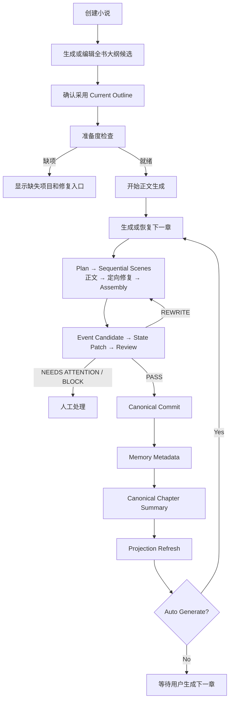
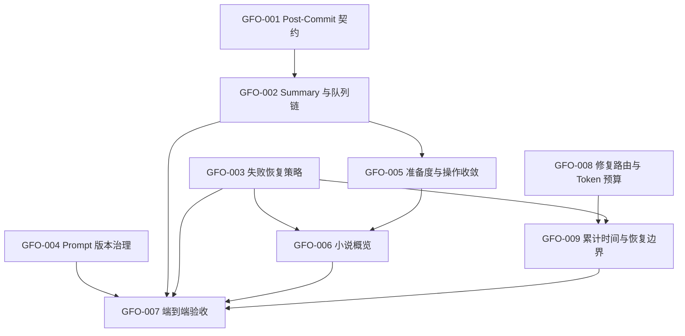

# 小说生成流程与操作体验优化方案

> 日期：2026-09-24
> 状态：Batch A、B、C 已完成
> 范围：Canonical Commit 后置任务、章节摘要、Provider 失败恢复、Scene 执行预算与修复路由、Prompt 版本、生成准备度、小说概览和系统仪表盘
> 参考项目：`/Users/webb/Herd/EasyPay` 的 Dashboard、Creative Console、Chapter Pipeline Error Catalog 与 Retry Policy
> 本文件性质：实施方案与实施记录；Batch A 未调用 AI Provider，未修改小说或 Canonical 数据

## 1. 目标

在保留 XNovel 当前 Canonical Story State、Review Gate、顺序 Scene、Artifact、恢复中心和单用户架构的前提下，完成以下优化：

1. 正式章节提交后，先完成下一章真正依赖的派生数据，再继续自动生成。
2. Provider 失败的可重试事实从异常发生点持续保存到 Generation Run 和后台恢复操作。
3. Prompt 公共写作策略发生变化时，历史 Run、Artifact 和复用判断能够识别版本变化。
4. 开始正文生成前，后台直接显示完整准备度，而不是先显示按钮、点击后才报告缺项。
5. 小说概览和系统首页只显示真实数据，并把日常写作操作放在高频位置。
6. 继续使用现有 Workspace、章节工作台、Generation 恢复中心，不复制 EasyPay 的复杂多租户和治理功能。
7. Scene 正文、结构化证据修复和字数修复使用与任务价值匹配的模型路由及 Token 预算，避免机械修复继承正文模型的高推理成本。
8. 长耗时 Scene 在 Queue Job 超时前主动形成可恢复边界，避免 Worker 强制终止后从正文阶段重新开始。

目标日常流程：



## 2. 约束与不实施内容

### 2.1 必须保留

- Draft 不能直接修改 Canonical Story State。
- Review PASS 之后只能通过 `CanonicalCommitService` 提交正式状态。
- 同一小说的章节生成和 Canonical Commit 保持串行。
- Generation Run、Artifact、Context Snapshot、Usage 和错误信息继续落 PostgreSQL。
- Post-Commit 派生任务失败不能回滚已经成功的正式章节。
- 自动恢复只能复用已验证的 Run / Artifact，不能绕过 Review 或 State Version 检查。

### 2.2 不从 EasyPay 复制

- Multi-tenancy、Team Permission 和多人审批。
- 历史重放、Canary 发布和复杂授权链。
- 独立知识图谱控制台。
- 为每个流水线小步骤增加新表或建立第二套 Workflow Engine。
- 与现有 Novel Workspace、章节工作台和 Generation 恢复中心重复的 Creative Console。

## 3. 已确认的当前事实

### 3.1 当前生成主链可以保留

- `GenerateNextChapterAction` 会先处理当前小说的停滞 Run，再锁定 Novel，检查状态、Style Profile、Canonical State、Active Volume、预算和活跃工作流。
- 已存在的下一章未正式提交时会恢复原 Chapter，不会创建重复章节。
- `AdvanceChapterPipelineAction` 由 Laravel 决定下一阶段，并按 Plan、Scene、Assembly、Event Extraction、Review、Rewrite 和 Commit 推进。
- 章节工作台已经显示 Plan、Scenes、Draft、Events、State Changes、Review、Canonical 和 Runs。
- Generation 页面已经能检查 Context Snapshot、Artifact、Usage，并支持 Retry、Resume 和 Worker Lost Recovery。

结论：不重写主流水线，只修复 Post-Commit、错误恢复和操作入口。

### 3.2 Post-Commit 与架构文档不一致

架构文档规定 Canonical Commit 后包含：

```text
Memory
Embedding
Chapter Summary
Projection Refresh
```

并声明 `RollupSummaryJob` 更新 `chapters.summary`。

当前代码实际只派发：

```text
UpdateMemoryJob
RefreshNovelProjectionJob
```

随后同步调用 `CheckNextAction`。项目没有 `RollupSummaryJob`，已有的 `CanonicalChapterSummaryService` 只被补写命令调用，没有进入正常提交链。

`ContextBuilder::recentStory()` 会跳过 `summary` 为空的正式章节，因此缺失摘要会直接降低后续规划和写作上下文质量。

### 3.3 Provider 恢复信息在持久化时丢失

- OpenAI 和 DeepSeek Provider 会把 HTTP 408、429 和 5xx 映射为可重试异常。
- HTTP 400 与 HTTP 500 都可能使用 `provider_request_failed` 错误码，区别存在于异常的 `retryable` 和 `statusCode`。
- `generation_runs` 当前只保存 `error_code` 和 `error_message`，没有保存 `retryable`、HTTP 状态和结构化错误类别。
- Generation 恢复中心使用页面内固定错误码数组重新推断可重试性，因此失败记录可能把 HTTP 5xx 显示为不可重试。

### 3.4 后台准备度判断与领域检查不一致

- `StartNovelGenerationAction` 会严格检查 Current Bible、主角、世界设定、Active Volume、Active Story Arc 和初始 Story State。
- `ViewNovel::hasPlanningData()` 只要上述任意一类数据存在就显示启动按钮。
- `ApplyNovelBlueprintAction` 在正常采用大纲时已经自动初始化 Story State，独立的“初始化故事状态”主要是手工路径或恢复能力。

### 3.5 概览和仪表盘包含占位数据

小说概览目前存在以下硬编码值：

```text
current_words = 0
current_volume = 尚未接入
today_cost = ¥0.00
review_pass_rate = 尚未接入
rewrite_rate = 尚未接入
due_foreshadowings = 0
needs_attention = 0
```

系统 Dashboard 目前突出显示 20、50、100 章测试入口，同时把活跃小说、当前章节、需要处理和最近生成显示为固定占位值。该页面更接近验收工具，而不是日常创作首页。

### 3.6 NarrativeProsePolicy 内容可保留，但版本未生效

`NarrativeProsePolicy::VERSION` 当前为 `natural-prose-v1`，但没有被 Prompt Version、Input Hash 或 Context Snapshot 引用。修改公共文风规则后，如果没有同时人工提升每一个阶段版本，历史成功 Run 仍可能被复用。

### 3.7 Run #393 暴露了 Scene 单 Job 无累计预算的问题

2026-09-24 的 Run #393 已确认关联小说 3、第 13 章、Scene 44，使用 DeepSeek `deepseek-v4-pro` 和 `scene-writer-v13`。同一次 `GenerateSceneJob` 内按顺序发生：

| 调用 | Provider 耗时 | 输出 Token | 推理 Token | 结果 |
|---|---:|---:|---:|---|
| Scene 正文生成 | 131.650 秒 | 8,589 | 7,125 | 成功，但正文 1,574 字，超过 1,411 字上限 |
| Coverage 证据修复第 1 次 | 14.467 秒 | 1,000 | 1,000 | `finish_reason=length`，没有可用 JSON |
| Coverage 证据修复第 2 次 | 55.054 秒 | 3,921 | 3,670 | 成功 |
| Scene 字数压缩 | 未收到响应 | 未知 | 未知 | 请求发出后没有响应日志 |

前三次 Provider 调用已经累计 201.171 秒。最后一次压缩请求发出时，Job 剩余执行时间已经不足以覆盖一次完整的 Provider 超时窗口。当前代码事实为：

- `GenerateSceneJob::$timeout = 330`，但一个 Job 可以连续执行正文、结构修复、Coverage 修复、伏笔 Coverage 修复和字数修复。
- Scene 重试 Run 将正文输出预算从 12,000 提高到 16,000 Token；字数压缩直接继承同一个 16,000 Token 预算，即使本次只需减少 163 字。
- Coverage 修复直接继承 Writer 的模型和推理程度；该任务只需要从正文中选择连续证据，却使用了 `deepseek-v4-pro`。
- `DeepSeekProvider` 当前不会把统一的 `reasoningEffort` 转换为供应商请求参数，因此后台配置的 Writer 推理程度对这条 DeepSeek 请求没有实际约束力。
- Run #393 的压缩请求没有 Provider 响应或 Provider 异常日志，时间位置与 330 秒 Job 上限一致。由现有日志可推断 Worker 在请求中被 Job 超时终止，但数据库不可达，无法读取持久化状态作最终确认。
- 后续 Queue 重试在重新读取 Scene 44 时遇到 PostgreSQL `192.168.44.131:5432 No route to host`，失败记录本身也无法写入数据库。这是独立的基础设施故障，放大了恢复问题，但不是前三次 AI 调用耗时过长的原因。
- Run 使用 `scene-writer-v13`，当前配置已经是 `scene-writer-v15`，说明执行该 Run 的长驻 Worker 当时仍持有旧配置。

结论：不能只提高 Job Timeout。需要同时限制子阶段成本、建立累计时间预算，并让每个已成功子阶段可以恢复复用。

## 4. 设计决定

### 4.1 Post-Commit 的完成边界

下一章必须依赖以下已完成结果：

```text
Canonical Chapter 已提交
Canonical State 指针已更新
Memory Metadata 已更新
上一正式章节 Summary 已生成
Novel Projection 已刷新
```

Embedding 不作为下一章的硬阻塞条件。它可以独立重试，因为最近章节优先通过 SQL Summary、Story Events、Current State 和 Previous Chapter Ending 进入上下文。

摘要失败不回滚 Canonical Commit，但必须停止自动续写，并在 Generation 恢复中心提供明确的“重试章节摘要”操作。

### 4.2 Post-Commit 的最小实现

优先使用 Laravel Queue Chain，不增加 Workflow Engine：

```text
UpdateMemoryJob
→ GenerateCanonicalChapterSummaryJob
→ RefreshNovelProjectionJob
→ ContinueAutoGenerationJob
```

要求：

- 每个 Job 使用 Canonical Artifact 或 State Version 校验当前来源。
- 重复投递产生 exactly-once effect。
- `ContinueAutoGenerationJob` 重新读取 Novel，不使用提交时的旧 Model 实例。
- 小说已暂停、自动生成已关闭、章节不再是最新 Canonical Chapter 时直接结束。
- 手动“生成下一章”也检查上一正式章节摘要是否就绪；缺失时指向摘要恢复操作。

### 4.3 统一失败契约

`generation_runs` 增加：

```text
error_retryable   nullable boolean
error_metadata    nullable jsonb
```

`error_metadata` 只保存安全诊断信息：

```json
{
  "category": "external_temporary",
  "http_status": 503,
  "provider_request_id": "request-id-if-present"
}
```

禁止保存 API Key、Authorization Header 或完整 Prompt。

新增单一 `GenerationFailurePolicy`，负责：

- 从异常生成持久化失败描述；
- 判断 Queue 是否自动重试；
- 判断后台是否显示 Retry / Resume / Rebuild / Manual Attention；
- 给 `AutoStopService` 提供停止原因和建议动作。

历史 Run 的 `error_retryable=null` 时才使用兼容性错误码映射；新 Run 不再由 Filament 页面猜测。

### 4.4 Prompt 版本组成

对使用 `NarrativeProsePolicy` 的阶段，将有效 Prompt Version 组成定义为：

```text
{stage_prompt_version}+{narrative_policy_version}
```

例如：

```text
scene-writer-v15+natural-prose-v1
reviewer-v15+natural-prose-v1
summary-v2+natural-prose-v1
```

有效版本必须同时进入：

- `generation_runs.prompt_version`
- `input_hash`
- `idempotency_key`
- `context_snapshot`
- AI Prompt 日志中的模型/版本诊断字段

不使用该策略的结构化提取阶段保持自身版本，不强行增加无关依赖。

### 4.5 后台信息架构

保留现有一级导航：

```text
Dashboard
Novels
Generation
Review
Memory
Settings
```

职责调整：

- Dashboard：跨小说的日常状态、异常和快捷入口。
- Novel Overview：单本小说的准备度、进度、当前流水线和下一动作。
- Chapter Workbench：单章产物、审校、修复和正式提交。
- Generation：跨小说恢复中心和 Run 诊断。
- 20/50/100 章测试：移动到诊断/验收区域，并由配置开关控制是否展示。

### 4.6 Scene 子阶段的模型路由与预算

不增加新的 Provider 抽象或模型角色，复用现有路由：

```text
Scene 正文生成             → writer
Coverage / 结构证据修复    → extractor
Scene 字数压缩或扩写       → rewrite
```

每个子阶段必须独立解析并冻结 Provider、Model、Prompt Version、Reasoning Effort 和 Token Budget。实际解析值进入 AI 请求日志、Usage、Context Snapshot 和子阶段 Run；日志中的 `ai_models` 只能作为配置快照，不能替代本次请求的实际路由字段。

预算原则：

- 正文首试和正文重试继续使用各自 Scene 输出预算。
- Coverage 和结构修复只返回小型 JSON，不得继承正文的 12,000/16,000 Token 预算。初始默认保持 1,000 Token，第二次定向重试从当前 4,000 收紧为 2,000 Token；真实回归证明不足时再单独调整。
- 字数压缩或扩写使用独立的 `scene_length_repair_max_output_tokens`，初始默认 4,000 Token，不得继承正文重试预算。
- Provider 不支持统一推理程度参数时，后台和日志明确显示“不适用/未发送”，不得显示为已生效。
- 不通过删除 Hard Constraints、Current State、Ending Contract 或必须内容来缩短耗时。

### 4.7 Scene Job 累计时间与恢复边界

Job Timeout 是 Worker 的最后保护，不作为流程预算。Scene 流程在每次 Provider 调用前计算：

```text
remaining_job_seconds
estimated_stage_timeout
safety_margin_seconds
```

当剩余时间不足以安全完成下一调用时：

1. 保存已经完成的不可变 Artifact、Usage 和子阶段 Run；
2. 将下一子阶段重新派发到 `generation` 队列；
3. 当前 Job 正常结束，不等待 Worker 强制杀死；
4. 新 Job 重新读取 Novel、Chapter、Scene、State Version 和来源 Artifact；
5. 来源未变化时从未完成子阶段继续，来源变化时拒绝覆盖并要求重建 Context。

正文、Coverage/结构证据修复和字数修复需要形成明确的恢复点，但继续使用现有 `generation_runs`、`generation_artifacts` 和 Queue，不新增 Workflow Engine 或业务表。是否拆成多个 Job 由实施时的最小代码方案决定，但必须满足相同的持久化和恢复契约。

数据库不可达时不得启动新的 Provider 调用。执行中的 Provider 请求已经完成但结果尚未持久化时，允许该次结果丢失并在数据库恢复后重试；系统不得把 Redis 或日志当作正式 Artifact 来源。数据库恢复后由停滞 Run 恢复逻辑重新判定，不允许绕过 Review 或 Canonical Commit。

## 5. 实施任务与依赖

状态定义：

```text
READY                可以开始实施
TODO                 等待依赖任务
BLOCKED_BY_DECISION  产品语义需要确认
BLOCKED_BY_EVIDENCE  缺少代码、数据或运行证据
DONE                 已完成并记录验收证据
```

| Task | 名称 | 优先级 | 状态 | 依赖 |
|---|---|---:|---|---|
| GFO-001 | Post-Commit 契约与 Source of Truth 对齐 | P0 | DONE | 无 |
| GFO-002 | 章节摘要接入 Post-Commit 队列链 | P0 | DONE | GFO-001 |
| GFO-003 | Provider 失败元数据与统一恢复策略 | P0 | DONE | 无 |
| GFO-004 | NarrativeProsePolicy 有效版本治理 | P1 | DONE | 无 |
| GFO-005 | 小说生成准备度与操作收敛 | P1 | DONE | GFO-002 |
| GFO-006 | 小说概览真实指标与当前操作卡片 | P1 | DONE | GFO-003、GFO-005 |
| GFO-007 | Dashboard 日常化与端到端验收 | P1 | DONE | GFO-002～006、GFO-009 |
| GFO-008 | Scene 修复模型路由与独立 Token 预算 | P0 | DONE | 无 |
| GFO-009 | Scene 累计时间预算与可恢复子阶段 | P0 | DONE | GFO-003、GFO-008 |



## 6. Task Cards

## GFO-001 — Post-Commit 契约与 Source of Truth 对齐

**优先级：** P0
**状态：** DONE
**依赖：** 无
**Skills：** `generation-pipeline`、`memory-context`、`story-engine`

### 实现内容

- 更新 PRD、Generation Architecture 和生命周期文档，明确 Post-Commit 完成边界。
- 将文档中的 `RollupSummaryJob` 修正为计划采用的真实 Job 名称。
- 明确摘要失败、Memory 失败、Projection 失败和 Embedding 失败各自是否阻止自动续写。
- 明确手动生成下一章对上一正式章 Summary 的准备度要求。

### 影响

- 只修改文档，不改变运行行为和数据库。
- 后续任务不得在文档仍冲突时直接实现不同语义。

### 验收

- PRD、Architecture、生命周期文档对 Post-Commit 和下一章启动时机描述一致。
- 明确 Canonical Commit 成功不会被派生任务失败回滚。
- 明确 Embedding 不阻塞下一章，Summary 阻塞自动续写。
- `git diff --check` 通过。

### 回滚

- 回退文档修改即可；无数据影响。

## GFO-002 — 章节摘要接入 Post-Commit 队列链

**优先级：** P0
**状态：** DONE
**依赖：** GFO-001
**Skills：** `generation-pipeline`、`memory-context`

### 实现内容

- 新增 `GenerateCanonicalChapterSummaryJob`，调用现有 `CanonicalChapterSummaryService`。
- 新增只负责续接的 `ContinueAutoGenerationJob`，内部调用现有停止条件和下一章生成逻辑。
- Canonical Commit 成功后派发受控 Queue Chain，而不是立即同步调用 `CheckNextAction`。
- Summary Job 校验 `chapter.canonical_artifact_id` 与任务携带的来源 ID；来源变化时安全结束。
- Generation 恢复中心支持 Summary 阶段重试。
- `GenerateNextChapterAction` 在存在上一正式章节但其 Summary 为空时给出明确、可恢复的前置错误。
- 使用现有 `novel:backfill-chapter-summaries` 对历史缺失摘要先 dry-run，再由用户显式执行补写。

### 数据与状态

- 不增加业务表。
- 继续使用 `chapters.summary`、`generation_runs` 和 Summary Artifact。
- 历史正式章节不得被重新生成或修改 Canonical Artifact。

### 幂等与 Crash Recovery

- 同一 Canonical Artifact + Prompt Version 复用成功 Summary Artifact。
- 重复 Queue Chain 不得重复创建正式 Memory 或启动两个下一章工作流。
- Summary 成功、Projection 失败时，从 Projection 恢复，不重复调用 AI。
- Chain 中断时，Generation 页面根据已持久化 Run 和 Artifact 显示恢复点。

### 测试

- Canonical Commit 后按顺序派发派生任务。
- Summary 成功后自动生成才进入下一章。
- Summary Provider 超时会保留正式章节并停止续写。
- 重试复用已成功 Summary Artifact。
- Canonical Artifact 已变化时旧任务不能覆盖新摘要。
- 小说暂停或关闭 Auto Generate 后 Continue Job 不创建章节。
- 同一个 Chain 重复投递不会创建重复章节或重复正式数据。

### 回滚

- 回退 Queue Chain 后可恢复当前 Commit 后直接续接行为。
- 已生成的 Summary Artifact 和 `chapters.summary` 保留，不需要删除。
- 回滚不能撤销已成功的 Canonical Commit。

## GFO-003 — Provider 失败元数据与统一恢复策略

**优先级：** P0
**状态：** DONE
**依赖：** 无
**Skills：** `generation-pipeline`、`filament-ui`

### 实现内容

- Migration 为 `generation_runs` 增加 nullable `error_retryable` 和 `error_metadata` JSONB。
- 新增 `GenerationFailurePolicy`，统一临时错误、配置错误、结构错误、领域错误、状态冲突和人工处理错误。
- 所有 AI 阶段保存失败时，通过同一策略写入错误字段。
- Queue Job、`AutoStopService` 和 Generation 页面调用同一策略。
- 删除 Generation 页面独立维护的 `RETRYABLE_ERROR_CODES` 判断，保留旧 Run 兼容映射。
- Inspector 显示 HTTP Status、Retryable、Provider Request ID、错误类别和建议动作。

### 分类基线

| 类型 | 例子 | 自动重试 | 后台动作 |
|---|---|---:|---|
| External Temporary | timeout、连接失败、408、429、5xx | 是 | Retry |
| Provider Configuration | 401、403、模型不存在 | 否 | 修复 AI 配置 |
| Structured Output | Schema invalid、output truncated | 不做网络盲重试 | 定向重生成或调整预算 |
| Domain Validation | Plan/Scene/Review validation | 否 | 检查结构化证据 |
| State Conflict | stale context、state version conflict | 否 | 重建 Context 后重试 |
| Worker Lost | stalled、interrupted | 否 | Recover / Resume |

### 安全边界

- `error_metadata` 不保存凭据、请求头、完整 Prompt 或未脱敏 Provider 响应。
- 继续使用现有 AI 请求日志关联详细供应商请求；Generation Run 只保存恢复决策所需摘要。

### 测试

- OpenAI / DeepSeek HTTP 503 最终失败后，Run 仍显示可重试。
- HTTP 400 显示不可重试和检查请求结构。
- 401/403 指向供应商连接配置。
- 历史 `error_retryable=null` 的 Run 仍按兼容规则显示。
- Job、AutoStop 和 Filament 对同一错误给出相同分类和下一动作。
- 敏感信息不进入 `error_metadata`。

### 回滚

- 新列为 nullable，应用代码可先回退而不影响旧逻辑。
- Migration 回滚只删除新增错误诊断列，不删除 Run、Artifact 或 Usage。

## GFO-004 — NarrativeProsePolicy 有效版本治理

**优先级：** P1
**状态：** DONE
**依赖：** 无
**Skills：** `generation-pipeline`

### 实现内容

- 让 `PromptVersionResolver` 对使用自然文风策略的阶段生成组合版本。
- 组合版本写入 Run、Context Snapshot、Input Hash 和 Idempotency Key。
- 明确 Planner、Writer、Assembler、Reviewer、Rewrite、Summary 使用该版本。
- Event Extractor 等不使用自然文风策略的阶段保持独立版本。
- 增加测试，防止修改 `NarrativeProsePolicy::VERSION` 后仍复用旧 Artifact。

### 边界

- 本任务不重写 `NarrativeProsePolicy` 的现有中文规则。
- 不创建新的 Agent 或 Prompt 管理系统。
- 不自动修改历史 Run 的 `prompt_version`。

### 测试

- 各相关阶段解析出预期组合版本。
- Policy Version 改变会改变 Input Hash 和 Idempotency Key。
- 旧版本成功 Artifact 不被新版本请求复用。
- Generation Inspector 显示完整有效版本。

### 回滚

- 恢复只返回阶段版本的 Resolver 行为。
- 新组合版本产生的历史 Run 和 Artifact 保留，可继续解释，不做改写。

## GFO-005 — 小说生成准备度与操作收敛

**优先级：** P1
**状态：** DONE
**依赖：** GFO-002
**Skills：** `generation-pipeline`、`filament-ui`

### 实现内容

- 新增只读 `NovelGenerationReadiness`，返回每项条件的 key、label、ready 和修复提示。
- `StartNovelGenerationAction` 与 Novel Workspace 共用该结果，移除 UI 的 OR 判断。
- 准备度区块显示 Current Outline、Bible、主角、世界设定、Active Volume、Active Story Arc、Initial State 和上一章派生数据。
- 未就绪时禁用主操作并直接展示缺项，不等用户提交后才报错。
- “初始化故事状态”移动到次要/恢复操作；AI Outline 正常采用后不再作为常规步骤提示。
- 保留 Action 内事务锁和再次校验，UI 检查不能替代领域校验。

### 测试

- 只有部分规划数据时，页面显示准确缺项。
- 所有条件满足时允许开始正文生成。
- 页面检查后数据发生变化，Action 仍会在事务内拒绝启动。
- AI Outline 采用后准备度自动反映 Initial State 已完成。
- 手工规划路径仍能显式初始化状态。

### 回滚

- 可恢复旧按钮可见性；领域 Action 的严格校验始终保留。
- 不涉及数据迁移。

## GFO-006 — 小说概览真实指标与当前操作卡片

**优先级：** P1
**状态：** DONE
**依赖：** GFO-003、GFO-005
**Skills：** `filament-ui`、`generation-pipeline`

### 实现内容

- 删除或替换 Novel Overview 的全部固定占位值。
- 增加“当前流水线”卡片，显示当前 Chapter、Stage、Run、耗时、停止原因、下一动作和入口。
- 复用 Generation Failure Policy，不在 Schema 中重新推断错误。
- 真实指标定义：
  - 当前字数：Canonical Chapter 的 `word_count` 总和；
  - 当前卷：Active Volume；
  - 今日成本：当前小说今日成功 Provider Usage 总额，使用后台货币设置；
  - Review 首次通过率：最近 30 个发生过 Review 的章节中，第一次有效 Review 为 PASS 的比例；
  - Rewrite 比例：最近 30 个已正式提交章节中存在 Rewrite Draft 的比例；
  - 待处理伏笔：复用现有 Due Foreshadowing 查询规则；
  - 需要处理：当前小说最新 Run 的失败/停滞数，加最新 Review 的 NEEDS_ATTENTION/BLOCK 数，分别展示避免重复合计误导。
- 查询使用聚合和 eager loading，避免每个 TextEntry 重复执行相同查询。

### 操作入口

根据状态只显示一个主要动作：

```text
规划不完整       → 完成规划
准备度满足       → 开始正文生成
无活跃章节       → 生成下一章
流水线运行中     → 查看当前章节
临时失败         → 重试失败阶段
Worker Lost      → 恢复
Review PASS      → 提交正式章节
Needs Attention  → 处理审校
Paused           → 继续
```

### 测试

- 指标只使用当前小说数据。
- 今日成本使用配置货币，不固定显示人民币符号。
- 只有 Draft/Rejected Artifact 不增加正式字数。
- 当前 Run、错误类别和下一动作显示一致。
- 页面查询数量保持稳定，不随章节数线性增加。

### 回滚

- UI 可回退到原 Schema；不修改正式故事数据。
- 指标全部为查询结果，不需要数据回滚。

## GFO-007 — Dashboard 日常化与端到端验收

**优先级：** P1
**状态：** DONE
**依赖：** GFO-002～006
**Skills：** `filament-ui`、`generation-pipeline`、`memory-context`

### 实现内容

- Dashboard 顶部改为“创建小说”“继续当前小说”“打开恢复中心”。
- 显示真实的活跃小说、正在运行章节、今日成本/Tokens、Failed、Blocked 和 Needs Attention。
- 最近生成列表展示 Novel、Chapter、Stage、Status、耗时、成本和时间，并链接到 Chapter Workbench 或 Run Inspector。
- 20/50/100 章测试迁移到诊断/验收区域。
- 增加 `generation.acceptance_tools_enabled` 配置，生产默认关闭；开启时仍要求选择小说和明确确认。
- 不新增独立 Creative Console，Dashboard 只做跨小说摘要，详细操作继续进入 Novel Workspace。

### 端到端验收场景

1. 新小说采用 Outline 后，准备度全部通过并进入 Generating。
2. 点击生成下一章后，流水线自动推进至 Review PASS 或明确停止点。
3. Canonical Commit 后完成 Memory、Summary 和 Projection，再根据 Auto Generate 决定是否创建下一章。
4. Provider HTTP 503 重试耗尽后，恢复中心仍显示可重试。
5. Provider HTTP 400 不执行网络盲重试，并显示请求/Schema 检查建议。
6. Summary 失败不回滚正式章节，不启动下一章，可从失败阶段恢复。
7. 重复 Job、重复 Commit 和重复 Continue 不产生重复正式数据或重复章节。
8. Pause 后已发出的请求可以保存 Artifact，但不派发新阶段或 Commit。
9. Dashboard、Novel Overview、Chapter Workbench 和 Generation 页面显示同一状态与下一动作。

### 验证命令

实施时至少执行：

```bash
php artisan test tests/Feature/CanonicalChapterSummaryTest.php
php artisan test tests/Feature/CanonicalCommitServiceTest.php
php artisan test tests/Feature/AutoGenerationTest.php
php artisan test tests/Feature/Filament/GenerationPageTest.php
php artisan test tests/Feature/Filament/NovelResourceTest.php
php artisan test tests/Feature/Filament/DashboardUsageTest.php
php artisan test tests/Feature/Filament/DashboardSmokeRunTest.php
php artisan test tests/Feature/Filament/DashboardReliabilityRunTest.php
php artisan test tests/Feature/Filament/DashboardMvpReadinessTest.php
php artisan test
```

以上是当前已确认存在的测试文件。实施时仍须用 `rg --files tests` 重新检查路径，并为新增行为补充对应测试。

### 回滚

- Dashboard 和导航变更可以独立回退。
- 关闭 `generation.acceptance_tools_enabled` 即可隐藏验收工具。
- 回滚 UI 不回滚已成功的 Run、Artifact、Usage、Summary、Memory 或 Canonical State。

## GFO-008 — Scene 修复模型路由与独立 Token 预算

**优先级：** P0
**状态：** DONE
**依赖：** 无
**Skills：** `generation-pipeline`

### 实现内容

- Scene 正文继续解析 `writer` 路由。
- `PlanCoverageEvidenceRepairer`、`SceneDraftStructureRepairer` 和伏笔 Coverage 证据修复改为解析 `extractor` 路由。
- Scene 字数压缩或扩写改为解析 `rewrite` 路由。
- 给字数修复增加独立配置 `scene_length_repair_max_output_tokens=4000`；不得继续传入 Scene 正文首试或重试预算。
- 保留 Coverage/结构修复首次 1,000 Token 预算，将对应的第二次重试预算默认收紧为 2,000 Token，并按目标模型实际输出验证；Token 截断只能触发一次有上限的定向重试。
- 每次请求的实际 Provider、Model、Reasoning Effort、Max Tokens、Prompt Version 和子阶段名称进入日志及 Usage 关联信息。
- DeepSeek 不支持当前统一推理程度字段时，不发送伪造参数；设置页面和 Run Inspector 显示该 Provider 的实际支持状态。
- 调整路由或预算后提升对应 Prompt Version，避免复用旧模型语义下的修复 Artifact。

### 数据与状态

- 不新增模型角色、业务表或 Provider 实现。
- 继续使用后台已有 `writer`、`extractor`、`rewrite` 路由。
- Scene 的权威正文仍只来自通过现有校验的 Scene Draft Artifact。
- 子阶段实际路由进入 Context Snapshot；不得只读取全局 `config('ai.models')` 作为历史解释依据。

### 测试

- Scene 正文调用 Writer 路由，Coverage/结构修复调用 Extractor 路由，字数修复调用 Rewrite 路由。
- 三类请求分别记录实际 Provider、Model、Prompt Version、Reasoning Effort 和 Max Tokens。
- 字数修复不会继承 `scene_retry_max_output_tokens=16000`。
- Coverage 第一次输出被截断时只执行受限重试，重试成功后不重新生成正文。
- DeepSeek 请求日志不会把未发送的推理程度显示为已生效。
- 路由改变会改变对应 Input Hash 或子阶段幂等键，不复用不兼容 Artifact。

### 验收

- 使用 Run #393 同规模输入回归时，Coverage 修复必须走 Extractor 路由，单次输出和最多一次重试均受独立预算约束。
- 只超出少量字数的 Scene 不会获得 16,000 Token 的压缩预算。
- 不降低 Scene Schema、Plan Coverage、伏笔 Coverage、Hard Constraints 或字数校验标准。

### 回滚

- 恢复修复调用使用 Writer 路由和原预算的行为。
- 已产生的 Run、Artifact 和 Usage 保留，不改写历史记录。
- 回滚不改变 Canonical Chapter 或 Story State。

## GFO-009 — Scene 累计时间预算与可恢复子阶段

**优先级：** P0
**状态：** DONE
**依赖：** GFO-003、GFO-008
**Skills：** `generation-pipeline`

### 实现内容

- 为 Scene 流程增加单次 Job 的开始时间、软截止时间和安全余量；不能只依赖 Worker 的 330 秒硬超时。
- 每次 Provider 调用前比较剩余 Job 时间与该 Provider 的请求超时；时间不足时持久化恢复点并重新派发下一子阶段。
- 为正文完成、Coverage/结构证据完成、字数修复完成建立可识别的阶段状态和不可变 Artifact。
- 恢复时校验 Novel、Chapter、Scene、State Version、来源 Artifact、Prompt Version 和输入哈希。
- 同一子阶段的重复 Queue 投递优先复用已成功 Artifact；没有完整响应或 Artifact 时才重新调用 Provider。
- Worker 被终止且没有 Provider 完整响应时，将 Run 归类为 `worker_lost`；Provider 明确超时时仍归类为 `provider_timeout`，两者不得混淆。
- 数据库连接不可用时，在发起 AI 请求前失败并按基础设施临时错误处理；数据库恢复后由现有停滞 Run 恢复入口继续。
- Horizon 重启或配置变更后，新 Job 必须记录当前有效 Prompt Version；不得继续把旧 Worker 的版本显示为当前配置。

### 幂等与 Crash Recovery

- 正文已成功、Coverage 修复未开始：恢复 Coverage，不重新生成正文。
- Coverage 已成功、字数修复未开始：恢复字数修复，不重新执行 Coverage。
- Provider 返回成功但 Artifact 事务未提交：视为该子阶段未完成并允许重试，不从日志恢复业务数据。
- Artifact 已提交但派发下一 Job 前崩溃：扫描或 Resume 操作根据来源 Artifact 补派，不重复调用 Provider。
- State Version 或来源 Artifact 已变化：旧任务安全结束并标记需要重建 Context，不覆盖新结果。
- 重复投递不得创建重复有效 Artifact、重复 Usage 归属或并行推进同一 Scene。

### 测试

- 模拟剩余时间不足，当前 Job 正常结束并只派发一次后继子阶段。
- 模拟正文成功后进程中断，恢复时复用正文 Artifact。
- 模拟 Worker 硬终止，Run 显示 `worker_lost`，而不是伪装成 Provider Timeout。
- 模拟 Provider Timeout，保持可重试并从失败子阶段继续。
- 模拟数据库在 Provider 调用前不可达，不产生外部 AI 请求。
- 模拟数据库在 Provider 响应后、Artifact 提交前不可达，不产生半持久化 Artifact。
- 重复 Job、旧 State Version 和来源 Artifact 变化均不会推进错误结果。
- Run #393 等价路径在 330 秒内主动交接，不由 Worker 强制杀死。

### 可观测性与验收

Run Inspector 增加或确认显示：

```text
owning_stage
substage
job_attempt
elapsed_seconds
remaining_job_seconds_at_dispatch
provider_timeout_seconds
source_artifact_id
resumed_from_run_id
actual_provider / model / prompt_version / max_tokens
```

验收时分别统计正文、Coverage/结构修复和字数修复耗时。不能只显示整个 Scene Run 总时长，从而无法判断慢在正文、推理、修复还是排队。

### 回滚

- 可恢复为单 Job 串行执行，但保留已经生成的子阶段 Artifact 和诊断字段。
- nullable 诊断字段允许应用代码先回退；回滚不得删除 Run、Artifact 或 Usage。
- 不回滚任何已经成功的 Canonical Commit。

## 7. 分批实施建议

### Batch A：可靠性闭环

```text
GFO-001
GFO-002
GFO-003
GFO-008
GFO-009
```

完成标准：正式提交后摘要进入正常流程，HTTP 5xx 在持久化后仍可正确恢复；Scene 子阶段使用独立路由和预算，并在 Job 硬超时前形成可恢复交接。

### Batch A 实施记录（2026-09-24）

- GFO-001：PRD、生成链、生命周期和数据模型文档已统一为 `GenerateCanonicalChapterSummaryJob`，并明确 Summary、Memory、Projection 与 Embedding 的阻塞边界。
- GFO-002：Canonical Commit 后改为 `UpdateMemoryJob → GenerateCanonicalChapterSummaryJob → RefreshNovelProjectionJob → ContinueAutoGenerationJob` 队列链；手动和自动续写都会校验上一正式章 Summary；恢复中心可以重试 Summary 阶段。
- GFO-003：`generation_runs` 增加结构化失败元数据，Provider、Queue、自动停止和 Generation 页面统一使用 `GenerationFailurePolicy`，旧 Run 保留兼容分类。
- GFO-008：Scene 正文、证据修复和字数修复分别使用 Writer、Extractor、Rewrite 路由；修复预算独立，实际请求参数写入 Usage 和 Run 诊断信息。
- GFO-009：Scene Job 增加软时间预算、Provider 调用前数据库可用性检查和不可变阶段检查点；恢复时校验输入哈希、状态版本、来源 Artifact 与 Prompt Version，并从最近成功子阶段继续。
- 两条新增 nullable 字段迁移已应用到当前本地数据库；历史摘要补写仍要求用户显式执行，本次未执行。
- 实施过程未调用真实 AI Provider，未修改现有小说、章节、Canonical State、Story Event、Memory 或 Artifact 业务数据。
- 验证：Batch A 针对性测试 `122 passed / 861 assertions`；最终全量测试 `956 passed / 5768 assertions / 27 skipped / 1 warning`；变更文件 Pint 与 `git diff --check` 通过。

### Batch B：版本与准备度

```text
GFO-004
GFO-005
```

完成标准：Prompt 策略变化可追踪，启动按钮与领域准备度一致。

### Batch B 实施记录（2026-09-24）

**Summary**

- GFO-004：Planner、Writer、Assembler、Reviewer、Rewrite、Summary 使用 `{stage_prompt_version}+{NarrativeProsePolicy::VERSION}` 有效版本；Extractor 保持独立版本，AI Debug 因不注入文风策略而继续使用基础阶段版本。
- GFO-005：新增只读 `NovelGenerationReadiness`，由小说概览和 `StartNovelGenerationAction` 共用；页面展示八项准备度并禁用未就绪的主操作，领域 Action 在 Novel 锁内再次校验。

**Problems Addressed**

- 修改自然文风策略后，旧 Run、Input Hash 和 Artifact 不再被当作同版本结果复用。
- “任一规划数据存在”不再让不完整小说显示可执行的正文启动按钮。
- Current Outline、Initial State 和上一正式章 Summary 等缺项在提交前可见，并提供明确修复提示。

**Files Changed**

- Prompt 版本：`app/AI/PromptVersionResolver.php`、六个主生成阶段及 AI Debug。
- 准备度：`app/Services/NovelGenerationReadiness.php`、`StartNovelGenerationAction`、Novel Workspace 页面和概览 Schema。
- 文档与自动测试同步更新。

**Database / Canonical State Changes**

- 无 Migration；未修改小说、章节、Canonical State、Story Event、Memory 或 Artifact 业务数据。
- 未调用真实 AI Provider。

**Tests Actually Run**

- Prompt、Summary、Planner、准备度、Outline、Story State、Novel Resource、AI Debug：`78 passed / 572 assertions`。
- Assembly、Review、Rewrite、Scene、Style Contract、Generation Inspector、准备度：`156 passed / 878 assertions`。
- 最终全量：`962 passed / 5809 assertions / 27 skipped / 1 warning`。
- 变更文件 Pint 与 `git diff --check` 作为最终静态检查执行。

**Known Limitations**

- 未发起真实 Provider 请求；有效版本传播通过 Fake Provider、Run、Context 和复用测试验证。
- 准备度界面通过 Filament Livewire 测试验证，未执行人工浏览器验收。

**Rollback / Recovery**

- 回退组合版本 Resolver、准备度服务和对应 UI 即可；已生成的组合版本 Run 保留，不应改写历史记录。
- 准备度只读，无业务数据回滚步骤。

**Next Task**

- GFO-006 已满足依赖并进入 `READY`；GFO-007 继续等待 GFO-006。

### Batch C：操作体验

```text
GFO-006
GFO-007
```

完成标准：后台不再显示虚假占位指标，日常写作入口和异常处理路径清晰。

### Batch C 实施记录（2026-09-24）

**Summary**

- GFO-006：新增 `NovelOperationsOverview`，小说概览显示 Canonical 字数、Active Volume、当前流水线、当前小说 Usage、首轮 Review 通过率、Rewrite 比例、到期伏笔以及分开的失败和审校待办；下一步入口根据准备度、暂停、Review 和 `GenerationFailurePolicy` 结果确定。
- GFO-007：Dashboard 顶部改为创建小说、继续当前小说和恢复中心；实时汇总活跃小说、运行中章节、今日 Usage、Failed、Blocked、Needs Attention 和最近 10 个 Run。20/50/100 章工具移入诊断与验收区，并由默认关闭的配置控制。

**Problems Addressed**

- Novel Overview 和 Dashboard 不再用 `0`、`尚未接入` 或固定人民币符号表示尚未查询的业务指标。
- 日常入口与验收长跑入口分离；失败 Run、审校待办和最近生成可以直接进入对应工作台或检查入口。
- Dashboard、Novel Overview 与 Generation Inspector 对同一失败 Run 使用持久化失败类别和同一恢复建议。

**Files Changed**

- 聚合查询：`app/Services/NovelOperationsOverview.php`、`DashboardOperationsOverview.php`、`DueForeshadowingQuery.php`。
- Filament：`NovelOverview.php`、`Dashboard.php`、`DueForeshadowingsWidget.php`。
- 配置：`config/generation.php`、`.env.example`。
- PRD、生命周期架构文档、任务计划和对应 Feature 测试同步更新。

**Database / Canonical State Changes**

- 无 Migration；未修改小说、章节、Canonical State、Story Event、Memory 或 Artifact 业务数据。
- 未调用真实 AI Provider。

**Tests Actually Run**

- 任务卡指定测试及 Batch C 新增测试：`84 passed / 691 assertions`。
- 最终全量：`968 passed / 5863 assertions / 27 skipped / 1 warning`；测试工具未返回 warning 明细。
- Batch C 变更文件 Pint 与 `git diff --check` 作为最终静态检查执行。

**Known Limitations**

- 本轮通过 Filament Livewire 测试验证页面与链接，未执行人工浏览器视觉验收。
- 今日 Usage 以已持久化的 `usage_records` 为准；失败且未形成 Usage 的 Provider 尝试不会计入成本或 Token。

**Rollback / Recovery**

- Dashboard 与 Novel Overview 可独立回退，不需要数据回滚。
- 将 `GENERATION_ACCEPTANCE_TOOLS_ENABLED=false` 即可隐藏诊断与验收区；已存在的长跑设置、Run、Artifact 与 Usage 保留。

**Next Task**

- Batch C 已完成；本计划列出的 GFO-001～GFO-009 均已完成。

**Post-implementation Correction（2026-09-24）**

- 修复 PostgreSQL 使用 `x_` 表前缀时，Dashboard 与 Novel Overview 最新 Review 聚合中的原始 `MAX(reviews.id)` 未经过 Query Grammar 加前缀，导致 `42P01 missing FROM-clause entry for table "reviews"`。
- 聚合列现在通过当前连接的 Query Grammar 包装表名和字段名，与 Generation、Review 页面已有实现保持一致。
- 新增表前缀 SQL 编译回归测试；相关测试 `19 passed / 203 assertions`。当前 PostgreSQL 上只读执行 Dashboard 指标与 Novel 质量聚合均成功。

**Provider Route Correction（2026-09-24）**

- Run #395 已确认正文请求由 DeepSeek 成功完成，随后 `coverage_evidence_repair` 按冻结快照应使用 OpenAI；旧 Router 却只允许请求 Provider 等于 Run 顶层 Writer Provider，因而在发出修复请求前错误抛出 `provider_run_mismatch`。
- Scene 的正文、结构与 Coverage 修复、字数修复请求现在携带明确 `route_key`。Router 从 Run Snapshot 的 `generation_preferences.substage_routes` 读取并校验对应 Provider 与 Model，仍拒绝未冻结路由或真实配置漂移。
- Usage 诊断新增 `route_key`；Provider/Model 漂移归类为 `provider_configuration`，错误信息包含 Run、路由键、请求值和冻结值。
- 未重新调用 Run #395 的真实 AI 请求，未修改小说、章节、Artifact 或 Canonical 数据。针对性测试 `75 passed / 363 assertions`；最终全量测试 `976 passed / 5886 assertions / 27 skipped / 1 warning`，测试工具未返回 warning 明细；Pint 与 `git diff --check` 通过。

**Assembly Truncation Correction（2026-09-25）**

- Run #397、#398、#399 的 Chapter、输入哈希、Provider、Model、Prompt Version 与 12,000 Token 上限完全相同；对应 Usage 的输出分别为 12,000、11,999、12,000 Token，Provider 响应均为 `finish_reason=length`，且 `reasoning_tokens` 占满可用额度。三次重试没有提高预算，因此重复执行了相同的必败请求。
- Chapter Assembly 现在冻结三级输出预算：首次 12,000、第一次截断后 16,000、再次截断后 24,000。预算等级按同一章节输入、Provider、Model 和 Prompt Version 的历史截断记录计算，现有 #397～#399 后的下一次恢复会直接采用 24,000，而不会再次使用 12,000。
- Run Snapshot 记录完整预算计划、当前截断序号和实际 `max_completion_tokens`；Assembly 长度修复沿用当前 Run 的实际预算。
- 最高预算已经截断时，后续重复操作会在 Provider 调用前以 `assembly_output_budget_exhausted` 停止，并建议调整 Assembler 模型路由或输出预算，避免相同请求继续产生费用。
- 本次未自动重放真实 AI 请求，未修改小说、章节、Artifact 或 Canonical 数据。针对性测试 `43 passed / 316 assertions`；最终全量测试 `979 passed / 5907 assertions / 27 skipped / 1 warning`，测试工具未返回 warning 明细；Pint 与 `git diff --check` 通过。

**Event Evidence Scene Reference Correction（2026-09-25）**

- Run #401 与 #402 使用同一 Chapter Draft 和 `event-extractor-v6`，模型把章内 Scene Sequence `1` 当成了数据库 `scene_id`。当前 Chapter 的实际 Scene ID 为 43、44、45，ID 1 属于其他 Chapter，因此 Laravel 的跨章校验正确拒绝了候选事件。
- Extractor Context 新增冻结的 `current_scene_references`，明确区分 `scene_id`、`sequence` 和 Scene Draft Artifact；Prompt 明确禁止将 sequence 填入 `evidence.scene_id`，版本提升为 `event-extractor-v7`。
- Laravel 在入库前用逐字 quote 对当前 Scene Draft 执行唯一命中解析。只有一个 Scene 命中时才纠正 ID；零命中、多命中或真实跨章引用仍失败，不降低 Event Validation 标准。
- 本次未自动重放 #401/#402，未发起真实 AI 请求，也未修改 Canonical Story State。针对性测试 `46 passed / 147 assertions`；最终全量测试 `981 passed / 5916 assertions / 27 skipped / 1 warning`；Pint 与 `git diff --check` 通过。Horizon 已优雅重启并恢复 `generation` / `default` Worker。

**Generation Job Exception Closure Correction（2026-09-25）**

- 数据库确认 `Undefined array key 0` 发生在 Run #403，不是 #404；#404 已成功并产生 Event Candidate。根因是 Laravel Collection `filter()` 保留原键，唯一命中第 2/3 个 Scene 时结果没有键 `0`。唯一命中集合现在先 `values()` 重建索引，回归测试强制使用“非首个 Scene 命中”。
- #405、#406 为同一 Review 输入，两次 4,000 Token 均被 reasoning 用尽且返回空正文。Review 现按 4,000 / 8,000 / 12,000 递增，现有两次截断后的下一次恢复直接使用 12,000；最高预算再截断时不发起第四次请求。
- Planner、Scene、Assembly、Review、Event Extraction、Rewrite 与 Canonical Summary 均具有分阶段递增预算与最高预算熔断。核心生成 Job、全书大纲、Canonical Summary 和 Embedding 统一将未知代码故障视为不可重试，只保留数据库等明确临时故障的 Queue Retry，避免本地 Bug 重复调用 Provider。
- Event Extraction 使用 4,000 / 8,000 / 12,000，Rewrite 使用 12,000 / 16,000 / 24,000，Canonical Summary 使用 1,200 / 2,400 / 4,000；每个阶段均有回归测试证明连续截断会升级预算，最高档再截断后不会发生第四次 Provider 调用。
- 本次未重放真实 AI 请求，未修改 Canonical Story State。针对性测试 `243 passed / 1321 assertions`；最终全量测试 `989 passed / 5995 assertions / 27 skipped / 1 warning`，测试工具未返回 warning 明细。

**Foreshadowing Event Evidence Lineage Correction（2026-09-25）**

- Run #408 的 Provider 响应、Chapter Draft 和最终 Coverage 均引用 Scene 43。Event 的三条原文证据分别证明未找到者、折返牺牲和无名者执念；Coverage 使用同一 Scene 中更完整的清点说明。旧校验要求其中一条 Event Quote 与单条 Coverage Quote 互相包含，误把互补证据判为不一致。
- `event-extractor-v8` 在伏笔 ID、动作、目标 Scene 和 fulfilled Coverage 全部匹配后，将已通过 Assembly 逐字校验的 Coverage Evidence 确定性附加到 Event Candidate，同时保留模型返回的其他原文证据。未授权动作、错误生命周期、missing/contradicted Coverage 和跨 Scene 引用仍被拒绝。
- 本次未重放 #408，未发起真实 AI 请求，也未修改 Canonical Story State。针对性测试 `64 passed / 235 assertions`；最终全量测试 `989 passed / 5995 assertions / 27 skipped / 1 warning`，测试工具未返回 warning 明细。

**Foreshadowing Review Evidence Normalization（2026-09-25）**

- Run #409 的 Review 将三段真实原文用中文引号和分号拼成一个 `foreshadowing_audits.evidence` 字符串；各片段存在于正文，但拼接串不是连续原文，因此旧校验以 `review_validation_failed` 拒绝。
- `fulfilled` 审校现在只在伏笔 ID、动作、目标 Scene、fulfilled Coverage 和匹配 Event Candidate 全部成立时，将证据归一化为已通过 Assembly 逐字验证的 Coverage Evidence。`rewrite_required`、`needs_attention` 和普通 Narrative Finding 的证据规则不变。
- 本次未重放 #409，未发起真实 AI 请求，也未修改 Canonical Story State。针对性测试 `140 passed / 718 assertions`；最终全量测试 `990 passed / 5997 assertions / 27 skipped / 1 warning`，测试工具未返回 warning 明细。
- Run #410 进一步暴露 `rewrite_required` 分支仍直接校验模型拼接串。共享 Evidence Resolver 现在先尝试完整逐字映射，再拆分分号或省略号连接的片段，逐段映射当前正文并保留最长的有效连续片段；真假混合引用保留真实片段，全部片段无效时仍以 `review_validation_failed` 拒绝。Story Arc 规划审校复用同一实现。
- Reviewer Prompt 升级为 `reviewer-v15+natural-prose-v1`，要求每个 evidence 只返回一段连续原文；后端仍保留确定性容错，不依赖模型完全遵守格式。本次未重放 #410，未发起真实 AI 请求，也未修改 Canonical Story State。针对性测试 `70 passed / 232 assertions`；最终全量测试 `993 passed / 6003 assertions / 27 skipped / 1 warning`，测试工具未返回 warning 明细。

每次只实施一个 `GFO-XXX`。开始前必须重新检查代码、数据库、依赖状态和工作区未提交修改。任务完成后记录：

```text
Summary
Problems Addressed
Files Changed
Database / Canonical State Changes
Tests Actually Run
Known Limitations
Rollback / Recovery
Next Task
```

## 8. 总体验收标准

- 正式章节提交后不会在 Summary 尚未生成时自动启动下一章。
- Canonical Commit 成功后，任何派生任务失败都不会留下半提交状态或回滚正式章。
- HTTP 5xx、429、timeout、HTTP 400、认证失败和状态冲突在 Job、数据库和 Filament 中分类一致。
- Scene 正文、结构化证据修复和字数修复使用各自明确的模型路由、Prompt Version、推理支持状态和 Token 预算。
- 每次 Provider 调用前执行累计时间预算检查；长耗时 Scene 不依赖 Worker 强制终止形成恢复点。
- 正文或修复子阶段已经成功时，重试从最后一个完整 Artifact 继续，不重复调用已成功阶段。
- Provider 不支持推理程度时，后台和日志不得把配置值显示为已发送或已生效。
- 数据库不可达时不发起新的 AI 请求，恢复后不从 Redis 或日志构造正式 Artifact。
- Retry、Resume、Recover、Rebuild Context 和 Manual Attention 的操作不会互相混用。
- 修改 NarrativeProsePolicy 后，相关阶段不会复用旧版本 Artifact。
- Novel Workspace 的开始、生成、恢复、提交动作都来自同一领域状态判断。
- Dashboard 和 Novel Overview 不显示硬编码业务指标。
- 日常操作无需进入验收长跑页面；验收工具默认不占据主操作区。
- 不引入多租户、复杂审批、知识图谱或新的 Workflow Engine。
- 关键测试和完整回归通过，并分别记录实际结果。
