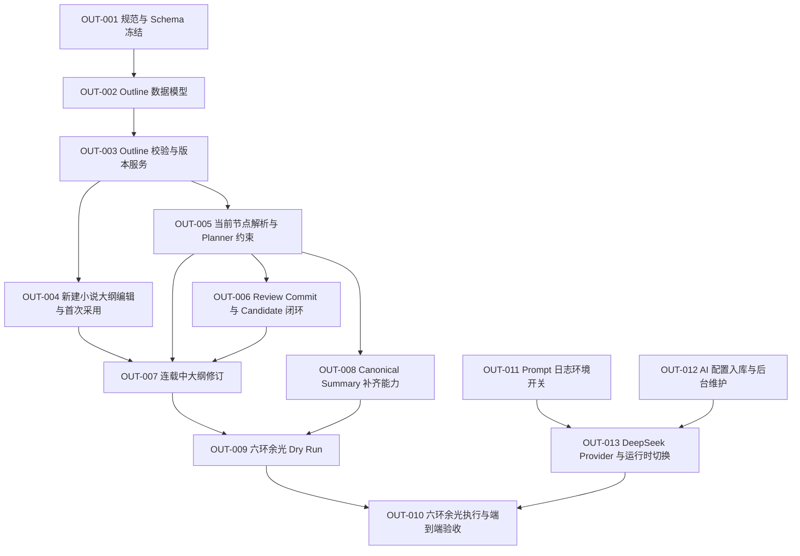

# 人工全书大纲与受控章节生成调整方案

> 日期：2026-09-21
> 状态：实施中（OUT-001、OUT-002、OUT-003、OUT-004、OUT-005、OUT-006、OUT-007、OUT-008、OUT-009 已完成）
> 范围：新建小说的全书大纲、连载中的未来大纲修订、Chapter Planner 按大纲生成、AI Prompt 日志开关、AI 配置后台维护、DeepSeek 生成支持、《六环余光》迁移准备
> 不包含：本文件不修改业务代码，不调用 AI Provider，不修改《六环余光》的小说数据

## 1. 目标

用户先确定整本小说要写什么、按什么顺序写、每个阶段必须达到什么结果。AI 只负责把当前大纲节点拆成章节和场景并生成正文，不能自行更换主线、跳过节点或长期停留在一个局部情节。

目标流程：

```text
创建小说基础信息
    ↓
录入或让 AI 辅助生成全书大纲候选
    ↓
用户编辑、排序、增加约束并确认
    ↓
采用为 Current Novel Outline
    ↓
Laravel 选择当前最早未完成的大纲节点
    ↓
Chapter Planner 只为该节点生成章节计划
    ↓
Scene → Assembly → Review
    ↓
Canonical Commit 后记录节点完成证据
    ↓
推进到下一个大纲节点
```

本方案中的“大纲”是以下层级，不是只有一句故事前提，也不是 AI 自行生成后只能整体采用的 Blueprint 摘要：

```text
Novel
└── Volume / 阶段
    └── Story Arc / 剧情线
        └── Outline Beat / 按顺序执行的剧情节点
```

## 2. 已确认的当前行为

### 2.1 新建小说和初始 Blueprint

- 新建表单只收集标题、题材、目标总字数、单章目标字数和故事前提等基础信息。
- `NovelPlanner` 根据这些有限输入生成 Bible、人物、世界实体、分卷、Story Arc 和伏笔。
- Blueprint 可以预览、重新生成或整体采用，但不能在采用前逐项编辑完整剧情路线。
- `ApplyNovelBlueprintAction` 只允许空白小说首次采用规划；小说已有规划、章节或 Story Event 时会拒绝执行。
- `ApplyNovelBlueprintAction` 当前直接把 AI 返回的 `volumes` 和 `story_arcs[].beats` 写入正式规划表。

结论：`ApplyNovelBlueprintAction` 可以继续承担“首次采用”，但它的输入必须改为用户最终确认的 Outline，而不是未经人工编辑的 AI 输出。它不能承担连载中的大纲修订。

### 2.2 当前 Story Arc Beat 能力

- `story_arcs.beats` 当前是 JSONB 字符串数组。
- `StoryArcBeatContract` 根据 Beat 文本计算 `beat_key`；修改文字会改变 Key。
- Chapter Plan 已支持 `arc_contributions`，可以引用 `arc_id + beat_key + beat_index`。
- Reviewer、Story Event Extractor 和 Canonical Commit 已能校验并提交 `story_arc_beat_completed`。
- Story Arc Progress 已能从正式 Beat 完成事件投影。

结论：后半段的 Review、Commit 和 Progress 基础已经存在。主要缺口在于大纲编辑、稳定节点、当前节点选择、顺序约束和旧小说迁移。

### 2.3 Chapter Planner 的缺口

当前 Planner 会读取 Active Story Arc 的全部 Beats，但只得到总体 `progress`，没有得到：

- 已完成的 Beat Keys；
- 当前必须推进的 Beat；
- 当前 Beat 已使用多少正式章节；
- 达到最大章节预算后应如何停止；
- 哪些后续 Beat 现在不得提前完成。

`PlanValidator` 当前只检查引用的 Beat 是否存在、是否属于 Active Arc、Scene 和验收条件是否合法，没有强制检查顺序。因此模型可以重复旧节点、跳到后续节点，或者继续输出不推进大纲的章节。

### 2.4 《六环余光》当前快照

2026-09-21 只读检查确认：

- Novel ID 为 2，状态为 `paused`。
- 11 章已经 Canonical Commit。
- 第 12 章处于 `review`，`canonical_artifact_id` 为空。
- 人物为林墨、苏璃、黑曜。
- 正式世界实体主要包括六环城、魔法学院、魔法议会和魔法代价。
- 11 个正式章节的 `summary` 全部为空。
- Active Story Arc 为“魔法启蒙”，`progress = 0`。
- `story_arc_beat_completed` Active Event 数量为 0。
- 最近章节计划持续围绕学院档案编号、监管申请、异常痕迹和低强度训练展开。

这说明当前重复问题同时来自三处：全书大纲过粗、Planner 不知道当前顺序节点、近期正式章节没有 Summary。

### 2.5 当前 AI 配置、日志和 Provider 边界

已检查当前实现，确认：

- `config/ai.php` 通过 `AI_PROVIDER`、`AI_MODEL` 和各阶段 `AI_MODEL_*` 环境变量提供默认值。
- `AppServiceProvider` 只接受 `openai`，配置其他 Provider 会抛出 `Unsupported AI provider`。
- `AiSettingsResolver` 只能解析全局 Provider；小说级设置只能覆盖模型，不能覆盖 Provider。
- `OpenAiProvider::generate()` 当前无条件把完整请求 Payload 写入 debug 日志，其中包含 System Prompt、Messages、JSON Schema 和 Metadata。
- API Key 没有写入请求日志；这个边界必须保持。
- Filament `Settings` 页面当前只读展示 AI 配置，不能保存。
- 项目已经有 `system_settings` 表，`key` 为主键、`value` 为 JSONB；目前用于保存 `emergency_stop`。
- `usage_records.provider` 当前从全局配置读取。增加运行时切换后，这种写法会记录错误 Provider，必须改为记录本次请求实际使用的 Provider。

结论：无需为了 AI 配置再新增一张通用设置表。复用 `system_settings` 保存 AI 运行配置；API Key 由 Laravel `Crypt` 加密后保存，后台只接受替换或显式清除且绝不回显。现有环境配置仅作为兼容回退。Prompt 是否落日志属于部署级安全开关，不放到后台修改。

## 3. 用户期望的大纲示例

用户提供的框架应在系统中保存为有顺序、有稳定 Key、有验收条件的结构：

```text
Volume 1：魔法学院学习魔法
└── Arc：学院成长
    ├── 1.1 与苏璃结识
    ├── 1.2 有教授指导，魔法等级快速提高
    ├── 1.3 在学院考核中名列前茅
    └── 1.4 外出购物意外获得加快魔法修行的神奇物品

Volume 2：外出历练
└── Arc：第一次学院任务
    ├── 2.1 接受学院任务
    ├── 2.2 途中遇见歹人欺凌弱小并拔刀相助
    ├── 2.3 到达任务地点，与其他学院学员产生矛盾
    ├── 2.4 矛盾激化，双方互斗
    └── 2.5 经历磨难并完成任务
```

AI 可以决定：

- 每个节点需要几章；
- 每章分几个 Scene；
- 具体对话、动作、局部冲突和场景表现；
- 在不改变节点结果的前提下如何铺垫和制造悬念。

AI 不可以决定：

- 删除或跳过用户要求的节点；
- 把后续节点提前写成已经完成；
- 把“教授指导”改成“苏璃继续陪练”；
- 把“外出历练”长期改写成学院内部档案调查；
- 让林墨无代价获得高阶能力；
- 在用户未修订大纲时自行新增或替换核心主线。

## 4. 数据结构调整

## 4.1 新增 `novel_outlines`

新增一张表保存用户确认后的完整大纲版本。不能只把它放进 Prompt，也不能只保存在 Redis。

字段：

```text
id                      bigint PK
novel_id                bigint FK novels.id
version                 unsigned integer
status                  draft | current | superseded
source                  ai | manual | revision
schema_version          unsigned integer
content                 jsonb
checksum                char(64)
based_on_outline_id     nullable FK novel_outlines.id
created_by              nullable FK users.id
applied_at              nullable timestamp
created_at
updated_at
```

约束：

```text
unique(novel_id, version)
version > 0
schema_version > 0
status CHECK
source CHECK
```

同一小说只能有一个 `current` Outline。应用新版本时必须在事务中锁定 Novel，将旧版本改为 `superseded`，再把新版本改为 `current`。

`novels` 增加：

```text
current_outline_id nullable FK novel_outlines.id
```

选择新增一张表而不是把大纲塞入 `novels.settings` 的原因：

- 需要版本、来源、校验状态和 checksum；
- 中途修订时必须保留旧大纲；
- Chapter Plan 必须能够引用当时采用的精确版本；
- 需要区分 AI 候选、人工修订和当前正式规划；
- 不能让一个可变 JSON 设置覆盖历史规划依据。

## 4.2 Outline JSON Schema

`novel_outlines.content` 使用以下结构：

```json
{
  "title": "六环余光全书大纲",
  "summary": "林墨从学院学徒成长为能够承担魔法代价的魔法使。",
  "must_include": [],
  "must_not_include": [],
  "volumes": [
    {
      "key": "volume-academy",
      "sequence": 1,
      "title": "魔法学院学习魔法",
      "goal": "完成学院阶段的基础成长",
      "climax": "林墨在学院考核中证明训练成果",
      "target_words": 120000,
      "arcs": [
        {
          "key": "arc-academy-growth",
          "sequence": 1,
          "type": "main",
          "title": "学院成长",
          "goal": "完成结识同伴、导师训练、考核和机缘",
          "stakes": "无法掌握魔法代价就不能离开学院执行任务",
          "completion_conditions": [
            "林墨完成学院考核",
            "林墨具备独立外出执行任务的能力"
          ],
          "beats": [
            {
              "key": "academy-meet-su-li",
              "sequence": 1,
              "title": "与苏璃结识",
              "summary": "林墨与苏璃建立能够支持后续合作的关系。",
              "chapter_budget": {"min": 1, "max": 2},
              "acceptance_criteria": [
                "林墨与苏璃正式见面",
                "两人形成明确的后续联系"
              ],
              "must_include": [],
              "must_not_include": []
            },
            {
              "key": "academy-professor-training",
              "sequence": 2,
              "title": "教授指导林墨学习魔法",
              "summary": "一位强大教授先考察林墨，再提供系统训练。",
              "chapter_budget": {"min": 2, "max": 4},
              "acceptance_criteria": [
                "教授正式登场并展示足够实力",
                "教授指出林墨当前修炼方式的问题",
                "林墨完成至少一次有失败和代价的针对性训练",
                "林墨获得可由正文验证的魔法控制提升"
              ],
              "must_include": [
                "教授必须先考察林墨",
                "训练必须继续遵守魔法代价规则"
              ],
              "must_not_include": [
                "教授直接赠送无代价力量",
                "林墨一次训练就成为高阶魔法使"
              ],
              "character_candidates": [
                {
                  "candidate_key": "character-professor-mentor",
                  "name": "待用户命名的教授",
                  "role": "导师",
                  "motivation": "确认林墨的特殊性并训练其控制魔法代价",
                  "profile": {},
                  "personality": {},
                  "abilities": {},
                  "knowledge": {}
                }
              ],
              "world_entity_candidates": []
            }
          ]
        }
      ]
    }
  ]
}
```

校验规则：

- Volume、Arc、Beat 的 `key` 在同一 Outline 内必须唯一且创建后不可修改。
- `sequence` 必须从 1 开始、连续且不重复。
- `chapter_budget.min >= 1`。
- `chapter_budget.max >= chapter_budget.min`。
- 每个 Beat 至少有一条 `acceptance_criteria`。
- `must_include` 与 `must_not_include` 不能包含完全相同的文本。
- Main Arc 至少一个；每个 Main Arc 至少一个 Beat。
- Candidate Key 必须在 Outline 内唯一。
- Target Words 总和与 Novel Target Words 不一致时显示 Warning，不阻止保存草稿；采用前必须由用户确认差异。

## 4.3 Volume 与 Story Arc 的稳定映射

`volumes` 增加：

```text
outline_key nullable string
```

`story_arcs` 增加：

```text
outline_key nullable string
sequence unsigned integer default 1
```

约束：

```text
unique(novel_id, outline_key) WHERE outline_key IS NOT NULL
unique(volume_id, sequence)
```

`story_arcs.beats` 从字符串数组升级为结构化对象数组。旧数据先通过 Normalizer 读取：

```text
旧字符串 Beat
→ 保留原文本
→ 使用当前 StoryArcBeatContract 生成兼容 key
→ sequence 使用原数组位置
→ chapter_budget 默认为 {min: 1, max: null}
→ acceptance_criteria 暂用 Beat 文本
```

迁移不得修改已有 Canonical Event 的 `beat_key`。旧 Beat 的兼容 Key 必须与当前算法结果完全一致。

## 4.4 Chapter Plan 冻结 Outline 来源

`chapter_plans` 增加：

```text
novel_outline_id nullable FK novel_outlines.id
```

`arc_contributions` 每项增加：

```text
role primary | secondary
```

Primary Contribution 表示本章必须推进的全书大纲节点。Secondary Contribution 用于允许的支线推进。

Generation Run 的 `context_snapshot` 必须记录：

```text
novel_outline_id
outline_version
outline_checksum
primary_arc_id
primary_beat_key
primary_beat_sequence
canonical_completed_beat_keys
chapters_used_for_current_beat
chapter_budget
```

这样能够解释某章为何写这个内容，也能防止大纲修订后把旧 Chapter Plan 提交到新大纲来源链。

## 4.5 新人物的 Candidate 边界

教授不能在大纲保存时直接成为 Canonical Character，也不能仅靠 Prompt 临时出现。

`chapter_plans` 增加：

```text
character_candidates jsonb default []
```

每项包含：

```text
candidate_key
name
role
motivation
profile
personality
abilities
knowledge
deduplication_basis
possible_duplicate_character_ids
introduction_reason
target_scene_sequence
```

新增事件类型：

```text
character_introduced
```

只有以下条件全部满足时，`CanonicalCommitService` 才创建正式 Character：

1. Candidate 来自当前 Chapter Plan；
2. Review 对该 Candidate 给出 `introduced`；
3. Review Evidence 逐字命中正文；
4. Event Candidate 中存在匹配的 `character_introduced`；
5. Candidate 未与现有人物重复；
6. Expected State Version 仍一致。

`characters` 增加：

```text
source_chapter_id nullable FK chapters.id
source_candidate_key nullable string
```

唯一约束：

```text
unique(novel_id, source_chapter_id, source_candidate_key)
```

Latest Chapter Rollback 时：

- 若本章引入的 Character 未被后续 Canonical Chapter 引用，删除该 Character；
- 若已被后续正式章节引用，拒绝简单回滚并提示先重建后续 Canonical 链；
- 不删除人工在初始规划中已经存在的人物。

神奇物品、新地点和新组织继续复用现有 `world_entity_candidates` 和 `world_entity_introduced`，不再创建第二套机制。

## 5. 新建小说操作流程

## 5.1 页面流程

新建小说不应在一次表单提交事务中同步调用 Provider。先保存 Draft Novel，再进入 Novel Workspace 的大纲步骤。

```text
步骤 1：基础信息
标题、题材、目标字数、单章字数、故事前提

步骤 2：创作约束
必须出现、禁止出现、结局方向、节奏、预计分卷数

步骤 3：建立全书大纲候选
选择“手工从空白创建”或“AI 根据前两步生成”

步骤 4：大纲编辑器
编辑 Volume → Arc → Beat，设置顺序、章节预算和验收条件

步骤 5：校验
显示错误、警告、字数分配和 Candidate 重复风险

步骤 6：确认采用
生成 Current Novel Outline，并写入 Volume、Story Arc、初始人物和世界资料
```

## 5.2 AI 生成候选

`NovelPlanner` 的 Schema 改为输出稳定的 `volume.key`、`arc.key` 和 `beat.key`，以及结构化 Beat。

AI 输出仍保存为 Immutable Generation Artifact。用户修改后不能覆盖原 Artifact，应创建新的 Outline Draft Version：

```text
AI Artifact
→ Outline Draft v1
→ 人工编辑
→ Outline Draft v2
→ 确认采用
→ Outline v2 status=current
```

## 5.3 `ApplyNovelBlueprintAction` 调整

该 Action 继续只用于首次采用，修改为接收一个已经通过校验的 Draft `NovelOutline`。

事务步骤：

```text
BEGIN
SELECT novel FOR UPDATE
检查小说仍为空白且没有 Chapter / Story Event
检查 Outline 属于当前小说且 status=draft
检查 checksum 与校验结果
创建 Bible Version
按 outline_key 创建 Volumes
按 outline_key + sequence 创建 Story Arcs
保存结构化 Beats
创建初始就存在的人物和世界实体
保留未来人物和世界实体为 Outline Candidate，不提前写正式表
初始化 Canonical Story State
将 Outline 改为 current
更新 novels.current_outline_id
将 Novel 改为 planning
COMMIT
```

重复执行必须返回同一已采用结果或明确拒绝，不能创建第二套 Volume、Arc 或人物。

## 6. Chapter Planner 按大纲生成

## 6.1 当前节点选择

新增 `OutlineProgressResolver`，全部选择逻辑由 Laravel 完成，不让模型自己决定。

选择顺序：

```text
Current Novel Outline
→ Active Volume
→ 当前 Volume 中 sequence 最小的 Active Main Arc
→ 查询 Active Story Events 中已完成 Beat Keys
→ 找到 sequence 最小的未完成 Beat
→ 计算该 Beat 已占用的 Canonical Chapter 数
→ 生成 Current Outline Target
```

`Current Outline Target` 至少包含：

```text
volume_key / title
arc_id / arc_key / title
beat_key / sequence / title / summary
chapter_budget
acceptance_criteria
must_include
must_not_include
resolved character candidates
resolved world entity candidates
```

## 6.2 Planner 规则

Chapter Planner 必须：

- 创建一个 `role=primary` 的 `arc_contribution`，引用 Current Outline Target；
- 把本章准备满足的具体标准写入 `acceptance_criteria`；
- 将 Beat 的 `must_include` 合并到 Chapter Plan 约束；
- 将 Beat 的 `must_not_include` 合并到 `must_not_reveal` 或 `forbidden_conflicts`；
- 只在目标 Beat 要求时引入对应 Character / World Candidate；
- 不得把后续 Beat 的最终结果写入当前章；
- 若一章不足以完成 Beat，必须推进一个可验证的中间结果，而不是重复背景说明。

## 6.3 PlanValidator 规则

新增确定性检查：

```text
MISSING_PRIMARY_OUTLINE_BEAT
OUTLINE_VERSION_MISMATCH
OUTLINE_BEAT_ALREADY_COMPLETED
OUTLINE_BEAT_OUT_OF_ORDER
OUTLINE_BEAT_BUDGET_EXHAUSTED
OUTLINE_REQUIRED_CONTENT_MISSING
OUTLINE_FORBIDDEN_CONTENT_PLANNED
INVALID_CHARACTER_CANDIDATE
```

默认行为：

- Main Arc 当前节点未完成时，不允许计划后续 Main Beat；
- 已完成 Beat 不允许再次作为 Primary；
- 一章只能有一个 Primary Beat；
- 支线可以作为 Secondary，但不能挤掉 Primary；
- 当前 Beat 已达到 `chapter_budget.max` 且仍未完成时，停止自动生成并进入 `NEEDS_ATTENTION`；
- 用户必须选择延长预算、修改节点、人工调整 Chapter Plan 或修订 Outline。

## 6.4 Review 与 Canonical Commit

Reviewer 必须逐项返回当前 Primary Beat 的验收状态：

```text
fulfilled
not_met
contradicted
```

只有 `fulfilled` 且 Evidence 逐字命中正文时，Event Extractor 才允许输出 `story_arc_beat_completed`。

Canonical Commit 必须校验：

- Chapter Plan 冻结的 Outline Version 仍可追踪；
- Beat 属于该 Outline；
- Review、Event Candidate 和 Plan 使用相同 `arc_id + beat_key`；
- 同一 Beat 已有 Active 完成事件时保持幂等，不重复推进；
- Commit 成功后由 `StoryArcProgressProjector` 更新进度；
- Draft、Review、Rewrite 均不得提前改变 Outline 或 Arc Progress。

## 7. 连载中的大纲修订

新增 `ApplyNovelOutlineRevisionAction`，不得复用 `ApplyNovelBlueprintAction`。

允许修改：

- 尚未开始的 Volume；
- 尚未开始的 Arc；
- 尚未完成且没有活动 Chapter 使用的 Beat；
- 未来 Beat 的顺序、章节预算、验收条件和 Candidate；
- 在当前节点之后增加新的 Volume、Arc 或 Beat。

禁止直接修改：

- 已有 Canonical Completion Event 的 Beat Key；
- 已被 Canonical Chapter 引用的 Beat 含义；
- 当前活动 Chapter 已冻结的 Outline Version；
- Canonical Story State、Story Event 或 Story Arc Progress。

修订步骤：

```text
BEGIN
SELECT novel FOR UPDATE
检查 Expected Current Outline ID / checksum
检查活动 Chapter 和 Generation Run
比较旧版与新版 Outline
拒绝修改已完成节点的 key 和语义
创建新 Outline Version
更新未开始的 Volume / Arc Projection
保留已完成和已引用的旧 Projection
supersede 旧 Outline
更新 novels.current_outline_id
COMMIT
```

如果当前已有非 Canonical Chapter：

- 默认让该 Chapter 继续使用旧 Outline Version；
- 用户可以选择“从下一章生效”；
- 若要求当前章立即采用新 Outline，必须使用独立的 `RestartChapterFromOutlineAction`；
- 该 Action 保留旧 Run、Artifact、Review 和 Usage，创建新的 Chapter Plan 来源链，不能覆盖旧产物。

## 8. Filament 页面

## 8.1 Novel Workspace → 规划 → 全书大纲

新增 Workspace 内页面，不增加一级导航。

页面按以下层级显示：

```text
Volume 卡片
  Story Arc
    Beat 1  状态 / 已用章节 / 章节预算
    Beat 2  状态 / 已用章节 / 章节预算
```

状态必须来自数据，不由页面猜测：

```text
已完成      存在有效 Canonical Completion Event
推进中      当前最早未完成节点
等待中      位于当前节点之后
超出预算    已用正式章节数 >= max 且仍未完成
历史基线    旧小说迁移时由用户确认的历史映射
```

页面动作：

- 从空白建立大纲；
- AI 生成大纲候选；
- 编辑 Draft；
- 校验 Draft；
- 采用初始大纲；
- 修订未来大纲；
- 查看版本差异；
- 从下一章应用；
- 对非 Canonical Chapter 发起安全重建。

## 8.2 大纲编辑器

使用 Filament 原生 Section、Repeater、Tabs 和 Actions。必须支持：

- Volume、Arc、Beat 增删和拖动排序；
- 稳定 Key 自动生成后只读显示；
- Beat 章节预算；
- 验收条件；
- 必须内容；
- 禁止内容；
- 人物 Candidate；
- 世界实体 Candidate；
- 只重新生成选中的 Volume、Arc 或 Beat；
- 重新生成前填写修改要求；
- 原版本和候选版本差异预览。

不能只提供一个大文本框让 AI 自行解释层级。

## 8.3 Chapter Planning Preview

增加：

- 当前 Outline Version；
- Current Volume / Arc / Beat；
- Beat 已使用章节数和预算；
- 本章 Primary / Secondary Contributions；
- Beat Acceptance Criteria；
- 必须内容和禁止内容；
- Candidate 引入计划；
- “本章未推进大纲”的明确告警。

## 9. 《六环余光》调整方案

该部分必须作为单独数据任务执行，不能与通用代码一起顺手修改。

## 9.1 先处理第 12 章边界

当前第 12 章处于 `review` 且尚未 Canonical Commit。实施时必须由用户选择：

```text
A. 保留第 12 章现有来源链，新大纲从第 13 章生效；
B. 废弃第 12 章当前 Draft，从 Canonical Chapter 11 和新 Outline 重新规划第 12 章。
```

系统不能自动替用户选择，也不能直接覆盖第 12 章的 Run、Artifact 或 Review。

## 9.2 建立全书大纲 Draft

先录入用户提供的两个阶段及节点：

```text
Volume 1：魔法学院学习魔法
1.1 与苏璃结识
1.2 教授指导
1.3 学院考核
1.4 购物获得修炼物品

Volume 2：外出历练
2.1 接受学院任务
2.2 途中拔刀相助
2.3 与其他学院学员冲突
2.4 双方互斗
2.5 完成任务
```

其余 Volume 必须由用户继续提供或确认 AI 候选后才能成为 Current Outline。不能把现有五卷粗略 Blueprint 自动当成用户确认的完整大纲。

## 9.3 历史节点映射

对 Chapter 1～11 的 Canonical Artifact 做只读审计，逐节点输出：

```text
节点
候选状态：completed / partial / not_started
支持该判断的 Canonical Chapter IDs
逐字 Evidence
不确定项
```

不得因为“林墨和苏璃已经一起行动”就自动把 1.1 判定为完成。必须找到正式正文证据并由用户确认。

旧小说迁移可以在 Outline Version 中记录 `baseline_completions`：

```text
beat_key
chapter_ids
evidence
reason
confirmed_by
confirmed_at
```

Baseline Completion 只用于决定新 Outline 从哪个节点继续，不创建虚构 Story Event，不修改历史 Canonical State。UI 必须显示“历史基线”，不能伪装成新流程产生的 Canonical Beat Event。

新大纲采用后的章节必须回到正常规则：只有 Review PASS + Canonical Commit 才能完成 Beat。

## 9.4 补齐 Canonical Chapter Summary

新增幂等的 Canonical Summary 生成流程：

- 只读取 Canonical Artifact；
- input hash 包含 Canonical Artifact checksum 和 Prompt Version；
- 已有相同 hash 的成功 Summary Artifact 时复用；
- Summary 写入前再次确认 Chapter 仍为 Canonical 且 Artifact 未变化；
- 不从 Draft、Rejected Rewrite 或旧 Artifact 生成正式 Summary；
- Provider 失败不修改 Story State，也不阻止已有正式章节。

先 dry-run 列出 Chapter 1～11 缺失 Summary，再单独执行补齐。补齐后验证 Chapter Planner 的 `recent_summaries` 不再为空。

## 9.5 推荐生效结果

若用户确认 1.1 已由历史章节完成，则下一目标为：

```text
Current Beat：1.2 教授指导林墨学习魔法
```

接下来 Chapter Planner 必须优先生成：

1. 教授登场和考察；
2. 指出林墨训练方法的问题；
3. 安排带失败和代价的训练；
4. 形成可验证的能力提升。

在 1.2 完成前：

- 不得继续用整章重复档案申请流程；
- 不得直接进入学院考核；
- 不得提前开始外出历练；
- 可以把现有档案线索作为教授关注林墨或设计考察的触发条件，但不能继续成为唯一主线。

## 10. AI 请求日志、后台配置与 DeepSeek

### 10.1 Prompt 日志环境开关

在 `.env.example` 增加：

```dotenv
AI_LOG_PROMPTS=false
```

在 `config/ai.php` 增加：

```php
'logging' => [
    'prompts' => env('AI_LOG_PROMPTS', false),
],
```

执行规则：

- 默认值必须为 `false`。
- `false` 时不得记录 `system_prompt`、`messages`、拼接后的 Prompt、JSON 示例或完整请求 Payload。
- `false` 时仍记录排错所需元数据：`ai_request_log_id`、实际 Provider、实际 Model、Generation Run ID、Novel / Chapter / Scene ID、Prompt Version、HTTP 状态、耗时、Token 用量和 Provider Request ID。
- `true` 时才记录当前已有的完整请求 Payload，并继续使用同一个 `ai_request_log_id` 关联请求、响应和异常。
- 无论开关值是什么，Authorization Header、OpenAI Key、DeepSeek Key 都不得进入日志。
- 该开关只控制请求 Prompt，不改变 Generation Artifact、Context Snapshot 和 Usage Record 的持久化规则。
- 修改 `.env` 后必须按部署方式清理或重建 Laravel 配置缓存，否则运行进程可能继续读取旧值。

本次只增加用户要求的 Prompt 开关。当前完整响应正文日志是否也需要独立开关，作为后续单独任务评估，不能让 `AI_LOG_PROMPTS=false` 被误解为“所有 AI 正文均不会写日志”。

### 10.2 AI 配置保存位置和字段

复用现有 `system_settings` 表，使用固定 Key：

```text
key = ai
```

`value` 保存运行配置。`credential` 是 Laravel `Crypt` 生成的密文，不是明文：

```json
{
  "schema_version": 1,
  "default_provider": "openai",
  "providers": {
    "openai": {
      "enabled": true,
      "base_url": "https://api.openai.com/v1",
      "credential": "Laravel Crypt ciphertext or null",
      "connect_timeout": 10,
      "timeout": 60
    },
    "deepseek": {
      "enabled": false,
      "base_url": "https://api.deepseek.com",
      "credential": null,
      "connect_timeout": 10,
      "timeout": 60
    }
  },
  "stages": {
    "planner": {"provider": "openai", "model": "现有 planner 模型"},
    "writer": {"provider": "openai", "model": "现有 writer 模型"},
    "assembler": {"provider": "openai", "model": "现有 assembler 模型"},
    "extractor": {"provider": "openai", "model": "现有 extractor 模型"},
    "reviewer": {"provider": "openai", "model": "现有 reviewer 模型"},
    "rewrite": {"provider": "openai", "model": "现有 rewrite 模型"},
    "summary": {"provider": "openai", "model": "现有 summary 模型"}
  },
  "cost": {
    "currency": "USD",
    "input_per_million": 0,
    "cached_input_per_million": 0,
    "output_per_million": 0
  },
  "budget": {
    "daily_hard_limit": null,
    "novel_total_limit": null,
    "chapter_max_cost": null
  }
}
```

约束：

- API Key 只以 Laravel `Crypt` 密文保存；数据库、页面、校验错误和日志均不得出现明文，页面和日志也不得出现密文。
- OpenAI 和 DeepSeek 的 Base URL、API Key、Timeout、Token 单价与全局预算由后台维护；`config/ai.php` 的环境值仅在数据库记录不存在或数据库密钥被显式清除时作为兼容回退。
- API Key 输入留空表示保留数据库现有密钥；填写新值表示替换；显式清除开关表示删除数据库密钥。页面重新加载时只显示配置状态，绝不回填原值。
- `provider` 只能是代码已经注册的 Provider，不能通过后台输入任意类名或任意 URL。
- Model 使用字符串保存，保存时去除首尾空格并限制长度；不把短期可能变化的模型列表做成数据库枚举。
- Stage 只能使用现有 `AiStage` 枚举值。
- Provider 未启用或缺少 Key 时，保存配置或连接测试必须给出明确错误，不得静默回退到另一家 Provider。
- 配置更新使用数据库事务，保存前校验完整 JSON；`system_settings` 中无 `ai` 记录或记录无效时，读取当前 `config/ai.php` 默认值，避免升级后立即中断生成。

配置解析优先级：

```text
小说级某 Stage 的 provider + model 覆盖
    ↓
system_settings.ai.stages.{stage}
    ↓
system_settings.ai.default_provider + 对应默认模型
    ↓
config/ai.php 当前环境变量默认值
```

每次创建 `GenerationRun` 时冻结解析后的实际 Provider、Model 和配置来源。已经运行或已经完成的 Run 不因后台设置变化而改变。

### 10.3 Filament Settings 页面

将当前只读 AI 区块改为可编辑表单，提供：

- 默认文本生成 Provider；
- OpenAI / DeepSeek 启用状态；
- Planner、Writer、Assembler、Extractor、Reviewer、Rewrite、Summary 各阶段的 Provider 和 Model；
- 两个 Provider 各自的连接超时和请求超时；
- 两个 Provider 各自的 Base URL、API Key 替换输入、显式清除开关和已配置状态；
- Token 成本货币及输入、缓存输入、输出单价；
- 每日、单小说和单章成本限制；
- 按 Provider 执行的“测试连接”操作。

保存时：

1. 先校验 Provider、Stage、Model、Base URL、超时、单价、预算和密钥操作；
2. 再写入 `system_settings.ai`；
3. 保存成功后清除应用内对应缓存；MVP 可以先不缓存，直接读取单行设置；
4. 使用 Laravel Log 写一条设置变更记录，包含操作者 ID 和变更前后的 Provider / Model / Base URL / Timeout / Cost / Budget，只记录 `credential_configured` 布尔状态，不记录密钥明文或密文；当前项目未安装 Activity Log 包，本任务不为此新增依赖；
5. 页面重新读取数据库，展示最终生效值和来源。

后台切换只影响之后创建的 Generation Run。正在执行的 Run 使用创建时冻结的 Provider 和 Model，不能运行到一半自动换 Provider。

### 10.4 DeepSeek Provider 和运行时路由

新增 `DeepSeekProvider`，并保留当前最小接口：

```php
interface AiProvider
{
    public function generate(AiRequest $request): AiResponse;
}
```

调整点：

- `AiRequest` 增加本次解析后的 `provider`。
- 新增固定映射的 `RoutingAiProvider`，只允许路由到代码已注册的 `openai` 或 `deepseek` 适配器。
- `AppServiceProvider` 不再在启动时只绑定一个全局 Provider；绑定包装顺序保持 Emergency Stop、预算检查、Usage 记录等现有能力，然后由 Router 选择实际适配器。
- `UsageRecorder` 从 `AiRequest.provider` 或解析结果记录实际 Provider，不再读取全局 `config('ai.provider')`。
- `generation_runs` 增加 nullable `provider` 字符串列，新 Run 必须写实际 Provider。历史行保持 null 并显示为“旧记录未保存 Provider”，不得根据当前配置批量猜测回填。
- OpenAI 和 DeepSeek 分别构造请求参数。不得直接复制 OpenAI 的模型名前缀判断到 DeepSeek。
- 两个适配器都返回现有 `AiResponse`，业务服务不得直接读取 DeepSeek 原始响应字段。

DeepSeek 官方文档在 2026-09-21 的核实结果：标准 Base URL 为 `https://api.deepseek.com`，Chat Completions 路径为 `/chat/completions`，接口兼容 OpenAI 请求形式；JSON Output 需要 `response_format={"type":"json_object"}`，同时 Prompt 中必须明确要求输出 JSON。官方也提示 JSON Output 可能偶发返回空内容，因此空内容必须按可识别的 Provider 输出错误处理，不能直接写入 Artifact。参考：

- <https://api-docs.deepseek.com/api/create-chat-completion/>
- <https://api-docs.deepseek.com/guides/json_mode/>

`.env.example` 不再要求配置 Provider Base URL、API Key、Timeout、Token 单价和预算；这些值由后台维护。`config/ai.php` 暂时保留旧环境变量读取，仅用于已有部署升级期间的兼容回退：

```dotenv
# Provider runtime settings are maintained in Settings / system_settings.ai.
```

兼容迁移：数据库没有 `system_settings.ai` 时从当前 `config/ai.php` 构造默认值；数据库 Provider 没有密钥时允许回退到现有环境密钥。管理员在后台保存后，以数据库配置为主。任何迁移和弃用日志都不得打印密钥值。

DeepSeek 切换范围只包含小说文本生成阶段：Planner、Writer、Assembler、Extractor、Reviewer、Rewrite、Summary。Embedding 继续使用当前独立配置和现有 Provider，除非以后确认 DeepSeek 提供并选定兼容的 Embedding 接口；后台不得把 DeepSeek 文本模型误配为 Embedding 模型。

### 10.5 失败处理和验证

- Provider 未启用、Key 缺失、Model 为空：创建请求前失败，Generation Run 标记为不可重试的配置错误。
- 401 / 403：凭据错误，不自动重试。
- 429、网络超时、临时 5xx：沿用可恢复错误重试策略。
- JSON 空内容、JSON 非法、缺少 Schema 字段：保留原始 Artifact / 日志关联信息，进入已有校验失败或 Rewrite / Needs Attention 流程，不写 Canonical State。
- 后台切换 Provider 后，至少分别对 OpenAI 和 DeepSeek 执行一个非正式连接测试及一个结构化输出测试。
- 端到端测试必须证明同一小说可以按 Stage 选择 Provider，Run、Artifact、Usage 和日志中的 Provider 一致。
- Provider 切换不得绕过 Review 和 Canonical Commit。

## 11. 实施任务与依赖



| Task | 名称 | 优先级 | 状态 | 依赖 |
|---|---|---:|---|---|
| OUT-001 | Source of Truth 与 Outline Schema 冻结 | P0 | DONE | 无 |
| OUT-002 | Novel Outline 数据模型与旧 Beat 兼容 | P0 | DONE | OUT-001 |
| OUT-003 | Outline 校验、版本和进度解析服务 | P0 | DONE | OUT-002 |
| OUT-004 | 新建小说大纲编辑与首次采用 | P0 | DONE | OUT-003 |
| OUT-005 | Chapter Planner 当前节点选择与顺序门禁 | P0 | DONE | OUT-003 |
| OUT-006 | Review、Canonical Commit、人物 Candidate 与回滚 | P0 | DONE | OUT-005 |
| OUT-007 | 连载中未来大纲修订与当前章安全重建 | P1 | DONE | OUT-004～006 |
| OUT-008 | Canonical Chapter Summary 幂等补齐 | P1 | DONE | OUT-005 |
| OUT-009 | 《六环余光》大纲迁移 Dry Run | P0 | DONE | OUT-007、008 |
| OUT-010 | 《六环余光》执行与端到端验收 | P0 | BLOCKED_BY_DECISION | OUT-009、OUT-013、用户确认第 12 章处理方式与完整大纲 |
| OUT-011 | Prompt 日志环境开关 | P0 | DONE | 无 |
| OUT-012 | AI 配置入库与后台维护 | P0 | DONE | 无 |
| OUT-013 | DeepSeek Provider 与运行时切换 | P0 | DONE | OUT-011、012 |

## 12. Task Cards

## OUT-001 — Source of Truth 与 Outline Schema 冻结

**实现内容**

- 将“人工全书大纲是章节规划的上游约束”写入 PRD。
- 在 Data Model 中定义 Novel Outline、结构化 Beat 和 Candidate。
- 在 Generation Pipeline 中定义当前节点选择、章节预算和超限停止。
- 在 Story Engine 中定义 Beat 完成、人物引入和回滚边界。

**涉及文件**

- `docs/PRD.md`
- `docs/architecture/data-model.md`
- `docs/architecture/generation-pipeline.md`
- `docs/architecture/story-engine.md`
- 本文件

**验收**

- 四份 Source of Truth 对 Outline、Beat、Candidate 和 Canonical 边界描述一致。
- 明确 AI 不拥有节点排序和主线切换权。
- 明确旧小说 Baseline Completion 不伪造 Story Event。
- `git diff --check` 通过。

**数据库 / Canonical State**

- 无。

**回滚**

- 只回退文档，不影响运行数据。

## OUT-002 — Novel Outline 数据模型与旧 Beat 兼容

**实现内容**

- 新增 `novel_outlines` 表和 `novels.current_outline_id`。
- 为 Volume、Story Arc 增加稳定 `outline_key`，为 Story Arc 增加 `sequence`。
- 为 Chapter Plan 增加 `novel_outline_id` 和 `character_candidates`。
- 为 Character 增加 Candidate 来源字段。
- 新增 Outline Model、Enum、Factory 和关系。
- 新增 `OutlineSchemaNormalizer`，同时读取旧字符串 Beat 和新对象 Beat。

**可能涉及文件**

- `database/migrations/*create_novel_outlines_table.php`
- `database/migrations/*add_outline_fields*.php`
- `app/Models/NovelOutline.php`
- `app/Models/Novel.php`
- `app/Models/Volume.php`
- `app/Models/StoryArc.php`
- `app/Models/ChapterPlan.php`
- `app/Models/Character.php`
- `app/Enums/NovelOutlineStatus.php`
- `app/Enums/NovelOutlineSource.php`
- `app/Services/OutlineSchemaNormalizer.php`

**测试**

- PostgreSQL CHECK、FK、Unique Constraint。
- 旧字符串 Beat 生成的 Key 与当前版本完全一致。
- 新结构 Beat 的显式 Key 不随标题文案修改而变化。
- 同一 Novel 不能出现两个相同 Outline Version。
- 删除 Novel 时关联数据按设计清理。

**数据库 / Canonical State**

- 只改 Schema，不修改现有小说内容。
- 旧 Story Arc Beat 保持原值，先通过 Normalizer 兼容，不在 Migration 中猜测业务字段。

**回滚**

- Migration down 删除新增 FK、列和表；不得改写旧 `beats` 内容。

## OUT-003 — Outline 校验、版本和进度解析服务

**实现内容**

- `NovelOutlineValidator` 校验层级、Key、Sequence、预算、验收条件和 Candidate。
- `CreateNovelOutlineVersionAction` 创建 Draft Version。
- `OutlineProgressResolver` 根据 Current Outline、Active Events 和 Baseline Completion 计算当前节点。
- `OutlineDiffService` 输出新增、删除、排序和语义修改。
- `OutlineContextBuilder` 生成 Planner 可用的冻结上下文。

**测试**

- Key 重复、Sequence 缺口、预算倒置、空验收条件均拒绝。
- Current Beat 始终是 Main Arc 中最早未完成节点。
- Completed Beat 不会再次成为 Current。
- Baseline Completion 仅影响旧小说迁移起点，不产生 Story Event。
- 相同输入产生相同 checksum。

**数据库 / Canonical State**

- 创建 Draft Outline，不修改 Canonical State。

**回滚**

- Draft 可以标记 superseded；已经被 Chapter Plan 引用的版本不能删除。

## OUT-004 — 新建小说大纲编辑与首次采用

**实现内容**

- 新建小说后进入 Outline Builder。
- 支持手工创建和 AI 候选两条入口。
- 支持 Volume、Arc、Beat 结构化编辑和局部重新生成。
- 调整 `NovelPlanner` Schema 和 Prompt。
- 调整 `ApplyNovelBlueprintAction`，只采用已校验的 Draft Outline。

**可能涉及文件**

- `app/Filament/Resources/Novels/Pages/CreateNovel.php`
- `app/Filament/Resources/Novels/Pages/ViewNovel.php`
- 新增 Novel Workspace Outline Page
- `app/Services/NovelPlanner.php`
- `app/Actions/Novels/ApplyNovelBlueprintAction.php`
- `app/Actions/Novels/CreateNovelOutlineVersionAction.php`

**测试**

- 手工大纲无需调用 Provider。
- AI 候选不会直接写 Volume、Arc 或 Character。
- 人工编辑创建新版本，不覆盖 Artifact 或旧 Outline。
- Apply 重复执行不产生重复规划。
- Apply 失败事务不留下半套 Volume / Arc / Character。
- 已有 Chapter 或 Event 的小说仍不能调用首次 Apply。

**数据库 / Canonical State**

- 只有用户确认采用时才创建正式规划和初始状态。

**回滚**

- Apply 事务失败全部回滚；成功后通过专门的 Outline Revision 修订，不能删除历史版本。

## OUT-005 — Chapter Planner 当前节点选择与顺序门禁

**实现内容**

- Planner 调用前由 `OutlineProgressResolver` 选择 Current Beat。
- 将 Outline Version、checksum、Current Beat 和预算写入 Context Snapshot。
- `ChapterPlanPayload` 增加 Outline 来源和 Primary Contribution 规则。
- `PlanValidator` 增加顺序、完成状态和预算门禁。
- Planning Preview 显示当前节点和约束。

**测试**

- 正常选择第一个未完成 Beat。
- 完成当前 Beat 后选择下一个。
- 禁止跳过、重复或引用其他 Outline Version。
- 支线不能替代 Main Primary Beat。
- 预算达到 max 后停止自动规划且不调用 Provider。
- Pause、Retry、Duplicate Job 继续复用正确的 Outline Context。

**数据库 / Canonical State**

- Plan 只是 Draft，不更新 Outline Progress、Story Arc Progress 或 Canonical State。

**回滚**

- 旧 Chapter Plan 保留 nullable Outline FK 兼容；关闭新 Planner 路径后仍能读取历史 Plan。

## OUT-006 — Review、Canonical Commit、人物 Candidate 与回滚

**实现内容**

- 增加 Character Candidate Schema、Validator 和 Review Audit。
- 增加 `character_introduced` Event。
- Canonical Commit 幂等创建通过验证的人物。
- Beat Fulfilled 必须具备 Plan、Review、Event 和 Evidence 四方一致性。
- Latest Chapter Rollback 处理本章引入的人物。

**测试**

- Character Candidate 正常引入。
- Candidate 重名或引用错误被拒绝。
- Review 未确认不得创建 Character。
- Duplicate Commit 不重复创建 Character 或 Beat Event。
- Commit 中途失败不留下人物、事件或半状态。
- Rollback 无后续引用时删除本章来源人物。
- 有后续 Canonical 引用时拒绝简单回滚。

**数据库 / Canonical State**

- 只有 Canonical Commit 会创建正式 Character、Story Event 和下一版 Story State。

**回滚**

- 使用 Latest Chapter Rollback；不直接删除已被后续正式内容引用的人物。

## OUT-007 — 连载中未来大纲修订与当前章安全重建

**实现内容**

- `ApplyNovelOutlineRevisionAction` 创建和应用新 Outline Version。
- 保护已完成 Beat 和已有 Canonical 引用。
- `RestartChapterFromOutlineAction` 为非 Canonical 当前章创建新的来源链。
- UI 提供“从下一章生效”和“重建当前非正式章”两个明确选项。

**测试**

- 修改未来 Beat 成功。
- 修改已完成 Beat Key 或语义失败。
- Expected Outline checksum 冲突失败。
- 活动 Run 存在时拒绝修订或先安全停止。
- 从下一章生效不会改变当前 Chapter Plan。
- 重建当前章保留旧 Run、Artifact、Review 和 Usage。
- 重复执行 Revision 不生成多个 Current Outline。

**数据库 / Canonical State**

- 修订只更新规划，不更新 Canonical Story State。
- 重建当前非正式章不删除历史 Artifact。

**回滚**

- 可以重新采用上一 Outline 为一个新的 Revision；不能把已发生的 Canonical 内容一起回退。

## OUT-008 — Canonical Chapter Summary 幂等补齐

**实现内容**

- 为 Canonical Chapter 生成结构化短摘要。
- 保存 Summary Artifact、Run、Usage 和 input hash。
- 只把当前 Canonical Artifact 对应的成功结果写入 `chapters.summary`。
- 提供 Dry Run 和显式 Execute 命令。

**测试**

- 非 Canonical Chapter 被拒绝。
- 相同 checksum 重复执行复用成功结果。
- Canonical Artifact 变化时旧 Summary 不会覆盖。
- Provider 失败保留旧 Summary 和 Story State。
- Chapter Planner 能读取最近 Canonical Summaries。

**数据库 / Canonical State**

- Summary 是 Canonical Chapter 的派生数据，不修改 Story Event 或 Story State。

**回滚**

- 清除错误的当前 Summary 指针或字段值，保留 Run、Artifact 和 Usage 用于审计。

## OUT-009 — 《六环余光》大纲迁移 Dry Run

**实现内容**

- 读取 Chapter 1～11 Canonical Artifact。
- 输出用户大纲节点与历史正文的证据映射。
- 输出第 12 章两种处理方案的具体影响。
- 输出缺失 Summary、当前 Beat、候选教授和未来世界实体。
- 生成 plan hash，供后续 Execute 防止数据漂移。

**验收产物**

- 本地 JSON Dry Run 报告。
- 本地 Markdown 人工审核报告。
- 报告包含 Expected State Version、Current Outline ID、Chapter 12 Artifact checksum 和 plan hash。

**数据库 / Canonical State**

- 无。Dry Run 必须回滚或完全只读。

**回滚**

- 不需要；删除本地报告即可。

## OUT-010 — 《六环余光》执行与端到端验收

**开始条件**

- 用户确认完整大纲或明确只先采用已提供的两个 Volume。
- 用户确认教授姓名、核心能力、动机和限制，或者确认允许 AI 提供候选后再选。
- 用户确认第 12 章保留还是废弃重建。
- 用户审核 OUT-009 的同一 plan hash。

**执行内容**

- 创建并采用《六环余光》的 Current Outline Version。
- 写入用户确认的 Baseline Completion。
- 按选择保留第 12 章或重建其来源链。
- 补齐 Chapter 1～11 Summary。
- 验证下一次 Chapter Planning 的 Primary Beat 是预期节点。

**端到端验收**

- Planner Context 明确包含 Outline Version 和 `academy-professor-training`。
- Chapter Plan 的 Primary Contribution 指向教授指导节点。
- Scene Plan 至少包含教授考察、训练冲突和可验收结果。
- Writer 不继续把档案申请作为唯一主线。
- Review 能区分 Beat partial 与 fulfilled。
- Commit 前不创建正式教授 Character。
- Commit 成功后只创建一次教授 Character 和对应 Event。
- Beat 未完全满足时下一章继续推进同一 Beat。
- Beat 完成后下一章转向学院考核。
- 重复 Job、Retry、Pause / Resume 和 Duplicate Commit 不改变上述结果。

**数据库 / Canonical State**

- 本任务会修改小说 2 的规划数据；若用户选择提交新章节，才会进一步修改 Canonical 数据。
- 必须记录实际执行命令、前后 ID、State Version、Outline Version 和 checksum。

**回滚 / Recovery**

- Outline 错误通过新 Revision 修正，不覆盖历史版本。
- 非 Canonical Chapter 使用 Restart Action 恢复。
- 已 Canonical Chapter 只允许 Latest Chapter Rollback，并遵守人物和世界实体引用检查。

## OUT-011 — Prompt 日志环境开关

**实现内容**

- 在 `.env.example` 增加 `AI_LOG_PROMPTS=false`。
- 在 `config/ai.php` 增加 `ai.logging.prompts`。
- 调整 `OpenAiProvider`，仅在开关为 true 时记录完整请求 Payload。
- 后续 `DeepSeekProvider` 使用相同规则，禁止各 Provider 自行决定是否记录 Prompt。
- 开关关闭时保留请求关联 ID、Provider、Model、业务对象 ID、状态码、耗时和 Token 等诊断字段。

**涉及文件**

- `.env.example`
- `config/ai.php`
- `app/AI/Providers/OpenAiProvider.php`
- `tests/Feature/AiProviderTest.php`

**测试**

- 未配置环境变量时，日志不包含 Prompt 和 Messages。
- 显式配置 false 时，日志不包含 Prompt 和 Messages。
- 配置 true 时，完整请求和响应使用相同 `ai_request_log_id`。
- true / false 两种情况都不记录 Authorization 或 API Key。
- 配置缓存启用时读取 `config('ai.logging.prompts')`，业务代码不直接调用 `env()`。

**数据库 / Canonical State**

- 无数据库修改，不影响 Canonical State。

**回滚**

- 回退代码和配置项后恢复当前日志行为；回滚不会删除已经产生的日志文件。

## OUT-012 — AI 配置入库与后台维护

**实现内容**

- 复用 `system_settings`，以 `ai` 为固定 Key 保存 Provider、Stage、成本和预算配置。
- 增加单一的 AI 配置读取、校验和保存服务，避免 Filament、Resolver 和 Provider 各自解析 JSON。
- `AiSettingsResolver` 按“小说 Stage 覆盖 → 数据库 Stage → 数据库默认值 → 环境默认值”解析。
- Filament `Settings` 页面增加 Provider、Base URL、API Key、Stage Model、Timeout、Token 单价和预算的编辑与保存。
- API Key 使用 Laravel `Crypt` 加密保存；页面只接受替换或显式清除，空输入保留现值，页面不回显密钥。
- 提供 `php artisan ai:import-environment-settings`，用于首次把当前环境中的 Provider、Model、Base URL、Timeout、Token 单价、预算和加密 API Key 写入 `system_settings.ai`；记录已存在时默认拒绝覆盖，只有显式 `--force` 才替换。
- 配置保存写入 Laravel 操作日志，只记录是否已配置密钥，不记录明文、密文或 Prompt，不新增审计 Package。

**涉及文件**

- `app/Models/SystemSetting.php`
- `app/AI/AiSettingsResolver.php`
- `app/AI/Data/ResolvedAiSettings.php`
- `app/Console/Commands/ImportAiEnvironmentSettings.php`
- `app/Filament/Pages/Settings.php`
- `config/ai.php`
- `tests/Feature/AiSettingsResolverTest.php`
- `tests/Feature/Filament/AiSettingsTest.php`
- `tests/Feature/ImportAiEnvironmentSettingsTest.php`

**测试**

- 没有 `system_settings.ai` 时行为与当前环境配置一致。
- 数据库默认 Provider / Model 能覆盖环境默认值。
- 小说级 Stage 覆盖只影响该小说和该 Stage。
- 非法 Provider、未知 Stage、空 Model、非法 Timeout 保存失败且原配置不变。
- 未启用或缺少 Key 的 Provider 不能成为生效配置。
- API Key 在 JSONB 中是可解密密文，空值保存不覆盖，显式清除后使用环境兼容回退。
- 页面、Laravel 操作日志和校验错误都不出现 API Key 明文或密文。
- Provider 请求使用数据库 Base URL 和解密后的 Key；费用和预算服务使用数据库单价与限制。
- 环境导入命令能创建加密配置、默认拒绝覆盖已有后台配置，并支持显式 `--force`。
- 两次相同保存不产生不必要的配置变化。

**数据库 / Canonical State**

- 只新增或更新 `system_settings.ai`，不新增设置表。
- 不修改 Story Event、Story State、Fact 或 Canonical Chapter。

**回滚**

- 删除 `system_settings.ai` 后自动回退到 `config/ai.php` 默认值；这也会删除其中保存的加密密钥，执行前必须确认环境回退凭据或重新录入路径可用。
- 回滚 UI 和 Resolver 不删除历史 Generation Run 或 Usage。

## OUT-013 — DeepSeek Provider 与运行时切换

**实现内容**

- 增加 `DeepSeekProvider` 和固定 Provider Router。
- `AiRequest`、`ResolvedAiSettings`、`generation_runs.provider` 和 Usage 贯通实际 Provider。
- 为 OpenAI、DeepSeek 分别读取 Base URL 和 Key；保留现有环境变量的过渡兼容。
- 后台可按生成 Stage 选择 OpenAI 或 DeepSeek，并执行对应连接测试。
- DeepSeek 结构化任务使用 JSON Output，明确处理空内容、非法 JSON 和 Schema 不匹配。
- Embedding 保持现有 Provider，不纳入本任务的 DeepSeek 切换。

**涉及文件**

- `app/AI/Contracts/AiProvider.php`
- `app/AI/Data/AiRequest.php`
- `app/AI/Data/ResolvedAiSettings.php`
- `app/AI/Providers/DeepSeekProvider.php`
- `app/AI/Providers/RoutingAiProvider.php`
- `app/AI/Providers/TrackingAiProvider.php`
- `app/AI/UsageRecorder.php`
- `app/Providers/AppServiceProvider.php`
- `app/Filament/Pages/Settings.php`
- `config/ai.php`
- `.env.example`
- 新增 `generation_runs.provider` 的 Migration
- `app/Models/GenerationRun.php`

**测试**

- OpenAI 配置仍走 `OpenAiProvider`，现有测试保持通过。
- DeepSeek 配置走 `DeepSeekProvider`，请求 URL、认证、Model 和 Token 参数正确。
- Planner 与 Writer 可以选择不同 Provider，且实际 Run / Usage 记录一致。
- 后台切换只影响新 Run，已经创建的 Run 不改变。
- 禁用 Provider、缺少 Key 和未知 Provider 在发起 HTTP 前失败。
- 429 / Timeout / 5xx 可按现有策略重试；401 / 403 和 Schema 错误不无脑重试。
- DeepSeek 空 JSON Output 不创建有效 Artifact，更不能进入 Canonical Commit。
- Prompt 日志开关对 OpenAI 和 DeepSeek 行为一致。
- Duplicate Job 复用规则不因 Provider 切换失效。

**数据库 / Canonical State**

- Generation Run 和 Usage 记录实际 Provider；Migration 先增加 nullable 列兼容历史数据，不猜测回填旧 Run。
- Provider 输出仍是 Draft，必须经过 Review 和 Canonical Commit 才能更新正式状态。

**回滚**

- 后台将所有文本 Stage 切回 OpenAI 后再回退 Router / DeepSeek 代码。
- 保留历史 Run、Artifact 和 Usage 中的 `deepseek` Provider 值，不改写为 `openai`。

## 13. 总体验收标准

完成全部通用任务后，系统必须满足：

1. 用户可以在生成正文前编辑完整的 Volume → Arc → Beat 大纲。
2. AI 候选未经用户确认不会写入正式规划。
3. 每个 Beat 有稳定 Key、顺序、章节预算和验收条件。
4. Laravel 决定当前 Beat，LLM 不决定主线跳转。
5. 每个 Chapter Plan 冻结 Outline Version 和 Primary Beat。
6. Plan Validator 阻止跳过、重复和超预算继续生成。
7. Reviewer 用正文证据判断 Beat 是否完成。
8. 只有 Canonical Commit 能写 Beat Completion、正式人物和正式世界实体。
9. 连载中可以修订未来大纲，但不能静默改写已完成节点。
10. 旧 Run、Artifact、Review、Usage 和 Outline Version 可追踪。
11. 《六环余光》下一章能够明确按用户指定节点推进，而不是继续由 AI 自行选择方向。
12. Targeted Tests、完整 Feature Suite、PostgreSQL Migration 和真实浏览器流程分别报告，不混为一次验证。
13. `AI_LOG_PROMPTS` 默认关闭，关闭时日志中没有 System Prompt、Messages 或完整请求 Payload。
14. API Key 可在管理后台维护，仅以 Laravel `Crypt` 密文保存；页面和应用日志均不出现明文或密文。
15. 管理后台可以维护默认 Provider 和各文本生成 Stage 的 Provider / Model。
16. 后台配置变化只影响之后创建的 Generation Run，历史 Run 保留实际 Provider / Model。
17. OpenAI 和 DeepSeek 的请求、Run、Artifact、Usage 使用同一个实际 Provider 标识。
18. DeepSeek 生成内容仍经过 Schema Validation、Review 和 Canonical Commit，不存在 Provider 直写正式状态的路径。

## 14. 明确不做的内容

- 不引入多 Agent 讨论大纲。
- 不让 LLM 自己决定是否跳过节点。
- 不提前生成整本小说每一章的完整正文计划。
- 不为每个 Beat 新建独立数据库表。
- 不引入 Workflow Engine、Event Sourcing Framework 或新的消息队列。
- 不把 Draft Outline 写入 Canonical Story State。
- 不自动修改《六环余光》已提交章节的正文。
- 不在没有证据时伪造历史 Beat Completion Event。
- 不把 OpenAI 或 DeepSeek API Key 以明文保存到 `system_settings`，也不在页面或日志中回显密钥或密文。
- 不允许后台录入任意 Provider 类名或把任意 URL 当作受信任 Provider。
- 不把 DeepSeek 文本生成配置自动用于 Embedding。
- 不在本方案中引入动态 Provider 选择、按价格自动路由或失败后跨 Provider 自动切换。
