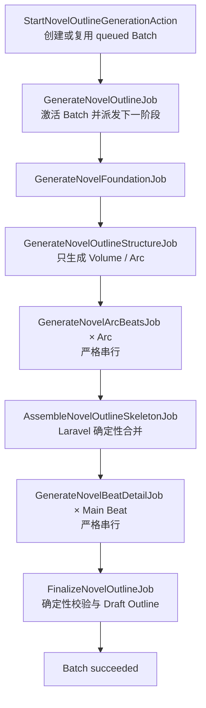
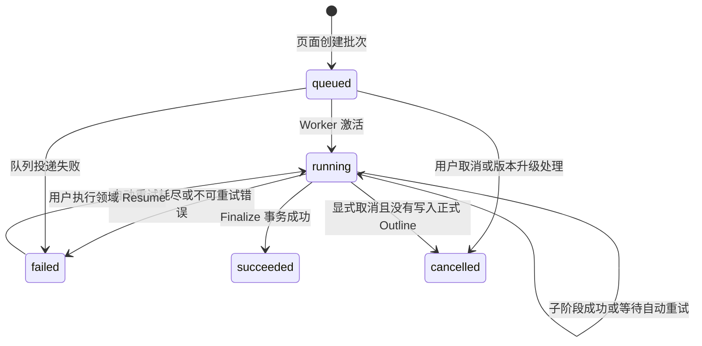
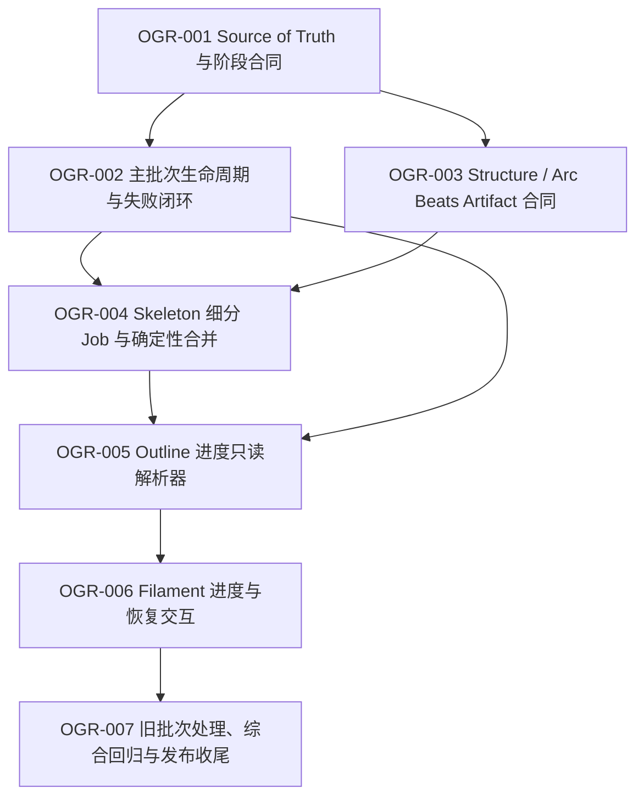

# 全书大纲生成可靠性与进度交互可执行任务

> 日期：2026-09-30  
> 来源：全书大纲页面“AI 生成候选”失败无反馈，以及现有 Skeleton 多次超时/截断的代码与数据库核对  
> 上游基线：`docs/PRD.md`、`docs/architecture/generation-pipeline.md`、`docs/architecture/data-model.md`、`docs/architecture/novel-lifecycle-and-project-core.md`  
> 关联历史任务：`NGC-002B` 已完成 Foundation、Skeleton、单 Main Beat Detail、Finalize 的首次分阶段实现；本任务集是后续可靠性与交互增强，不改写其历史完成状态  
> 用途：把已确认的“进一步拆分 Skeleton + 页面持久化进度与恢复交互”方案拆成可逐项实施、测试、验收和回滚的任务  
> 当前状态：`OGR-001`～`OGR-006` DONE；`OGR-007` READY

## 1. 使用规则

1. 每次只实施一个 `OGR-XXX`，严格按依赖顺序执行。
2. 开始任务前重新检查当前代码、数据库状态、迁移状态、Horizon 状态和未提交改动。本文件中的 2026-09-30 数据快照不是永久事实。
3. PostgreSQL 中的 `generation_runs`、`generation_artifacts` 和最终 Draft Outline 是业务进度事实源；Redis、Horizon 和 `failed_jobs` 只用于队列运行与诊断，不能成为页面进度的唯一依据。
4. 同一 Novel 的 Outline Provider 阶段保持严格串行；不得引入并行 Arc/Beat 生成、新 Queue 或工作流引擎。
5. 每个 Provider Job 最多执行一次模型请求；技术重试由 Queue 重新投递同一阶段。
6. 成功 Artifact 不可变。恢复只能复用输入指纹、Prompt Version、来源链和 Checksum 均匹配的 Artifact。
7. Filament 只负责展示、启动、继续和查看详情；阶段选择、状态迁移和恢复判断必须由领域 Action/Service 完成。
8. 不得通过提高 Token、增加无限重试或把 Provider Timeout 调得更大来代替阶段拆分。
9. 除 `OGR-007` 的显式旧批次处理外，任务不得修改真实小说、Outline、Bible、Character、World Entity、Foreshadowing、Chapter 或 Canonical 数据。
10. 所有任务完成后保留未提交改动供用户检查；**不得自动执行 `git commit`、`git push`、创建 PR 或发布**。

每个任务完成时必须记录：

```text
Summary
Problems Addressed
Files Changed
Database / Business Data Changes
Migrations Actually Run
Tests Actually Run
Browser Verification
Known Limitations
Rollback / Recovery
Next Task
```

状态定义：

```text
TODO                 尚未满足依赖
READY                依赖和决策已经满足，可以实施
IN_PROGRESS          正在实施
BLOCKED_BY_EVIDENCE  缺少代码、数据库、Provider 或浏览器证据
BLOCKED_BY_DECISION  存在会改变产品语义的未确认选择
DONE                 已完成实现并通过该任务验收
```

优先级定义：

```text
P0  当前主链失败、状态真实性、幂等或恢复能力
P1  进度交互、诊断与长期可维护性
P2  发布收尾、历史数据处理和文档归档
```

## 2. 已确认的当前基线

### 2.1 当前代码行为

- `ManageNovelOutline` 的“AI 生成候选”只做目标平台预检、投递 `GenerateNovelOutlineJob` 和发送“已加入生成队列”的临时通知。
- `GenerateNovelOutlineJob` 已经只是协调入口：创建或恢复主批次，然后调用 `NovelOutlinePipeline::dispatchNext()`。
- 当前 Provider 流程已经拆为 Foundation、Skeleton、逐 Main Beat Detail；Finalize 由 Laravel 确定性完成。
- 当前 Skeleton 一次返回全部 Volume、Arc 和 Beat，最大输出预算为 12,000 Token，是仍然偏大的单次结构化输出。
- 子阶段会创建独立 `GenerationRun`、Artifact、输入指纹和尝试次数；成功 Artifact 可以局部复用。
- Finalize 成功时才把主批次改为 `succeeded`。阶段 Job 最终失败时，没有统一把主批次改为 `failed`。
- 页面 Blade 在没有 Draft Outline 时只显示“尚未建立全书大纲”，没有读取主批次、子 Run、Artifact 或错误。
- 项目当前 Filament v5 Schema Component 支持 `poll()`；章节工作台已经存在按 3 秒轮询运行状态的实现先例。

### 2.2 2026-09-30 数据库只读快照

以下记录用于说明任务来源，实施任何任务前都必须重新查询：

- Novel `id=2` 的 Outline 主批次 Run `#1` 仍为 `running`，开始时间为 2026-09-29 22:03:03（Asia/Shanghai）。
- Foundation 第 1 次因 `provider_timeout` 失败，第 2 次成功，并已保存 `outline_foundation` Artifact。
- Skeleton 第 1～3 次因 `provider_timeout` 失败。
- Skeleton 第 4 次已收到响应，但输出 Token 用尽并被截断；子 Run 被记录为 `outline_stage_result_uncertain`，实际错误信息指向输出截断。
- failed job UUID 为 `a5827bdf-d462-498d-a15c-7879a23072a3`。
- 当前数据库中 OpenAI 与 DeepSeek Provider 连接的请求超时均为 300 秒；最新失败已经证明仅提高超时不能解决 Skeleton 输出规模问题。

### 2.3 已确认的问题

1. 主批次状态不能表达子阶段已经最终失败，页面即使读取主批次也可能永远显示“运行中”。
2. 点击入口没有先创建持久化的 `queued` 批次，Worker 启动前只能依赖一次性 Toast。
3. `providerStage()` 在已经收到响应后，把解析、Schema、领域校验和 Artifact 持久化异常统一归为 `outline_stage_result_uncertain`，错误语义过宽。
4. Skeleton 仍在一次请求中生成整本书的全部 Volume/Arc/Beat，已发生实际超时和截断。
5. 页面没有阶段进度、尝试次数、当前 Arc/Beat、错误原因、恢复操作或运行详情。
6. 直接使用 `queue:retry` 无法承担领域恢复：它不会重新检查批次状态、Prompt 合同、暂停门禁和 Artifact 来源链。

## 3. 已确认的目标方案

### 3.1 后台流水线



### 3.2 Run Scope 与 Artifact

| 阶段 | `scope_type` | Artifact | Provider |
|---|---|---|---|
| 主批次 | `novel_outline_batch` | 无 | 否 |
| Foundation | `novel_outline_foundation` | `outline_foundation` | 是 |
| Structure | `novel_outline_structure` | `outline_structure` | 是 |
| Arc Beats | `novel_outline_arc_beats` | `outline_arc_beats` | 是，每个 Arc 一次 |
| Skeleton Assembly | `novel_outline_skeleton_assembly` | `outline_skeleton` | 否 |
| Beat Detail | `novel_outline_beat_detail` | `outline_beat_detail` | 是，每个 Main Beat 一次 |
| Finalize | `novel_outline_finalize` | `outline_blueprint` | 否 |

所有子 Run：

```text
stage = chapter_planning
scope_id = 主批次 Run ID
```

Arc Beats 的 `context_snapshot.discriminator` 保存 `arc_key`；Beat Detail 保存 `beat_key`。

### 3.3 主批次状态机



`retrying` 是页面根据“主批次仍为 running + 最新子 Run 可重试失败 + 尚未出现成功 Artifact”派生的展示状态，不新增数据库枚举。

### 3.4 页面交互

- 页面在批次 `queued/running` 时每 3 秒轮询 PostgreSQL 投影；终态停止轮询。
- Structure 完成前不显示虚假的整体百分比。
- Structure 完成后显示 Arc Beats `x/y`；Skeleton Assembly 完成后显示 Main Beat Detail `x/y`。
- 失败信息持久显示，不依赖 Worker 向浏览器推送 Toast。
- `failed` 且可恢复时显示“继续 AI 生成”；恢复从最早缺失的有效 Artifact 开始。
- Run、Artifact、Prompt Version、Provider、Model、耗时与技术错误在 SlideOver 中查看。

## 4. 工程边界回答

| 问题 | 本任务集答案 |
|---|---|
| 对应哪个 PRD 需求 | G1 长篇连续生成、Failure Recovery、Generation Run/Artifact 可追踪性，以及单用户 Filament 操作闭环 |
| 涉及哪些表 | `generation_runs`、`generation_artifacts`；最终仍由现有逻辑写 `novel_outlines` 及其关系表；不新增业务表 |
| 涉及哪些 Model | `Novel`、`GenerationRun`、`GenerationArtifact`、`NovelOutline`；不新增 Canonical Model |
| 哪些状态变化 | 主批次 `queued → running → failed/succeeded/cancelled`；子 Run 保留现有状态 |
| 是否产生 Story Event | 否。Outline 候选属于正式章节前的规划数据 |
| Transaction Boundary | 批次创建/恢复使用 Novel 与 Batch 行锁；Finalize 的 Blueprint、Draft Outline 和批次成功保持同一事务边界 |
| Idempotency | Batch 输入指纹、Job 唯一键、子阶段 `input_hash`、Artifact Checksum 与 `dispatchNext()` 最早缺失阶段共同保证 |
| Job 执行两次 | 命中相同输入的成功 Artifact 后直接推进；不得重复请求 Provider 或重复创建 Draft Outline |
| 中途 Crash | 已成功 Artifact 保留；陈旧 Run 按现有 Lease 规则失败，恢复只重做最早缺失阶段 |
| 如何恢复 | 使用领域 Resume Action 锁定 Batch，检查版本/暂停/活动 Run 后调用唯一 `dispatchNext()` |
| 需要哪些测试 | 成功、超时、截断、Schema 错误、Retry 耗尽、Duplicate、Pause/Resume、Worker Crash、页面轮询、旧批次版本边界 |
| 是否新增基础设施 | 否。继续使用 Laravel、PostgreSQL、Redis Queue、Horizon 与 Filament |

## 5. 总体依赖



## 6. 任务清单

| Task | 名称 | 优先级 | 状态 | 依赖 |
|---|---|---:|---|---|
| OGR-001 | Source of Truth 与新阶段合同 | P0 | DONE | 无 |
| OGR-002 | 主批次 queued/running/failed 生命周期与错误闭环 | P0 | DONE | OGR-001 |
| OGR-003 | Structure / Arc Beats Artifact、Schema 与数据库约束 | P0 | DONE | OGR-001 |
| OGR-004 | Skeleton 细分 Job、确定性合并与局部恢复 | P0 | DONE | OGR-002、OGR-003 |
| OGR-005 | 全书大纲进度只读解析器 | P1 | DONE | OGR-002、OGR-004 |
| OGR-006 | Filament 进度、失败提示与继续生成交互 | P1 | DONE | OGR-005 |
| OGR-007 | 旧批次版本处理、端到端回归与发布收尾 | P0 | READY | OGR-006 |

## 7. Task Cards

## OGR-001 — Source of Truth 与新阶段合同

**Skills：** `generation-pipeline`, `filament-ui`  
**优先级：** P0  
**状态：** DONE
**依赖：** 无

### 目标

在修改代码前，将 Skeleton 进一步拆分、主批次终态、进度展示与领域恢复规则写入当前权威文档，避免新代码与已经完成的 NGC-002B 描述产生冲突。

### 实施范围

- 更新 `docs/PRD.md`：明确全书 Outline 生成必须可显示持久化进度、失败原因和恢复入口。
- 更新 `docs/architecture/generation-pipeline.md`：将 Outline 权威流程更新为 Foundation → Structure → Arc Beats × Arc → Deterministic Skeleton Assembly → Beat Detail × Main Beat → Finalize。
- 更新 `docs/architecture/data-model.md`：增加 `outline_structure`、`outline_arc_beats` Artifact 语义；`outline_skeleton` 改为 Laravel 确定性合并结果。
- 更新 `docs/architecture/novel-lifecycle-and-project-core.md`：说明页面同步创建 queued Batch、后台激活、失败收口和 Resume。
- 在 `NOVEL_GENERATION_CONTROL_AND_CONTENT_DELETION_OPTIMIZATION_PLAN.md` 的 NGC-002B 完成记录附近增加后续任务引用，保留其历史完成事实，不把 NGC-002B 改回未完成。
- 固化本文第 3 节的 Run Scope、Artifact、状态机、轮询、失败和恢复语义。

### 可能涉及的文件

- `docs/PRD.md`
- `docs/architecture/generation-pipeline.md`
- `docs/architecture/data-model.md`
- `docs/architecture/novel-lifecycle-and-project-core.md`
- `docs/development/NOVEL_GENERATION_CONTROL_AND_CONTENT_DELETION_OPTIMIZATION_PLAN.md`
- 本任务文件

### 不包含

- 不修改 PHP、Blade、Migration、配置或测试。
- 不修改数据库、Queue 或真实小说数据。
- 不决定具体 Token 数字；Token 上限必须在 OGR-003 根据拆分后 Schema 和模型容量验证确定。

### 测试

- 搜索旧流程描述，确认权威文档不再把 Provider Skeleton 描述为一次生成全部 Volume/Arc/Beat。
- 检查 Markdown 链接、Mermaid、代码围栏和术语一致性。
- 执行 `git diff --check`。

### 验收

- PRD、Generation Architecture、Data Model 与 Lifecycle 对新阶段、状态和恢复语义一致。
- NGC-002B 保留 DONE 历史，同时明确由 OGR 任务继续增强。
- 文档没有承诺 Redis/failed_jobs 是业务进度源。
- 文档没有承诺 Worker 直接向浏览器发送可靠 Toast。

### 回滚

- 仅文档变更，可整体回退本任务 diff。
- 在 OGR-002 开始后不得单独回退本任务文档而保留新代码。

### 完成定义

新阶段和交互合同成为唯一当前规范，后续代码任务没有未解决的产品语义分歧。

### 完成记录（2026-09-30）

**Summary**

- 已把 Outline 目标流程统一为 Foundation → Structure → Arc Beats × Arc → Laravel 确定性 Skeleton Assembly → Beat Detail × Main Beat → Finalize。
- 已固定主批次状态、页面持久化进度、失败闭环、领域 Resume、Run Scope 和 Artifact 语义。
- 已明确区分 OGR 目标合同与当前 NGC-002B 代码，避免把尚未实施的类和页面行为写成当前事实。

**Problems Addressed**

- 权威文档不再把 Provider Skeleton 作为新版一次性全书 Volume/Arc/Beat 输出。
- 页面入口必须先持久化 `queued` Batch；子阶段终止失败必须收口主批次；可恢复失败必须通过领域 Resume。
- PostgreSQL 被固定为 Outline 业务进度事实源；Redis、Horizon、`failed_jobs` 和 Worker Toast 只承担运行或诊断职责。

**Files Changed**

- `docs/PRD.md`
- `docs/architecture/generation-pipeline.md`
- `docs/architecture/data-model.md`
- `docs/architecture/novel-lifecycle-and-project-core.md`
- `docs/development/NOVEL_GENERATION_CONTROL_AND_CONTENT_DELETION_OPTIMIZATION_PLAN.md`
- `docs/development/NOVEL_OUTLINE_GENERATION_RELIABILITY_AND_PROGRESS_TASKS.md`

**Database / Business Data Changes**

- 无。未修改数据库、Queue、真实小说或任何业务数据。

**Migrations Actually Run**

- 无。本任务仅修改文档。

**Tests Actually Run**

- `git diff --check`：通过。
- Markdown 结构脚本：6 个相关文档代码围栏成对，文件内相对链接存在，Mermaid 代码块入口类型检查通过。
- Outline 术语脚本：新阶段、Artifact、状态与恢复术语均存在；3 条旧权威流程表述均不存在。

**Browser Verification**

- 未执行。本任务不修改页面或运行时代码。

**Known Limitations**

- OGR-002～OGR-006 尚未实施；当前代码仍运行 NGC-002B 的 Foundation → Provider Skeleton → Beat Detail → Finalize，页面仍未提供本合同定义的持久化进度与恢复交互。
- OGR-003 尚未完成 Strict Schema 和模型容量验证，因此没有在本任务中决定 Structure/Arc Beats 的具体 Prompt Version 或 Token 上限。

**Rollback / Recovery**

- 可整体回退本次六个文档的 OGR-001 diff；一旦 OGR-002 开始实施，不得只回退合同而保留依赖它的新代码。

**Next Task**

- `OGR-002`：主批次 queued/running/failed 生命周期与错误闭环。

## OGR-002 — 主批次 queued/running/failed 生命周期与错误闭环

**Skills：** `generation-pipeline`  
**优先级：** P0  
**状态：** DONE
**依赖：** OGR-001

### 目标

让用户点击后立即存在可查询的主批次，并保证子阶段最终失败会可靠收口到主批次；领域 Resume 可以安全复用已成功 Artifact。

### 实施范围

- 建议新增 `StartNovelOutlineGenerationAction`：
  - 在 Novel 行锁事务内执行生命周期、目标平台、参数和并发预检；
  - 创建或复用 `queued/running` 的同输入 Batch；
  - 冻结 Provider、Model、Reasoning Effort、目标平台和阶段 Prompt Version；
  - 事务提交后通过现有 `GenerationJobDispatcher` 投递入口 Job；
  - 投递失败时把新批次记录为 `queue_dispatch_failed`。
- 保持 `GenerateNovelOutlineJob` 现有序列化参数兼容，避免现有 failed job payload 因构造参数变化无法反序列化；Job 激活 prepared Batch 并调用唯一 `dispatchNext()`。
- 建议新增 `ResumeNovelOutlineGenerationAction`：锁定 Novel 与 Batch，验证 `failed`、版本兼容、暂停状态、正式生命周期和活动 Run，然后切回 `running` 并派发最早缺失阶段。
- 为所有 Outline 阶段 Job 增加统一最终失败收口：
  - Queue 尚会自动重试时，主批次保持 `running`；
  - 重试耗尽或显式不可重试失败时，主批次改为 `failed`；
  - 保存 `failed_scope`、`discriminator`、`child_run_id`、`auto_retry_exhausted` 和分类信息；
  - 延迟失败回调不得覆盖已经成功、取消或已有更新成功 Artifact 的批次。
- 修正 `providerStage()` 错误边界：
  - Provider 请求错误交给 `GenerationFailurePolicy`；
  - 截断保留明确的截断错误码；
  - Structured Output、Schema 和领域校验分别保留其错误语义；
  - 只有已经完成解析/验证、在 Artifact 持久化阶段失败时才记录 `outline_stage_result_uncertain`。
- `startOrResume()`、`assertRunnableBatch()`、Lease 和 Stalled Run 规则必须理解 `queued/failed/resume`，但主协调 Batch 仍不得被普通停滞扫描误判为 Worker Run。

### 可能涉及的文件

- `app/Actions/Novels/StartNovelOutlineGenerationAction.php`（建议新增）
- `app/Actions/Novels/ResumeNovelOutlineGenerationAction.php`（建议新增）
- `app/Services/NovelOutlinePipeline.php`
- `app/Jobs/GenerateNovelOutlineJob.php`
- `app/Jobs/Concerns/HandlesNovelOutlineStageFailures.php`
- 现有四个 Outline 阶段 Job
- `app/Services/GenerationFailurePolicy.php`（仅在现有分类不足时小范围修改）
- `app/Services/GenerationJobDispatcher.php`（优先复用，避免复制）
- 对应 Factory 与 Feature Tests

### 状态与事务要求

- Batch 创建与并发检查必须处于 Novel 行锁事务。
- Resume 必须锁定 Novel 和 Batch；事务内只做状态检查与持久化，Job 在提交后投递。
- Batch `failed → running` 时可以清除当前聚合错误，但历史子 Run 错误必须保留。
- Finalize 成功后，延迟到达的 Job `failed()` 不得把 Batch 从 `succeeded` 改回 `failed`。

### 幂等与 Crash 行为

- 用户重复点击开始：返回同一个 active Batch，不创建第二批次，不重复投递等价 Job。
- Start 事务成功但 Queue 投递失败：Batch 进入可诊断 `failed`，不能停在 `queued`。
- Queue 重复投递：入口 Job 激活相同 Batch，`dispatchNext()` 仍只选择一个最早缺失阶段。
- Resume 重复提交：第一次成功后，后续提交看到 Batch 已 `running`，不重复改变状态或创建新 Batch。

### 不包含

- 不拆分 Skeleton 内容合同；由 OGR-003、OGR-004 完成。
- 不实现页面进度卡；由 OGR-005、OGR-006 完成。
- 不处理当前真实旧批次；由 OGR-007 单独执行。

### 测试

- 页面领域入口创建 `queued` Batch 后才投递 Job。
- Queue 投递失败后 Batch 为 `failed` 且错误可诊断。
- Worker 激活后 `queued → running`。
- Retryable 第一次失败时 Batch 保持 `running`。
- 自动重试耗尽后 Batch 为 `failed`。
- 不可重试 Schema/截断错误立即收口。
- 解析/验证错误不会被误记为 `result_uncertain`。
- Artifact 持久化崩溃仍记录 `result_uncertain`。
- Resume 只派发最早缺失阶段并复用成功 Artifact。
- Duplicate Start/Resume/Job 不产生重复 Provider 请求。
- Pause、取消、成功 Batch 和版本不兼容 Batch 拒绝 Resume。
- 延迟失败回调不能覆盖成功 Batch。

### 验收

- 主批次不再永久停在伪 `running`。
- 点击入口后无需等待 Worker 即可查询 Batch。
- 每个终态都有 `finished_at` 和可解释错误。
- 恢复不依赖 `failed_jobs` 是否仍存在。

### 回滚/恢复

- 不新增表或枚举；代码回滚前停止创建新 Batch。
- 已存在的 `queued/failed` Batch 保留，可由旧代码忽略，但不得删除其子 Run/Artifact。
- 如果回滚后旧入口不识别 `queued`，先通过只读查询列出这些 Batch，再决定取消或继续，禁止批量静默改状态。

### 完成记录（2026-09-30）

**Summary**

- 新增 `StartNovelOutlineGenerationAction`，在 Novel 行锁事务内创建或复用 queued Batch，并在提交后通过 `GenerationJobDispatcher` 投递保持旧构造参数的协调 Job。
- `GenerateNovelOutlineJob` 激活 prepared Batch 为 running；旧序列化 Payload 仍只需要 Novel ID 与预计分卷数。
- 新增 `ResumeNovelOutlineGenerationAction`，验证 failed、合同版本、生命周期、暂停与活动 Run 后，从最早缺失 Artifact 继续。
- 四个现有 Outline 阶段 Job 统一在不可重试失败或 Queue 重试耗尽时关闭主批次；迟到回调不会覆盖成功、取消或更新成功 Artifact。
- `providerStage()` 已把 Provider、Structured Output、Schema、领域校验和 Artifact 持久化错误分开；仅持久化阶段失败使用 `outline_stage_result_uncertain`。

**Problems Addressed**

- 点击“AI 生成候选”后无需等待 Worker 即存在可查询 queued Batch。
- 子阶段终止失败不再让主批次永久停在伪 running。
- Queue 投递失败、失败阶段、discriminator、子 Run、自动重试耗尽和错误分类均保存到主批次。
- 恢复不依赖 `failed_jobs`，并复用同一批次内来源有效的成功 Artifact。

**Files Changed**

- `app/Actions/Novels/StartNovelOutlineGenerationAction.php`
- `app/Actions/Novels/ResumeNovelOutlineGenerationAction.php`
- `app/Services/NovelOutlinePipeline.php`
- `app/Services/GenerationFailurePolicy.php`
- `app/Jobs/GenerateNovelOutlineJob.php`
- `app/Jobs/Concerns/HandlesNovelOutlineStageFailures.php`
- `app/Jobs/GenerateNovelFoundationJob.php`
- `app/Jobs/GenerateNovelOutlineSkeletonJob.php`
- `app/Jobs/GenerateNovelBeatDetailJob.php`
- `app/Jobs/FinalizeNovelOutlineJob.php`
- `app/Filament/Resources/Novels/Pages/ManageNovelOutline.php`
- `tests/Feature/NovelPlanningBootstrapTest.php`
- `docs/PRD.md`
- `docs/architecture/generation-pipeline.md`
- `docs/architecture/data-model.md`
- `docs/architecture/novel-lifecycle-and-project-core.md`
- 本任务文件

**Database / Business Data Changes**

- 无生产或现有业务数据修改；继续复用 `generation_runs` 与 `generation_artifacts`，未新增表或枚举。

**Migrations Actually Run**

- 未手工执行 Migration。Feature Tests 使用 `RefreshDatabase` 初始化隔离测试数据库。

**Tests Actually Run**

- `php artisan test tests/Feature/NovelPlanningBootstrapTest.php`：35 tests，35 passed，275 assertions。
- `php artisan test tests/Feature/NovelPlanningBootstrapTest.php tests/Feature/GenerationFailurePolicyTest.php tests/Feature/GenerationJobDispatcherTest.php tests/Feature/GenerationRunTest.php tests/Feature/Filament/NovelResourceTest.php`：68 tests，68 passed，514 assertions。
- `php artisan test`：1029 tests，1005 passed，24 skipped，6165 assertions，0 failures，2 warnings。
- `vendor/bin/pint --dirty`：通过并完成格式化。
- `git diff --check`：通过。

**Browser Verification**

- 未执行浏览器操作。本任务的 Filament 入口由 Livewire Feature Test 验证；页面进度卡与 Resume 按钮不属于 OGR-002。

**Known Limitations**

- 当前内容阶段仍是 Foundation → Provider Skeleton → Beat Detail → Finalize；Structure/Arc Beats 与确定性 Skeleton Assembly 由 OGR-003、OGR-004 实施。
- `ResumeNovelOutlineGenerationAction` 已可用，但全书大纲页面尚未展示进度、失败详情或“继续 AI 生成”按钮；由 OGR-005、OGR-006 实施。
- 未调用真实 Provider、未运行真实 Horizon Worker、未处理现有旧批次；旧批次处置属于 OGR-007。

**Rollback / Recovery**

- 回滚代码前停止新的 Outline 启动操作；保留已生成的 queued/failed Batch、子 Run 与 Artifact，不做批量状态改写或删除。
- 回滚后若旧代码不识别 queued Batch，先只读列出并逐个决定继续或取消。

**Next Task**

- `OGR-003`：Structure / Arc Beats Artifact、Schema 与数据库约束。

## OGR-003 — Structure / Arc Beats Artifact、Schema 与数据库约束

**Skills：** `generation-pipeline`  
**优先级：** P0  
**状态：** DONE
**依赖：** OGR-001

### 目标

为进一步拆分 Skeleton 建立明确、严格、可校验的 Provider 输出合同和不可变 Artifact 类型。

### 实施范围

- 在 `ArtifactType` 增加：
  - `OutlineStructure = outline_structure`
  - `OutlineArcBeats = outline_arc_beats`
- 新增 PostgreSQL Migration 扩展 `generation_artifacts` 类型 CHECK Constraint；不得修改已经执行的历史 Migration。
- 定义 Structure Strict Schema：
  - 全书 title、summary、must include/not include；
  - 固定数量的 Volume；
  - 每个 Volume 的稳定 Key、标题、目标、高潮和目标字数；
  - 每个 Arc 的稳定 Key、类型、标题、目标、stakes、完成条件；
  - 不包含 Beat、Milestone、Handoff 或数据库 ID。
- 定义 Arc Beats Strict Schema：
  - 精确返回目标 `arc_key`；
  - 只返回该 Arc 的 Beats、预算、验收条件和候选；
  - 不返回其他 Arc、Milestone、Handoff 或数据库 ID。
- Laravel 根据 Volume/Arc/Beat 数组顺序确定性写入同级 sequence，并在 Skeleton Assembly 时统一计算 Main Arc/Main Beat 的全局 `mainline_sequence`；模型不拥有全局排序权。
- Structure 校验全局 Volume/Arc Key 唯一；Arc Beats 校验目标 Arc、Beat/Candidate Key 和预算；Skeleton Assembly 再做跨 Artifact 全局 Key 唯一与主线连续性校验。
- 每个 Arc Beats 输入包含 Foundation 摘要、完整 Structure、目标 Arc，以及必要的前后相邻 Arc 摘要；不得把已经生成的所有 Beat 全量重复塞入每次 Prompt。
- 根据拆分后 Schema、模型上下文窗口和最大合法输出做容量检查，再确定命名常量；不得凭经验随意设置 Token 数字。
- Prompt Version 使用新版本，不覆盖旧 `novel-outline-skeleton-v1` 的历史解释能力。

### 可能涉及的文件

- `app/Enums/ArtifactType.php`
- 新增扩展 Artifact Type CHECK 的 Migration
- `app/Services/NovelOutlinePipeline.php` 或小范围拆出的纯 Schema/Validator 类
- `tests/Feature/OpenAiStructuredOutputSchemaTest.php`
- `tests/Feature/NovelPlanningBootstrapTest.php`
- Factory / fixture 文件

### Migration 要求

- 在当前 PostgreSQL 驱动下验证 migrate、rollback、reapply。
- `down()` 收窄 CHECK 前必须明确：存在新类型 Artifact 时不能静默删除数据；应阻止回滚或要求先执行显式清理/归档方案。
- Migration 注释用中文说明约束变化、兼容边界和回滚前提。

### 不包含

- 不新增表。
- 不修改正式 Outline 关系表结构。
- 不实现 Job 派发或 Filament 页面。
- 不允许通过 JSON 内隐式字符串替代 Artifact Enum。

### 测试

- Structure 与 Arc Beats Strict Schema 的所有嵌套 object 都满足 `additionalProperties=false` 和 required/property 完全对齐。
- Structure 拒绝 Beat、数据库 ID、重复 Volume/Arc Key、错误 Volume 数量。
- Arc Beats 拒绝错误 `arc_key`、跨 Arc 数据、重复 Beat/Candidate Key、无效预算和额外字段。
- Laravel 确定性 sequence/mainline sequence 不依赖模型返回值。
- PostgreSQL 允许新 Artifact 类型并继续拒绝未知类型。
- Migration rollback/reapply 符合已声明前提。

### 验收

- 单个 Provider 响应不再要求同时返回全书 Volume/Arc/Beat。
- 新 Artifact 具有明确类型、输入指纹、来源和 Checksum。
- Provider 不能返回或猜测数据库 ID 与全局顺序。

### 回滚

- 无新类型数据时可回滚 Migration 与 Enum。
- 已存在新类型数据时先停止新批次并评估保留/删除范围；禁止通过收窄约束让数据库进入不一致状态。

### 完成记录（2026-09-30）

**Summary**

- `ArtifactType` 新增 `outline_structure` 与 `outline_arc_beats`，并通过独立 PostgreSQL Migration 扩展 `generation_artifacts_type_check`。
- 新增纯合同服务 `NovelOutlineStageContract`，提供 Structure / Arc Beats Strict Schema、严格字段校验、稳定 Key 与预算校验、局部 sequence 归一化、Arc Beats 最小输入上下文和容量门禁。
- Provider Schema 不包含数据库 ID、Beat 之外的层级、`sequence` 或 `mainline_sequence`；Laravel 只在校验成功后按数组顺序补同级 sequence，全局主线顺序留给 OGR-004 的 Skeleton Assembly。
- Prompt Version 冻结为 `novel-outline-structure-v1` 与 `novel-outline-arc-beats-v1`，历史 `novel-outline-skeleton-v1` 保持不变。
- Structure 与 Arc Beats 输出上限分别冻结为 12,000 与 8,000 Token；完整请求在调用前必须同时满足冻结模型的上下文窗口与最大合法输出。

**Problems Addressed**

- 单个新合同不再同时要求模型返回全书 Volume、Arc 和 Beat。
- 额外字段、数据库 ID、模型自报排序、跨 Arc 数据、重复 Key 和无效章节预算会在 Provider 结果持久化前被拒绝。
- Arc Beats 上下文只包含 Foundation 摘要、完整 Structure、目标 Arc 和相邻 Arc 摘要，不累积此前已生成 Beats。
- Migration 回滚在存在新类型 Artifact 时明确失败，不会静默删除数据或留下不满足 CHECK 的记录。

**Files Changed**

- `app/Enums/ArtifactType.php`
- `app/Services/NovelOutlineStageContract.php`
- `database/migrations/2026_09_30_100000_add_outline_structure_and_arc_beats_artifact_types.php`
- `tests/Feature/NovelOutlineStageContractTest.php`
- `tests/Feature/OutlineArtifactTypeConstraintTest.php`
- `tests/Feature/OpenAiStructuredOutputSchemaTest.php`
- `docs/PRD.md`
- `docs/architecture/data-model.md`
- `docs/architecture/generation-pipeline.md`
- `docs/architecture/novel-lifecycle-and-project-core.md`
- 本任务文件

**Database / Business Data Changes**

- 当前开发 PostgreSQL `x_novel` 的 `generation_artifacts_type_check` 已加入 `outline_structure` 与 `outline_arc_beats`。
- 未新增表、未修改正式 Outline 关系表、未创建或保留新类型 Artifact，现有小说与 Canonical 数据未修改。

**Migrations Actually Run**

- `php artisan migrate:status`：确认新 Migration 初始为 Pending。
- `php artisan migrate --force`：首次应用成功。
- 只读确认新类型 Artifact 数量为 0 后，执行 `php artisan migrate:rollback --path=database/migrations/2026_09_30_100000_add_outline_structure_and_arc_beats_artifact_types.php --force`：成功。
- `php artisan migrate --path=database/migrations/2026_09_30_100000_add_outline_structure_and_arc_beats_artifact_types.php --force`：重新应用成功。
- 最终只读核对 Migration 已记录，CHECK 同时包含两个新类型。

**Tests Actually Run**

- `php artisan test tests/Feature/NovelOutlineStageContractTest.php tests/Feature/OpenAiStructuredOutputSchemaTest.php tests/Feature/OutlineArtifactTypeConstraintTest.php`：24 tests，22 passed，2 PostgreSQL-only skipped，49 assertions。
- `DB_CONNECTION=pgsql DB_DATABASE=x_novel php artisan test tests/Feature/OutlineArtifactTypeConstraintTest.php`：最终 2 tests，2 passed，4 assertions；前两次运行分别暴露测试数据库覆盖值和 Query Builder / Schema Grammar 测试辅助问题，修正后通过。
- `php artisan test tests/Feature/NovelOutlineStageContractTest.php tests/Feature/OpenAiStructuredOutputSchemaTest.php tests/Feature/OutlineArtifactTypeConstraintTest.php tests/Feature/NovelPlanningBootstrapTest.php`：59 tests，57 passed，2 PostgreSQL-only skipped，324 assertions。
- `php artisan test`：1052 tests，1026 passed，26 skipped，6213 assertions，0 failures，2 warnings。
- `vendor/bin/pint --dirty`：通过并格式化本任务文件。

**Browser Verification**

- 未执行浏览器操作；OGR-003 不包含 Filament 页面或运行流程切换。

**Known Limitations**

- 当前运行流程仍是 Foundation → Provider Skeleton → Beat Detail → Finalize；Structure / Arc Beats Jobs、Artifact 持久化来源链和确定性 Skeleton Assembly 由 OGR-004 接线。
- 容量验证使用当前 Planner 路由 `openai/gpt-5.6-terra` 的官方 1,050,000 Token 上下文与 128,000 Token 最大输出作为本次证据；路由更换后必须提供新模型的真实容量。
- 未调用真实 Provider、未运行真实 Horizon Worker，也未处理旧批次。

**Rollback / Recovery**

- 新类型 Artifact 数量为 0 时，可先回滚本 Migration，再回退 Enum、合同服务和测试。
- 已存在 `outline_structure` 或 `outline_arc_beats` 时，`down()` 会阻止回滚；必须先停止新批次并显式确定归档或清理范围。

**Next Task**

- `OGR-004`：Skeleton 细分 Job、确定性合并与局部恢复。

## OGR-004 — Skeleton 细分 Job、确定性合并与局部恢复

**Skills：** `generation-pipeline`  
**优先级：** P0  
**状态：** DONE
**依赖：** OGR-002、OGR-003

### 目标

用 Structure、逐 Arc Beats 和 Laravel Skeleton Assembly 替换当前单次全书 Skeleton Provider 请求，同时保留 NGC-002B 的严格串行、Artifact 复用和 Finalize 边界。

### 实施范围

- 新增：
  - `GenerateNovelOutlineStructureJob`
  - `GenerateNovelArcBeatsJob`
  - `AssembleNovelOutlineSkeletonJob`
- 调整 `NovelOutlinePipeline::dispatchNext()`，唯一阶段顺序为：
  1. Foundation；
  2. Structure；
  3. 按 Structure 顺序找到第一个缺少成功 Artifact 的 Arc Beats；
  4. 全部 Arc 完成后派发确定性 Skeleton Assembly；
  5. 按完整 Skeleton 找到第一个缺失 Main Beat Detail；
  6. Finalize。
- 每个新 Provider Job 实现 `ShouldBeUnique`，唯一键包含 Batch 与 Arc Key；沿用 `generation` Queue、3 次有界技术重试、现有超时层级和统一失败策略。
- Skeleton Assembly：
  - 不调用 Provider，不产生 Usage Record；
  - 严格按 Structure 的 Volume/Arc 顺序收集同批次 Arc Beats；
  - 校验 Artifact 类型、小说、Batch、discriminator、input hash 与 Checksum；
  - 确定性写 sequence 与全局 mainline sequence；
  - 执行完整 Skeleton 校验；
  - 创建新的不可变 `outline_skeleton` Artifact。
- 调整 Beat Detail 输入和 Finalize 来源链，使它们读取确定性 Skeleton，并在最终 `outline_blueprint.lineage` 中记录 Structure、全部 Arc Beats、Skeleton、全部 Beat Detail 的 ID 与 Checksum。
- 调整 Apply 的 Blueprint 来源校验，拒绝缺失、跨小说、跨 Batch、类型错误或 Checksum 错误的新来源链。
- 当前 `GenerateNovelOutlineSkeletonJob`：
  - 不再作为新批次 Provider 主路径；
  - 在 OGR-007 完成旧 failed job 处理前保留可安全反序列化的兼容边界；
  - 不允许它生成的新旧 Artifact 混入同一个新版 Batch。

### 可能涉及的文件

- `app/Jobs/GenerateNovelOutlineStructureJob.php`
- `app/Jobs/GenerateNovelArcBeatsJob.php`
- `app/Jobs/AssembleNovelOutlineSkeletonJob.php`
- `app/Jobs/GenerateNovelOutlineSkeletonJob.php`
- `app/Jobs/GenerateNovelBeatDetailJob.php`
- `app/Jobs/FinalizeNovelOutlineJob.php`
- `app/Services/NovelOutlinePipeline.php`
- `app/Actions/Novels/ApplyNovelBlueprintAction.php`
- 相关 DTO、Validator、Factory、Fake Provider fixture 与 Feature Tests

### 状态、幂等与恢复

- Structure 重复投递：相同输入命中成功 Artifact，不重复调用 Provider。
- 单 Arc 失败：只重试该 Arc；Foundation、Structure 和其他成功 Arc 不重新计费。
- Skeleton Assembly 重复投递：相同来源链只产生一个可复用结果。
- 某 Arc 输出变化：Skeleton 与其下游使用新输入指纹；旧 Artifact 保留但不得成为当前来源。
- Pause：已运行请求可以保存结果，但不得派发新阶段或执行 Skeleton Assembly/Finalize。
- Worker Crash：根据 Run Lease 和 Artifact 判断最早缺失阶段，不能依赖 Redis Job 是否存在。

### 不包含

- 不并行生成 Arc。
- 不拆分 Foundation。
- 不再拆 Beat Detail；它已经按单 Main Beat 有界。
- 不修改 Canonical Story State、Story Event 或章节生成流程。

### 测试

- 新主链成功完成并产生 Draft Outline。
- 每个 Arc Beats Provider Job 只发送一次请求。
- Arc 2 超时后只重试 Arc 2，Arc 1 Artifact 被复用。
- Arc 输出截断、Schema 无效、错误 Arc Key 时不创建 Skeleton。
- 缺任一 Arc Artifact 时 Skeleton Assembly 失败且不产生半成品。
- Skeleton Assembly 不产生 AI Request Log/Usage Record。
- Duplicate Structure/Arc/Assembly/Beat Detail/Finalize 不产生重复效果。
- 新 Blueprint 缺少任一来源、跨 Batch、跨 Novel 或 Checksum 错误时 Apply 在正式写入前失败。
- Pause/Resume、Worker Crash、Stalled Run、Queue Retry Exhaustion 按最早缺失阶段恢复。
- 旧 Skeleton Job 不参与新版 Batch。

### 验收

- 不再存在一次 Provider 请求返回整本书全部 Volume/Arc/Beat 的新批次路径。
- 单 Arc 失败只影响该 Arc，已成功阶段保留。
- Finalize 仍是唯一创建完整 Draft Outline 的入口。
- Foundation、Structure、Arc Beats、Skeleton、Beat Detail 均可追踪到同一 Batch。

### 回滚/恢复

- 回退前停止创建新 Outline Batch。
- 新版 Batch 不得交给旧版 `dispatchNext()` 继续；必须保持失败/取消状态供诊断。
- 不删除新 Artifact；如需恢复旧代码，先通过版本化批次策略阻止旧代码误读新来源链。

### 完成记录（2026-09-30）

**Summary**

- 新增 Structure、单 Arc Beats 与确定性 Skeleton Assembly 三个 Job，新建 v3 批次严格串行执行 Foundation → Structure → 逐 Arc Beats → Skeleton Assembly → 逐 Main Beat Detail → Finalize。
- 新版批次冻结为 `novel-outline-pipeline-v3`，Skeleton Assembly 算法冻结为 `novel-outline-skeleton-assembly-v1`；旧 v2 批次继续只走历史 Provider Skeleton 路径，旧 Job 对 v3 批次直接拒绝。
- Structure、Arc Beats、Skeleton、Beat Detail 均按当前来源链和 `input_hash` 选择，来源变化时不会误读同批次旧 Artifact。
- Finalize 写入 Structure、全部 Arc Beats、Skeleton 和全部 Beat Detail 的 ID、类型与 Checksum；Apply 在正式初始化前复核 Novel、Batch、Scope、类型、discriminator、状态和 Checksum。
- Planner 批次冻结已核实模型容量；Structure 与 Arc Beats 调用前对完整请求执行上下文窗口和最大输出门禁。推荐环境配置与当前 `openai/gpt-5.6-terra` 路由一致。

**Recovery / Idempotency**

- 单 Arc 超时只新增该 Arc 的失败与重试 Run，已成功 Foundation、Structure 和其他 Arc Artifact 继续复用。
- Skeleton Assembly 不调用 Provider、不产生 Usage Record；相同有序来源链重复执行时复用同一成功 Artifact。
- 缺失、错误 Arc Key、跨小说、跨批次、类型或 Checksum 不匹配的来源不能进入 Skeleton 或 Apply。
- Pause 仍阻止新阶段；Resume 与 Worker Crash 继续依赖 PostgreSQL Run Lease、最早缺失 Artifact 和当前输入指纹恢复。

**Files Changed**

- `app/Jobs/GenerateNovelOutlineStructureJob.php`
- `app/Jobs/GenerateNovelArcBeatsJob.php`
- `app/Jobs/AssembleNovelOutlineSkeletonJob.php`
- `app/Jobs/GenerateNovelOutlineSkeletonJob.php`
- `app/Jobs/Concerns/HandlesNovelOutlineStageFailures.php`
- `app/Services/NovelOutlinePipeline.php`
- `app/Actions/Novels/ApplyNovelBlueprintAction.php`
- `config/generation.php`
- `.env.example`
- `tests/Feature/NovelPlanningBootstrapTest.php`
- `tests/Feature/ChapterPipelineOrchestrationTest.php`
- `docs/PRD.md`
- `docs/architecture/data-model.md`
- `docs/architecture/generation-pipeline.md`
- `docs/architecture/novel-lifecycle-and-project-core.md`
- 本任务文件

**Database / Business Data Changes**

- 本任务无 Migration、无表结构变更、无 Canonical Story State 或正式 Outline 写入。
- 对当前开发 PostgreSQL 执行只读核对：`outline_structure=0`、`outline_arc_beats=0`、`novel_outline_skeleton_assembly` Run 为 `0`；未通过本任务测试向开发业务库保留新阶段数据。

**Tests Actually Run**

- `php artisan test tests/Feature/NovelPlanningBootstrapTest.php tests/Feature/ChapterPipelineOrchestrationTest.php`：46 tests，46 passed，492 assertions。
- `php artisan test tests/Feature/NovelOutlineStageContractTest.php tests/Feature/NormalizedNovelOutlineTest.php tests/Feature/OpenAiStructuredOutputSchemaTest.php tests/Feature/DeleteNovelActionTest.php`：39 tests，38 passed，1 PostgreSQL-only skipped，169 assertions，1 warning。
- `php artisan test`：1060 tests，1034 passed，26 skipped，6265 assertions，0 failures，2 warnings。
- `vendor/bin/pint --dirty`、`git diff --check` 与相关 PHP syntax checks：通过。

**Browser / External Verification**

- 未执行浏览器操作；OGR-004 不包含 OGR-005/006 的进度解析器、轮询卡片或 Resume 页面入口。
- 未调用真实 AI Provider、未启动或重启真实 Horizon Worker；Provider 次数、Queue 顺序、失败与恢复均由 Fake Provider 和 Feature Tests 验证。

**Known Limitations**

- 页面仍不会展示持久化阶段进度或失败后的“继续 AI 生成”；这是 OGR-005～OGR-006 的明确范围。
- 旧 v2 批次只保留安全完成与反序列化边界；真实遗留 failed job 的发布处置仍由 OGR-007 完成。
- Planner 路由变更时必须同步提供该 Provider/Model 的真实容量配置，否则新批次会在调用 Provider 前明确失败。

**Next Task**

- `OGR-005`：全书大纲进度只读解析器。

## OGR-005 — 全书大纲进度只读解析器

**Skills：** `generation-pipeline`, `filament-ui`  
**优先级：** P1  
**状态：** DONE
**依赖：** OGR-002、OGR-004

### 目标

建立一个不修改状态、一次查询即可解释主批次阶段、进度、失败和恢复能力的页面读模型，避免把业务判断散落在 Blade/Filament Page。

### 实施范围

- 建议新增 `NovelOutlineProgressResolver` 和只读 DTO（最终命名在实施时按项目习惯确定）。
- 输入 Novel，读取最新相关 Batch，并批量预加载子 Run、Artifact 和必要 Usage；避免 N+1。
- 返回：
  - Batch ID、数据库状态、页面派生状态；
  - 当前阶段、当前 Arc/Beat Key 与可读标签；
  - 每阶段 completed/total；
  - 最新尝试次数、开始/完成/耗时；
  - 冻结 Provider、Model、Reasoning Effort、Prompt Version；
  - 当前错误码、用户文案、技术信息、是否可恢复；
  - Run/Artifact 引用，供 SlideOver 查看。
- 阶段判断只依赖成功 Artifact 和终态 Run：
  - Structure 前显示不定总量阶段；
  - Structure 后计算 Arc 总数；
  - Skeleton 后计算 Main Beat 总数；
  - 不把不同成本的阶段简单平均成整体百分比。
- 页面派生状态：
  - `not_started`
  - `queued`
  - `running`
  - `retrying`
  - `failed`
  - `succeeded`
  - `cancelled`
- 错误文案以 `error_code` 与 metadata 映射，原始 Exception/Stack Trace 只进入技术详情；不得直接把完整 Guzzle 路径作为主提示。
- Resolver 不读取 Redis/Cache 决定成功、失败或恢复点；必要时 Redis pending marker 只能作为“等待 Worker”辅助信息。

### 可能涉及的文件

- `app/Services/NovelOutlineProgressResolver.php`（建议新增）
- `app/Data/NovelOutlineProgress.php`（可选，只有结构复杂度确实需要时新增）
- 错误展示映射类或现有 Error Catalog
- `tests/Feature/NovelOutlineProgressResolverTest.php`（建议新增）

### 不包含

- 不修改 Batch/Run/Artifact。
- 不投递 Job。
- 不在 Resolver 内实现 Resume。
- 不创建进度表或 Redis 业务状态。

### 测试

- 无 Batch、queued、running、retrying、failed、succeeded、cancelled。
- Structure 前不返回虚假总百分比。
- Structure 后正确返回 Arc `x/y`。
- Skeleton 后正确返回 Main Beat Detail `x/y`。
- 多次失败后选择当前有效的最新 Run，不把旧失败覆盖后续成功。
- 子 Run 失败但 Batch 尚有自动重试时派生为 retrying。
- Batch 最终失败时返回准确 failed scope、Arc/Beat 标签和恢复能力。
- 查询数量有界，不随 Arc/Beat 数线性产生 N+1。
- `failed_jobs` 缺失或被清理不影响结果。

### 验收

- 相同数据库状态始终得到相同页面进度。
- UI 不需要理解 Pipeline 分支或直接拼 scope_type。
- 所有进度都能追溯到 Run/Artifact。

### 回滚

- 纯读取能力，可删除 Resolver/DTO 和对应测试，不影响流水线数据。

### 完成记录（2026-09-30）

**Summary**

- 新增 `NovelOutlineProgressResolver`、`NovelOutlineProgress` 与 `NovelOutlineStageProgress`，从 PostgreSQL 最新主批次、子 Run、Artifact 和 Usage 生成统一只读页面模型。
- 页面状态覆盖 `not_started / queued / running / retrying / failed / succeeded / cancelled`；`retrying` 只在主批次仍为 running 且当前子 Run 为可重试失败时派生，不新增数据库状态。
- Structure 成功前 Arc 总数为未知；Structure 成功后返回 Arc Beats `x/y`；Skeleton Assembly 成功后只统计 Main Beat Detail `x/y`，不输出混合阶段的虚假整体百分比。
- 错误主提示按稳定 `error_code` 与 category 映射；原始 Provider/Guzzle 信息仅保留在技术详情。终态失败使用 Batch 的 `failed_scope`、discriminator 与 child Run 还原准确阶段和 Arc/Beat 标签。
- 恢复资格与现有领域 Resume 门禁保持一致，包括 Novel 生命周期、当前 Outline/Chapter/Event、完整 Prompt 版本、冻结 Provider/Model/目标平台、其他活动 Batch 与活动子 Run。

**Traceability / Query Boundary**

- 只有成功 Run 上 Checksum 正确、Batch/Stage/Discriminator 正确且来源 Artifact ID、类型、Checksum 完整匹配的 Artifact 才计入完成度。
- DTO 提供 Batch、当前 Run、全部相关 Run/Artifact 引用、尝试次数、时间、耗时、Usage 汇总、Provider、Model、Reasoning Effort 与 Prompt Versions，供 OGR-006 页面和 SlideOver 直接消费。
- Resolver 固定执行 5 条查询加载 Novel 计数、Batch、Run、Artifact 与 Usage；1 个和 12 个 Arc 的测试查询数相同，不读取 Redis、Cache、Horizon 或 `failed_jobs`。
- Resolver 不修改 Batch/Run/Artifact，不投递 Job，也不执行 Resume。

**Files Changed**

- `app/Data/NovelOutlineProgress.php`
- `app/Data/NovelOutlineStageProgress.php`
- `app/Services/NovelOutlineProgressResolver.php`
- `tests/Feature/NovelOutlineProgressResolverTest.php`
- `docs/PRD.md`
- `docs/architecture/data-model.md`
- `docs/architecture/generation-pipeline.md`
- `docs/architecture/novel-lifecycle-and-project-core.md`
- 本任务文件

**Database / Business Data Changes**

- 无 Migration、无表结构变更、无真实业务数据修改。
- 测试使用 `RefreshDatabase` 隔离数据库；未修改开发环境中的真实 Batch、Run、Artifact、Outline 或 Canonical Story State。

**Tests Actually Run**

- `php artisan test tests/Feature/NovelOutlineProgressResolverTest.php`：10 tests，10 passed，74 assertions。
- `php artisan test tests/Feature/NovelOutlineProgressResolverTest.php tests/Feature/NovelPlanningBootstrapTest.php tests/Feature/ChapterPipelineOrchestrationTest.php tests/Feature/GenerationFailurePolicyTest.php`：65 tests，65 passed，596 assertions。
- `php artisan test`：1070 tests，1044 passed，26 skipped，6339 assertions，0 failures，2 warnings。
- `vendor/bin/pint`、相关 PHP syntax checks 与 `git diff --check`：通过。

**Browser / External Verification**

- 未执行浏览器操作；OGR-005 是只读领域投影，不包含 OGR-006 的 Filament 进度卡、轮询、Toast、SlideOver 或 Resume 按钮。
- 未调用真实 AI Provider，未启动、暂停或重启 Horizon Worker。

**Known Limitations**

- 全书大纲页面尚未消费该 DTO，因此当前页面仍不会显示持久进度或失败后的继续入口；由 OGR-006 实施。
- 旧 v2 Batch 仅按其冻结阶段图提供只读兼容显示；旧批次发布处置仍由 OGR-007 完成。

**Next Task**

- `OGR-006`：Filament 进度、失败提示与继续生成交互。

## OGR-006 — Filament 进度、失败提示与继续生成交互

**Skills：** `filament-ui`, `generation-pipeline`  
**优先级：** P1  
**状态：** DONE
**依赖：** OGR-005

### 目标

在全书大纲页面持续展示方案三的阶段进度，在失败后提供明确原因和安全的领域 Resume 操作。

### 实施范围

- 在 `ManageNovelOutline::content()` 中读取 `NovelOutlineProgressResolver`，把进度 DTO 传给页面 View。
- 在现有 Outline 内容前增加原生 Filament Section 风格的“AI 大纲生成”区域；优先复用 Section、Badge、Action 和 SlideOver，不新增页面级设计系统。
- 对包含进度区的 Filament Schema `View` 使用：

  ```php
  ->poll(fn (): ?string => $this->outlineGenerationActive() ? '3s' : null)
  ```

  实际实现必须复用 Resolver 结果并避免同一轮渲染重复查询。
- 展示阶段：基础设定、分卷与故事线、故事线节点、合并全书骨架、主线节点细化、创建候选版本。
- 运行中显示当前 Arc/Beat、`x/y`、尝试次数、耗时、Provider/Model；未知总数时只显示阶段，不显示伪百分比。
- 失败时持续显示：
  - 失败阶段和 Arc/Beat；
  - 用户可理解的错误；
  - 自动重试是否耗尽；
  - 已成功 Artifact 将被保留；
  - 推荐操作。
- Header Action 行为：
  - 无 Batch：`AI 生成候选`；
  - queued/running/retrying：显示 `生成中` 或 `等待重试` 并禁用重复启动；
  - failed 且可恢复：显示 `继续 AI 生成`；
  - succeeded：进入现有 Draft/确认采用路径。
- `继续 AI 生成` 只调用 `ResumeNovelOutlineGenerationAction`，不得直接重试 failed_jobs 或在 Page 中复制 `dispatchNext()`。
- Run 详情使用 SlideOver，展示 Run ID、状态、时间、模型、Prompt Version、Token/费用（存在时）、Artifact 和技术错误。
- 页面打开期间从 active 进入 failed/succeeded 时可以发送一次 Toast；页面持久 Section 仍是唯一可靠反馈。
- 保持现有暗色/浅色、状态色、紧凑密度和无大面积装饰要求。

### 可能涉及的文件

- `app/Filament/Resources/Novels/Pages/ManageNovelOutline.php`
- `resources/views/filament/resources/novels/pages/outline-builder.blade.php`
- 可选新增独立进度 partial，但不得复制业务判断
- `tests/Feature/Filament/NovelOutlineProgressPageTest.php`（建议新增）
- 现有 `tests/Feature/NovelPlanningBootstrapTest.php`

### 交互状态示例

```text
AI 大纲生成                              生成中

故事线节点 3 / 8
当前：第二卷 · 长安夺嫡线
第 2 次尝试 · 已运行 02:06

基础设定        已完成
分卷与故事线    已完成
故事线节点      3 / 8
合并全书骨架    等待中
主线节点细化    等待中
创建候选版本    等待中

OpenAI · gpt-5.6-terra · reasoning: medium
                                      查看运行详情
```

### 不包含

- 不使用 WebSocket、Broadcast 或新增实时基础设施。
- 不从浏览器直接修改 Run 状态。
- 不在主错误提示展示完整 Stack Trace、API Key、Prompt 或凭据。
- 不增加新的一级导航。

### 测试

- 点击生成后立即看到 queued Batch 和“已进入队列”。
- active 时每 3 秒轮询，终态停止轮询。
- queued/running/retrying 时生成按钮禁用且不会重复投递。
- Structure 前显示阶段但不显示虚假百分比。
- Arc Beats 与 Beat Detail 正确显示 `x/y` 和当前标签。
- Timeout、截断、Schema 错误显示正确用户文案和错误码。
- failed 后刷新页面仍能看到失败信息与继续按钮。
- 点击继续调用领域 Action，只恢复最早缺失阶段。
- succeeded 后显示 Draft Outline 和现有“确认采用”。
- SlideOver 能检查 Run/Artifact，但不泄漏 Prompt、凭据或完整敏感配置。
- 使用真实浏览器验证点击、轮询 DOM 更新、失败提示、SlideOver 和 Resume；Feature Test 不能替代浏览器验证记录。

### 验收

- 用户无需离开全书大纲页即可知道是否排队、运行、重试、失败或完成。
- 页面能回答“当前在哪一步、完成多少、为什么失败、下一步做什么”。
- 页面刷新不会丢失失败和进度信息。
- Worker 不在线时不会只显示一次成功 Toast 后永久无状态。

### 回滚

- 可以移除进度 Section 和 Resume Action 入口，后台 Batch/Artifact 不受影响。
- 回滚 UI 后仍可通过 Generation 页面或数据库检查 Run；不得删除生成追踪数据。

### 完成记录（2026-09-30）

**Summary**

- 全书大纲页面新增持久化“AI 大纲生成”Section，直接消费 OGR-005 的只读 DTO，展示 Batch 状态、六个阶段、当前 Arc/Beat、`x/y`、尝试次数、耗时及冻结的 Provider/Model/Reasoning。
- 活动态使用 `wire:poll.3s="$refresh"` 刷新完整 Livewire 页面，终态移除轮询。真实浏览器验证确认 Filament Schema 的局部 `poll()` 只会更新进度 View、会让页头残留旧动作，因此改为完整页面刷新以同步 Header Action；同一轮渲染仍复用 Resolver 缓存结果。
- Header Action 按持久状态切换：未开始可生成，queued/running/retrying 禁用重复启动，failed 且可恢复时显示“继续 AI 生成”；继续操作只调用 `ResumeNovelOutlineGenerationAction`。
- 失败 Section 持久显示稳定错误码、用户文案、失败阶段/Arc/Beat、自动重试是否耗尽、Artifact 保留语义及推荐操作；原始技术错误仅在 SlideOver 展示。
- 新增 Run 详情 SlideOver，展示安全的 Run、Usage、Prompt Version、Artifact 与技术错误引用，不读取或输出 Prompt、Context Snapshot、API Key 或凭据。

**Problems Addressed**

- Worker 未消费任务时，页面不再只依赖一次性 Toast；queued Batch 会立即成为页面可查询状态。
- 页面现在可以回答当前阶段、完成数量、失败原因和下一步操作，刷新页面后状态仍然存在。
- 轮询从活动态进入 failed 时会同时刷新页头与进度卡，避免“卡片已失败、页头仍显示禁用生成中”的不一致。
- 重复启动在活动态被禁用；恢复经既有领域 Action 从最早缺失阶段继续，不直接操作 failed job 或 Run 状态。

**Files Changed**

- `app/Filament/Resources/Novels/Pages/ManageNovelOutline.php`
- `resources/views/filament/resources/novels/pages/outline-builder.blade.php`
- `resources/views/filament/resources/novels/pages/partials/outline-generation-progress.blade.php`
- `resources/views/filament/resources/novels/pages/partials/outline-generation-runs.blade.php`
- `tests/Feature/Filament/NovelOutlineProgressPageTest.php`
- 本任务文件

**Database / Business Data Changes**

- 无 Migration、无表结构变更、无开发环境或生产环境真实业务数据修改。
- Feature Test 使用 `RefreshDatabase`；真实浏览器验证使用 `/tmp/xnovel-ogr006-browser.sqlite` 隔离库及临时账号、Novel、Batch/Run，未调用真实 AI Provider。

**Migrations Actually Run**

- 对隔离浏览器库执行 `DB_CONNECTION=sqlite DB_DATABASE=/tmp/xnovel-ogr006-browser.sqlite php artisan migrate:fresh --force`：成功，仅重建该临时 SQLite 文件；未对项目配置的 PostgreSQL 执行 Migration。

**Tests Actually Run**

- `php artisan test tests/Feature/Filament/NovelOutlineProgressPageTest.php --compact`：6 tests，6 passed，66 assertions。
- 相关回归（Outline Page、Resolver、Bootstrap、Novel Resource）：75 tests，75 passed，641 assertions。
- `php artisan test --compact`：1076 tests，1050 passed，26 skipped，6405 assertions，0 failures，2 warnings。
- `vendor/bin/pint --test ...`、相关 PHP syntax checks 与 `git diff --check`：通过。

**Browser Verification**

- 在本机 `127.0.0.1:8765`、隔离 SQLite、database Queue 且无 Worker 的 Chrome 会话中验证：点击“AI 生成候选”后立即出现 queued 状态、成功 Toast 与禁用的生成按钮。
- 将隔离 Run 切换为 running 后，页面在 3 秒内自动更新为活动状态；切换为 failed 后，进度卡和页头在同一轮询中同步更新，页头显示“继续 AI 生成”，终态 DOM 不再包含轮询指令。
- 已验证持久失败文案、`provider_timeout`、重试耗尽与 Artifact 保留提示；SlideOver 展示 Batch/子 Run/技术错误，注入到测试 Context 的敏感标记未出现在 DOM。
- 点击“继续 AI 生成”并确认后，页面显示成功 Toast 和 `retrying` 活动态，隔离数据库只派发 Foundation 恢复任务；未启动真实 Worker、未发送真实 Provider 请求。

**Known Limitations**

- 活动态轮询刷新整个 Page，以保证 Header Action 与进度 Section 一致；单用户页面每 3 秒会执行一次 OGR-005 的固定查询投影，后续只有在实际性能证据出现时才需要优化。
- 页面不主动处理旧 v2 Batch 的发布处置；旧批次清点、状态标记与 failed job 处理仍属于 OGR-007。
- 终态转换未新增一次性 Toast；持久 Section 与同步更新的 Header Action 是可靠反馈。

**Rollback / Recovery**

- 删除新增进度/详情 partial，并移除 `ManageNovelOutline` 的 Resolver、Resume 与详情 Action 接入即可回滚 UI；现有 Batch、Run、Artifact 与领域 Resume 实现不受影响。
- 若只需停止页面自动刷新，可移除 `outline-builder.blade.php` 的活动态 `wire:poll.3s="$refresh"`，不会修改后台状态或追踪数据。

**Next Task**

- `OGR-007`：旧批次版本处理、端到端回归与发布收尾。

**Git**

- 未提交；未 push；未创建 PR。

## OGR-007 — 旧批次版本处理、端到端回归与发布收尾

**Skills：** `generation-pipeline`, `filament-ui`  
**优先级：** P0  
**状态：** READY
**依赖：** OGR-006

### 目标

安全处理新版阶段合同上线前遗留的旧 Skeleton 批次，完成 PostgreSQL、Queue、Filament 和文档的综合验证，并形成可恢复的发布记录。

### 实施范围

- 部署前只读清点：
  - queued/running/failed 的 `novel_outline_batch`；
  - 每批次 Prompt Versions、Provider/Model、成功 Artifact、失败子 Run；
  - `failed_jobs` 中旧 `GenerateNovelOutlineSkeletonJob` payload；
  - 是否已经存在 Draft/Current Outline 或正式生命周期数据。
- 对旧 `novel-outline-skeleton-v1` 未完成 Batch：
  - 不允许在新版 Pipeline 中静默继续；
  - 明确标记为 `cancelled` 或保持 `failed` 并记录 `pipeline_contract_upgraded`；
  - 不删除历史 Run/Artifact；
  - 不自动重试旧 failed job UUID。
- 新批次按新 Prompt Version 启动。
- 默认最低复杂度方案是重新生成 Foundation；如果实施时确认必须跨 Batch 复用旧 Foundation，必须先增加显式 carry-forward 设计并校验 input hash、Prompt Version、Novel、Provider/Model、Artifact 类型和 Checksum，不能直接改 `scope_id` 或复制数据库行。
- 对目标真实批次执行状态修改前，必须输出 Batch ID、Novel ID、现有 Artifact、影响范围和恢复方式；任务完成记录中写明实际 SQL/Artisan/领域 Action 与结果。
- 验证 Horizon 同时监听 `generation` Queue，Worker Timeout 晚于 Job Timeout，`retry_after` 晚于 Worker Timeout；不得把重启 Horizon 写成已经成功，除非实际执行并检查状态。
- 同步最终 Architecture、Lifecycle、任务状态与发布检查记录。

### 当前已知目标

2026-09-30 快照中的旧目标为 Batch Run `#1`、Novel `#2`、failed job UUID `a5827bdf-d462-498d-a15c-7879a23072a3`。执行时必须重新查询，不能只凭本行操作。

### 数据安全要求

- 旧 Batch 状态修改属于真实数据库业务追踪写入，必须通过明确领域 Action/Command 或可审计事务完成。
- 禁止直接删除 Foundation Artifact、子 Run、Usage、AI Request Log 或 failed job 诊断证据。
- 禁止执行 `migrate:fresh`。
- Migration 前确认数据库目标和备份/恢复条件；报告实际目标，不从 `.env.example` 推断。

### 测试与验证顺序

1. 目标 Feature Tests：

   ```bash
   php artisan test tests/Feature/NovelPlanningBootstrapTest.php
   php artisan test tests/Feature/OpenAiStructuredOutputSchemaTest.php
   php artisan test tests/Feature/NovelOutlineProgressResolverTest.php
   php artisan test tests/Feature/Filament/NovelOutlineProgressPageTest.php
   ```

2. PostgreSQL Migration migrate/rollback/reapply，并记录数据库目标和数据影响。
3. 受影响 Outline、Queue Recovery、AI Settings、Filament 测试集。
4. `vendor/bin/pint --dirty`。
5. `git diff --check`。
6. 完整 `php artisan test`，与目标测试结果分开报告。
7. 真实浏览器验收：
   - 点击生成后立即出现 queued；
   - 轮询依次显示 Foundation、Structure、Arc Beats、Assembly、Beat Detail、Finalize；
   - 模拟/触发失败后页面持续显示错误；
   - Resume 只继续失败 Arc/Beat；
   - 成功后展示 Draft Outline；
   - 重复刷新与重复点击不产生并行批次。
8. 如执行真实 Provider 请求，单独报告请求数量、模型、成本、结果和是否修改真实数据；没有执行时明确写“未执行真实 Provider 调用”。

### 验收

- 旧合同 Batch 不会进入新版阶段图。
- 新版批次可以完成整条 Outline 主链。
- 页面进度与 PostgreSQL Run/Artifact 一致。
- Timeout、截断、Retry Exhaustion 和 Resume 均有自动测试与页面验证。
- 没有重复 Provider 调用、重复 Artifact、重复 Draft Outline 或残留伪 running Batch。
- 所有权威文档与当前代码一致。
- 工作区改动保留未提交，供用户最终检查。

### 回滚/恢复

- 发布前保留数据库备份和旧代码版本引用。
- 新版 Migration 的回滚必须满足 OGR-003 的新类型 Artifact 前提。
- 回退代码前停止新 Batch；新版 Batch 保持 failed/cancelled 供诊断，不交给旧 `dispatchNext()`。
- 旧 Batch 的历史 Artifact 不自动恢复到 active；需要恢复时使用明确领域操作并记录原因。
- Git 回滚与数据库恢复分别记录，不能用 `git reset` 代替数据库恢复。

### 完成定义

新版 Outline 生成、持久化进度、失败反馈和领域 Resume 已通过目标测试、完整回归及真实浏览器验收；旧 Batch 已按记录处理；文档与实现一致；未自动提交 Git。

## 8. 总体验收标准

1. 点击“AI 生成候选”后立即创建可查询的 queued Batch。
2. Foundation、Structure、每个 Arc Beats、Skeleton Assembly、每个 Beat Detail 和 Finalize 都有清晰边界。
3. 单次 Provider 请求不再生成整本书全部 Volume/Arc/Beat。
4. 单 Arc/Beat 失败只恢复该节点，成功 Artifact 不重复计费。
5. 自动重试耗尽后主批次可靠进入 `failed`，不残留伪 `running`。
6. 截断、Schema、领域校验与持久化不确定结果具有不同错误语义。
7. 全书大纲页面显示持久化阶段进度、尝试次数、耗时、路由和失败原因。
8. 页面刷新后仍能看到状态；active 时轮询，终态停止。
9. “继续 AI 生成”通过领域 Action 从最早缺失阶段恢复，不直接操作 failed_jobs。
10. Duplicate Start/Resume/Job 不产生重复 Provider 请求、Artifact 或 Draft Outline。
11. Pause、版本不兼容和正式生命周期门禁在 Provider 调用前失败。
12. Finalize 和 Apply 继续验证完整不可变来源链，Draft 不影响 Canonical State。
13. 不新增业务表、新 Queue、工作流引擎、WebSocket 或外部基础设施。
14. 目标测试、完整测试、Migration 验证和浏览器验收分别记录实际结果。
15. 所有改动保持未提交，除非用户之后明确要求提交。

## 9. 任务完成记录模板

```markdown
### OGR-XXX 完成记录（YYYY-MM-DD）

Summary
-

Problems Addressed
-

Files Changed
-

Database / Business Data Changes
- 无 / 具体说明

Migrations Actually Run
- 未运行 / 命令、数据库目标、结果、数据影响

Tests Actually Run
- 命令：结果

Browser Verification
- 未执行 / 页面、操作、观察结果

Known Limitations
-

Rollback / Recovery
-

Next Task
- OGR-XXX

Git
- 未提交；未 push；未创建 PR。
```
